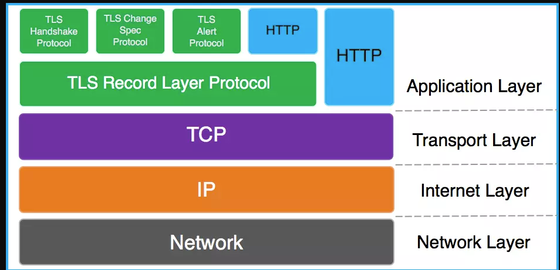
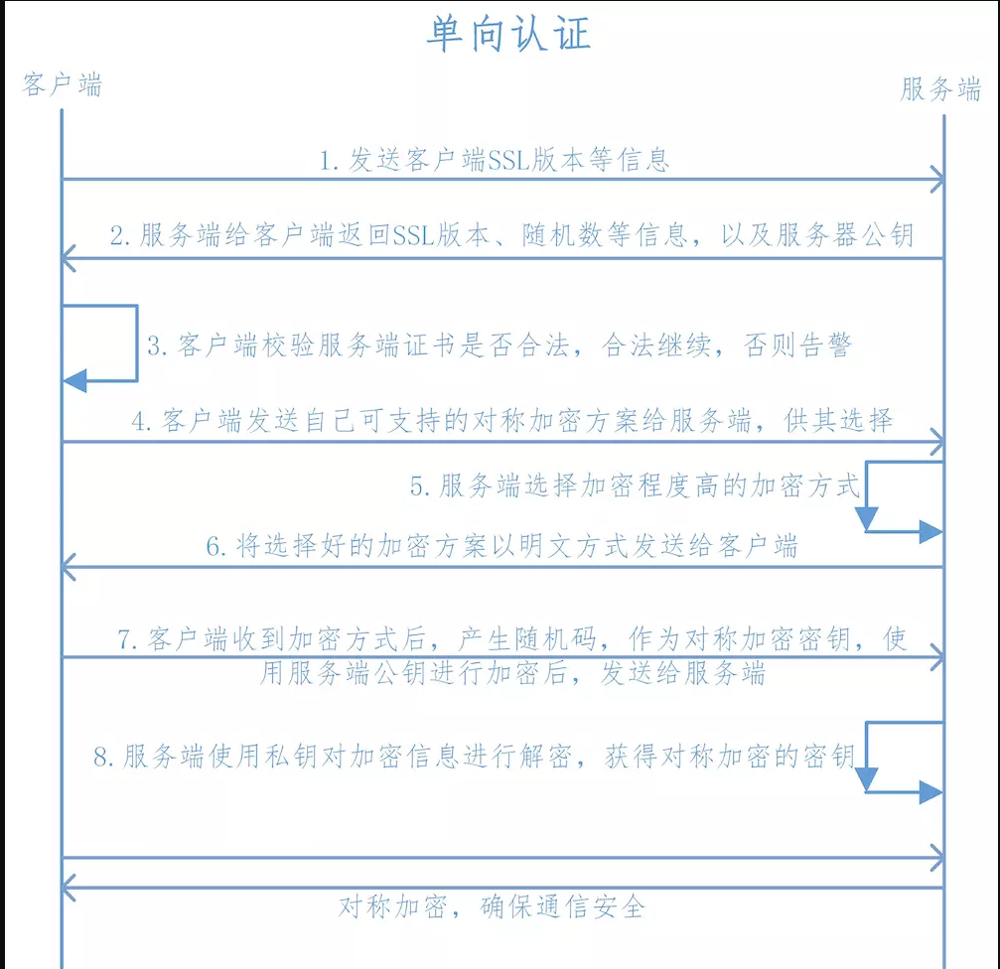
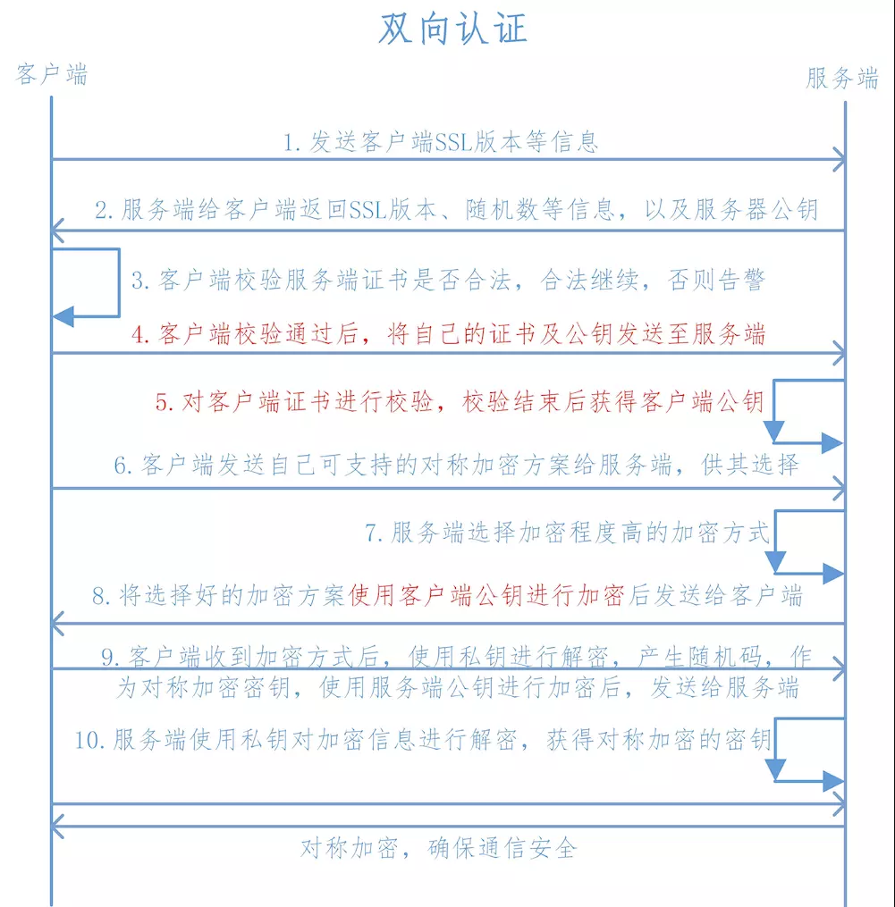

HTTPS如何进行安全部署，如何缓解单向证书校验下的抓包和中间人攻击

+ 什么是https
+ nginx如何部署https
+ android ios 如何部署https 双向
+ html下面如何支持https
+ 单向下面的风险以及如何规避
+ http2
+ http3

+ **https简介**

  [wiki中https解释](https://en.wikipedia.org/wiki/HTTPS)
  超文本传输安全协议（英语：Hypertext Transfer Protocol Secure，缩写：HTTPS，常称为HTTP over TLS，HTTP over SSL或HTTP Secure）是一种通过计算机网络进行安全通信的传输协议。HTTPS经由HTTP进行通信，但利用SSL/TLS来加密数据包。HTTPS开发的主要目的，是提供对网站服务器的身份认证，保护交换数据的隐私与完整性。这个协议由网景公司（Netscape）在1994年首次提出，随后扩展到互联网上。
  
  HTTPS的主要思想是在不安全的网络上创建一安全信道，并可在使用适当的加密包和服务器证书可被验证且可被信任时，对窃听和中间人攻击提供合理的防护。
  
  HTTPS的信任继承基于预先安装在浏览器中的证书颁发机构（如Symantec、Comodo、GoDaddy和GlobalSign等）（意即“我信任证书颁发机构告诉我应该信任的”）。因此，一个到某网站的HTTPS连接可被信任，当且仅当：
  
  用户相信他们的浏览器正确实现了HTTPS且安装了正确的证书颁发机构；
  + 用户相信证书颁发机构仅信任合法的网站；
  + 被访问的网站提供了一个有效的证书，意即，它是由一个被信任的证书颁发机构签发的（大部分浏览器会对无效的证书发出警告）；
  + 该证书正确地验证了被访问的网站（如，访问https://example.com时收到了给example.com而不是其它组织的证书）；
  或者互联网上相关的节点是值得信任的，或者用户相信本协议的加密层（TLS或SSL）不能被窃听者破坏。
  
  HTTPS不应与在 RFC 2660 中定义的安全超文本传输协议（S-HTTP）相混淆。
  
  

+ **nginx如何部署https**
  + 2.1 全站ssl
        全站做ssl是最常见的一个使用场景，默认端口443，而且一般是单向认证。
       
        server {
                listen 443;
                server_name example.com;
        
                root /apps/www;
                index index.html index.htm;
        
                ssl on;
                ssl_certificate ../SSL/test.pem;
                ssl_certificate_key ../SSL/test.key;
        
        #        ssl_protocols SSLv3 TLSv1 TLSv1.1 TLSv1.2;
        #        ssl_ciphers ALL:!ADH:!EXPORT56:RC4+RSA:+HIGH:+MEDIUM:+LOW:+SSLv2:+EXP;
        #        ssl_prefer_server_ciphers on;
        
        }
        
      如果想把http的请求强制转到https的话：
      
         server {
           listen      80;
           server_name example.me;
           rewrite     ^   https://$server_name$request_uri? permanent;
         
         ### 使用return的效率会更高 
         #  return 301 https://$server_name$request_uri;
         }
         
       ssl_certificate证书其实是个公钥，它会被发送到连接服务器的每个客户端，ssl_certificate_key私钥是用来解密的，所以它的权限要得到保护但nginx的主进程能够读取。当然私钥和证书可以放在一个证书文件中，这种方式也只有公钥证书才发送到client。
       
       ssl_protocols指令用于启动特定的加密协议，nginx在1.1.13和1.0.12版本后默认是ssl_protocols SSLv3 TLSv1 TLSv1.1 TLSv1.2，TLSv1.1与TLSv1.2要确保OpenSSL >= 1.0.1 ，SSLv3 现在还有很多地方在用但有不少被攻击的漏洞。
       
       ssl_ciphers选择加密套件，不同的浏览器所支持的套件（和顺序）可能会不同。这里指定的是OpenSSL库能够识别的写法，你可以通过 openssl -v cipher 'RC4:HIGH:!aNULL:!MD5'（后面是你所指定的套件加密算法） 来看所支持算法。
       
       ssl_prefer_server_ciphers on设置协商加密算法时，优先使用我们服务端的加密套件，而不是客户端浏览器的加密套件。    
       
       https优化参数
       ssl_session_cache shared:SSL:10m; : 设置ssl/tls会话缓存的类型和大小。如果设置了这个参数一般是shared，buildin可能会参数内存碎片，默认是none，和off差不多，停用缓存。如shared:SSL:10m表示我所有的nginx工作进程共享ssl会话缓存，官网介绍说1M可以存放约4000个sessions。 详细参考serverfault上的问答ssl_session_cache。
       ssl_session_timeout ： 客户端可以重用会话缓存中ssl参数的过期时间，内网系统默认5分钟太短了，可以设成30m即30分钟甚至4h。
       设置较长的keepalive_timeout也可以减少请求ssl会话协商的开销，但同时得考虑线程的并发数了。
       
       提示：在生成证书请求csr文件时，如果输入了密码，nginx每次启动时都会提示输入这个密码，可以使用私钥来生成解密后的key来代替，效果是一样的，达到免密码重启的效果：
       
       openssl rsa -in ittest.key -out ittest_unsecure.key
       导入证书
       如果你是找一个知名的ssl证书颁发机构如VeriSign、Wosign、StartSSL签发的证书，浏览器已经内置并信任了这些根证书，如果你是自建C或获得二级CA授权，都需要将CA证书添加到浏览器，这样在访问站点时才不会显示不安全连接。各个浏览的添加方法不在本文探讨范围内。
       
       2. 部分页面ssl
       一个站点并不是所有信息都是非常机密的，如网上商城，一般的商品浏览可以不通过https，而用户登录以及支付的时候就强制经过https传输，这样用户访问速度和安全性都得到兼顾。
       
       但是请注意不要理解错了，是对页面加密而不能针对某个请求加密，一个页面或地址栏的URL一般会发起许多请求的，包括css/png/js等静态文件和动态的java或php请求，所以要加密的内容包含页面内的其它资源文件，否则就会出现http与https内容混合的问题。在http页面混有https内容时，页面排版不会发生乱排现象；在https页面中包含以http方式引入的图片、js等资源时，浏览器为了安全起见会阻止加载。
       
       下面是只对example.com/account/login登录页面进行加密的栗子：
       
       root /apps/www;
       index index.html index.htm;
       
       server {
           listen      80;
           server_name example.com;
       
           location ^~ /account/login {
               rewrite ^ https://$server_name:443$request_uri? permanent;
           }
           location / {
               proxy_pass  http://localhost:8080;
       
               ### Set headers ####
               proxy_set_header Host $host;
               proxy_set_header X-Real-IP $remote_addr;
               proxy_set_header X-Forwarded-For $proxy_add_x_forwarded_for;
               proxy_redirect     off; 
           }
       }
       
       server {
           listen 443 ssl;
           server_name example.com;
       
           ssl on;
           ssl_certificate ../SSL/ittest.pem;
           ssl_certificate_key ../SSL/ittest.key;
           ssl_protocols SSLv3 TLSv1 TLSv1.1 TLSv1.2;
           ssl_ciphers ALL:!ADH:!EXPORT56:RC4+RSA:+HIGH:+MEDIUM:+LOW:+SSLv2:+EXP;
           ssl_prefer_server_ciphers on;
       
           location ^~ /account/login {
               proxy_pass  http://localhost:8080;
               proxy_set_header Host $host;
               proxy_set_header X-Real-IP $remote_addr;
               proxy_set_header X-Forwarded-For $proxy_add_x_forwarded_for;
               proxy_redirect     off; 
       
               ### Most PHP, Python, Rails, Java App can use this header -> https ###
               proxy_set_header X-Forwarded-Proto  $scheme;
           }
           location / {
               rewrite  ^  http://$server_name$request_uri? permanent;
           }
       }
       关于rewrite与location的写法参考这里。当浏览器访问http://example.com/account/login.xx时，被301到https://example.com/account/login.xx，在这个ssl加密的虚拟主机里也匹配到/account/login，反向代理到后端服务器，后面的传输过程是没有https的。这个login.xx页面下的其它资源也是经过https请求nginx的，登录成功后跳转到首页时的链接使用http，这个可能需要开发代码里面控制。
       
       上面配置中使用了proxy_set_header X-Forwarded-Proto $scheme，在jsp页面使用request.getScheme()得到的是https 。如果不把请求的$scheme协议设置在header里，后端jsp页面会一直认为是http，将导致响应异常。
       ssl配置块还有个与不加密的80端口类似的location /，它的作用是当用户直接通过https访问首页时，自动跳转到不加密端口，你可以去掉它允许用户这样做。
       3. 实现双向ssl认证
       上面的两种配置都是去认证被访问的站点域名是否真实可信，并对传输过程加密，但服务器端并没有认证客户端是否可信。（实际上除非特别重要的场景，也没必要去认证访问者，除非像银行U盾这样的情况）
       
       要实现双向认证HTTPS，nginx服务器上必须导入CA证书（根证书/中间级证书），因为现在是由服务器端通过CA去验证客户端的信息。还有必须在申请服务器证书的同时，用同样的方法生成客户证书。取得客户证书后，还要将它转换成浏览器识别的格式（大部分浏览器都认识PKCS12格式）：
       
       openssl pkcs12 -export -clcerts -in client.crt -inkey client.key -out client.p12
       然后把这个client.p12发给你相信的人，让它导入到浏览器中，访问站点建立连接的时候nginx会要求客户端把这个证书发给自己验证，如果没有这个证书就拒绝访问。
       
       同时别忘了在 nginx.conf 里配置信任的CA：（如果是二级CA，请把根CA放在后面，形成CA证书链）
       
           proxy_ignore_client_abort on；
       
           ssl on;
           ...
           ssl_verify_client on;
           ssl_verify_depth 2;
           ssl_client_certificate ../SSL/ca-chain.pem;
       
       #在双向location下加入：
           proxy_set_header X-SSL-Client-Cert $ssl_client_cert;
       拓展：使用geo模块
       nginx默认安装了一个ngx_http_geo_module，这个geo模块可以根据客户端IP来创建变量的值，用在如来自172.29.73.0/24段的IP访问login时使用双向认证，其它段使用一般的单向认证。
       
       geo $duplexing_user {
           default 1;
           include geo.conf;  # 注意在0.6.7版本以后，include是相对于nginx.conf所在目录而言的
       }
       语法 geo [$address] $variable { … }，位于http段，默认地址是$reoute_addr，假设 conf/geo.conf 内容：
       
       127.0.0.1/32    LOCAL;  # 本地
       172.29.73.23/32 SEAN;   # 某个IP
       172.29.73.0/24  1;      # IP段，可以按国家或地域定义后面的不同的值
       需要配置另外一个虚拟主机server{ssl 445}，里面使用上面双向认证的写法，然后在80或443里使用变量$duplexing_user去判断，如果为1就rewrite到445，否则rewrite到443。具体用法可以参考[nginx geo](http://www.ttlsa.com/nginx/using-nginx-geo-method/?spm=a2c4e.11153940.blogcont47357.10.5a3b2335WpqzX3)使用方法。
       

+ **android ios 如何部署https 双向**
   + 单向认证和双向认证区别
   
       SSL协议加密方式
       
       SSL协议即用到了对称加密也用到了非对称加密(公钥加密)，在建立传输链路时，SSL首先对对称加密的密钥使用公钥进行非对称加密，链路建立好之后，SSL对传输内容使用对称加密。
         
         对称加密
         速度高，可加密内容较大，用来加密会话过程中的消息
         公钥加密
         加密速度较慢，但能提供更好的身份认证技术，用来加密对称加密的密钥
         
      单向认证：
       
         
       
            1.  客户端向服务端发送SSL协议版本号、加密算法种类、随机数等信息。
            2.  服务端给客户端返回SSL协议版本号、加密算法种类、随机数等信息，同时也返回服务器端的证书，即公钥证书
            3.  客户端使用服务端返回的信息验证服务器的合法性，包括：
            
                *   证书是否过期
                *   发型服务器证书的CA是否可靠
                *   返回的公钥是否能正确解开返回证书中的数字签名
                *   服务器证书上的域名是否和服务器的实际域名相匹配
            
                验证通过后，将继续进行通信，否则，终止通信
            
            4.  客户端向服务端发送自己所能支持的对称加密方案，供服务器端进行选择
            5.  服务器端在客户端提供的加密方案中选择加密程度最高的加密方式。
            6.  服务器将选择好的加密方案通过明文方式返回给客户端
            7.  客户端接收到服务端返回的加密方式后，使用该加密方式生成产生随机码，用作通信过程中对称加密的密钥，使用服务端返回的公钥进行加密，将加密后的随机码发送至服务器
            8.  服务器收到客户端返回的加密信息后，使用自己的私钥进行解密，获取对称加密密钥。 
                在接下来的会话中，服务器和客户端将会使用该密码进行对称加密，保证通信过程中信息的安全。
            
       
            
            1.  客户端向服务端发送SSL协议版本号、加密算法种类、随机数等信息。
            2.  服务端给客户端返回SSL协议版本号、加密算法种类、随机数等信息，同时也返回服务器端的证书，即公钥证书
            3.  客户端使用服务端返回的信息验证服务器的合法性，包括：
            
                *   证书是否过期
                *   发型服务器证书的CA是否可靠
                *   返回的公钥是否能正确解开返回证书中的数字签名
                *   服务器证书上的域名是否和服务器的实际域名相匹配
            
                验证通过后，将继续进行通信，否则，终止通信
            
            4.  服务端要求客户端发送客户端的证书，客户端会将自己的证书发送至服务端
            5.  验证客户端的证书，通过验证后，会获得客户端的公钥
            6.  客户端向服务端发送自己所能支持的对称加密方案，供服务器端进行选择
            7.  服务器端在客户端提供的加密方案中选择加密程度最高的加密方式
            8.  将加密方案通过使用之前获取到的公钥进行加密，返回给客户端
            9.  客户端收到服务端返回的加密方案密文后，使用自己的私钥进行解密，获取具体加密方式，而后，产生该加密方式的随机码，用作加密过程中的密钥，使用之前从服务端证书中获取到的公钥进行加密后，发送给服务端
            10.  服务端收到客户端发送的消息后，使用自己的私钥进行解密，获取对称加密的密钥，在接下来的会话中，服务器和客户端将会使用该密码进行对称加密，保证通信过程中信息的安全。
            
      
          
          
          
               
      
   + android Android HTTPS 自制证书实现双向认证(OkHttp + Retrofit + Rxjava)
      + https://www.jianshu.com/p/64172ccfb73b
      
   + ios IOS-https自签名证书双向认证
        + https://www.jianshu.com/p/4102b817ff2f
        + https://www.jianshu.com/p/9e573607be13
   + nginx server to nginx server
        + https://www.jianshu.com/p/e5aef185f0c6 
               
+ **html下面如何支持https**
     + windows linux osx 系统安装并信任证书
     +  ios android  系统安装并信任证书
+ **单向下面的风险以及如何规避**
   + 中间人证书攻击
   + 服务器信息泄露
   + 总结： 没有实现双向的可信传输，无法在不安全网络下进行可信传输
   
+ [**http2**](https://en.wikipedia.org/wiki/HTTP/2) 
   协议
   [HTTP/2](https://http2.github.io/) 协议由以下两个 RFC 组成：
   + [RFC 7540 - Hypertext Transfer Protocol Version 2 (HTTP/2)](https://httpwg.org/specs/rfc7540.html)；
   + [RFC 7541 - HPACK: Header Compression for HTTP/2；](https://httpwg.org/specs/rfc7541.html)
   
   顾名思义有了HTTP1.x，那么HTTP2.0也就顺理成章的出现了。HTTP2.0可以说是SPDY的升级版（其实原本也是基于SPDY设计的），但是，HTTP2.0 跟 SPDY 仍有不同的地方，主要是以下两点：
   + HTTP2.0 支持明文 HTTP 传输，而 SPDY 强制使用 HTTPS
   + HTTP2.0 消息头的压缩算法采用 HPACK，而非 SPDY 采用的 DEFLATE
   
   nginx 
   
 
+ [**http3**](https://en.wikipedia.org/wiki/HTTP/3)  
  * QUIC
  * 

***参考来源***
+ 
+ https://www.jianshu.com/p/64172ccfb73b
+ https://yq.aliyun.com/articles/47357
+ https://www.jianshu.com/p/b5e0eb05bcfa
+ https://imququ.com/post/http2-resource.html
+ https://developers.google.com/web/fundamentals/performance/http2/?hl=zh-cn
+  自动强制http跳转https
    server {
    	listen       192.168.1.11:443;	#ssl端口
    	listen       192.168.1.11:80;	#用户习惯用http访问，加上80，后面通过497状态码让它自动跳到443端口
    	server_name  test.com;
    	#为一个server{......}开启ssl支持
    	ssl                  on;
    	#指定PEM格式的证书文件 
    	ssl_certificate      /etc/nginx/test.pem; 
    	#指定PEM格式的私钥文件
    	ssl_certificate_key  /etc/nginx/test.key;
    	
    	#让http请求重定向到https请求	
    	error_page 497	https://$host$uri?$args;
    }
+ swagger docker 部署
   docker pull swaggerapi/swagger-editor
   docker run -d -p 80:8080 swaggerapi/swagger-editor