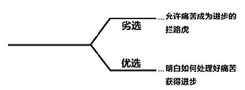
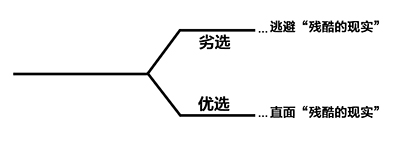
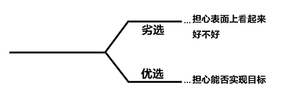
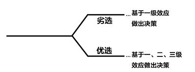
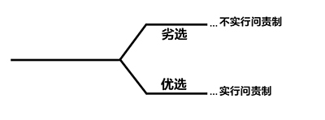
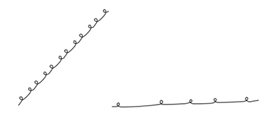
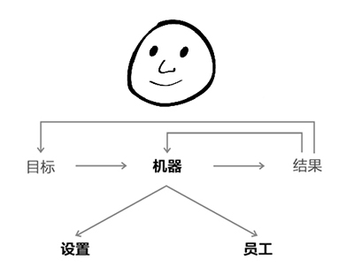

# 个人成长过程

### 
The Personal Evolutionary Process

个人成长过程

As I mentioned before, I believe that life consists of an enormous number of choices that come at us and that each decision we make has consequences, so **the quality of our lives depends on the quality ofthe decisions we make.**

我提过，人生由大量选择构成，我们要依次做出抉择，得到结果，所以**生活质量取决于我们所作抉择的质量。**

We aren’t born with the ability to make good decisions; we learn it.We all start off as children with others, typically parents, directing us. But, as we get older, we increasingly make our own choices. We choose what we are going after (i.e., our goals), which influences our directions. For example, if you want to be a doctor, you go to med school; if you want to have a family, you find a mate; and so on. As we move toward our goals, we encounter problems, make mistakes, and run into personal weaknesses. Above all else, how we choose to approach these impediments determines how fast we move toward our goals.

我们不是天生就会做出明智的决策，是通过学习才拥有这种能力的。我们从小都是和大人一起成长，尤其是父母，他们指导我们的生活，但日渐长大后我们就要靠自己做选择了。我们选择追寻什么样的目标影响着我们成长的方向。例如，你想成为一名医生，就会攻读医学院校，你想组建家庭，就会先找到伴侣，诸如此类。实现目标的征途中，我们遇到困难，犯错，发现自己的缺点。选择何种方式应对这些困难，决定着我们实现梦想的速度。

Of course it is true that people are born with differences in their various innate abilities. However, judgment is primarily learned.

当然，人们各种与生俱来的能力都确实存在差异，但判断力基本是靠学习获得的。

I believe that the way we make our dreams into reality is by constantly engaging with reality in pursuit of our dreams and by using these encounters to learn more about reality itself and how to interact with it inorder to get what we want—and that if we do this with determination, we almost certainly will be successful. In short:

要梦想成真，得不断在现实里历练，追寻梦想，总结教训，进而获得成长，了解现实，明白如何解决现实中的问题，实现自己的目标——下定决心，坚持不懈，定能成功。简而言之：

### 
Reality + Dreams + Determination = A Successful Life

现实+梦想+决心=成功的人生

So what is success? I believe that it is nothing more than getting what you want—and that it is up to you to decide what that is for you. I don’t care whether it’s being a master of the universe, a couch potato, or anything else—I really don’t. What is essential is that you are clear about what you want and that you figure out how to get it.

成功是什么?没什么比实现梦想更重要了，想要什么是自己决定的。做宇宙之主？躺沙发看电视的宅男？还是别的什么？我可不在乎，重要的是清楚自己想要什么，知道怎么去实现这个梦想。

However, there are a few common things that most people want.

然而，有些东西看起来普通，但却是大多数人都想要的。

As I mentioned, for most people success is evolving as effectively as possible, i.e., learning about oneself and one’s environment and then changing to improve. Personally, I believe that personal evolution is both the greatest accomplishment and the greatest reward.

我说过，对大多数人来说，成功是一个高效的进化过程，即了解自己和周遭环境、做出改变、获得提高。我认为实现个人进化，即成长是最伟大的成就，也能获得最丰厚的回报。

Also, for most people happiness is much more determined by how things turn out relative to their expectations rather than the absolute level of their conditions. For example, if a billionaire loses $200 million he will probably be unhappy, while if someone who is worth $10 thousand unexpectedly gets another $2 thousand, he will probably be happy. This basic principle suggests that you can follow one of two paths to happiness: 1) have high expectations and strive to exceed them, or 2) lower your expectations so that they are at or below your conditions. Most of us choose the first path, which means that to be happy we have to keep evolving.

同样，对大多数人来说，幸福感取决于同自身期望值的关联度，而非个体条件的绝对水平。例如，一个亿万富翁输了两亿美金，他可能会不开心，但如果另一个身价一万美元的人意外获得了两千美金，那他可就乐开了花。这条基本原则说明，通往幸福之路有两条：1）期望值高，努力超越；2）降低期望值，符合或低于自身客观条件。大家一般都会选第一条路，也意味着想幸福，就得不断成长。

Another principle to keep in mind is that people need meaningful work and meaningful relationships in order to be fulfilled. I have observed this to be true for virtually everyone, and I know that it’s true for me.

另一条要牢记的原则是，充实的生活需要从事有意义的工作，需要跟值得打交道的人建立人脉。我发现这几乎是适用于每个人的一条真理，当然，对我更是如此。

> As Freud put it, “Love and work are the cornerstones of our humanness.”
> 
> 弗洛伊德说过：爱情和工作是我们人性的基石。
> The work doesn’t necessarily have to be a job, though I believe it’s generally better if it is a job. It can be any kind of long-term challenge that leads to personal improvement. As you might have guessed, I believe that the need to have meaningful work is connected to man’s innate desire to improve. And relationships are the natural connections to others that make us relevant to society.
> 
> 工作不一定是一份职业，当然我觉得最好是一份职业。只要是一项长期挑战，可以提升自我，就能称作是工作。我认为必须从事有意义的工作，因为想要提升自己是人类与生俱来的欲望，所以我们在社会中才会自然而然和他人建立关系。

Regardless of others’ principles, you will need to decide for yourself what you want and go after it in the best way for you.

别的原则暂且不谈，首先你得决定自己想要追寻的是什么，并通过最适合自己的方式实现它。

### 
Your Most Important Choices

你最重要的选择

As I mentioned, as we head toward our goals we encounter an enormous number of choices that come at us, and each decision we make has consequences. So, **the quality of our lives depends on the qualityof the decisions we make**. We literally make millions of decisions that add up to the consequences thatare our lives.

我提过，实现目标的征途中，会遇到大量选择，而我们所做的每一个决定都产生其结果，**生活质量取决于我们所作的抉择的质量**。我们大概会做出百万次抉择，最终的结果累加构成了我们的人生。

Of these millions, I believe that there are five big types of choices that we continually must make that radically affect the quality of our lives and the rates at which we move toward what we want. Choosing well is not dependent on our innate abilities such as intelligence or creativity, but moare on what I think of as character. For this reason, I believe that most people can make the right choices.

这百万次选择中，我们一直在做的深刻影响生活质量与实现目标速度的选择主要有五大类。选对与否不是取决于我们天生的智慧或创造力，而是取决于我们的性格，所以我认为大多数人都能做出正确的选择。

The following five decision trees show these choices. I believe that those who don’t move effectively to their goals do the things on the top branches, and those who do move to them most quickly do the things on the bottom branches.

下面五大“决策树”展现了不同的选择。实现梦想的征途上，效率低下之人会选上分支的选项，效率高的会选下分支的选项。

First:

第一个选择：

It is a fundamental law of nature that to evolve one has to push one’s limits, which is painful, in order to gain strength—whether it’s in the form of lifting weights, facing problems head-on, or in any other way. Nature gave us pain as a messaging device to tell us that we are approaching, or that wehave exceeded, our limits in some way. At the same time, nature made the process of getting stronger require us to push our limits. Gaining strength is the adaptation process of the body and the mind to encountering one’s limits, which is painful. In other words, both pain and strength typically result from encountering one’s barriers. When we encounter pain, we are at an important juncture in our decision-making process.

大自然的一条根本定律是，要想进化，就要突破极限，承受痛苦，方能获得成长，举重也好，直面难题也好，都不外乎如此。大自然赋予我们痛苦，其实是让我们感受到离目标越来越近，或已在某方面超越了自己的极限。同时，大自然中物种变得强大的过程也要求突破极限。获得成长是身心适应环境，了解自身极限的痛苦过程，换句话说，痛苦与成长都是克服自身障碍的过程，当我们感到痛苦之时，我们其实是处于做出抉择的重要分叉口。

Most people react to pain badly. They have “fight or flight” reactions to it: they either strike out at whatever brought them the pain or they try to run away from it. As a result, they don’t learn to find ways around their barriers, so they encounter them over and over again and make little or no progress toward what they want.

大多数人对疼痛反应激烈，采取“战斗或逃避”的法子，要么奋起反抗给他们带来痛苦的东西，要么就想逃之夭夭，结果呢，终究没能解决这些障碍，这也决定了他们将会一次又一次遇到这些困难，遭受痛苦，无法取得进步，无法达成目标。

> There are literally two different parts of each person’s brain that influence these reactions: the pre-frontal cortex and the amygdala. They work as though they were two different brains that fight for control of decision-making. The pre-frontal cortex is the logical part of the brain that evaluates choices logically and the amygdala is the “animal instinct” part of the brain that triggers emotional reactions like the instinct to fight or flee. When faced with an obstacle or threat, an emotional reaction (e.g. pain) can be triggered that can lead to a fight or flight reaction that “hijacks” decision making away from the pre-frontal cortex, where the rational choices are being made. This can result in our making decisions that produce consequences that we do not want. This typically causes really big problems.
> 
> 人体大脑有两个部分会影响这类反应：前额叶皮层和杏仁体。它们就像两个不同的大脑，相互斗争想控制决策行为。前额叶皮层是大脑的逻辑组织，从逻辑上评估各种选项，杏仁体是大脑“动物天性”部分，会引起情绪反应，如战斗或逃跑。面对障碍或威胁，会产生情绪反应（比如痛苦），导致战斗或逃跑之类的行为，这种行为会将人做理性决策的行为能力从前额叶皮层那里抢过来，这样做的决策结果不是我们想要的。

Those who react well to pain that stands in the way of getting to their goals—those who understand what is causing it and how to deal with it so that it can be disposed of as a barrier—gain strength and satisfaction. This is because most learning comes from making mistakes, reflecting on the causes of the mistakes, and learning what to do differently in the future. Believe it or not, you are lucky to feel the pain if you approach it correctly, because it will signal that you need to find solutions and to progress. Since the only way you are going to find solutions to painful problems is by thinking deeply about them—i.e., reflecting — if you can develop a knee-jerk reaction to pain that is to reflect rather than to fight or flee, it will lead to your rapid learning/evolving.

面对困难，有人反应得体，这种人深知根源起因，明白如何应对，清除掉这些人生路障，获得成长与满足感。这是因为人是在犯错中学习、反思根源，并学会如何在未来改变策略。不管你信不信，我觉得遭受痛苦是件幸事，能从中意识到哪儿有什么问题需要解决与提高。要想解决这些令人头疼的问题，唯一的法子就是深入思考。如果在膝跳反应中，对疼痛的反应是反思，而不是反抗或逃避，即可快速学习，获得成长。

> Your very unique power of reflectiveness—i.e., your ability to look at yourself, the world around you, and the relationship between you and the world—means that you can think deeply and weigh subtle things to come up with learning and wise choices. Asking other believable people about the root causes of your pain in order to enhance your reflections is also typically very helpful— especially others who have opposing views and who share your interest in finding the truth rather than being proven right.
> 
> 因为你拥有一项独特的能力，即反思的能力，能使你审视自己、周围的世界和你与世界的关系。因此你能够深入思考，对细节进行考量，从而获得知识，做出明智的选择。让值得信赖之人告诉你痛苦的根本原因，能提升反思的质量。尤其当对方与你观点相对立，或与你一样乐于自己去寻找真相而不是乐于坐等事实被别人证明。

If you can reflect deeply about your problems, they almost always shrink or disappear, because you almost always find a better way of dealing with them than if you don’t face them head on. The more difficult the problem, the more important it is that you think hard about it and deal with it. After seeing how effectively facing reality—especially your problems, mistakes and weaknesses— works, I believe you will become comfortable with it and won’t want to operate any other way.

如果你能深刻反思自己的问题，这些问题基本都会减少或消失。因为比起躲避这些问题，你几乎总是能找到一种更高的解决方法。问题越严重，越需要你认真思考并解决它，当看到有效面对现实，尤其是面对自己的问题，错误和缺点。我相信你终会从容应对，到时候都不会想用其他方法解决了。

So, please remember that:

所以，请记住：

#### Pain + Reflection = Progress
痛苦+反思=进步

#### How big of an impediment is psychological pain to your progress?
通往成功之路上，困难阻碍对你的心灵能造成多大的痛苦呢？

Second:

第二个选择：

People who confuse what they wish were true with what is really true create distorted pictures of reality that make it impossible for them to make the best choices. They typically do this because facing “harsh realities” can be very difficult. However, by not facing these harsh realities, they don’t find ways of properly dealing with them. And because their decisions are not based in reality, they can’t anticipate the consequences of their decisions.

有人会混淆“期望的真相”与“事实真相”，真实情况因而被扭曲，也就无法做出最佳选择，这可能是因为直面“残酷的现实”确实很难做到。但不直面这些残酷的现实，人们就没法找到从容应对这些现实的办法。如果决策不是基于真实情况，那么决策的结果就无法预测。

> An example of this is what discussed earlier: wanting to save the wildebeest from the hyenas. When you don’t want to face what’s really happening, you can’t make sound decisions.
> 
> 我之前谈过有人想从土狼手中救回羚羊的例子就是如此。若你回避现实，是不可能做出明智决定的。
> 
> In contrast, **people who know that understanding what is real is the first step toward optimallydealing with it make better decisions.**
> 
> **相比之下，人明白实事求是从容应对困难的第一步，这些人会做出更明智的选择。**

So, remember…

所以，记住。。。

### 
Ask yourself, “Is it true?”

问问自己：这是真的吗？

…because knowing what is true is good.

因为了解真实情况是大有好处的。

### 
How much do you let what you wish to be true stand in the way of seeing what is really true?

你会让“期望的真实情况”阻碍自己认清事实真相吗？如果是，程度是怎样呢？

Third:

第三个选择：

**People who worry about looking good typically hide what they don’t know and hide their weaknesses, so they never learn how to properly deal with them and these weaknesses remain impediments in the future.** Thesepeople typically try to prove that they have the answers, even whenthey really don’t. Why do they behave in this unproductive way? They typically believe the senseless but common view that great people are those who have the answers in their heads and don’t have weaknesses. Not only does this view not square with reality, but it also stands in the way of progress.

**担心表面上看起来是否体面的人，一般是在掩盖自己不清楚的地方或缺点，这种人从来不去学怎么处理自己的无知与缺点，任凭其成为未来的拦路虎。**这类人就算不知道答案是什么，也试图努力证明自己知道正确答案。为什么他们做如此低效的事情？因为他们持有一个虽可笑但普遍的观点，认为成功人士脑袋里装的只有正确答案、没有缺点。这种观点本身就与事实不符，也会阻碍前进的步伐。

> For example, if you are dumb or ugly, you are unlikely to acknowledge it, even though doing so would help you better deal with that reality. Recognizing such “harsh realities” is both very painful and very productive.
> 
> 例如，假如你是愚蠢或丑陋的，你可能不会承认，尽管这么做会助你更好地面对现实。认识到这种“残酷的现实”虽痛苦，但很有成效。

I have never met a great person who did not earn and learn their greatness. They have weaknesses like everyone else—they have just learned how to deal with them so that they aren’t impediments to getting what they want. In addition, the amounts of knowledge and the capabilities that anyone does not have, and that could be used to make the best possible decisions, are vastly greater than that which anyone (no matter how great) could have within them.

我所遇到的成功人士没有一个不是历经犯错学习才获得成功的。他们和大家一样都有缺点，不过他们懂得如何应对自己的缺点，不会使其阻碍梦想的实现。除此之外，这些成功人士学识渊博，能力超凡，这些都能助我找到最佳的决策方案，这种资源比任何单个成功的人（无论他多成功）所拥有的优势都大得多。

> I am not saying that we all have the same potential, just that to get the most of your potential—whatever that is—you must learn and earn.
> 
> 我不是说大家的潜力是一样的，无论这种潜力是什么，要想完全开发就得学习然后获得。

As I mentioned in the first chapter, you don’t have to know everything to get what you want. You just have to be honest with yourself about what you don’t know and know who to ask for help.

我在第一章提过，要想实现梦想不必什么都知道，坦诚面对自己对某些东西不知道的事实，懂得找他人寻求帮助。

This explains why **people who are interested in making the best possible decisions rarely areconfident that they have the best possible answers**. So they seek to learn more (often by exploringthe thinking of other believable people, especially those who disagree with them) and they are eager to identify their weaknesses so that they don’t let these weaknesses stand in the way of them achieving their goals.

这解释了为什么**乐于做出最佳决策的人极少会对自己的方案表示十足的信心**。他们因此希望学到更多（通过探索其他值得信赖之人，尤其是持异见之人的想法），并渴望发现自身缺点，避免这些缺点阻碍自己实现目标。

So, what are your biggest weaknesses? Think honestly about them because if you can identify them, you are on the first step toward accelerating your movement forward. So think about them, write them down, and look at them frequently.

所以你最大的缺点是什么呢？若你能发现这些缺点，请坦诚思考一下，这是加速自己成功的第一步。想想这些缺点，写下来，时常看看。

One of my biggest weaknesses is my poor rote memory: I have trouble remembering things that don’t have reasons for being what they are, such as names, phone numbers, spelling, and addresses. Also, I am terrible at doing tasks that require little or no logic, especially if I have to do them repeatedly. On the other hand, I have a great contextual memory and good logic, and I can devote myself to things that interest me for untold hours. I don’t know how much of what I am bad at is just the other side of what I am good at—i.e., how much of what I am good at is due to my brain working in a certain way that, when applied to certain tasks, does well and when applied to others does poorly—and how much of what I am good at was developed in order to help compensate for what I am bad at. But I do know that I have created compensating approaches so that what I am bad at doesn’t hurt me much; e.g., I surround myself with people who have good rote memories who do the things that I am bad at, and I carry around tools like my BlackBerry.

我最大的缺点是识记能力差，特别是没有上下文推理的东西我就很难记住，比如姓名、电话号码、单词拼写、地址等等。没什么逻辑的任务我也干不好，如果是机械重复的工作我更是不在行。但从另一方面来看，我情景记忆力和逻辑思维都很强，感兴趣的事情我愿投身其中，不眠不休。不知道我不擅长某些事的原因会不会正好就是我擅长另一些事的原因，也就是说，我擅长某些事是因为大脑的某种思维方式应用到某些具体任务上发挥了很好的效果，但应用到别的一些任务时效果就很差。也不知道我擅长的思维方式是不是得到了开发，足以弥补我的缺点。但可以肯定的是我自己想出了补偿方法，不会因为这些缺点而吃什么大亏。比方说，我身边结交很多识记能力很强的人，他们可以做我不擅长的事情，我随身带着黑莓手机这种电子设备就足够了。

#### 
How much do you worry about looking good relative to actually being good?

你有多担心看起来好不好呢？你又有多担心实际上好不好呢？

Fourth:

第四个选择：

People who overweigh the first-order consequences of their decisions and ignore the effects that the second- and subsequent-order consequences will have on their goals rarely reach their goals. Thisis because first-order consequences often have opposite desirabilities from second-orderconsequences, resulting in big mistakes in decision-making. For example, the first-order consequences of exercise (pain and time-sink) are commonly considered undesirable, while the second-order consequences (better health and more attractive appearance) are desirable. Similarly, food that tastes good is often bad for you and vice versa, etc. If your goal is to get physically fit and you don’t ignore the first- order consequences of exercise and good-tasting but unhealthy food and connect your decisions with their second- and third-order consequences, you will not reach your goal.

过于看重决策的一级效应，忽略二、三级效应的人，一般很难实现目标。因为一级效应和二级效应的意愿经常是对立的，容易使人做决策时犯大错。例如，健身的一级效应为承受痛苦，花费时间，这一般不是人们渴望的。而其二级效应，即更健康，外貌变得更具吸引力，则是人们渴望的。类似的道理，可口的食物一般对健康无益，反之亦然。比如，你的目标是身体健康，但是如果你不忽视运动与美味但不健康的饮食之间的一级效应，不将决策建立在二、三级效应之上，那么你就无法实现目标。

> Sometimes it can be difficult to anticipate the 2nd or 3rd order consequences of a decision, such as one that involves using complex technology like X-Rays or DDT, where either things are not what they seem to be or there are too many unknown variables to make a sound decision. For more on the probabilities of personal decision-making, please refer to the “To Make Decisions Effectively” section at the end of Part 3.
> 
> 某项决定的二、三级效应有时是很难预料的，比如某人使用像X光或数字资料发送机这种复杂的科技设备时就是如此，因为这两样东西表面上很难预测后果，存在太多未知变数，没法做出很好的决定。关于个人抉择的可能性，请参阅第三章末的《有效决策》部分。

Quite often the first- order consequences are the temptations that cost us what we really want, and sometimes they are barriers that stand in our way of getting what we want. It’s almost as though the natural selection process sorts us by throwing us trick choices that have both types of consequences and penalizing the dummies who make their decisions just on the basis of the first-order consequences alone.

大多数时候，一级效应是我们实现目标要克服的诱惑，有时还是阻碍成功的拦路虎。这就像自然中物竞天择的过程，甩给我们具备两种结果的选项，那些傻乎乎只基于一级效应做选择的笨蛋就会受到惩罚。

By contrast, people who choose what they really want, and avoid the temptations and get over the pains that drive them away from what they really want, are much more likely to have successful lives.

与之相比，选择真心所渴望、抵挡住诱惑、克服实现目标所需承受的痛苦，这样才更可能拥有成功的人生。

#### 
How much do you respond to 1st order consequences at the expense of 2nd and 3rd order consequences?

做决策时，不考虑二、三级效应，仅就一级效应做出反应，这种情况发生在你身上的频率高么？

Fifth:

第五个选择：

People who blame bad outcomes on anyone or anything other than themselves are behaving in a way that is at variance with reality, and subversive to their progress.

有的人，结果不理想就怪罪别人而不从自身找原因，这与事实相矛盾，也会阻碍进步。

Blaming bad outcomes on anyone or anything other than one’s self is essentially wishing that reality is different than it is, which is silly. And it is subversive because it diverts one’s attention away from mustering up the personal strength and other qualities that are required to produce the best possible outcomes.

结果不理想就怪到别人头上，而不认为自己有问题，实际上是想自欺欺人，这种做法很可笑，还会阻碍进步。因为这样做无疑是分散精力，而原本是可以集中精力提升个人能力素质，实现最佳结果的。

> Blaming others is NOT the same thing as holding others accountable, which we will discuss in my Management Principles.
> 
> 责备他人和实行问责制度不是一回事，我在管理原则章节会进行探讨。

**Successful people understand that bad things come at everyone and that it is their responsibility to make their lives what they want them to be by successfully dealing with whatever challenges they face.** Successfulpeople know that nature is testing them, and that it is not sympathetic.

**成功人士明白，不好的结果大家都会受其影响，人人都有责任应对各种挑战，这样才能实现梦想。**成功人士明白这是大自然在对他们进行考验，这没什么可悲的。

> Luck — both good and bad — is a reality. But it is not a reason for an excuse. In life, we have a large number of choices, and luck can play a dominant role in the outcomes of our choices. But if you have a large enough sample size—if you have large number of decisions (if you are playing a lot of poker hands, for example)—over time, luck will cancel out and skill will have a dominant role in determining outcomes. A superior decision-maker will produce superior outcomes. That does not mean there won’t be certain bad-(or good-) luck events that are life changing: a friend of mine dove into a swimming pool and became a quadriplegic. But he approached his situation well and became as happy as anybody else, because there are many paths to happiness. What happens to a lot of people is that they don’t take personal responsibility for their outcomes, and as a result fail to make the best possible decisions.
> 
> 无论是好运气还是坏运气，都是事实。但运气不能作为做不好事的借口。生活中我们面对很多选择，运气对选择的结果起着主导作用，但假如样本数量足够大，就是说你的决定特别多，那久而久之，运气的作用就开始淡化了，能力开始对结果起主导作用了。优秀的决策者会做出优秀的决定。那并不意味着运气（好的或坏的）不会对人生产生重大改变：我有个朋友在游泳池游泳不慎变成了四肢瘫痪者，但他面对这样的境遇依然能够处理地很好，同大家一样幸福，因为通往幸福的道路不止一条。很多人不为自己所造成的结果担当起个人责任，结果就是无法做出最佳决定。

As I mentioned earlier, I believe that nature is symbiotic—and that we must give to it for it to give back.

我之前提过，大自然是共生的，我们需要给它它想要的，才得到回报。

#### 
How much do you let yourself off the hook rather than hold yourself accountable for your success?

为实现成功，你是置身事外呢，还是富有担当与责任心呢？

**In summary, I believe that you can probably get what you want out of life if you can suspend your ego and take a no-excuses approach to achieving your goals with open -mindedness, determination, and courage, especially if you rely on the help of people who are strong in areas that you are weak.**

**总结一下，我认为要实现梦想，你得清除自我设障，做事不找借口、思维开放、下定决心、富有勇气，尤其要依靠那些在你不擅长的领域表现优秀之人。**

If I had to pick just one quality that those who make the right choices have, it is character. Character is the ability to get one’s self to do the difficult things that produce the desired results. In other words, I believe that for the most part, achieving success—whatever that is for you—is mostly a matter of personal choice and that, initially, making the right choices can be difficult. However, because of the law of nature that pushing your boundaries will make you stronger, which will lead to improved results that will motivate you, the more you operate in your “stretch zone,” the more you adapt and the less character it takes to operate at the higher level of performance. So, if you don’t let up on yourself, i.e., if you operate with the same level of “pain,” you will naturally evolve at an accelerating pace. Because I believe this, I believe that whether or not I achieve my goals is a test of what I am made of. It is a game that I play, but this game is for real. In the next part I explain how I go about playing it.

若要说做出明智的选择之人具备什么共同的素质，我想，是意志。意志坚强的人能够克服困难，获得想要的结果。换句话说，我认为要实现成功主要靠的是个人选择，刚开始做正确的选择会很困难，但根据大自然法则，要变得强大就要突破自己的极限，才能实现进步这一结果，激励自己继续前行，在“伸展区”历练越多，就越能适应环境，高级阶段也就不用那么费力了。所以，如果你不放松，保持“疼痛”的程度，就会自然而然加速成长。因为我相信，能否实现目标是对自身品质的检验，这是一场自己主导的游戏，但是这是荷枪实弹的游戏。下一章我会谈谈怎么开始玩这场游戏。

In summary, **I don’t believe that limited abilities are an insurmountable barrier to achieving yourgoals, if you do the other things right.**

总结一下，**我不认为有限的能力是实现目标不可逾越的障碍，能把其他的事情做好，也能弥补自身的缺陷。**

As always, it is up to you to ask yourself if what I am saying is true. As the next part delves into this concept more, you might want to reserve your judgment until after you have read it.

还是老规矩，你自己来判断我说的是不是真的，下一章会更深入探讨这个概念，在那之前，你可以保留自己的判断。

### 
Your Two Yous and Your Machine

两个“你”和你的“机器”

Those who are most successful are capable of “higher level thinking” —i.e., they are able to step back and design a “machine” consisting of the right people doing the right things to get what they want. They are able to assess and improve how their “machine” works by comparing the outcomes that the machine is producing with the goals. Schematically, the process is as shown in the diagram below. It is a feedback loop:

成功人士具备“高层思维”，即能够往回看，设计一台“机器”，由合适的员工做匹配的工作，然后实现目标。他们通过比较这台“机器”的生产情况与预期目标，能够评估并改善其运行情况。整个过程如下图所示，这个过程形成了一个反馈循环：

That schematic is meant to convey that your goals will determine the “machine” that you create to achieve them; that machine will produce outcomes that you should compare with your goals to judge how your machine is working. Your “machine” will consist of the design and people you choose to achieve the goals. For example, if you want to take a hill from an enemy you will need to figure out how to do that— e.g., your design might need two scouts, two snipers, four infantrymen, one person to deliver the food, etc. While having the right design is essential, it is only half the battle. It is equally important to put the right people in each of these positions. They need different qualities to play their positions well—e.g., the scouts must be fast runners, the snipers must be precise shots, etc. If your outcomes are inconsistent with your goals (e.g., if you are having problems), you need to modify your “machine,” which means that you either have to modify your design/culture or modify your people. Do this often and well and your improvement process will look like the one on the left and do it poorly and it will look like the one on the right, or worse:

这个图表说明，这台“机器”旨在实现你所设定的目标，“机器”产出的结果与目标进行比较，判断“机器”的运行情况，你的这台“机器”由机构设置与员工配备两块组成。例如，你想要攻下敌人占领的山头，就得知道怎么去操作，你的设计方案可能是：需要两个侦察兵，两名狙击手，四名步兵，一名后勤兵并给前方运送食物。做好设计方案很重要，但想打好仗，这只完成了一半，同样重要的是，你还需要将合适的员工安排在正确的岗位上。每个岗位所要求的素质不同，侦察兵要跑得快，狙击手要射得准。如果结果和目标不一致，比如出现问题了，你就要调试自己的这台“机器”，既要调试设计方案，即公司文化，也要调整人员配备。经常这样进行反馈与调整，进步的过程就会如左图曲线所示，反之如右图曲线所示。

**I call it “higher level thinking” because your perspective is of one who is looking down on at your machine and yourself objectively**, using the feedback loop as I previously described. In other words,your most important role is to step back and design, operate and improve your “machine” to get what you want.

**“高层思维”是以俯视的角度客观审视这台“机器”与你自己。**要运用我之前描述的反馈回路。换句话说，你最重要的角色是回过头反思，进行设计、操作，改善“机器”的性能，实现目标。

Think of it as though there are two yous—you as the designer and overseer of the plan to achieve your goals (let’s call that one you(1)) and you as one of the participants in pursuing that mission (which we will call you(2)). You(2) are a resource that you(1) have to get what you(1) want, but by no means your only resource. To be successful you(1) have to be objective about you(2).

想象有两个你，你（1号）是整个方案的设计者和监督者，你（2号）是履行任务的参与者。你（2号）是你（1号）为了实现目标的一个资源，但绝不是唯一的资源。要想成功，你（1号）要对你（2号）保持客观评价。

Let’s imagine that your goal is to have a winning basketball team. Wouldn’t it be silly to put yourself in a position that you don’t play well? If you did, you wouldn’t get what you want. Whatever your goals are, achieving them works the same way.

想象一下，我们的目标假设是赢一场篮球比赛，要把你安排在不擅长的位置打这场比赛，是不是听起来很蠢？若一定要这么安排，也是会输掉这场比赛的。无论目标是什么，实现目标的原理是一致的。

If you(1) see that you(2) are not capable of doing something, it is only sensible for you(1) to have someone else do it. In other words, you(1) should look down on you(2) and all the other resources at your(1) disposal and create a “machine” to achieve your(1) goals, remembering that you(1) don’t necessarily need to do anything other than to design and manage the machine to get what you(1) want. If you(1) find that you(2) can’t do something well **fire yourself** (2) and get a good replacement! You shouldn’t be upset that you found out that you(2) are bad at that—you(1) should be happy because you(1) have improved your(1) chances of getting what you(1) want. If you(1) are disappointed because you(2) can’t be the best person to do everything, you(1) are terribly naïve because nobody can do everything well.

如果你（1号）发现你（2号）不擅长做某事，你（1号）安排别人来做，这样看才是合理的。换句话说，你（1号）要俯视包括你（2号）在内所有可利用的资源，建立一台“机器”，实现你（1号）的目标。记住，你（1号）可不一定只做为实现你（1号）目标的设计与管理“机器”的工作，当你（1号）发现你（2号）不能很好完成任务时，就**解雇你自己**（2号），换个合适的岗位。不要因为发现你（2号）不擅长那个岗位就感到沮丧，你（1号）应该感到高兴，因为你（1号）提升了你（1号）自己实现目标的几率，如果你（1号）是因为觉得你（2号）无法成为事事都能做得完美之人而感到沮丧，那你（1号）的想法就太幼稚了，因为人无完人。

**The biggest mistake most people make is to not see themselves and others objectively.** If theycould just get around this, they could live up to their potentials.

**很多人最大的错误就是没能客观看待自己或他人**，克服了这点就能实现自身潜力的发展。

*   How much do you intellectually agree with what I just said?

    理性来看，你同意我所说的吗？

*   How good are you in approaching life as a “higher level thinker” rather than as a doer?

    做生活的“高层思维者”而不是仅作一个办事的，你这方面做到了吗?

*   How much would you like to get better at this?**

    你想在这方面愿意做得更好吗？

*   How much do you think that reading this is a waste of time?

    你现在觉得读这个是浪费时间吗？