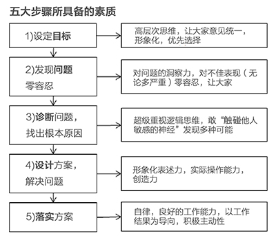

# 实现梦想的五大步骤

### 
My 5-Step Process to Getting What You Want Out of Life

实现梦想的五大步骤

The you I am referring to here is the strategic you – the one who is deciding on what you want and how best to get it, previously referred to as you (1).

这里的你（1号）是指制定战略的你，所做的主要是决定目标和最佳获得方式。

There are five things that you have to do to get what you want out of life. First, you have to **choose your goals**, which will determine your direction. Then you have to **design a plan** to achieve your goals. On the way to your goals, you will **encounter problems** As I mentioned, these problems typically cause pain. The most common source of pain is in exploring your mistakes and weaknesses. You will either react badly to the pain or react like a master problem solver. That is your choice. To figure out how to get around these problems you must be calm and analytical to accurately **diagnose your problems**. Only after you have an accurate diagnosis of them can you **design a plan that will get you around your problems**. Then you have to do the **tasks** specified in the plan. Through this process of encountering problems and figuring out how to get around them, you will become progressively more capable and achieve your goals more easily. Then you will set bigger, more challenging goals, in the same way that someone who works with weights naturally increases the poundage. This is the process of personal evolution, which I call my 5-Step Process.

要实现梦想，得做五件事，首先，**选择你的目标**，这会为你指明方向。然后你需要**设计一个方案**来实现你的目标。这个过程中，你会**遇到问题**，正如我说过的，这些问题一般都会带来痛苦。痛苦最普遍的是来源于自己犯的错和缺点。面对问题，你将要么对着痛苦怨声载道，要么像大师级的问题解决能手一样从容应对，这是你自己的选择。要解决这些问题，必须冷静，精准分析，诊断问题。只有精准**诊断问题**后，才能**设计解决问题的方案**。接下来，你要完成方案里设置的具体**任务**。通过遇到问题，寻找解决方案，你会变得更积极，更有能力，更易实现梦想，进而就能设置更宏伟，更具挑战性的目标了，就像练哑铃的人也会不断增加哑铃的重量一样。这就是个人成长过程，我称之为五大步骤。

In other words, “The Process” consists of five distinct steps:

也即，该方法包括五大具体步骤：

*   **Have clear _goal_.**

    **目标清晰。**

*   **Identify and don’t tolerate the _problems_ that stand in the way of achieving your goals.**
    **
    发现 _问题_ ，对阻碍目标实现的问题零容忍。**

*   **Accurately _diagnose_ these problems.****

    精准 _诊断_ 这些问题。**

*   **
    _Design_ plans that explicitly lay out tasks that will get you around your problems and on to your goals.**

    **_设计_ 方案，清晰列出待解决的问题，实现目标的各项具体任务。**

*   **
    _mplement_ these plans—i.e., _do_ these tasks.**

    **落实方案，也就是_完成_具体任务。**

**
You need to do all of these steps well in order to be successful.**

**这些步骤完成好了才会走向成功。**

**
Before discussing these individual steps in more detail, I want to make a few general points about the process.**

**开始分述每个步骤前，我想先简单谈谈整个过程。**

1\. **You must approach these as distinct steps rather than blur them together.** For example,when setting goals, just set goals (don’t think how you will achieve them or the other steps); when diagnosing problems, just diagnose problems (don’t think about how you will solve them or the other steps). Blurring the steps leads to suboptimal outcomes because it creates confusion and short-changes the individual steps. Doing each step thoroughly will provide information that will help you do the other steps well,**since the process is iterative.**

**每个步骤要界限分明，独立操作，不可交叉重叠，混为一谈。** 例如，设置目标时就只想着设置目标，不要想你怎么实现或想别的步骤；诊断问题时就仅仅诊断问题，不要想怎么解决或想别的步骤。目标间相互混杂会导致不尽人意的结果，因为这样会令人产生困惑，给每个步骤带来临时的变数。完整地完成每个步骤，有助于更好地完成其他步骤，**因为整个过程可以循环往复。**

2\. **Each of these five steps requires different talents and disciplines.** Most probably, you havelots of some of these and inadequate amounts of others. If you are missing any of the required talents and disciplines, that is not an insurmountable problem because you can acquire them, supplement them, or compensate for not having them, if you recognize your weaknesses anddesign around them. So you must be honestly self-reflective.

**每个步骤都需要具备不同的能力，了解不同学科的知识。**很可能你这方面懂很多，那方面懂一点，有些方面则没什么了解，如果你在完成步骤所需的资质或学科知识上不够完备，也不是什么不可逾越的大问题，因为不会的可以学，可以补充，不知道的地方也有抵消的办法，只要你认识到自己的缺点，并设计出解决方案，这就不是难事儿。所以请做一名诚实的自省者。

3\. **It is essential to approach this process in a very clear-headed, rational way rather than emotionally.** Figure out what techniques work best for you; e.g., if emotions are getting the betterof you, take time out until you can reflect unemotionally, seek the guidance of calm, thoughtful others, etc.

**操作这个过程，需要头脑清醒理智，而非感情用事。**指出哪些技巧最适合你，若个人情感在左右你的选择，就先跳出来冷静下直到可以理性反思，向处事冷静且考虑周全之人寻求指导。

To help you do these things well—and stay centered and effective rather than stressed and thrown off by your emotions—try this technique for reducing the pressure: **treat your life like a game** or a martial art. Your mission is to figure out how to get around your challenges to get to your goals. In the process of playing the game or practicing this martial art, you will become more skilled. As you get better, you will progress to ever- higher levels of the game that will require—and teach you—greater skills. I will explain what these skills are in the next section. However, **the big and really great news is that you don’t needto have all of these skills to succeed!** You just have to 1) know they are needed; 2) know you don’thave some of them; and 3) figure out how to get them (i.e., either learn them or work with others who have them).

为了帮你摆脱压力和情绪化的影响，进而聚精会神、高效顺利地完成这些步骤，试试这个减压技巧：把你的生活当作一场游戏或武术。你的使命是找出应对挑战的办法，实现目标。在玩游戏或练武术的过程中，技艺日益娴熟，变得强大，升级到需要新技能的关卡，新的关卡也会教会你新的技能。我会在下一部分详述这些技能是指什么。不过，**最鼓舞人心的消息是，你实现成功并不需要具备所有的这些技能！**你只需要：1）知道你需要这些技能；2）知道你没必要掌握全部技能；3）指出如何获得这些技能，通过学习或跟已掌握这些技能的人一起工作。

This particular game—i.e., your life—will challenge you in ways that will be uncomfortable at times. But if you work through this discomfort and reflect on it in order to learn, you will significantly improve your chances of getting what you want out of life. **By and large, life will give you what you deserve and itdoesn’t give a damn what you “like.” So it is up to you to take full responsibility to connect what you want with what you need to do to get it, and then to do those things—which often are difficult but produce good results—so that you’ll then deserve to get what you want.**

这个特别的游戏，也就是你的人生，会时而出现令你不悦的挑战。但如果你克服了这种不悦，反思学习，就能大幅度提升实现梦想的几率。**总体来说，生活会给你应得的回报，生活不会谴责你的喜好，所以你要自己负起责任来，搭建起“自己想要什么”和“要得到想要的该如何做”之间的桥梁，然后脚踏实地干起来，做起来虽然不那么容易，但能收获满意的结果，实现你的梦想。**

That’s just the way it is, so you might as well accept it. Once you accept that playing the game will be uncomfortable, and you do it for a while, it will become much easier (like it does when getting fit) . When you excel at it, you will find your ability to get what you want thrilling. You’ll see that excuses like “That’s not easy” are of no value and that it pays to “push through it” at a pace you can handle. Like getting physically fit, the most important thing is that you keep moving forward at whatever pace you choose, recognizing the consequences of your actions. When you think that it’s too hard, remember that in the long run, doing the things that will make you successful is a lot easier than being unsuccessful. The first-order consequences of escaping life’s challenges may seem pleasurable in the moment, but the second-and third-order consequences of this approach are your life and, over time, will be painful. With practice, you will eventually play this game like a ninja, with skill and a calm centeredness in the face of adversity that will let you handle most of your numerous challenges well.

游戏就是这么玩的，你最好还是接受这样的设定。一旦你也确实觉得玩这场游戏会遭受一些不适，请坚持一段时间，一切会变得越来越容易，就像健身一样。当你实现了超越，会为实现了梦想而兴奋不已，像“这可不容易”之类的借口就会变得毫无价值，按自己能掌控的节奏“突破自己”就会带来回报。跟健身一样，最重要的是，无论你选择了什么速度，都要坚持前行，才能认识到这样做的结果。当你觉得这太困难时，请记住，从长远来看，做能让自己成功的事，比失败容易得多。逃避人生中挑战的一级效应在那一刻看起来是令人愉悦的，但其带来的二、三级效应，随时间积淀，才真的会带来痛苦的人生。通过不断练习，最终你能跟忍者一样技艺娴熟，面对逆境能做到冷静专注，从容应对各种挑战。

However, you will never handle them all well: mistakes are inevitable, and it’s important to recognize and accept this fact of life. The good news, as I have mentioned, is that most learning comes through making mistakes—so there is no end to learning how to play the game better. You will have an enormous number of decisions to make, so no matter how many mistakes you make, there will be plenty of opportunities to build a track record of success.

诚然，你没有办法做得面面俱到：犯错难以避免，重要的是认识并接受这个人生事实。但利好的一面我也提到过，大多数的学习都是通过犯错得来的，所以人生这场游戏怎么玩得更好，其中的学问是无止境的。你得做大量决定，所以无论犯多少错误，都会有大量机会构建成功。

That’s basically the whole concept.

上述是整体概念。

Let’s pause and reflect on this before moving on.

我们暂且停顿一下，继续展开前先反思一下。

*   **Does what I am saying make sense to you?

    我所说的你都理解了么？**

*   **Do you agree that it is true?**

    **你认为我所说的是对的吗**

*   **If not, why not?**

    **如果你不同意，为什么？**

If you can’t work through your doubts alone, speak to me or to others about it, but PLEASE do not proceed until you agree with the basic logic behind the 5-Step Process. Either you will get comfortable with it and internalize it or you will point out something that is wrong and the process will get better.

若心存质疑，自己没法解答，可以告诉我或跟别人说说，但在认同五大步骤背后的基本逻辑前，请勿进行下一步。要么你会适应并消化这套基本逻辑，要么你也可以指出哪里有问题，帮助我们把这个过程做得更好。

What follows now is a closer examination of each of the five steps.

下面是对这五个步骤更进一步的探讨。

### 
The 5 Steps Close-U

五大步骤的特写详述

#### 
1) Setting Goals
1）设定目标

**You can have virtually anything you want, but you can’t have everything you want.**

**事实上，你想要什么都行，但你无法拥有一切。**

The first, most important, and typically most difficult step in the 5-Step Process is setting goals, because it forces you to decide what you really want and therefore what you can possibly get out of life. This is the step where you face the fundamental limit: life is like a giant smorgasbord of more delicious alternatives than you can ever hope to taste. So you have to reject having some things you want in order to get other things you want more.

五大步骤中，通常最重要又最困难的就是设定目标了，因为这是在逼你决定什么是你真正想要的以及可能获得的现实结果。这一步会面临最根本的局限：生活如同一盘大杂烩，美味佳肴种类繁多、应接不暇。所以你得学会舍弃一些想要的东西，才能获得你更想要的东西。

Some people fail at this point, afraid to reject a good alternative for fear that the loss will deprive them of some essential ingredient to their personal happiness. As a result, they pursue too many goals at the same time, achieving few or none of them.

有人会在这点上失败，不敢舍弃看起来不错的选择，害怕一旦失去，个人幸福感中某些重要组成元素就被剥夺了。所以这些人同时设置很多目标，但鲜有真正实现的。

So it’s important to remember: it doesn’t really matter if some things are unavailable to you, because the selection of what IS available is so great. (That is why many people who had major losses—e.g., who lost their ability to walk, to see, etc.—and who didn’t narrow-mindedly obsess about their loss but rather open-mindedly accepted and enjoyed what remained, had equally happy lives as those who didn’t ever have these losses.)

所以得记住，无法拥有某些东西并不要紧，因为在可以拥有的东西中进行挑选是很棒的事情。有人先天残疾，比如无法行走，看不见东西，但能和身体健全的人一样幸福，因为他们不狭隘地沉浸在失去的情绪中，而是大方接受并享受自己依然拥有的东西。

In other words, you can have an enormous amount: much, much more than what you need to have for a happy life. So don’t get discouraged by not being able to have everything you want, and for God’s sake, don’t be paralyzed by the choices. That’s nonsensical and unproductive. Get on with making your choices.

换句话说，你可以拥有很多东西，远多于你生活幸福所需，所以无法拥有一切也不要沮丧，也千万别被各种选择打垮，这样既没意义又无效，要习惯做选择。

Put another way, **to achieve your goals you have to prioritize, and that includes rejecting good alternatives** (so that you have the time and resources to pursue even better ones—time being probablyyour greatest limiting factor, though, through leverage, you can substantially reduce time’s constraints).

换个说法，**要实现目标就要有优先次序，包括舍弃看起来还不错的选项**。这样你就有时间和资源追寻更好的选项，时间可能是限制你最多的因素，最大程度利用好时间，就能极大减少时间带来的约束。

It is important not to confuse “goals” and “desires.”

不要混淆“目标”和“欲望”，这很重要。

Goals are the things that you really want to achieve, while desires are things you want that can prevent you from reaching your goals—as I previously explained, desires are typically first-order consequences. For example, a goal might be physical fitness, while a desire is the urge to eat good-tasting, unhealthy food (i.e., a first-order consequence) that could undermine you obtaining your fitness goal. So, in terms of the consequences they produce, goals are good and desires are bad.

目标是你真的想实现的东西，而欲望是你想要但会阻碍你实现目标的东西。我之前解释过，欲望一般是一级效应。例如，假设目标是身体健康，欲望就是吃可口但不健康的食物，这个是一级效应。这种结果不利于你实现健康这一目标。所以单从结果来看，目标是好的，欲望是不好的。

> Some societies define evil to be the desires that can take you away from your goals, which I think is a good way of seeing the difference between goals and desires. That doesn’t mean I think that there isn’t room for a little “bad”, but I do think that desires that fundamentally divert you from your goals should be avoided at all cost.
> 
> 有社会学家把导致自己远离目标的欲望称为邪恶，我认为这是用来区分目标与欲望很好的思路。这并不是说我不允许大家“不以恶小而为之”，但我真的认为，要想让自己远离目标的欲望应不惜一切代价将其铲除干净。

Don’t get me wrong; I believe you can choose to pursue any goal you want as long as you consider the consequences. So, staying with this example, I think it is perfectly OK for you to make your goal to enjoy eating good-tasting, unhealthy food if that choice will bring you what you really want. As I said earlier, if you want to be a couch potato, that’s fine with me—seriously. But if that’s not what you want, you better not open that bag of chips. In other words, failing to make the distinction between goals and desires will lead you in the wrong direction, because you will be inclined to pursue things you want that will undermine your ability to get things you want more. In short, you can pursue anything you desire—just make sure that you know the consequences of what you are doing.

别误解了我的意思，只要考虑了后果，我认为你完全可以去追寻任何你想要的目标。还是拿健身举例，如果你要把尽享可口不健康的食物作为目标，这是完全没问题的，只要能带来你想要的结果就行。我说过，你想做成天宅在家里看电视吃薯片无所事事的人，这对于我来说真的完全没问题。但如果这不是你想要的生活，最好就别撕开薯片包装袋了，换句话说，不能清晰辨别目标与欲望，将于事无补。因为你会倾向于追求你渴望的事情，而这件事情会影响你收获更多的能力。简而言之，你想追求什么都行，只要你确信自己知道这样做的后果就行。

> Another common reason people fail at this stage is that they lose sight of their goals, getting caught up in day-to-day tasks.
> 
> 导致你在这个阶段失败的另一个普遍原因是你忽视了自己的目标，陷入到一复一日的工作任务中去了。

**Avoid setting goals based on what you think you can achieve.**

**避免基于自己主观意愿设定目标。**

As I said before, do each step separately and distinctly without regard to the others. In this case, that means don’t rule out a goal due to a superficial assessment of its attainability. Once you commit to a goal, it might take lots of thinking and many revisions to your plan over a considerable time period in order to finalize the design and do the tasks to achieve it. So you need to set goals without yet assessing whether or not you can achieve them.

我提到过，每一步都要单独操作，绝不相互影响。这种情况下，也就是说目标不能仅根据表面上的可实现度而进行设定。一旦开始投身到实现目标的过程中，会需要大量的思考、反思，耗费大量的时间来最终确定实现目标的方案和具体任务。所以设定目标时，不要一开始就下结论说能不能实现。

This requires some faith that you really can achieve virtually anything, even if you don’t know how you will do it at that moment. Initially you have to have faith that this is true, but after following this process and succeeding at achieving your goals, you will gain confidence. If you like, you can start with more modest goals and, when you build up the track record to give you faith, increase your aspirations.

这需要你坚信没什么是办不到的。即使当下不知道怎么操作也不要紧。只要刚开始坚定这个信念，按这个过程依次推进，实现目标后，就会获得真正的信心。如果你愿意，刚开始可以设定一些简单普通的目标，小有成就后就能增强信念，个人志向也开始日趋宏大起来。

> This might sound inconsistent with the previous point that you can’t have everything. It’s not. I am saying that, at this stage of goal-setting, don’t set your goals based on what you think you can achieve. In the process of doing the other four steps (especially designing) you will thoroughly think through what is possible. Then you will circle back and enter the goal-setting mode again. As I mentioned, this five-step process is iterative, but it must be pursued one step at a time in order to do each step excellently.
> 
> 这里似乎和我之前提到的“你不能拥有一切”的观点有点矛盾，其实不是。在目标设置阶段，不要根据主观认为能实现什么而设定目标。在进行另外四个步骤，特别是方案设计时，你将会仔细思考可能的解决方案。那时又会返回到目标设定模式。我提过，这五大步骤是循环往复的，但每次必须认真完成一个步骤，才能为下一步顺利完成打好基础。

Every time I set goals, I don’t yet have any idea how I am going to achieve them because I haven’t yet gone through the process of thinking through them. But I have learned that I can achieve them if I think creatively and work hard.

每次我设定目标时都还不知道怎么去实现，因为这还没进入到仔细思考的步骤，但我认为只要思维富有创造性，勤奋努力，就能实现我的目标。

> The more creative I am, the less hard I have to work.
> 
> 我的创造力越强，我的工作就越轻松。

I also know that I can “cheat.” Unlike in school, in life you don’t have to come up with all the right answers. You can ask the people around you for help—or even ask them to do the things you don’t do well.

我还知道可以“作弊”。学校里事事都得有正确答案，而现实生活中，遇到问题你可以问身边的人，甚至让他们做你不擅长的事情。

In other words, there is almost no reason not to succeed if you take the attitude of 1) total flexibility—good answers can come from anyone or anywhere (and in fact, as I have mentioned, there are far more good answers “out there” than there are in you) and 2) total accountability: regardless of where the good answers come from, it’s your job to find them.

换句话说，采取以下的态度，没有理由不成功。1）完全的灵活性-任何人在任何地方都能提供令人满意的答案，事实上如我所说，我们自身能提供的答案是有限的，外在的人和环境能提供多得多的答案；2）要完全负责。不管合适的答案来自何处，找到它们是你的职责所在。

This no-excuses approach helps me do whatever it takes to get whatever I want most. Not all goals are achievable, of course. There are some impossibilities or near-impossibilities, such as living forever, or flying with just the power of your arms. But it’s been my experience that if I commit to bringing creativity, flexibility, and determination to the pursuit of my goals, I will figure out some way to get them, i.e., almost all goals are attainable. And as I don’t limit my goals to what seems attainable at the moment I set them, the goals I set tend to be higher than they would otherwise be. Since trying to achieve high goals makes me stronger, I become increasingly capable of achieving more. Great expectations create great capabilities, in other words. And if I fail to achieve my goal, it just tells me that I have not been creative or flexible or determined enough to do what it takes, and I circle back and figure out what I need to do about this situation.

这种不找借口的方法，助我尽全力实现最想达成的目标。当然，不是所有的目标都有可能实现。有些目标是不可能或几乎不可能实现的，例如长生不死，张开双臂飞翔等等。但根据我的经验，只要在追寻目标时，投入创造力，灵活性和决心，总能找到办法实现的。这么看来，几乎所有的目标都是可以实现的。我设置目标时，也不只是看它当下是否可能实现，我设的目标都是立足长远的。努力实现高难度目标，助我变得强大，能够实现更多的新目标。对期望值设定越高，能力也会变得越强。如果没能实现目标，我会对自己说，肯定我不够创新，不够灵活，毅力不够，然后回过头思考应该怎么解决。

**Achieving your goals isn’t just about moving forward.**

**实现目标不仅仅只是前进**

Inevitably, you must deal with setbacks. So goals aren’t just those things that you want and don’t have. They might also be keeping what you do have, minimizing your rate of loss, or dealing with irrevocable loss. Life will throw you challenges, some of which will seem devastating at the time. Your goal is always to make the best possible choices, knowing that you will be rewarded if you do. It’s like playing golf: sometimes you will be in the fairway and sometimes you will be in the rough, so you have to know how to play it as it lies.

挫折无法避免。目标是你想要但还没实现的东西，目标也能让你保留已有的东西，让失去的机率最小化，应对不可挽回的损失。生活会向你抛来挑战，有时是灾难性的。你的目标基本上都是在寻找最优解，并明白实现就能获得回报。跟打高尔夫球一样，有时球在光滑的球道上，有时在粗糙的地面上，要根据具体情况才能知道怎么去玩。

Generally speaking, goal-setting is best done by those who are good at big-picture conceptual thinking, synthesizing, visualizing, and prioritizing. But whatever your strengths and weaknesses are, don’t forget the big and really great news here: it is not essential that you have all of these qualities yourself, because you can supplement them with the help of others.

总的来说，目标设置最好能够由擅于在把握大局情况下进行概念思维、合成、形象化和优先排序的人来操作。不管你有什么优缺点，都别忘了最令人兴奋的好消息，就是你不必具备所有的能力素质，因为你可以通过别人的帮助来进行补充。

In summary, in order to get what you want, the first step is to really know what you want, without confusing goals with desires, and without limiting yourself because of some imagined impediments that you haven’t thoroughly analyzed.

总的来说，要实现梦想，第一步是真的知道自己要什么，不混淆目标与欲望，不因缺乏全面分析的假想障碍而把自己限制住了。

*   **How well do you know what you want most out of life?**

    **你有多了解自己想要什么？**

*   **What are your most important goals?**

    **你最重要的目标是什么？**

*   **Are you good at setting your goals?**

    **你擅于设定目标吗?**

How confident are you that your assessment of your ability to set goals is right?

对自己设定目标的能力进行评估，你有几分自信？

If you are confident of your self-assessment, why should you be confident (e.g. because you have a demonstrated track-record, because many believable people have told you, etc)?

如果你对自我评估很有信心，请论述自信的原因。是因为有过往业绩吗，还是值得信赖之人告诉过你？

#### 
2) Identifying and Not Tolerating Problems
2）发现问题，对问题零容忍

After you set your goals, you must come up with a plan or a design to achieve them and then you must execute that plan by doing the tasks. On the way to achieving your goals and executing your design, you will encounter problems that have to be diagnosed, so that the design can be modified to get around these obstacles. That’s why you need to identify and not tolerate problems.

设定目标后，你得设计出一套方案来实现目标，并且要实施方案里布置的各项任务。在实现目标、实施方案的过程中，你会碰到问题、诊断问题，进而完善设计方案以避免这些阻碍，所以要发现问题，并对问题零容忍。

**Most problems are potential improvements screaming at you.**

**大多数问题都是蕴含着改善良机的。**

Whenever a problem surfaces, you have in front of you an opportunity to improve.The more painful theproblem, the louder it is screaming. In order to be successful, you have to 1) perceive problems and 2) not tolerate them.

一旦有问题出现，摆在你面前的就是一个提升改善的良机。问题越棘手，带来的反应越大，要想成功，你得 1）发现问题；2）对问题零容忍。

> Though I’ve said it before, it’s worth saying again: I understand that recognizing harsh realities can be extremely painful. But I’ve learned that if you can stare hard at your problems, they almost always shrink or disappear, because you almost always find a better way of dealing with them than if you don’t face them head on. The more difficult the problem, the more important it is that you stare at it and deal with it. After seeing how effectively facing reality – especially your problems, mistakes and weaknesses – works, you will become comfortable with it and won’t want to operate any other way. I also believe that one of the best ways of getting at truth is reflecting with others who have opposing views and who share your interest in finding the truth rather than being proven right.
> 
> 虽然说过，但有必要再强调下：我明白，认识到残酷的现实非常痛苦，但我也发现，只要紧盯你的问题，这些问题基本都会减少或消失，因为比起躲避这些问题，你经常就已经找到了更好的解决办法了。问题越困难，越是需要对其紧抓不放。在面对现实情况时看到这种办法的有效性，尤其是面对自己的问题，错误和缺点，终会从容应对，到时候都不会想用其他方法解决了。我也相信，获得真相的最佳途径是同他人一起反思，尤其是当对方与你的观点相对立时，或与你一样乐于自己去寻找真相而不是乐于坐等事实被别人证明。

If you don’t identify your problems, you won’t solve them, so you won’t move forward toward achieving your goals. As a result, it is essential to bring problems to the surface.

若不能发现问题，你就无法解决问题，也就不能前行实现目标。所以，让问题显现出来十分关键。

Most people don’t like to do this. But most successful people know that they have to do this.

大多数人不爱这么做，但大多数成功人士知道他们必须这样做。

The most common reasons people don’t successfully identify their problems are generally rooted either in a lack of will or in a lack of talent or skill:

人们不能很好地发现自身问题，主要是源于缺少意愿、天赋或技能。

*   They can be “harsh realities” that are unpleasant to look at, so people often subconsciously put them “out of sight” so they will be “out of mind.”

    直面“残酷的现实”令人不悦，人们会下意识忽略，不去想。

*   Thinking about problems that are difficult to solve can produce anxiety that stands in the way of progress.

    思考棘手的问题，可能产生焦虑，阻碍进步。

*   People often worry more about appearing to not have problems than about achieving their desired results, and therefore avoid recognizing that their own mistakes and/or weaknesses are causing the problems. This aversion to seeing one’s own mistakes and weaknesses typically occurs because they’re viewed as deficiencies you’re stuck with rather than as essential parts of the personal evolution process.

    人们常常更担心表面上是否看起来有问题，而不担心能否实现预期目标，因此就回避自身可能产生问题的错误或弱点。这种对自身错误的反感非常普遍，因为人们认为犯错是一种缺陷，而没有把犯错当做个人进化过程中的重要一环。

*   Sometimes people are simply not perceptive enough to see the problems.

    有时人们仅仅是对问题缺乏洞察力罢了。

*   Some people are unable to distinguish big problems from small ones. Since nothing is perfect, it is possible to identify an infinite number of problems everywhere. If you are unable to distinguish the big problems from the little ones, you can’t “successfully” (i.e., in a practical way) identify problems.

    有人不会区分大问题和小问题。世上没有完美的事情，所以每个地方都可能发现数不完的问题，要不能从这一堆问题中分辨出大问题，实际上是不能顺利发现问题的。

Remember, you don’t have to be good at any of the five steps (in this case, identifying problems) to be successful if you get help from others. So push through the pain of facing your problems, knowingyou will end up in a much better place.

记住，五大步骤你不必样样精通（这里就是说发现问题的能力），因为能够从别人那里获得帮助。所以直面问题，经受住痛苦，相信自己的结果会比现在好很多。

**When identifying problems, it is important to remain centered and logical.**

**发现问题时，保持聚精会神和逻辑思维。**

While it can be tempting to react emotionally to problems and seek sympathy or blame others, this accomplishes nothing.Whatever the reasons, you have to get over the impediments to succeed. Remember that the pains you are feeling are “growing pains” that will test your character and reward you if you push through them. Try to look at your problems as a detached observer would. Remember thatidentifying problems is like finding gems embedded in puzzles; if you solve the puzzles you will get the gems that will make your life much better. Doing this continuously will lead to your rapidevolution. So, if you’re logical, you really should get excited about finding problems because identifying them will bring you closer to your goals.

面对问题时采取情绪化的做法，比如寻求同情或斥责他人，是毫无用处的。无论是什么原因，要想成功就要越过障碍。记住，你所体验的痛苦是“成长的痛苦”，会锻炼你的性格，经受住了考验就能获得回报。尝试以一个置身事外的观察者身份看待自己的问题。记住，发现问题就像是搜寻谜阵里镶嵌的宝石，解开了谜阵，就能获得宝石，让人生变得更好。持续这样做，会加速你的进化过程。如果你的逻辑思维很好，那你应该很乐于寻找问题，因为发现问题会让你更接近目标。

> This is typically because they let their emotions control their behavior and/or they haven’t learned how to deal with their problems e.g., the amygdala is “hijacking” decision-making away from the pre-frontal cortex.
> 
> 一般这样是因为个人情绪控制了他们的行为，他们还没学会如何解决问题，比如：大脑的杏仁体把决策行为从前额叶皮层那抢了过去

*   **How good are you at perceiving problems?

    你擅于察觉问题吗？**

*   **How confident are you that your assessment of your ability to perceive problems is right?**

    **你对上述问题的自我评估有信心吗？**

*   **If you are confident of your self-assessment, why should you be confident (e.g. because you have a demonstrated track-record, because many believable people have told you, etc)?**

    **如果你对自我评估很有信心，请论述自信的原因。（例如过去有过辉煌的记录，或值得信赖之人告诉过你等等）？**

*   **Be very precise in specifying your problems.**

    **问题要精准且具体化。**

It is essential to identify your problems with precision, for different problems have different solutions. For example, if your impediments are due largely to issues of will—to your unwillingness to confront what is really happening—you have to strengthen your will, for example by starting small and building up your confidence.

要精准地发现问题，这很关键，因为不同的问题有不同的解决办法。例如，如果你的障碍主要是由于个人意愿，不愿意直面现实。那你需要增强意愿，从小事做起建立信心。

If your problems are related to lack of skill or innate talent, the most powerful antidote is to have others point things out to you and objectively consider whether what they identify is true. Problems due to inadequate skill might then be solved with training, whereas those arising from innate weaknesses might be overcome with assistance or role changes. It doesn’t matter which is the case; it only matters that the true cause is identified and appropriately addressed.

如果你的问题是缺少技能或天赋，克服问题的良方就是让别人当你的面指出来，客观思考他们说的是不是正确的。能力不足就加强训练，天生的缺点可能需要帮助或角色改变才能克服。无论是什么情况，找到真正的原因并恰当化解才是最重要的。

> There are also other antidotes that we will delve into in the next book.
> 
> 对此还有别的良方，下一本书里我再做探讨。

The more precise you are, the easier it will be to come up with accurate diagnoses and successful solutions. For example, rather than saying something like “People don’t like me,” it is better to specify which people don’t like you and under what circumstances.

问题发现的越准确，越容易对问题进行诊断和提供有效的解决方案。例如，与其说“大家不喜欢我”，不如具体一点，说说谁不喜欢你，在什么情况下不喜欢你。

**Don’t confuse problems with causes.**

**不要混淆问题和原因。**

“I can’t get enough sleep” is not a problem; it is a cause of some problem. What exactly is that problem? To avoid confusing the problem with its causes, try to identify the suboptimal outcome, e.g., “I am performing badly in my job because I am tired.”

“我睡眠不足”不是一个问题，这个是一些问题的原因。问题实际上是什么？要避免混淆问题与原因，尝试看一下不满意的结果，比如说：我工作表现不好是因为我太累了。

**Once you identify your problems, you must not tolerate them.**

**一旦发现了自身的问题，必须采取零容忍的态度。**

Tolerating problems has the same result as not identifying them (i.e., both stand in the way of getting past the problem), but the root causes are different. Tolerating problems might be due to not thinking that they can be solved, or not caring enough about solving them.People who tolerate problems are the worse off because, without the motivation to move on, they cannot succeed. In other words, if you are motivated, you can succeed even if you don’t have the abilities (i.e., talents and skills) because you can get the help from others. But if you’re not motivated to succeed, if you don’t have the will to succeed, the situation is hopeless.

容忍问题带来的后果，和不发现它们一样，都会阻碍问题的解决。但两者的根本原因是不一样的，容忍问题可能是认为这些问题无法解决，或者不在乎能否解决。容忍问题的存在更为糟糕，因为这是缺乏前进动力的表现，是不会成功的。换句话说，只要你有成功的积极性，就算没有能力、天资、技能，你也能成功，因为你可以从别人那获得帮助。但你要连想成功的积极性都没有，就没有成功的意愿，毫无成功希望。

> Not caring to solve problems often occurs when the expected reward is less than the expected cost. For example, when someone is working toward someone else’s goals without being appropriately supervised, rewarded or punished.
> 
> 如果解决问题的回报低于解决成本，那么人们就可能不在乎是否能解决问题。例如，一个人为实现另一个人的目标而工作，但不受其监管奖惩。

* How much do you tolerate problems?

你容忍问题的程度怎样？

*   How confident are you that your assessment of how much you tolerate problems is right?

    你对上述问题的自我评估有几分信心？

If you are confident of your self-assessment, why should you be confident (e.g. because you have a demonstrated track-record, because many believable people have told you, etc)?

如果你对自我评估很有信心，请论述自信的原因。是因为你有过往业绩，或值得信赖之人这样评价过你？

People who are good at this step—identifying and not tolerating problems—tend to have strong abilities to perceive and synthesize a clear and accurate picture, as well as demonstrate a fierce intolerance of badness (regardless of the severity).

擅于发现问题并对问题零容忍的人，对问题的洞察力和综合能力很强，擅于构思清晰准确的方案，也说明他们不能忍受任何不良情况（不管多严重)。

Remember that you need to do each step independently from the other steps before moving on.

记住，每一步都要单独完成后再进入其他步骤。

Can you comfortably identify your problems without thinking about how to solve them? It is a good exercise to just make a list of them, without possible solutions. Only after you have created a clear picture of your problems should you go to the next step.

你能在不思考怎么解决的情况下轻松地发现你的问题吗？列个清单，不写解决方案，这是个不错的练习方式。当你对自己的问题有了清晰的认识后，再进入到下一个步骤。

For a more detailed explanation of identifying and not tolerating problems, please read My Management Principles.

想要了解更多关于发现问题与对问题零容忍的内容，可以阅读第三章，我的管理原则。

#### 
3) Diagnosing the Problems

3）诊断问题

**You will be much more effective if you focus on diagnosis and design rather than jumping to solutions.**

**比起直接跳到解决方案，关注问题的诊断与解决方案的设计会有效得多。**

It is a very common mistake for people to move directly from identifying a tough problem to a proposed solution in a nanosecond without spending the hours required to properly diagnose and design a solution. This typically yields bad decisions that don’t alleviate the problem. Diagnosing and designing are what spark strategic thinking.

人们常犯的一个错误就是，发现了难题就不假思索跳到解决方案了，而没有多花点时间对问题进行适当的诊断并设计解决方案。这样通常会产生不明智的决策，解决不了问题。诊断问题与方案设计才是具有战略性思维的源泉。

**You must be calm and logical.**

**一定要冷静，保持清晰的逻辑。**

Root causes, like principles, are things that manifest themselves over and over again as the deep- seated reasons behind the actions that cause problems. So you will get many everlasting dividends if you can find them and properly deal with them.

同原则一样，问题的根本原因是导致问题产生背后反复出现的深层因素。若能找到根本原因并能妥善解决，你就会得到源源不断的回报。

It is important to distinguish root causes from proximate causes. Proximate causes typically are the actions or lack of actions that lead to problems—e.g., “I missed the train because I didn’t check the train schedule.” So proximate causes are typically described via verbs. Root causes are the deeper reasons behind the proximate cause: “I didn’t check the schedule because I am forgetful”—a root cause. Root causes are typically described with adjectives, usually characteristics about what the person is like that lead them to an action or an inaction.

区分“根本原因”和“直接原因”很重要。直接原因是导致问题产生的行为或行为缺失。例如：我错过了火车是因为我没查看列车时刻表。直接原因一般是由动词描述的；根本原因是直接原因背后的深层次原因。比如，我没查看列车时刻表是因为我健忘。这才是根本原因。根本原因一般是由形容词描述的，通常是描述一个人行动或不行动的性格特点。

Identifying the real root causes of your problems is essential because you can eliminate your problems only by removing their root causes. In other words, you must understand, accept, and successfully deal with reality in order to move toward your goals.

发现问题的根本原因非常重要，解决根本原因才能进而消除问题，换句话说，必只有理解、接受并顺利解决这些现实问题，才能继续朝目标前行。

**Recognizing and learning from one’s mistakes and the mistakes of others who affect outcomes is critical to eliminating problems.**

**要认识到，从自己的错误中吸取教训，以及从对结果有影响的人的错误中吸取教训，都对消除问题十分关键。**

Many problems are caused by people’s mistakes. But people often find it difficult to identify and accept their own mistakes. Sometimes it’s because they’re blind to them, but more often it’s because ego and shortsightedness make discovering their mistakes and weaknesses painful. Because people are often upset when their mistakes are pointed out to them, most people are reluctant to point out mistakes in others. As a result, an objective diagnosis of problems arising from people’s mistakes is often missing and personal evolution is stunted. (As I mentioned in the last chapter, most learning comes from making mistakes and experiencing the pain of them—e.g., putting your hand on a hot stove—and adapting.) It is at this stage that most people fail to progress. **More than anything else, what differentiates peoplewho live up to their potential from those who don’t is a willingness to look at themselves and others objectively.**

很多问题源于人们犯错，但人们经常很难发现并接受自己的错误，有时是因为他们对之视而不见，但更多时候是因为自负和缺乏远见致使发现错误与缺点会令人感到痛苦。因为被当面指出错误，大家往往会不悦，大多数人也不愿意当着别人的面指出对方的错误。从而常常错失对错误中出现的问题的客观诊断，个人进化受阻。我上一章说过，大多数学习源自犯错与经历痛苦，例如，把你的手放火炉上烤，最后就形成对环境的适应。这个步骤是大多数人前功尽弃的地方。**能开发自己潜能的人与别人的不同就在于能否客观看待自己和他人。**

I call the pain that comes from looking at yourself and others objectively “growing pains,” because it is the pain that accompanies personal growth. No pain, no gain. Of course, anyone who really understands that no one is perfect and that these discoveries are essential for personal growth finds that these discoveries elicit “growing pleasures.” But it seems to be in our nature to overly focus on short-term gratification rather than long-term satisfaction—on first-order rather than second- or third-order consequences—so the connection between this behavior and the rewards it brings doesn’t come naturally. However, if you can make this connection, such moments will begin to elicit pleasure rather than pain. It is similar to how exercise eventually becomes pleasurable for people who hardwire the connection between exercise and its benefits.

客观审视自己或他人带来的痛苦我称为“成长的痛苦”，因为这种痛苦是伴随个人成长的。一分耕耘一分收获。当有人真正理解世上无完人，对错误的发现对个人成长是至关重要的，就会明白这些发现带来的“成长的喜悦”。我们的天性使然，似乎更过于关注短期满意度，而不关注长期满意度，更关注一级效应，而不考虑二、三级效应。所以行为与回报之间的联系显得不那么自然，其实只要你建立这种关联，就能引出愉悦而非痛苦，这好比健身者将运动和健身益处直接关联，锻炼最终变成一件乐事。

Remember that:

记住：

### Pain + Reflection = Progress

痛苦+反思=进步

Much as you might wish this were not so, this is a reality that you should just accept and deal with. There is no getting around the fact that achieving success requires getting at the root causes of all important problems, and people’s mistakes and weaknesses are sometimes the root causes. **So to be successful,you must be willing to look at your own behavior and the behavior of others as possible causes of problems.**

尽管这可能与你期望的不一样，但这就是你必须接受和应对的现实。无法回避的现实是，想成功，就要找出所有主要问题的根本原因，人们犯的错和缺点有时就是根本原因。**所以要想成功，一定要愿意观察自身和他人的行为，这些可能是产生问题的原因。**

Of course, some problems aren’t caused by people making mistakes. For example, if lightning strikes, it causes problems that have nothing to do with human error. All problems need to be well-diagnosed before you decide what to do about them.

当然，有些问题不是因为人们犯错导致的，例如闪电产生的问题和人为过错无关，所有问题需仔细诊断后再决定如何应对。

**The most important qualities for successfully diagnosing problems are logic, the ability to see multiple possibilities, and the willingness to touch people’s nerves to overcome the ego barriers that stand in the way of truth.**

**成功诊断问题所需的主要特质包括：逻辑、发现多重可能性的能力、愿意帮助他人克服追寻真理时的自我设障情绪。**

For a more detailed explanation of diagnosing problems, please read My Management Principles.

想要了解更多关于诊断问题的内容，可以阅读第三章，我的管理原则。

*   **In diagnosing problems, how willing are you to “touch the nerve” (i.e., discuss your and others possible mistakes and weaknesses with them)?**

    **诊断问题时，你敢不敢触碰敏感问题？（和他们讨论自己或他人可能的错误和缺点）**

*   **Are you willing to get at root causes, like what people are like?**

    **你愿意探寻根本原因吗？比如去了解人们的真实情况？**

*   **Are you good at seeing the patterns and synthesizing them into diagnoses of root causes?**

    **你善于扮演观察者的角色，并融入到根本原因的诊断中去吗?**

#### 
4) Designing the Plan (Determining the Solutions)

4）设计方案（决定解决方案）

In some cases, you might go from setting goals to designing the plans that will get you to these goals; while in other cases, you will encounter problems on the way to your goals and have to design your way around them. So design will occur at both stages of the process, though it will occur much more often in figuring out how to get around problems. In other words, most of the movement toward your goals comes from designing how to remove the root causes of your problems. Problems are great because they are very specific impediments, so you know that you will move forward if you can identify and eliminate theirroot causes.

某些情况下，你从目标设定、设计解决方案到一步步走向目标，但有时你在通往目标的途中遇到了问题，不得不想办法解决。无论是哪种，都需要方案设计环节，更多时候是需要指出如何解决问题。换句话说，通往目标的路上，我们做的无非是按照设计，消除产生问题的根本原因。问题是很棒的东西，因为问题是非常具体的障碍物。一旦发现问题并解决了，就能朝前迈进。

**Creating a design is like writing a movie script in that you visualize who will do what through time in order to achieve the goal.**

**方案设计和写电影剧本一样，形象化地描述在规定时间内为实现目标需要做哪些事。**

Visualize the goal or problem standing in your way, and then visualize practical solutions. When designing solutions, the objective is to change how you do things so that problems don’t recur—or recur so often. Think about each problem individually, and as the product of root causes—like the outcomes produced by a machine. Then think about how the machine should be changed to produce good outcomes rather than bad ones. There are typically many paths toward achieving your goals, and you need to find only one of them that works, so it’s almost always doable.

把设定的目标或阻碍目标实现的问题都形象化，再提供形象的实际解决办法。设计解决方案时，目的是改变你做事的方式，防止错误反复出现。独立地思考每个问题，把问题视为某个根本原因的产出物，就像一台“机器”带来的结果一样。然后再想想怎样改进机器，使之生产合格的产品。实现目标的路径很多，找出一条行得通，可操作的就好。

But an effective design requires thinking things through and visualizing how things will come together and unfold over time. It’s essential to visualize the story of where you have been (or what you have done) that has led you to where you are now and what will happen sequentially in the future to lead you to your goals. You should visualize this plan through time, like watching a movie that connects your past, present, and future.

有效的方案设计需要把问题想透，能形象化描述事情的来源起因和未来发展方向。关键是要能跟讲故事一样，形象化地描述整个过程，从你来自何处（或你做过什么），到你现在的情况，以及未来发展如何，一直到实现目标。整个方案要随着时间轴日益具体形象化，就像看一部记录了你过去，现在和未来的电影一样。

Then write down the plan so you don’t lose sight of it, and include who needs to do what and when. The list of tasks falls out from this story (i.e., the plan), but they are not the same. The story, or plan, is what connects your goals to the tasks. For you to succeed, you must not lose sight of the goals or the story while focusing on the tasks; you must constantly refer back and forth. In My Management Principles (Part 3), you can see one such plan.

然后把设计方案写下来，保证自己能随时看到。方案设计包括谁要在什么时候做什么。具体任务清单是根据设计方案设置的，但任务和方案又不尽相同，方案设计将你的目标同具体任务关联起来。想要成功，在关注具体任务的同时 ，就一定不能忽视目标或方案。要记得不断反复前后查看。在第三章我的管理原则中，你会看到这样一个方案。

When designing your plan, think about the timelines of various interconnected tasks. Sketch them out loosely and then refine them with the specific tasks. This is an iterative process, alternating between sketching out your broad steps (e.g., hire great people) and filling these in with more specific tasks with estimated timelines (e.g., in the next two weeks choose the headhunters to find the great people) that will have implications (e.g., costs, time, etc.). These will lead you to modify your design sketch until the design and tasks work well together. Being as specific as possible (e.g., specifying who will do what and when) allows you to visualize how the design will work at both a big-picture level and in detail. It will also give you and others the to-do lists and target dates that will help direct you.

设计方案时，按时间次序，思考各种相关联的任务，在纸上粗略地写个大概，再用具体任务补充完善。这是个反复的过程中，粗略描绘宏观大方向（例如：聘请优秀的员工）和往框架内填充具体任务的过程中交替反复，这些具体的任务要估算大概时间（例如：未来两周内选猎头公司帮忙物色优秀人才），还要考虑因此带来的影响（例如：成本，时间等）。通过不断完善，设计方案草图等具体任务也会相得益彰充实起来。尽可能做到具体（例如：明确谁在什么时候做什么），这样你的设计方案从宏观布局到细枝末节都会显得十分形象化。方案里也会明确任务清单和任务完成时间，为工作指明方向。

Of course, not all plans will accomplish everything you want in the desired time frame. In such cases, it is essential that you look at what won’t be accomplished and ask yourself if the consequences are acceptable or unacceptable. This is where perspective is required, and discussing it with others can be critical. If the plan will not achieve what’s necessary in the required time, so that the consequences have an unacceptably high probability of preventing you from achieving your goal, you have to either think harder (probably with the advice of other believable people) to make the plan do what is required or reduce your goals.

在预期时间框架下，并不是所有的计划都能完成，关键是关注无法完成的任务，问自己这个结果是否可以接受。这时就需要集思广益了，同他人展开探讨至关重要。如果无法在规定时间内完成必须完成的任务，后果极有可能阻碍你实现最终目标，这时就得绞尽脑汁想想（可能需要其他值得信赖之人的建议）怎么样调整方案，使得任务能够得以完成，或者你也可以降低目标难度。

People successful with this stage have an **ability to visualize** and a **practical understanding** of how things really work. Remember, you don’t have to possess all these qualities if you have someone to help you with the ones you are missing.

顺利完成这个步骤，需要具备**形象化的能力**，能**务实理解**工作实际情况。记住，如果有人帮你，你不必完全具备这些能力。

*   **How good is your ability to visualize?**

    **你形象化表述能力如何？**

*   **How confident are you that your assessment of your ability to visualize is accurate?**

    **你对自己在形象化表述能力方面的自我评估有几分信心？**

If you are confident of your self-assessment, why should you be confident (e.g. do have an excellent track record of visualizing and making what you visualized happen, have other believable parties told you that you are good at this)?

如果你对自我评估很有信心，请论述自信的原因。是因为有过往业绩吗，还是值得信赖之人告诉过你？

**Remember: Designing precedes doing!** The design will give you your to-do list (i.e., the tasks).

**记住：方案设计要在具体行动之前！**方案设计会列出具体的工作任务。

#### 
5) Doing the Tasks

5）完成任务

Next, you and the others you need to rely on have to do the tasks that will get you to your goals. Great planners who don’t carry out their plans go nowhere. You need to “push through” to accomplish the goals. This requires the self-discipline to follow the script that is your design. **I believe the importance of goodwork habits is vastly underrated.** There are lots of books written about good work habits, so I won’tdigress into what I believe is effective. However, **it is critical to know each day what you need to doand have the discipline to do it.** People with good work habits have to-do lists that are reasonablyprioritized, and they make themselves do what needs to be done. By contrast, people with poor work habits almost randomly react to the stuff that comes at them, or they can’t bring themselves to do the things they need to do but don’t like to do (or are unable to do). There are lots of tools that can help (e.g., thank God for my BlackBerry!)

接下来，你和需要依靠的工作团队将完成任务，实现目标。成功的设计者是不会让方案落无实处的，你需要“推动”方案的实施，完成目标，这需要大家自觉按照设计方案做事，我**认为很多人都大大低估了良好工作习惯的重要性。**以良好工作习惯为题材的书籍很多，我认为这点对各种效率很重要，我就不在此赘述了。**知道每天需要做什么并具备良好的纪律来保证这些工作的完成是至关重要的。**工作习惯好的人，任务清单是经过合理优先排序的，他们依此完成必要的任务。相比而言，工作习惯差的人几乎都是胡子眉毛一把抓，来什么就做什么，没法自觉完成必要任务，不喜欢做，也不会做。很多工具能帮到你。（例如：我的黑莓手机！）

You need to know whether you (and others) are following the plan, so you should establish clear benchmarks. Ideally you should have someone other than yourself objectively measure if you (and others) are doing what you planned. If not, you need to diagnose why and resolve the problem.

你得知道自己与工作团队是否在按设计的方案工作，因此你应建立清晰的衡量标准。理想情况下，你得找个人客观评价你的工作是否在按设计方案执行。如果不是，就得诊断原因，解决问题。

People who are good at this stage can reliably execute a plan. They tend to be **self-disciplined** and **proactive** rather than reactive to the blizzard of daily tasks that can divert them from execution. They are results-oriented: they love to push themselves over the finish line to achieve the goal. **If they seethat daily tasks are taking them away from executing the plan (i.e., they identify this problem), they diagnose it and design how they can deal with both the daily tasks and moving forward with the plan.

擅于完成此步骤的人能令人放心地实施方案，这样的人很自律，是**积极行动派**，不会因日常大量的繁琐工作影响任务的落实，他们以工作结果为导向：热爱推动自己冲刺前行，突破终点，实现目标。

As with the other steps, if you aren’t good at this step, get help. There are many successful, creative people who are good at the other steps but who would have failed because they aren’t good at execution. But they succeeded nonetheless because of great symbiotic relationships with highly reliable task-doers.

和其他步骤一样，如果你不擅长这一步，请找别人寻求帮助。有很多创造力很强的成功人士擅长其他几步，但如果在执行落实这步上没做好，就可能会失败。

For a more detailed explanation of doing what you set out to do, please see My Management Principles.

想了解关于落实计划的详述内容，请阅读我的管理原则这章。

*   **How good are you at pushing through?**

    **你擅于推动自己完成任务吗？**

*   **How confident are you that your assessment of your ability to push through is accurate?**

    **你对自己在这方面能力的自我评估有几分自信？**

#### 
The Relationships between These Steps

五大步骤间的联系

Designs and tasks have no purpose other than to achieve your goals. Said differently, goals are the sole purpose of designs and tasks. So you mustn’t forget how they’re related. Frequently I see people feel great about doing their tasks while forgetting the goals they were designed to achieve, resulting in the failure to achieve their goals. This doesn’t make any sense, because the only purpose of tasks is to achieve goals. In order to be successful, your goals must be riveted in your mind: they are the things you MUST do. To remember the connections between the tasks and the goals that they are meant to achieve, you just have to ask, “Why?” It is good to connect tasks to goals this way (with the “Why?”), because losing sight of the connections will prevent you from succeeding.

设计方案与任务最主要的目的就是实现你的目标。虽然方案和任务有所不同，但都是为了最终实现工作目标。所以一定不要忘记它们同目标之间的联系。我经常发现有人对自己完成了各项任务洋洋得意，却忘了最终的工作目标是什么，最终没能实现目标。这其实很没意义，因为任务的唯一目的就是实现目标。要想成功，必须牢记自己的工作目标：这些是你必须要做的事情。记住，任务和目标之间的联系，完成任务是为了实现目标的。其实你只用问“为什么”就知道他们之间的联系了。通过“为什么”将任务和目标联系起来很好，因为忽视了这种关联，会阻碍你实现成功。

Again, this 5-Step Process is iterative. This means that after completing one of the steps you will probably have acquired relevant information that leads you to modify the other steps.

再次说明，这五大步骤是循环往复的，也就意味着当你完成一个步骤后，可能会获得有用的信息帮助你改善其他步骤。

If this process is working, goals will change much more slowly than designs, which will change more slowly than tasks. Designs and tasks can be modified or changed often (because you might want to reassess how to achieve the goal), but changing goals frequently is usually a problem because achieving them requires a consistent effort. I often find that people who have problems reaching their goals handle these steps backwards; that is, they stick too rigidly to specified tasks and are not committed enough to achieving their goals (often because they lose sight of them).

如果这个过程开始运作了，对目标的改变远慢于设计方案的改变，而任务的改变则快得多。设计方案和任务可以经常调整改变（因为你可能想重新评估实现目标的方式），但频繁改变目标则通常会带来问题，因为实现目标本来就需要贯彻始终的努力。我常发现，有人在实现目标的征途上遇到问题，他们反复退回之前的步骤，对某些具体任务过度苛刻，却没有花更多精力在实现目标上，很多时候是因为他们忽略了目标的存在。

#### 
Weaknesses Don’t Matter if You Find Solutions

找到解决方案，有缺点也不要紧

To repeat, the best advice I can give you is to ask yourself what you want, then ask ‘what is true,’ and then ask yourself ‘what should be done about it.’ If you honestly ask and answer these questions you will move much faster towards what you want to get out of life than if you don’t!

再说一遍，我能给你的最好建议就是，问问自己想要什么，“真实情况是怎样的？”，“应该对此做些什么？”我相信只要按此步骤，就能更快实现梦想。

Most importantly, **ask yourself what is your biggest weakness that stands in the way of what you want.**

最重要的是，**问你自己，阻碍你成功最大的缺点是什么。**

As I mentioned before, everyone has weaknesses. The main difference between unsuccessful and successful people is that unsuccessful people don’t find and address them, and successful people do.

我说过，人人都有缺点，成功人士与平庸之辈的区别在于他们懂得发现缺点并采取解决方案。

It is difficult to see one’s own blind spots for two reasons:

发现个人缺点很难主要有两点原因：

1) Most people don’t go looking for their weaknesses because of “ego barriers”—they find having weaknesses painful because society has taught them that having weaknesses is bad. As I said early on, I believe that we would have a radically more effective and much happier society if we taught the truth, which is that everyone has weaknesses, and knowing about them and how to deal with them is how people learn and succeed.

1) 大多数人都不去搜寻自身缺点，就是因为“自我设障”，社会大环境告诉他们，有缺点是不好的，所以会觉得发现缺点很痛苦。我早前提过，如果大家都知道这样一个真相，即人人都有缺点，人们通过了解缺点，知道如何应对缺点而成长与成功，那我们的社会将变得更高效幸福。

2) Having a weakness is like missing a sense—if you can’t visualize what it is, it’s hard to perceive not having it.

2）具备缺点就像缺少一种感官——如果你无法形象描述这个感官是怎样的，也就很难察觉你在这方面的缺失。

For these two reasons, having people show you what you are missing can be painful, though its essential for your progress. When you encounter that pain, try to remember that **you can get what you want outof life if you can open-mindedly reflect, with the help of others, on what is standing in your way and then deal with it.**

基于这两点原因，要别人当你面告诉你缺少什么是挺痛苦的，但这是实现进步的重要步骤。遭受痛苦时，请记住：**只要以开放的思维，并在别人的帮助下，对阻碍成功的东西进行反思，找到应对办法，就能实现人生梦想。**

*   What do you think is the biggest weakness you have that stands in the way of what you want – the one that you repeatedly run into?

    在追逐人生目标的征途上，你认为反复出现的阻碍你前行的最大缺点是什么？

People who don’t get what they want out of life fail at one or more of the five steps. But being weak atany one of these steps is not a problem if you understand what you are weak at and successfully compensate for that weakness by seeking help. For example, a good goal-setter who is bad at doingtasks might work well with a bad goal-setter who is great at doing tasks—i.e., they will be much more successful working together. It is easy to find out what weaknesses are standing in your way by 1) identifying which steps you are failing at and 2) getting the feedback of people who are successful at doing what you are having problems with.

没能实现人生梦想的人，一般是因为没能顺利完成五大步骤。但是对这五大步骤都不在行并不是问题，只需了解自己的缺点在哪，然后通过寻求帮助弥补这方面的劣势就好。例如，擅于设置目标但不擅长完成任务的人，可以和擅长完成任务但不善于设置目标的人进行合作。这两个人在一起工作，比单独工作要成功得多。找到阻碍成功的缺点不难，可以用以下的办法：1）弄清是哪一个步骤出了问题；2）从擅长你所不擅长的领域的成功人士那里获得反馈。

Because I believe that you will achieve your goals if you do these five steps well, it follows that if you are not achieving your goals you can use the 5-Step Process as a diagnostic tool. You would do this by 1) identifying the step(s) that you are failing at; 2) noting the qualities required to succeed at that step; and 3) identifying which of these qualities you are missing.

因为我认为只要做好这五个步骤，就能实现目标，若没能实现目标，也可以把这五步过程当作诊断工具。你可以：1）弄清楚在哪一步上失败的；2）记下需要完成此步骤所需的素质；3）弄清楚这些素质中，自己缺少哪些?

To repeat, the five steps and the qualities that I believe are required to be good at them are as follows:

再重复一下，以下是我认为五大步骤所需的素质：

*   **Which qualities needed do you wish you had more of?**

    **这几条素质中，你最希望提升哪一条？**

*   **In a nutshell, my 5-Step process for achieving what you want is:**

    **你对自己在这方面的能力的自我评估有几分？**

In a nutshell, my 5-Step process for achieving what you want is:

简而言之，我的目标实现五步骤如下：

**Values→ 1) Goals → 2) Problems → 3) Diagnoses → 4) Designs → 5) Tasks**

**价值观→ 1) 目标 → 2) 问题 → 3) 诊断 → 4) 设计 → 5) 任务**

Your values determine what you want, i.e., your goals. In trying to achieve your goals, you will encounter problems that have to be diagnosed. Only after determining the real root causes of these problems can you design a plan to get around them. Once you have a good plan, you have to muster the self-discipline to do what is required to make the plan succeed. Note that this process starts with your values, but it requires that you succeed at all five steps. While these steps require different abilities, you don’t have to be good at all of them. If you aren’t good at all of them (which is true for almost everyone), you need to know what you are bad at and how to compensate for your weaknesses. This requires you to put your ego aside, objectively reflect on your strengths and weaknesses, and seek the help from others.

价值观决定你的目标。为了实现目标，就会遇到问题，对之进行诊断。只有找出这些问题的根本原因，才能设计方案解决问题。好的方案，还需要自律才能按要求顺利完成方案。请注意，这个过程始于你的价值观，但需要你顺利完成五个步骤。每个步骤要求不同的能力，你不用样样具备，这对大多数人来说也是事实，你只需要了解自己不擅长什么，并懂得弥补自己的缺点。这需要你把内心的自我情绪放一边，客观审视自己的优缺点，并向别人寻求帮助。

As you design and implement your plan to achieve your goals, you may find it helpful to consider that:

设计与落实目标实现计划时，下面的建议可能有所帮助

*   Life is like a game where you seek to overcome the obstacles that stand in the way of achieving your goals

    人生如一场游戏，要克服阻碍前行的障碍

*   You get better at this game through practice;

    玩这场游戏，多多练习，熟能生巧

*   The game consists of a series of choices that have consequences;

    这场游戏由一系列会带来后果的选择组成。

*   You can’t stop the problems and choices from coming at you, so it’s better to learn how to deal with them;

    你无法阻挡问题和选择扑面而来，所以最好还是学学怎么去应对它们吧。

*   You have the freedom to make whatever choices you want, though it’s best to be mindful of their consequences;

    你可以随心所欲做选择，不过最好要考虑后果。

*   The pain of problems is a call to find solutions rather than a reason for unhappiness and inaction, so it’s silly, pointless, and harmful to be upset at the problems and choices that come at you (though it’s understandable);

    问题的出现会带来痛苦，但也会提醒自己寻找解决问题的办法。出现问题不能作为沮丧或不作为的理由，要这样想就太蠢了，也是没有意义的，消极应对扑面而来的问题与选择是有害的。

*   We all evolve at different paces, and it’s up to you to decide the pace at which you want to evolve;

    我们进化的速度不尽相同，这个进化的速度取决于你自己。

*   The process goes better if you are as accurate as possible in all respects, including assessing your strengths and weaknesses and adapting to them.

    这个过程进展顺利与否取决于你是否精准地把握方方面面，包括评估自身优劣势，思考适应策略。

> The organization Outward Bound has a concept that is helpful in thinking about the optimal pace of personal evolution. They speak of a comfort zone, a stretch zone and a panic zone. It’s best to spend most of your time in the stretch zone.
> 
> 一家叫“拓展训练”的公司提出过一组概念：舒适区，伸展区和恐慌区。这个观点为个人进化的最佳速度提供了思路，所以最好都处在“伸展区”。