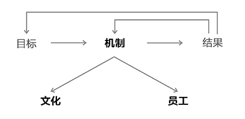
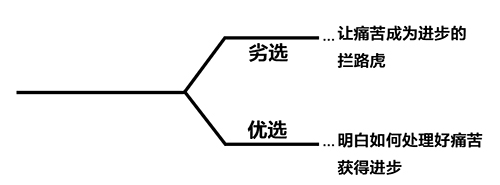
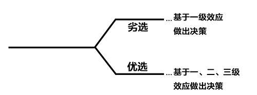

# 第三章 我的管理原则

## Part 3: My Management Principles
第三章：我的管理原则

In Part 1 I explained why I believe having principles is important and that I believe that it is up to each person to decide what principles are best for them. In Part 2 I explained my most fundamental principles. In this part I explain my management principles. Naturally, my management principles reflect the principles I believe are best throughout my life. But before I get into my particular management principles, I’d like to touch on management principles in general.

在第一章中，我详述了具备原则的重要性，每个人要自己决定最适合自己的原则。第二章我详述了对我来说最重要的根本原则。本章将详述我的管理原则。实际上我的管理原则反映出了我一生中最坚信的一些原则。在开展论述之前，我先大概谈谈管理原则。

If you read any of the earlier parts you know that I believe that having principles is essential for getting what you want out of life. That is as true for groups of people (e.g., companies, schools, governments, foundations, etc.) as it is for individuals. While individuals operating individually can choose whatever values and principles they like, when working in a group the people must agree on the group’s values and principles. If the group is not clear about them, confusion and eventually gravitation toward the population’s averages will result. If the group’s values and principles are clear, their way of being (i.e., their culture) will permeate everything they do. It will drive how the people in the group set goals, identify problems, diagnose problems, design solutions and make sure that these designs are implemented. So I believe this relationship looks like this:

你要是读了前面两章就会明白，我认为要实现梦想，具备原则极其重要，不仅是个人，对于团队来说也是如此，包括公司、学校、政府、基金会等。个人在做抉择时能根据自身喜好选择价值观和原则，但在团队里工作则要认同团队的价值观和原则。如果一个团队对其价值观和原则不够清晰明朗，随之带来的后果终会落到每个成员身上。团队的价值观和原则一旦清晰明了，团队的工作方式（也就是团队文化）将渗透于团队的方方面面，包括如何制定目标、发现问题、诊断问题、设计解决方案、落实方案。我认为团队里关系应该是这样的：

While having a clearly conveyed **great culture** is important, that’s only half of the magic formula. The other half is having **great people**—i.e., people who have the values, abilities, skills that fit the organization’s culture.

清晰传递团队的**良好文化**非常重要，但这只是“魔法公式”的一半，另一半是**优秀的员工**，他们的价值观、能力、技能都和公司文化相得益彰。

In other words, I believe that to have a great company you have to make two things great — the **culture** and the **people**. If these two things are great your organization can navigate the twists and turns to get you where you want to go.

也就是说，要想让公司强大起来，你得有两样拿得出手的利器 —— 公司文化和员工，这两样东西足够强大，遇到什么问题都能迎刃化解，助你实现梦想。

Of course, you have to know where you want to go. Organizations, like individuals, have to choose what they are going after (i.e., their goals), which influences their directions. As they move toward their goals, they encounter problems, make mistakes and discover weaknesses. Above all else, how they choose to approach these impediments determines how fast they move toward their goals.

当然，你得清楚前进的方向，组织和个体一样，要选择追逐什么，即目标是什么，这会影响到公司发展的方向。在追逐目标的征途中，会遇到问题，犯错，发现缺点。选择何种方式应对这些困难，决定着我们实现梦想的速度。

Every organization works like a machine to achieve its goals. This machine produces outcomes. By comparing the outcomes to the goals, those running the machine can see how well the machine is working. This is the **feedback loop** that those who are responsible for the machine need to run well in order to improve the machine. Based on the feedback, the machine can be adjusted to improve. The machine consists of two big parts—the **culture** and the **people**. If the outcomes are inconsistent with the goals, something must be wrong with the machine, which means that something must be wrong with the culture and/or the people. By diagnosing what is wrong, designing improvements and implementing those improvements, the machine will evolve. In short, the evolutionary process is as follows. Take a minute to look it over and see what you think.

每个公司机构都像一台机器，为了实现目标而运行着，这台机器会产生结果。将目标和结果进行对比，机器的操作者可以了解机器的运行状态，机器的负责人要把这种**反馈循环**利用好，才能更好地提升机器的性能。基于反馈，这台机器才能调整与提升。这台机器由两块组成 —— **文化**与**员工**。如果结果与目标不符，那机器肯定出问题了，也就是文化和员工出问题了。要让这台机器发展延续下去，就得诊断问题，设计改进方案，落实改进措施。简而言之，这个不断进化的过程如下图所示，花一分钟好好看看，自己思考一下。

The more frequently and effectively those in the machine go through this process, the more rapidly they and the machine will evolve. An effective evolutionary process looks like this—i.e., lots of quality feedback loops produces a steep upward trajectory.

在这台机器里，这样的过程运行得越多越有效率，进化的速度就越快。有效率的进化过程如下图所示：大量有质量的反馈回路产出一条曲折上升的轨迹线。

An ineffective evolutionary process—i.e., one in which mistakes are infrequently looked at and weaknesses are not well identified—looks like that shown below, i.e., fewer and/or less effective feedback loops produces a slower upward trajectory. In fact, if there are two few and/or bad quality feedback loops, there will be a decline because you won’t identify and deal with the problems that will kill you.

在效率低下的进化过程中，人们很少审视错误，鉴别缺点，如下图所示，量少且低效的反馈回路构成了上升缓慢的轨迹线。事实上，如果存在两次量少质差的反馈回路，轨迹曲线就会转走下降趋势，因为没有发现错误，无法解决某些致命的问题。

I believe that this is equally true for individuals and organizations. I also believe that the most important difference between great organizations and bad ones is in how well they manage their feedback loops.

人与组织均适用此原理，成功的组织脱颖而出就在于他们能完美地处理好反馈回路。

### Bridgewater’s Culture and People
桥水联合基金的公司文化和员工

Naturally, the culture and people that I have chosen for Bridgewater are extensions the principles that I believe work best, which I explained in Part 2\. Most importantly I value meaningful work and meaningful relationships that are obtained by striving for truth and excellence with great people. I am confident that through this constant striving, we will evolve rapidly together.

事实上，在创造桥水联合基金公司文化与聘用员工时，我遵循的管理原则是我认为最有效的原则的拓展，这些原则我在第二章已经详述。最重要的是，我很重视在追求真理与卓越的过程中，完成有意义的工作，与值得打交道的人建立关系。我坚信，只要这样不断奋进，我们定能实现快速进化。

As you might have guessed from reading Part 2, I want Bridgewater to be a company in which peoplecollectively…

如果你已阅读第二章，就应该能猜到，我心目中桥水联合基金的员工应都具备什么素质：

**…1) work for what they want and not for what others want of them.**

**…1) 干自己真正想做的事情，而非他人逼迫为之**

**…2) come up with the best independent opinions they can muster to move toward their goals,**

**…2) 达成最好的独立观点，用以实现目标。**

**…3) stress-test their opinions by having the smartest people they can find to challenge them so they can find out where they are wrong,**

**…3) 对自己的观点进行压力测试，把身边最聪明的人找来挑毛病，找出观点中错误的地方。**

**…4) are wary about overconfidence, and good at not knowing**

**…4) 不能太过自信，并善于面对“不知”。**

**…5) wrestle with reality, experiencing the results of their decisions, and reflecting on what they did to produce them so that they can improve.**

**…5) 同现实展开斗争，反思为什么他们的决定会产生这种结果，从中学习与提高。**

And when faced with difficult choices, I want them to see the choices as follows.

遇到棘手选择时，可参考如下选项：

While I recognize that being this way is challenging, I am also confident that it is what is required to get the most out of out of life. I am confident for two reasons. First, it is logical that the cause-effect relationships are such that being this way produces good results. Second, this theory has been tested over the last 40 years and has worked. While 40 years ago being this way seemed logical, back then that was an untested theory. Now that we have 40 years of testing to look back on, we can see that the results verify the theory.

尽管我知道这种管理方式很具有挑战性，但我坚信这是实现成功的必备条件。我对此深信不疑是基于两点。第一，基于原因-结果的逻辑关系，这样的管理方式会带来满意结果；第二，40多年的公司管理表明，这套理论是行之有效的。我们现在回顾这40多年来走过的历程，最后的结果也证明，这套理论经受住了检验。

### Fleshing Out This Way of Being
管理原则的具体内容

The best advice I can give you is to ask yourself what do you want, then ask ‘what is true’—and then ask yourself ‘what should be done about it.’ I believe that if you do this you will move much faster towards what you want to get out of life than if you don’t!

我能给你的最好建议就是，问问自己想要什么，“真实情况是什么？”，“应该对此做些什么？”我相信只要按此步骤，就能更快实现梦想。

Because what I have said is pretty abstract, I need to spell out exactly what it means to run a company this way. I need to get very specific. Over time I have built a collection of principles that because I have collected and refined so many over time. I believe that virtually all problems you might encounter are addressed by one or more of the principles that follow.

我之前谈的都很抽象，所以下面我会说说在管理公司时的具体原则，所谈的内容非常具体。这些年来，我总结了一套包罗万象、历经大浪淘沙的管理原则，相信你遇到的问题都能从中获得解答。

There are too many to read as a book. What follows is not a few rules to go by presented in an easily digestible form that’s easy to remember. That wouldn’t have been specific enough to be of much help to you. There are over 200 principles here that are well explained and are meant to be used more as a reference book than a book that is read from cover to cover.

一本书的内容有限，总该有其核心要旨。下面将列出一系列具体原则，便于理解与识记，内容非常具体，对你大有帮助。详述了200多条原则，这些原则也表明本书不是单纯意义上的参考书，因为这些原则是能运用到实际工作中的。

I’ve created an outline that serves the purposes of being both a summary of my management principles and a table of contents for a more complete explanation of them. Said differently, these principles are presented in a big picture way in this Summary and Table of Principles and in a more thoroughly explained way in the section that follows. If you want to understand the principles in brief, just read what’s said in the summary below and if you want to delve into them, go to the individual principles after the outline.

下文是原则纲要，既是我管理原则的汇总，也是后续原则详述的目录。换句话说，原则汇总列表提供了这些原则的总体概览，后续部分则是每条原则的详述阐释。若你想简要了解这些原则，阅读下文原则汇总列表即可，如果想深入理解，可阅读汇总表后面每条原则的详述部分。