# 干货

### What Follows is the Meat…

下面是干货。

### To Get the Culture Right…

创造良好的公司文化**
1) Trust in Truth
1）直面真相**

So…
因此:

... 2) **Realize that you have nothing to fear from truth**. Understanding, accepting, and knowing how to effectively deal with reality are crucial for achieving success. Having truth on your side is extremely powerful. While the truth itself may be scary—you have a weakness, you have a deadly disease, etc.—knowing the truth will allow you to deal with your situation better. Being truthful, and letting others be truthful with you, allows you to explore your own thoughts and exposes you to the feedback that is essential for your learning. Being truthful is an extension of your freedom to be you; people who are one way on the inside and another on the outside become conflicted and often lose touch with their own values. It’s difficult for them to be happy, and almost impossible for them to be at their best. While the first-order effects of being radically truthful might not be desirable, the second- and third-order effects are great.

... 2) **你要知道，真相没什么可怕的**。理解、接受、并了解如何能够有效处理现实问题，这对于取得成功而言至关重要。站在真相一边，就最有说服力。当然，有时真相本身可能会让人惧怕，比如，你暴露了一个弱点或者甚至是身患绝症，而了解真相却能让你更从容地处理事情。对自己坦诚、对他人坦诚，让别人也对自己坦诚，才能更好地了解自己的想法，获得他人的反馈，从而学到知识。诚实，同时也是做自己的自由的延伸。表里不一的人往往会自相矛盾，也容易丢失自己的价值观。他们不易开心，更不可能展现出自己最好的一面。尽管从一级效应的角度来看，过于诚实未免使人难以接受，但是从二、三级效应的角度而言，这样做却收效可观。

*   Do you agree with this?

*   你是否同意以上说法？

... 3) **Create an environment in which everyone has the right to understand what makes sense and no one has the right to hold a critical opinion without speaking up about it.**

... 3) **创造这样一种氛围：人人都有权理解合理之事，如果任何人有意见，都拥有开诚布公地表达自己想法的环境。**。

... 4) **Be extremely open**. Openness leads to truth and trust. Being open about what you dislike is especially important, because things you don’t like need to be changed or resolved. Discuss your issues until you are in synch or until you understand each other’s positions and can determine what should be done. As someone I worked with once explained, “It’s simple - just don’t filter.” The main reason Bridgewater performs well is that all people here have the power to speak openly and equally and because their views are judged on the merits of what they are saying. Through that extreme openness and a meritocracy of thought, we identify and solve problems better. Since we know we can rely on honesty, we succeed more and we ultimately become closer, and since we succeed and are close, we are more committed to this mission and to each other. It is a self-reinforcing, virtuous cycle.

... 4) **要极为坦诚**。坦诚能够揭示真相，增强互信。对于自己不喜欢的事情开诚布公尤为重要，因为你必须改变或彻底解决这些你不喜欢的事情。各抒己见，直到达成一致，或者直到充分理解彼此的处境，找到解决方案。一位曾经的同事说过，“这其实很简单，（表达观点时）不作任何过滤就行了。”桥水联合基金的成功经验之一就是公司所有人都能够以开放的、平等的方式进行沟通，他们的观点会得到客观公正的对待。遵循极致坦诚和观点至上的原则，我们才能够更好的发现并解决问题。对诚实的依赖，使我们更频繁地取得成功，彼此变得更加亲密。而因为这些成功和亲密，我们能更坚定地投入到事业与彼此之中。这是一个自我增强的过程，一个良性循环。

*   Do you agree with this?

*   你是否同意以上说法？

... 5) **Have integrity and demand it from others**. Integrity comes from the Latin word integer,meaning “one.” People who are one way on the inside and another way outside lack integrity; they have duality.

... 5) **为人正直，要求别人也保持正直**。英文中的正直（integrity）一词来源于拉丁语的整体（integer）一词，含有唯一性。表里不一的人缺少唯一性，他们具有两面性。

The second- and third-order effects of having integrity and avoiding duality are great. Thinking solely about what’s accurate instead of how it is perceived helps you to be more focused on important things. It helps you sort the people you are around and the environments you are in. It improves the organization’s efficiency and camaraderie because the secret things that people think and don't say to each other drive resentment and key issues underground and don’t lead to improvement. Having nothing to hide relieves stress. It also builds trust. For these reasons:

坚持正直，拒绝两面性的二、三级效应是显著的。只考虑事物的准确本质而不是其表象能够帮助你抓住主要矛盾。同时，这样做还能帮你筛选身边的人和环境，提高组织效率，促进同事之谊。那些不为人知、不与人言的隐秘心思会掩盖埋怨与关键问题，更不能解决问题。相反，毫不隐瞒却能释放压力，增强互信，理由如下：

5a) **Never say anything about a person you wouldn’t say to them directly, and don’t try people without accusing them to their face**. Badmouthing people behind their backs shows a serious lack of integrity and is counterproductive. It doesn’t yield any beneficial change, and it subverts both the people you are badmouthing and the environment as a whole. Next to being dishonest, it is the worst thing you can do at Bridgewater. Criticism is both welcomed and encouraged at Bridgewater, so there is no good reason to talk behind people’s backs. You need to follow this policy to an extreme degree. For example, managers should not talk about people who work for them without those people being in the room. If you talk behind people’s backs at Bridgewater you are called a slimy weasel.

5a) **若当面不对别人进行评论，背地里也不要说。若未曾当面控诉过别人，也不要背地里试探**。暗箭伤人是不正直的表现，只会产生消极效果，不能带来有价值的改变，不仅会中伤他人，也会对整体环境带来负面影响。在桥水联合基金，暗箭伤人被认为是仅次于不诚实的恶劣行径。我们公司欢迎并鼓励批评，完全没有必要背后对别人说三道四。这一原则必须得到最严格的遵守，比如说，管理者们不应该在当事人不在场的情况下指责下属。如果你在桥水基金背地说人坏话，别人会称你为“令人厌恶的黄鼠狼”。

5b) **Don’t let “loyalty” stand in the way of truth and openness**. In some companies, employees hide their employer’s mistakes, and employers do the same in return. In these places, openly expressing your concerns is considered disloyal, and discouraged. Because it prevents people from bringing their mistakes and weaknesses to the surface and because it encourages deception and eliminates the subordinates’ right of appeal, unhealthy loyalty stands in the way of improvement. I believe in a truer, healthier form of loyalty, which does the opposite. Healthy loyalty fosters improvement through openly addressing mistakes and weaknesses. The more people are open about their challenges, the more helpful others can be. In an environment in which mistakes and weaknesses are dealt with frankly, those who face their challenges have the most admirable character. By contrast, when mistakes and weaknesses are hidden, unhealthy character is legitimized.

5b) 所谓的“忠诚”不能成为真相与坦诚的拦路虎。在某些公司，雇员会隐瞒雇主的错误，而雇主也会隐瞒雇员的错误。这些公司，公开表达自己的疑虑被认为是不忠诚的，也不被鼓励。那么，所谓的忠诚就会阻止人们将错误和弱点摆到台面上来，鼓励欺瞒，剥夺下属向领导层上诉问题的权利，这种不健康的忠诚就是阻碍进步的拦路虎。我坚持的是另一种更加真实、健康的忠诚，效果正好相反。健康的忠诚通过坦诚应对错误和弱点实现进步，人们越是对自己的问题开诚布公，越是能够获得他人的帮助。在这样一种坦诚的环境之下，错误和弱点都得以解决，那些直面自己问题的人最令人敬仰。相应的，如果错误和弱点被一再掩盖，那么不健康的人格也会因此形成。

... 6) **Be radically transparent**. Provide people with as much exposure as possible to what’s going on around them. Allowing people direct access lets them form their own views and greatly enhances accuracy and the pursuit of truth. Winston Churchill said, “There is no worse course in leadership than to hold out false hopes soon to be swept away.” The candid question-and-answer process allows people to probe your thinking. You can then modify your thinking to get at the best possible answer, reinforcing your confidence that you’re on the best possible path.

... 6）**要极为透明**。尽可能多的为人们提供对周围事物的知情权。允许人们直接获取信息能够使他们形成自己的观点，从而提高对事物认识的准确性，激励人们追求真相。丘吉尔曾经说过，“没有什么比在领导过程中给公众虚假的、会迅速破灭的希望来的更糟的错误了。”坦诚的问答模式让人们挑战你的想法，从而促使你不断修改，直到获得最佳方案。这一过程会增强你的信心，保证自己是在最正确的方向上前行。

6a) **Record almost all meetings and share them with all relevant people**. Provide tapes of all meetings that don’t contain confidential information to enhance transparency. Of course, there are some times when privacy is required. If someone gives you confidential information, keep it confidential until you have permission to disclose it.

6a) **记录每一次会议成果，并分享给所有相关人士**。为促进透明度，请向大家提供所有不含涉密信息的会议录音带。当然，有时还需考虑隐私问题。当别人给了你保密信息，在获得披露许可之前，你都必须严守秘密。

... 7) **Don’t tolerate dishonesty**. People typically aren’t totally honest, which stands in the way of progress, so don’t tolerate this. There’s an adjustment process at Bridgewater in which one learns to be completely honest and expect the same from others. Increasingly you engage in logical, unemotional discussions in pursuit of truth in which criticisms are not viewed as attacks, but as explorations of possible sources of problems.

... 7) **对不诚实零容忍**。无法做到完全诚实是人之本性，但这却阻碍了人取得进步，因此，不该容忍不诚实的现象。在桥水，我们拥有一项调整程序，在此程序中，人们学习该如何完全诚实，并期待他人对自己坦诚相见。你会逐步参与到理智的、不带感情色彩的讨论当中。这些讨论旨在追求真相，讨论过程中的批评不会被看作是人身攻击，而会被当成探寻问题之源的途径。

7a) **Don’t believe it when someone caught being dishonest says they have seen the light and will never do that sort of thing again**. Chances are they will. The cost of keeping someone around who has been dishonest is likely to be higher than any benefits.

7a) **不要相信不诚实之人说他已痛改前非，绝不再犯。他们很可能重蹈覆辙**。将这种不诚信之人留在身边只会遗患无穷。

**

... 8) Create a Culture in Which It Is OK to Make Mistakes but Unacceptable Not to Identify, Analyze, and Learn From Them

... 8）创造这样一种文化：容许犯错，并对错误进行识别、分析、吸取教训。**

So…
因此:

... 9) **Recognize that effective, innovative thinkers are going to make mistakes and learn from them because it is a natural part of the innovation process**.For every mistake that you learn from you will save thousands of similar mistakes in the future, so if you treat mistakes as learning opportunities that yield rapid improvements you should be excited by them. But if you treat them as bad things, you will make yourself and others miserable, and you won’t grow. Your work environment will be marked by petty back-biting and malevolent barbs rather than by a healthy, honest search for truth that leads to evolution and improvement. Because of this, the more mistakes you make and the more quality, honest diagnoses you have, the more rapid your progress will be. That’s not B.S. or just talk. That’s the reality of learning.50

... 9) **要意识到处事高效、具有创新思维的人都会犯错，从错误中吸取教训，这都是创新过程的自然组成部分**。你每吃一堑，长一智，就能在未来避免犯数千次类似的错误。如果你将错误当做快速提升自我的学习机会，那么你就会对发现错误激动不已。如果你将他人向你指出的错误视为一件坏事，那么你不仅自己痛苦，指出错误的人也会痛苦，你更不会因为这个错误而得到成长。你的工作环境会充斥着小肚鸡肠和暗箭伤人，而缺乏健康的、诚实的对真相的探索。然而，只有通过这一探索过程才能实现成长和提升。基于此，你犯的错越多，你获得的高质量的诚实的诊断就越多，你就会进步得越快。这一过程不是简单的头脑风暴或者聊天，而是学习的本质所在。

> Thomas Edison said about failure: “I have not failed. I’ve just found 10,000 ways that don’t work.” “I am not discouraged, because every wrong attempt discarded is another step forward.” “Results! Why, man, I have gotten a lot of results. I know several thousand things that won’t work.” “When I have fully decided that a result is worth getting I go ahead of it and make trial after trial until it comes.” “Many of life’s failures are men who did not realize how close they were to success when they gave up.”
> 爱迪生在谈论失败时曾说，“我并没有失败，我只是成功找到了一万种不合适的方法。”“我不气馁，因为每一个错误的尝试都是向成功迈进的一步。”“成果呢！为什么要这样问，我获得了很多成果。我发现了数以千计不对的方法。”“当我下定决心要达到目的，那么我就会一直努力，不断尝试，直到成功。”“生活中许多的失败都是距离成功一步之遥的放弃。”
> 
> A good book about this is Einstein’s Mistakes by Hans Ohanian.
> 汉斯·欧哈尼亚（Hans Ohanian）的《爱因斯坦的错误》一书很好的阐述了这一观点。

... 10) **Do not feel bad about your mistakes or those of others. Love them**! Remember that 1) they are to be expected, 2) they’re the first and most essential part of the learning process, and 3) feeling bad about them will prevent you from getting better. People typically feel bad about mistakes because they think in a short-sighted way that mistakes reflect their badness or because they’re worried about being punished (or not being rewarded) . People also tend to get angry at those who make mistakes because in a short-sighted way they focus on the bad outcome rather than the educational, evolutionary process they’re a part of. That’s a real tragedy.

... 10) **不要为自己或别人犯的错而郁郁寡欢，要热爱这些错**! 记住，1）错误是不可避免的；2）错误是学习过程中第一个也是最重要的一个环节；3）为犯错而懊恼会阻碍你的成长。人们总是对犯错耿耿于怀，这可能是因为人们短视地认为错误反映了他们的缺点，又或者他们担心会因此受到惩罚（或者无法获得奖励）。同时，人们会因为他人犯错而生气，因为从短视的角度来看，大家只会将注意力放在犯错带来的坏结果上，而没有看到错误的教育意义和其作为成长过程的一部分。这才是悲剧所在。

... 11) **Observe the patterns of mistakes to see if they are a product of weaknesses.** Connect the dots without ego barriers. If there is a pattern of mistakes, it probably signifies a weakness. Everyone has weaknesses. The fastest path to success is to know what they are and how to deal with them so that they don’t stand in your way. Weaknesses are due to deficiencies in learning or deficiencies in abilities. Deficiencies in learning can be rectified over time, though usually not quickly, while deficiencies in abilities are virtually impossible to change. Neither is a meaningful impediment to getting what you want if you accept it as a problem that can be designed around.

**... 11) 仔细观察所犯错误的模式，看看它们是不是⾃⾝缺陷所导致的。以不设自我障碍的方式回想过去的点点滴滴。如果有错误模式，它很可能意味着一种缺陷。每个人都有很多缺陷，最快的成功方式就是知道这些缺陷和如何处理这些缺陷，那么它们就不会阻挡你成功的路。缺陷来自于学习的不足或者能力的不足。学习的不足可以通过时间来改进，但是通常不会很快，然而能力的不足几乎不能改变。但是只要你认为缺陷是一个可以用新方法解决的问题，不论是学习缺陷还是能力缺陷都不会是一个阻碍你得到你想要的东西的有实际意义的障碍。

I once had a ski instructor who had taught Michael Jordan, the greatest basketball player of all time, how to ski. He explained that Jordan enjoyed his mistakes and got the most out of them. At the start of high school, Jordan was an unimpressive basketball player; he became a champion because he loved using his mistakes to improve. Yet despite Jordan’s example and the example of countless other successful people, it is far more common for people to allow ego to stand in the way of learning. Perhaps it’s because school learning overemphasizes the value of having the right answers and punishes wrong answers. Good school learners are often bad mistake-based learners because they are bothered by their mistakes. I particularly see this problem in recent graduates from the best colleges, who frequently shy away from exploring their own weaknesses. Remember that intelligent people who are open to recognizing and learning from their weaknesses substantially outperform people with the same abilities who aren’t similarly open.

我遇到过一个滑雪教练，他曾教过世界最优秀的篮球运动员乔丹滑雪。他说，他说，乔丹很热爱自己所犯的错，因为他会尽可能地从中吸取教训。刚上高中时，乔丹并不是一个引人注目的篮球运动员，他热衷于通过自己不断犯错来自我提升，终成世界冠军。尽管大家了解乔丹和许多其他成功人士的例子，但还是会让“自我”成为学习的阻力。这可能是因为学校的教育过分强调正确答案，惩罚错误的答案。一个学校里的好学生往往是一个糟糕的错误导向型学习者，因为他们总是为自己的错误感到苦恼。我发现最近的名校毕业生身上这一点特别明显，他们总是对自身的缺点避而不谈。切记，那些善于发现自己的缺点并从中学习的聪明人会比那些能力相等却不够坦诚的人表现好很多。

... 12) **Do not feel bad about your weaknesses or those of others**. They are opportunities to improve. If you can solve the puzzle of what is causing them, you will get a gem - i.e., the ability to stop making them in the future. Everyone has weaknesses and can benefit from knowing about them. Don’t view explorations of weaknesses as attacks. A person who receives criticism - particularly if he tries to objectively consider if it’s true - is someone to be admired.

... 12) **不要因为自己或别人的缺点而感到糟糕**。缺点意味着进步的机会。如果你能解决迷阵，就能获得一颗宝石，如果你能解决迷阵，就能获得一颗宝石，即获得了将来不再犯此类错误的能力。每个人都有缺点，也都能从了解自身缺点中受益。不要将寻找弱点的过程当作是对自身的攻击。一个从善如流的人能够接受批评，并客观判断批评是否客观，尤其值得别人的敬仰。

... 13) **Don’t worry about looking good - worry about achieving your goals**. Put your insecurities away and get on with achieving your goals.

... 13) **别老担心面子上过不过得去，而要担心是否能达成目标**。克服安全感缺失，一心一意实现自己的目标。

To test if you are worrying too much about looking good, observe how you feel when you find out you’ve made a mistake or don’t know something. If you find yourself feeling bad, reflect - **remind yourself that the most valuable comments are accurate criticisms**. Imagine how silly and unproductive it would be if you thought your ski instructor was blaming you when he told you that you fell because you didn’t shift your weight properly. If a criticism is accurate, it is a good thing. You should appreciate it and try to learn from it.

怎样检验你是否过于关注面子？你可以回味一下过往你发现自己犯错或对某事不甚了解时的感受，如果你感觉很糟糕，你就需要反思，**提醒自己，客观的批评是最宝贵的意见**。试想一下，你的滑雪教练批评你，说你在滑雪时没有恰当的转移重心才会摔倒，如果此时你认为教练是在责备你，那这种想法该是多么愚蠢无用啊。如果批评是准确的，那这就是件好事情，你应该心存感激，吸取教训。

... 14) **Get over “blame” and “credit” and get on with “accurate” and “inaccurate**.” When people hear, “You did XYZ wrong,” they have an instinctual reaction to figure out possible consequences or punishments rather than to try to understand how to improve. Remember that what has happened lies in the past and no longer matters, except as a method for learning how to be better in the future. Create an environment in which people understand that remarks such as “You handled that badly” are meant to be helpful (for the future) rather than punitive (for the past) . While people typically feel unhappy about blame and good about credit, that attitude gets everything backwards and can cause major problems. Worrying about “blame” and “credit” or “positive” and “negative” feedback impedes the iterative process essential to learning.

... 14) **别去管“责备”或“赞扬”，要去判断“精准”还是“不精准”**。当人们听到别人说“这事你做错了”，大家的本能反应是担心后果，害怕惩罚，而不是去想办法改进。要记住，要记住，过去的事情已经过去，也不再重要，过去只能当作学习的参照，以便让自己在未来做的更好。努力创造这样一种环境，当听到有人说，“这件事你处理的很差劲”时，当事人应该看到这种评价是对未来的帮助，而不是对过去的惩罚。人们面对责备时总是闷闷不乐，而对赞扬总是沾沾自喜，这种处事态度于事无补，甚至会引发重大问题。纠结反馈是“责备”还是“赞扬”，是“积极”还是“消极”，只会阻碍学习必须的互动过程。

... 15) **Don’t depersonalize mistakes**. Identifying who made mistakes is essential to learning. It is also a test of whether a person will put improvement ahead of ego and whether he will fit into the Bridgewater culture. A common error is to say, “We didn’t handle this well” rather than “Harry didn’t handle this well.” This occurs when people are uncomfortable connecting specific mistakes to specific people because of ego sensitivities. This creates dysfunctional and dishonest organizations. Since individuals are the most important building blocks of any organization and since individuals are responsible for the ways things are done, the diagnosis must connect the mistake to the specific individual by name. Someone created the procedure that went wrong, or decided we should act according to that procedure, and ignoring that fact will slow our progress toward successfully dealing with the problem.

... 15) **错误归因要具体到个人**。确定是谁犯了错误，对于学习而言至关重要。问责也是检验一个人是否能够将进步置于自我之上，检验他是否能够融入桥水的文化。人们会犯一个普遍的错误，我们总说，“这件事我们处理的不好”而不是“哈利这件事处理的不好”。将具体的错误归因到具体的人身上会有碍自尊，让人难堪。但是如果没有个人追责制，只会导致公司运营紊乱，诚信缺失。每一个人都是组织最重要的构建模块，因为每个人都对组织的运行方式负责。因此针对问题的诊断必须将错误具体到个人。是谁设立了出问题的流程，又是谁决定我们应该按此流程办事，忽视个人归责将拖累我们成功处理问题的步伐。

... 16) **Write down your weaknesses and the weaknesses of others to help remember and acknowledge them**. It’s unhealthy to hide them because if you hide them, it will slow your progress towards successfully dealing with them. Conversely, if you don’t want them and you stare at them, you will inevitably evolve past them.

... 16) **写下你和别人的缺点，帮助彼此牢记并承认这些缺点**。隐藏缺点是不健康的，因为隐藏只会拖累成功解决问题的步伐。相反，如果你不想要这些缺点，对它们横眉冷对，最终也会逐渐克服它们。

... 17) **When you experience pain, remember to reflect**. You can convert the “pain” of seeing your mistakes and weaknesses into pleasure. If there is only one piece of advice I can get you to remember it is this one. Calm yourself down and think about what is causing your psychological pain. Ask other objective, believable parties for their help to figure it out. Find out what is true. Don’t let ego barriers stand in your way. Remember that pains that come from seeing mistakes and weaknesses are “growing pains” that you learn from.51 Don’t rush through them. Stay in them and explore them because that will help build the foundation for improvement. It is widely recognized that 1) changing your deep-seated, harmful behavior is very difficult yet necessary for improvement and 2) doing this generally requires a deeply felt recognition of the connection between your harmful behavior and the pain it causes. Psychologists call this “hitting bottom.” Embracing your failures is the first step toward genuine improvement; it is also why “confession” precedes forgiveness in many societies.52 If you keep doing this you will learn to improve and feel the pleasures of it.

... 17) **若因犯了错而感到痛苦，记住要进行反思**。若因犯错后而感到痛苦，记住要习惯反思。你有把发现自己的错误和缺点后的痛苦转化成快乐的自由，你有资格善用它，这是你的权利，如果你只能记住一条建议，那么我希望是这一条。冷静思考痛苦的心理原因，向客观、可信的他人求证，最终找到真相。不要让自我成为进步的拦路虎。记住，那些因看到了错误或缺点而感到的痛苦，是成长的痛苦，是可以从中受益的痛苦。不要试图匆忙结束这种痛苦，而应该沉浸在其中，探索痛苦，因为这样做能够为提升自我打好基础。众所周知，1）改变自己深层次的有害行为是非常困难的，但这是取得进步的必由之路；2）要想成功，还需要深刻认识到有害行为和其所带来的痛苦之间的联系。心理学家将这一过程称之为“探底”。拥抱失败是通向真正进步的第一步，这也是为什么在整个社会迭代的进程中，都凸显出一个相同的真理，即要先坦白，才能获得宽恕。如此往复，你就能学会提升自我，并从中获得快乐。

> If you recognize short-term failure as a step toward long-term success, which it really is if you learn from it, you won’t be afraid of it or made uncomfortable by it and you will approach all of your experiences as learning experiences, even the most difficult ones.
> 如果你将短期的失败看作通向长期成功的一步，如果你能吃一堑、长一智，那么事实也的确是这样。你不会对失败感到惧怕或难受，却能够将所有的经历都当做学习的机会，即便是最痛苦的经历也不例外。
> 
> Ego often stands in the way of acknowledging your weaknesses (which is the essential first step in overcoming them) , like being afraid to ask a question because people might think you’re stupid because you don’t know something. Yet acknowledging those weaknesses (e.g., “I know I‘m a dumb shit, but I’d just like to know…”) helps you move beyond ego toward learning and improving.
> 自我总是阻碍我们看到自己的缺点，而看到缺点是克服缺点的第一步。比如说，你害怕提出问题，因为这会显示出你的无知，人们就会认为你很愚蠢。然而，承认缺点，比如，“我知道我有点傻，可我就是想知道……”，却能够帮你克服自我，学习新知识，提升水平。

... 18) **Be self-reflective and make sure your people are self-reflective**. This quality differentiates those who evolve fast from those who don’t. When there is pain, the animal instinct is ‘fight or flight’ (i.e., to either strike back or run away) - reflect instead. When you can calm yourself down, thinking about the dilemma that is causing you pain will bring you to a higher level and enlighten you, leading to progress. That is because the pain you are feeling is due to something being at odds - maybe it’s you encountering reality, such as the death of a friend, and not being able to accept it. If when you are calm, you can think clearly about what things are at odds, you will learn more about what reality is like and how to better deal with it. It really will produce progress. If, on the other hand, the pain causes you to tense-up, not think, feel sorry for yourself, and blame others, it will be a very bad experience. So, when you are in pain, try to remember: Pain + Reflection = Progress. It’s pretty easy to determine whether a person is reflective or deflective: self-reflective people openly and objectively look at themselves while deflective people don’t.

... 18) **要经常自我反思，也确保你身边的朋友们也都懂得自我反思**。这一特质因人而异，有的人成长得快，有的人慢。当人感受到痛苦的时候，其动物本性就是“战斗还是逃跑”，而此时，你需要去反思。使自己冷静下来，反思自己痛苦的根源将有助于从更高层次启发自我，取得进步。因为你感觉到的痛苦是由生活中的变数带来的，可能是你所面临的现实，比如好友的逝去，使你一时无法接受。当你平静下来，你可以更清晰地思索生活中的变数，更好地了解现实，从而更好处理生活事物，这样做真的裨益良多。而如果痛苦让你紧张，无法思考，陷入懊丧，责备他人，那么这将是一段非常糟糕的经历。所以，当你经历痛苦的时候，请记住：痛苦+反思=进步。判断一个人是否会反思很简单，经常自省的人能够开放、客观地看待自己，而不会反思的人则反之。

... 19) **Teach and reinforce the merits of mistake-based learning**. We must bring mistakes into the open and analyze them objectively, so managers need to foster a culture that makes this normal and penalizes suppressing or covering up mistakes. Probably the worst mistake anyone can make at Bridgewater is not facing up to mistakes - i.e., hiding rather than highlighting them. Highlighting them, diagnosing them, thinking about what should be done differently in the future, and then adding that new knowledge to the procedures manual are all essential to our improvement.

... 19) **树立从错误中吸取教训的观念，传递并强化这个观念**。我们必须坦诚对待错误，客观分析错误。管理者应该努力营造一种文化，使从错误中吸取教训的学习方式常规化，惩罚打压或掩盖错误的行为。在桥水，一个人所能犯的最糟糕的错误就是不能直面错误，就是躲避错误而不是强调错误。强调错误，诊断错误，思考未来的改进方案，将这些吸取的新知识加入到流程手册中，所以这些都是取得进步的必要步骤。

19a) **The most valuable tool we have for this is the issues log (explained fully later) , which is aimed at identifying and learning from mistakes**. Using this tool is mandatory because we believe that enforcing this behavior is far better than leaving it optional.

19a) 最有效的工具是建立“问题日志”（后详），旨在鉴别问题，并从中吸取教训。要求员工必须使用问题日志这一工具，因为我们认为强制要求记录日志会比选择性使用效果好得多。

**

... 20) Constantly Get in Synch

... 20）不断争取意见统一**

So…
因此:

... 21) **Constantly get in synch about what is true and what to do about it**. Getting in synch helps you achieve better answers through considering alternative viewpoints. It can take the forms of asking, debating, discussing, and teaching how things should be done. Sometimes it is to make our views on our strengths, weaknesses, and values transparent in order to reach the understanding that helps us move forward. Sometimes it is to be clear about who will do what and the game plan for handling responsibilities. So this process can be both a means of finding the best answers and pushing them ahead. Quality conversations about what is true and what should be done will produce better outcomes and many fewer misunderstandings in the future.

... 21) **要在去伪存真和解决方案上争取意见统一**。争取意见统一能够使你通过参考不同意见从而获得更好的解决方案。形式可以是多种多样的，比如提问、辩论、讨论或者教别人如何解决问题。有时，我们需要公开对自己长处、短处、价值观的看法，以此达成谅解，帮助我们前行。有时，我们需要明确分工，对于处理任务有一个计划方案。因此，这一流程既能找到最优方案，又能敦促解决方案的实施。关于去伪存真和解决方案的高质量进行沟通，能够带来更优产出，也会在未来避免很多误解。

... 22) **Talk about “Is it true?” and “Does it make sense?”** In a culture that values both independent thinking and innovation, each individual has both the right and the obligation to ensure that what they do, and what we collectively do, in pursuit of excellence, makes sense to them. So, get in synch about these things.

... 22) **养成对“这是对的么？”和“这事有意义么？”这两个问题反复讨论的习惯。**在我们的文化里，独立思考和创新思维受到同样的重视。在追求卓越的过程中，确保保个人做的事和集体做的事都有意义，这既是每个人的权利也是每个人的义务。因此，我们需要就这些问题争取意见统一。

...23) **Fight for right.** Discuss or debate important issues with the right relevant parties in an open-minded way until the best answers are determined. This process will maximize learning and mutual understanding. Thrash it out to get to the best answer.

... 23) **认为对的事情，要据理力争。**与合适的相关方本着开放的态度讨论或辩论重要问题直到确定最佳方案。这一过程能够将学习效果和互相理解最大化。据理力争，直到获得最佳方案。

... 24) **Be assertive and open-minded at the same time.** Just try to find out what is true.Don’t try to ‘win’ the argument. Finding out that you are wrong is even more valuable than being right, because you are learning.

... 24）**既要立场坚定，也要开诚布公。**我们的目的是探寻真相而不是赢得辩论。找出你的错往往比证明自己是对的更有价值，因为你在学习。

24a) **Ask yourself whether you have earned the right to have an opinion.** Opinions are easy to produce, so bad ones abound. Knowing that you don’t know something is nearly as valuable as knowing it. The worst situation is thinking you know something when you don’t.

24a) **在想表达意见的时候，先问问自己，是否拥有发表观点的权利。** 观点来之容易，错误的观点则不可避免。知道自己无知与知识本身的价值相等，即便他们对讨论的话题知之甚少。
24b) **Recognize that you always have the right to have and ask questions.**

24b) **要知道自己始终拥有提问的权利。**
24c) **Distinguish open-minded people from closed-minded people.** Open- minded people seek to learn by asking questions; they realize that what they know is little in relation to what there is to know and recognize that they might be wrong. Closed- minded people always tell you what they know, even if they know hardly anything about the subject being discussed. They are typically made uncomfortable by being around those who know a lot more about a subject, unlike open-minded people who are thrilled by such company.

24c) **区分思想开放的人和思想保守的人。** 思想开放的人通过问问题来学习，他们知道自己所知与未知相比实在微不足道，也承认自己可能会犯错。思想保守的人会不停向你诉说他们的见解，即便他们对讨论的话题一无所知。思想保守的人通常会因为身处一群专业人士之中感到不安，而思想开放的人则最见贤思齐，不亦乐乎。

24d) **Don’t have anything to do with closed- minded, inexperienced people.** They won’t do you any good and there’s no helping them until they open their minds, so they will waste your time in the meantime. If you must deal with them, the first thing you have to do is open their minds. Being open-minded is far more important than being bright or smart.

24d) **对思想保守、缺乏经验之人，还是敬而远之吧。**他们对你毫无益处，如果他们一直故步自封对自己也没有好处。这种人只会浪费你的时间，如果你必须与他们打交道，那么首先你需要解放他们的思想。保持开放性思维要比聪明睿智重要的多。

24e) **Be wary of the arrogant intellectual who comments from the stands without having played on the field.** And avoid that trap yourself.

24e) **对那些夸夸其谈的纸上谈兵之人要尤为警惕。** 不要被他们忽悠。

24f) **Watch out for people who think it’s embarrassing not to know.** They’re dangerous.

24f) **小心那些面子至上，不好意思说自己不知道的人。(因为会为此而假装说自己知道其实并不了解的事）**他们是危险的。

... 25) **Make sure responsible parties are open-minded about the questions and comments of others.** They are required to explain the thinking behind a decision openly and transparently so that all can understand and assess it. Further, in the event of disagreement, an appeal should be made to either the manager’s boss or an agreed- upon, knowledgeable group of others, generally including people more believable than and senior to the decision-maker. The person(s) resolving the dispute must do this objectively and fairly; otherwise our system will fail at maintaining its meritocracy of ideas.

... 25) **确保主要负责人对于他人提出的问题与评论都是持开放态度的。** 他们必须本着开放和透明的精神向大家解释决策背后的深思熟虑，以便让每个人都能够理解并评估决策。。此外，当出现意见不合时，应该向其他比决策者更权威的人士提出申诉，包括决策者的上级、其他约定方和专业小组。相关人员必须以客观、公正的态度来解决纠纷，否则我们的系统将无法保证观点至上原则的执行。

... 26) **Recognize that conflicts are essential for great relationships because they are the means by which people determine whether their principles are aligned and resolve their differences.** I believe that in all relationships, including the most treasured ones, 1) there are principles and values each person has that must be in synch for the relationship to be successful and 2) there must be give and take. I believe there is always a kind of negotiation or debate between people based on principles and mutual consideration. What you learn about each other via that “negotiation” either draws you together or drives you apart. If your principles are aligned and you can work out your differences via a process of give and take, you will draw closer together. If not, you will move apart. It is through such open discussion, especially when it comes to contentious issues, that people can make sure there are no misunderstandings. If that open discussion of differences doesn’t happen on an ongoing basis, the gaps in perspectives will widen until inevitably there is a major clash. Ironically, people who suppress the mini-confrontations for fear of conflict tend to have huge conflicts later, which can lead to separation, precisely because they let minor problems fester. On the other hand, people who address the mini-conflicts head-on in order to straighten things out tend to have the great, long-lasting relationships. That’s why I believe people should feel free to say whatever they really think.

... 26) **要意识到，冲突对于建立重要关系是大有裨益的，因为通过冲突人们才能确定对方的原则是否与自己一致，便于化解分歧。**我相信在所有的关系之中，包括那些最令人珍视的关系，1）为了建立良好的关系，有一些原则和价值观是必须达成一致的；2）必须有人给予，有人接受。人们总会基于原则和互谅进行一些协商和辩论。通过协商，增进了对彼此的了解，而这种了解可以让双方更加亲密，也可能让你们分道扬镳。如果你们的原则一致，通过给予与接受，你们彼此磨合，则会更加亲密。反之，你们将渐行渐远。只有通过这种自由讨论，尤其是针对极具争议话题的讨论，相关方才能确保他们不存在误解。如果这种针对彼此之间差异性的讨论不是持续进行的，那么观点上的间隙便会持续扩大直至出现重大冲突。令人感到讽刺的是，那些为避免冲突而试图压制小小不合的人，往往会在之后经受更大的冲突，最终可能分崩离析。而这一结果正是由于他们让小问题不断恶化造成的。与此相反，如果大家能够正视小矛盾，不断将关系捋顺，则更有可能获得健康、长久的关系。因此，我认为人们应该毫无保留地勇敢说出自己的真实想法。

26a) **Expect more open-minded disagreements at Bridgewater than at most other firms.**They fuel the learning that helps us be at our best. Sometimes when there are disagreements, people get angry. But you should remind them that the management at most other companies doesn’t welcome disagreement or encourage open debate. As a result, there is less of both. So instead of getting angry, they should welcome the fact that disagreements and open debate are encouraged here.

26a) **在桥水，我们期待比其他公司更多不拘于成见的分歧。**分歧能够促进学习，帮助我们成为最好的自己，但人们却时常会因为分歧而生气。这时，你应该提醒大家，大多数公司不欢迎分歧，也不鼓励自由辩论：其结果得分歧与辩论越来越少。因此，面对分歧的正确态度，是与其生气，还不如鼓励分歧与公开辩论。

26b) **There is giant untapped potential in disagreement, especially if the disagreement is between two or more thoughtful people** - yet most people either avoid it or they make it an unproductive fight. That’s tragic.

26b) **分歧中蕴含巨大潜力，尤其对于两个或两个以上有独立思考能力的人之间的分歧而言，更是如此。**然而大多数人要么避免分歧，要么将其化为一场毫无意义的斗争，这才是真正的悲剧。

> Most people have a tough time disagreeing about the most trivial things, like whether they like the same restaurant, yet are happy to confidently express their opinions, however badly they are formed, if they get them out first. As a result, there is an overabundance of confident bad opinions around and very few thoughtful conclusions arising from learning from each other. It is common for conversations to be exchanges of sentences that begin “I think…” followed by their conclusions, and both parties believing that they had a good conversation and feeling good about each other, even though nothing was accomplished. If most people did the opposite—i.e., if they sought out and open-mindedly explored their disagreements—it would produce a radical increase in learning, and the world would be a much better place.
> 大多数人消耗太多的时间对琐事争论不休，比如讨论是否喜欢同一家餐馆。然而，他们却乐于自以为是地对于自己一无所知的事情发表见解，只要这个话题是自己起的头。于是，人们对于糟糕的观点过于自信，却只有极少通过互相学习、深思熟虑得来的结论。现在人们进行对话，双方大多是以“我觉得”来开头，后面紧跟着就是自己的结论，双方都自我感觉良好地认为这是一个很自然很流畅的沟通，但其实根本言之无物。如果大多数人能以开放的心态一心探索他们之间的分歧，则会极大提高学习效果，世界也将变的更美好。

... 27) Know when to stop debating and move on to agreeing about what should be done. I have seen people who agree on the major issues waste hours arguing over details. It’s more important to do big things well than to do small things perfectly. Be wary of bogging down amid minor issues at the expense of time devoted to solidifying important agreements.

... 27) 知道什么时候终止辩论，进而讨论一致的解决方案。 我见过太多人在大问题上能达成共识，却在细节上浪费过多的时间争执不休。与其将小事做到完美，不如将大事做好。谨防被琐碎之事拖累，牺牲掉本该投入到就大问题达成一致的时间。
27a) However, when people disagree on the importance of debating something, it should be debated. Operating otherwise would essentially give someone (typically the boss) a de facto veto right.

27a) 但是，当有人质疑就某事展开辩论的重要性时，辩论是有必要的。 辩论十分必要，否则无异于给了别人（尤其是上司）实际上的否决权。
27b) Recognize that “there are many good ways to skin a cat.” Your assessment of how responsible parties are doing their jobs should not be based on whether they’re doing it your way but whether they're doing it in a good way.

27b) 认识到“条条大路通罗马”。评价相关方是否负责任的完成了工作不应该看他们是不是按照你的方法来完成了任务，而应该看他们的方法是否是有效的。

27c) **For disagreements to have a positive effect, people evaluating an individual decision or decision -maker must view the issue within a broader context.** For example, if the responsible party being challenged has a vision, and the decision under disagreement involves a small detail, evaluate the decision within the context of the broader vision. The ensuing discussion resulting from challenging someone’s decision will help people understand all the considerations behind it.

27c) **要利用分歧获得具有积极意义的成果，评估个人抉择或决策者的观点时需要从更广更高的角度来看问题。** 例如，如果被质疑的责任主体有自己的远见，而在分歧之下的决策涉及细节问题，那么请在更大的背景之下审查该决策。质疑某人决策而引发的讨论将有助于人们了解决策背后的诸多考量。

**27d) Distinguish between 1) idle complaints and 2) complaints that are meant to lead to improvement.**

**27d) 要区分两个概念：1）无用的抱怨 2）旨在实现改善的合理诉求。**

... 28) **Appreciate that open debate is not meant to create rule by referendum.** It is meant to provide the decision-maker with alternative perspectives in anticipation of a better answer. It can also be used to enhance understanding of others’ views and abilities and, over time, assess whether someone should be assigned a responsibility. It doesn’t mean there can’t be some designs in which a group oversees a person. But that’s designed and embedded in the organizational structure, specifying the people responsible for oversight who are chosen because of their knowledge and judgment.

... 28) **赞赏自由辩论的讨论方式并不意味着要通过全体投票来制定规则。**为获得最佳方案，本就应该为决策者提供更多的可选视角。自由辩论也能够增进对彼此观点和能力的了解，随着时间的推移，还可以检验一个人是否能担当重任。这并不意味着不能刻意规划让一个团队来监管一个人，但是这种规划是刻意置于组织架构之中的，需要说明的是，负责监管的人必须是因其知识与判断而被选定。

... 29) **Evaluate whether an issue calls for debate, discussion, or teaching.** Debate,discussion, and teaching are all ways of getting in synch, but they work differently and the approach you choose should reflect your goal and the relative believability of the people involved. Debate is generally among approximate equals; discussion is open-minded exploration among people of various levels of understanding; and teaching is between people of different levels of understanding.

... 29) **要评估事项是否需要辩论、讨论或传授。**辩论、讨论和传授都是达成意见统一的方式，但是三者的运作方式不同，选择何种方式取决于你的目标和相关人员的理解能力。每个人在沟通前，都应该客观评估自己的专业程度与理解力，以保证沟通的效率。辩论一般应用于理解程度相等的人之间；讨论是不同理解程度人之间的自由探讨；而传授则是理解度高的人对理解度低的人的沟通方式。

29a) **To avoid confusion, make clear which kind of conversation (debate, discussion, or teaching) you are having** and recognize that the purpose is ultimately to get at truth, not to prove that someone is right or wrong.

29a) **为了避免产生误解，需要确定使用何种沟通方式（辩论、讨论或传授）**，同时需要认识到沟通的目的是为了寻求真相，而不是证明孰是孰非。

29b) **Communication aimed at getting the best answer should involve the most relevant people.** Not everyone should randomly probe everyone else, because that’s an unproductive waste of time. People should consider their own levels of believability and understanding to assess if the probing makes sense. As a guide, the most relevant people are your managers, direct reports, and/or agreed experts. They are the most impacted by and most informed about the issues under discussion, and so they are the most important parties to be in synch with. If you can’t get in synch, you should escalate the disagreement.

29b) **旨在获得最佳方案的沟通，应该邀请最相关人士参与其中。**并不是每个人都应该无所顾忌的刺探他人，这将是无谓的时间浪费。每个人都应该斟酌自己的可信度和理解力来衡量沟通是否有意义。首先，你可以考虑最为相关的人，包括你的上级、直接下属以及约定了的专家。这些人是受决策影响最大的人，也是最了解情况的人，因此也是最应该征求意见的人。如果不能争取实现意见一致，就需要将分歧升级，提交上一级进行讨论。

29c) **Communication aimed at educating or boosting cohesion should involve a broader set of people than would be needed if the aim were just getting the best answer.** Less experienced, less believable people will be included. They may not be necessary to decide an issue, but if you aren’t in synch with them, that lack of understanding will likely undermine morale and the organization’s efficiency. In cases where you have people who are both not believable and highly opinionated (the worst combination) , you will drive their uninformed opinions underground if you don’t get in synch. Conversely, if you are willing to be challenged, and others behave the same way, you can demand that all critical communication be done openly.

29c) **旨在教育，增强凝聚力的沟通，如果目标是获得最佳方案，那么就应该听取更多人的意见。**也应该听取那些不太有经验、可信度不太高的人的意见。这些人可能不会起到决定作用，但是如果不与他们达成一致，那么随之而来的理解缺失很可能会打压士气，影响公司效率。在最糟糕的情况下，会碰到既不可信又固执己见的人，如果此时不是必须达成一致，则可对他们的意见置之不理。相反，如果你乐于被挑战，而其他人也是如此，那么你也可以要求所有辩证沟通都自由展开。

Imagine if a group of us were trying to learn how to play golf with Tiger Woods, and he and a new golfer were debating how to swing the club. Would it be helpful or harmful to our progress to ignore their different track records and experience? Of course it would be harmful and plain silly to treat their points of view equally, because they have different levels of believability. It is better to listen to what Tiger Woods has to say, without constant interruptions by some know-nothing arguing with him. While I believe this is true, it would be most productive if Tiger Woods gave his instructions and then answered questions. However, because I’m pretty extreme in believing that it is important to obtain understanding rather than accepting doctrine at face value, I also think the new golfer shouldn’t accept what Tiger Woods has to say as right only because he has won loads of tournaments and has years of experience playing golf. In other words, I believe the new golfer shouldn’t stop questioning Tiger until he is confident he has found truth. At the same time, I also think the new golfer would be pretty dumb and arrogant to believe he’s probably right and the champion golfer is wrong. So he should approach his questioning with that perspective rather than overblown confidence. It would be really bad for the group’s learning if all the people in the group treated what the new golfer and Tiger Woods had to say as equally valuable. I feel exactly the same way about getting at truth at Bridgewater. While it’s good to be open-minded and questioning, it’s dumb to treat the views of people with great track records and experience the same as those without track records and experience.

如果我们和泰格·伍兹一起学习打高尔夫球，他和另一个高尔夫新手争论应该如何挥杆。如果我们完全忽略二人过往的业绩与成就对此争议进行评价，这对于我们的学习与进步有害还是有益呢？显然，抛弃两人在高尔夫领域专业度的巨大差异，将他俩观点进行平等的对待，绝对是有害且愚蠢的做法。最好还是听一下泰格·伍兹的说法，不要让某些一无所知的人不停打断他。我认为有必要让泰格·伍兹能够在传授完技巧之后回答一些问题，与之同时我坚信，理解事情的逻辑远比直接接收理论更重要，那么作为一名高尔夫新手，当然不应该只因为伍兹赢得过无数奖项，有一些高尔夫球的经验就对伍兹的话照单全收。也就是说，我认为，一个新手应该不停地向伍兹讨教，直到他自信找到窍门为止。与此同时，如果新手认为高尔夫冠军说的不对，自己是对的，那他肯定既愚蠢又自大。他应该将自己的疑惑以问题的方式提出来，而不是盲目自大。如果团队里所有人认为高尔夫新手和泰格·伍兹的话具有同等价值，那只会拖累整个团队的学习进度。在桥水联合寻求真相时，我更是深以为然。当然，我们应该本着开放的心态坚持提问，但是如果对有着优秀业绩与毫无业绩的人的看法不加甄别，那也是不明智的。

29d) **Leverage your communication.** While open communication is very important, the challenge is figuring out how to do it in a time-efficient way. It is helpful to use leveraging techniques like open e-mails posted on a FAQ board. If the reporting ratios are organized as described in the principles on organizational design, there should be ample time for this. The challenges become greater the higher you go in the reporting hierarchy because the number of people affected by your actions and who have opinions and/or questions grows larger than just two reporting levels down. In such cases, you will need even greater leverage and prioritization (e.g., having some of the questions answered by a well -equipped party who works for you, asking people to prioritize their questions by urgency or importance, etc) .

29d) **充分利用各种沟通手段。**自由沟通是非常重要的，问题是如何最有效地进行沟通。你可以利用各种方式，比如将公开邮件发布到常见问题专栏上。如果你已经按照前述原则提前进行了组织规划，那么应该拥有充分的时间来进行沟通。你所处的汇报等级越高，沟通难度也就越大，因为此时受你行为影响的人数众多，那么相应对你的决策有想法和问题的人数也就越大，这比只需要向下两级要更为复杂。在这种情况下，你需要更大的影响力，更加注重事务的轻重缓急。比如，某些问题可以让有能力回答的下属来回答。还可以让人们在提问时标出问题的优先程度，是紧急还是重要，等等。

... 30) **Don’t treat all opinions as equally valuable.** Almost everyone has an opinion, but many are worthless or harmful. The views of people without track records are not equal to the views of people with strong track records. Treating all people equally is more likely to lead away from truth than toward it. People without records of success who are nonetheless confident about how things should be done are either naïve or arrogant. In either case, they’re potentially dangerous to themselves and others. However, all views should be considered in an open-minded way, albeit placed in the proper context of experience and track record. Ultimately, the proof is in the pudding: can you handle your responsibilities well? As a general rule, if you can, then you can have an opinion of how to do it—if you can’t, you can’t.

... 30) **不是所有观点都具有同等价值。**每个人都有观点，但是这其中有许多是毫无价值甚至是有害的。过往业绩为零的人的观点肯定无法与有优秀业绩的人相提并论。对所有人一视同仁只能离真相越来越远。那些既没有经验又夸夸其谈的人不是太天真就是过于自负。不论是哪种情况，他们对自己和他人而言都是潜在的危险因素。然而，在考虑了经验和过往业绩之后，还是应该对所有的观点都持开放的态度。实践出真知：你是否能承担自己的责任？这是一个通用的原则，如果你能，那说明你对如何做这件事有发言权，反之则没有。

30a) **A hierarchy of merit is not only consistent with a meritocracy of ideas but essential for it.** Not only is better decision-making enhanced, so is time management. It’s not possible for everyone to debate everything all the time and still get work done effectively.

30a) **能力层级不仅需要与观点优先原则相一致，更是后者的必然要求。**这样做不仅能够促进明智决策，更能加强时间管理。让每个人不停地就每个问题都进行辩论的同时还能让工作高效完成是不可能的。

... 31) **Consider your own and others’ “believabilities.”** By believability, I mean the probability that a person’s view will be right. While we can never know this precisely, we can roughly assess it according to the quality of a person’s reasoning and their track record. Of course, different people will have different views of their own and other’s believability, which is fine. Just recognize that this is a reality that is relevant in a number of ways. Ask, “Why should I believe you?” and “Why should I believe myself?”

... 31) **思考自己和别人的可信度。**所谓可信度，就是某人观点正确的概率。可信度肯定无法做到精确评估，但你通过某人的逻辑思维能力和他的过往业绩可以看出个大概。当然，虽然不同人对自己以及他人的「可信度」评估有差异，这没关系，你只需认识到可信度的评估在很多方面都有参考价值。比如，你可以问“我为什么应该相信你呢？”以及“我为什么要相信我自己呢？”

31a) **Ask yourself whether you have earned the right to have an opinion.** As a general rule, if you have a demonstrated track record, then you can have an opinion of how to do it—if you don’t, you can’t, though you can have theories and questions.

31a) **在想表达意见的时候，问问自己，是否拥有发表观点的权利。**作为一个通用原则，如果你有卓越的过往成就，那么你就可以就如何做这件事发表观点，反之则不可以，即使你针对这个问题有自己的理论与意见。

31b) **People who have repeatedly and successfully accomplished the thing in question and have great explanations when probed are most believable.** Those with one of those two qualities are somewhat believable; people with neither are least believable.

31b) **若有人多次成功解决悬而未决的问题，面对质疑也能讲得头头是道，这种人的观点最可信。**那些拥有以上两种特质之一的人，有一定的可信度，而两者都做不到的，可信度最低。

At the same time, people’s ideas should always be assessed on their merit in order to encourage them to always think in an open-minded way. I have seen that inexperienced people can have great ideas, sometimes far better than more experienced people, though often much worse. So we must be attuned to both the good and the bad and allow people to build their own track records and their own level of believability. Because of Bridgewater’s radical openness, you can see how we make our assessments of that.

与此同时，人们的观点可信度应该总是与他们的能力挂钩，以此来鼓励大家以开放性态度思考问题。我见过一些毫无经验的人拥有很棒的点子，有的时候甚至要比更有经验的人的点子更棒，然而大多数时候，前者的观点只会比后者差。所以我们应该不断适应好与坏，使人们不断更新自己的成就记录及自身可信度。在桥水联合基金，我们正是基于此来进行评估的。

Someone new who doesn’t know much, has little believability, or isn’t confident in his views should ask questions. On the other hand, a highly believable person with experience and a good track record who is highly confident in his views should be assertive. Everyone should be upfront in expressing how confident they are in their thoughts. A suggestion should be called a suggestion; a firmly held conviction should be presented as such. Don’t make the mistake of being a dumb shit with a confident opinion.

那些不太了解情况、可信度低的新人，或者对自己的看法不自信的人，应该多提问。与此相反，一个经验丰富、可信度高、业绩良好、自信十足的人，就应该更坚定自己的看法。每个人都应该直接表达对自己的看法有多自信，建议就是建议，坚定的信念就是坚定的信念。千万不要做一个一无所知却盲目自信的傻瓜。

31c) **If someone asks you a question, think first whether you’re the responsible party/right person to be answering the question.**

31c) **如果有人问你一个问题，首先考虑自己是不是能够解答这个问题的人。**

... 32) **Spend lavishly on the time and energy you devote to “getting in synch” because it’s the best investment you can make.** You will inevitably need to prioritize because of time constraints, but beware of the tremendous price of skimping on quality communication.

...32) **为了“意见统一”，花再多的时间与精力都不为过，因为这是最有价值的投资。**由于时间限制，你必须将所有事排出优先顺序，但是又必须谨防筛选过度带来沟通质量的牺牲。

... 33) **If it is your meeting to run, manage the conversation.** There are many reasons why meetings go poorly, but frequently it is because of a lack of clarity about the topic or the level at which things are being discussed (e.g., the principle/machine level, the case at hand level, or the specific fact level) . To manage the meetings well:

... 33) **如果是你主持会议，请协调好会议中各方的讨论。** 会议进行不顺利的原因有很多，但是最常碰到的问题就是主题不明确，讨论问题的层次不清晰。比如，要分清哪些问题是原则和机制层面的，哪些是手头待处理的问题，哪些是具体的事实问题。让会议顺利进行，要做到以下几点：

33a) M**ake it clear who the meeting is meant to serve and who is directing the meeting.**Every meeting is for the purpose of meeting someone’s goals; that person is the responsible party for the meeting and decides what s/he wants to get out of it and how s/he will do so. Meetings without a clear responsible party run a high risk of being directionless and unproductive.

33a) **弄清每一次会议的责任方和主持方。**每一次会议都是为了实现某人的目的，此人就是会议的负责人，决定会议目的和会议模式。没有明确负责人的会议很可能会毫无方向，也无法实现效果。

33b) **Make clear what type of communication you are going to have in light of the objectives and priorities.** For example, if the goal of the meeting is to have people with different opinions work through their differences to try to get closer to what is true and what to do about it (i.e., open-minded debate) , you will run it differently than if the meeting is meant to educate. Debating issues takes time. That time increases geometrically depending on the number of people participating in the discussion, so you have to carefully choose the right people in the right numbers to suit the decision that needs to be made. In any discussion try to limit the participation to those whom you value most in light of your objectives. The worst way to pick people is based on whether their conclusions align with yours.

33b) **根据会议目标与重点议题，确定会议的交流方式。**比如，如果会议的目标是让持不同观点的人消除分歧，寻求真相，找到解决方案，那么会议方式就是自由辩论。这种会议要与那些旨在教育的传授会议开展模式不同。辩论问题比较耗时，所需时间随着参与讨论的人数的增加呈几何级增长。因此，你必须谨慎选择适当数量的合适人群参会。在任何会议沟通中，请尝试主动限制那些对你的目标最看重的人参会，最糟糕的参会选人方法是基于对方的结论与你相同的前提。

33c) **Lead the discussion by being assertive and open-minded.** Group-think and solo-think are both dangerous.

33c) **主持讨论要坚定自信，开诚布公。** 集体思维或孤立思维都是危险的。
33d) **A small group (3 to 5) of smart, conceptual people seeking the right answers in an open- minded way will generally lead to the best answer.** Next best is to have decisions made by a single smart, conceptual decision-maker, but this is a much worse choice than the former. The worst way to make decisions is via large groups without a smart, conceptual leader. Almost everyone thinks they’re smart and conceptual, but only a small percentage of any group really is. Even when there is a large number of smart, conceptual leaders, more than five trying to make a decision is very inefficient and difficult. This is especially the case when people think they need to satisfy everyone.

33d) **组织三至五人的小组讨论，邀请思维灵活、概念清晰的成员开放地寻求最佳方案，这种情况一般能取得最好的效果。** 次之，可以让一个聪明的决策者来做决定，但这一方案要比前者效果差很多。最糟糕的方式是在没有任何一个聪明的领导者领导的情况下，让一大群人来做决定。几乎每个人都认为自己既聪明又概念清晰，但是事实上每个团队中只有极少数人是这样的。即便是有一大群明智又有远见的领导者在一起，超过五个人的决策也将是十分低效与艰难的。即便是有一大群明智又有远见的领导者在一起，当人数超过 5 个人的时候，决策的产生也将是十分低效与艰难的。特别是人们还想做出让每个人都满意的决策下更是如此。

33e) 1+1=3\. Two people who collaborate well will be about three times as effective as the two of them operating independently because they will see what the other might miss, they can leverage each other, and they can hold each other to higher standards. This symbiotic relationship of adding people to a group will have incremental benefits (2+1=4.25) up to a point at which there are no incremental gains and beyond which adding people produces incremental losses in effectiveness. That is because 1) the marginal benefits diminish as the group gets larger—e.g. two or three people might be able to cover most of the important perspectives so adding more people doesn't bring much more, and 2) larger group interactions are less efficient than smaller group interactions. Of course, what's best in practice is a function of 1) the quality of the people and the differences of the perspectives that they bring and 2) how well the group is managed. As noted before, each group should have someone who is responsible for managing the flow to get out of the meeting the most possible.

33e) 1+1=3\. 两个合作无间的人的效率是两个各自为阵的人的三倍，因为前者能够看到彼此的疏漏，取长补短，将彼此都提升到一个新高度。这种增加人手的共生关系是具有增量效应的，2+1=4.25，直到一个临界点，增加人手不再产生增量效应，却开始影响效率。这种现象是因为：1）随着团队人数的增多，将产生边际效应。比如说，两三个人也许已经足以涵盖最重要的视角了，那么增加更多的人并不会带来更明显的收益；2）人数多的团队互动要比小团队互动效率更低。当然，实践中最佳模式是将参会人员的质量和不同视角与团队管理相结合的。如前所述，每一个团队都必须要有一个负责人来协调整个会议的流程，确保会议成效。

33f) **Navigate the levels of the conversation clearly.** When considering an issue or situation, there should be two levels of discussion: the case at hand and the relevant principles that help you decide how the machine should work. Since the case at hand is a manifestation of one or more relevant principles, you need to clearly navigate between these levels in order to 1) handle the case well, 2) improve the machine so that future cases like this will be handled better in the future, and 3) test the effectiveness of your principles.

33f) **确保对事件沟通层次的清晰。** 在讨论某个问题或情势时，需要进行两个层级的讨论：手边的案件以及相关可以帮助决定机制如何运作的原则。相关的案件可能涉及一个或多个原则，你需要为不同层次之间设定明确的方向。以此确保：1）正确处理案件；2）改进机制使未来类似案件能得以顺利解决；3) 检验你的原则是否有效。

33g) **Watch out for “topic slip.”** Topic slip is the random and inconclusive drifting from topic to topic without achieving completion. Tip: Avoid topic slip by tracking the conversation on a whiteboard so everyone can see where you are.

33g) **谨防讨论偏题。** 偏题是指偏离主题的、任意的、无结论、没完没了的讨论。提示：为防止跑题，可使用白板记录对话，以便所有人都能注意到讨论进度。

**33h) Enforce the logic of conversations.** There is a tendency for people’s emotions to heat up when there is a disagreement, so focusing on the logic of your exchange will facilitate communication. If you are calm and analytical in listening to others’ points of view, it is more difficult for them to shut down a logical exchange than if you get emotional or allow them to get emotional. **33h) 增强沟通的逻辑性。**当出现分歧的时候，人们总是容易情绪激动，此时，注重交流的逻辑性能够促进沟通。在听取对方观点时，如果你能够冷静进行分析，那么对方更容易进行有逻辑的交流，这种交流要比你或者对方情绪激动时高效得多。

33i) **Worry about substance more than style.** This is not to say that some styles aren’t more effective than others with different people and in different circumstances, but don’t let style or tone prevent you from getting in synch. I often see people complain about the delivery of a criticism in order to deflect from its substance. If you think someone’s style is an issue, box it as a separate issue to get in synch about (start by asking whether it’s true and whether it’s important) .

33i) **实质内容比形式更重要。** 当然，不同的人在不同的情况下适用某些形式会比适用另一些形式效率更高。但是，不要让形式或风格限制了你们达成一致的步伐。我经常听到人们为了扯开话题而对批评的形式进行抱怨。如果你对某人的表述风格有意见，那么你应该单独就此问题争取达成一致， 比如可以问一下此人的表述风格是否是其真实情绪的流露，以及这种表述形式对于沟通而言是否真的重要等。

33j) **Achieve completion in conversations.** The main purpose of discussion is to achieve completion and get in synch, which leads to decisions and or actions. Conversations often fail to reach completion. This amounts to a waste of time because they don’t result in conclusions or productive actions. When there is an exchange of ideas, especially if there is a disagreement, it is important to end it by stating the conclusions. If there is agreement, say it; if not, say that. Where further action has been decided, get those tasks on a to-do list, assign people to do them, and specify due dates. Write down your conclusions, working theories, and to-do’s in places that will lead to their being used as foundations for continued progress.

33j) **在讨论中要得出一定结论。** 讨论的主要目的就是要解决问题，达成一致，从而做出决断，付诸行动。讨论经常得不到完结，这完全是浪费时间，因为这种讨论无法得到任何结论，也无法转化成有价值的行动。当大家交换观点的时候，尤其是当有分歧出现的时候，必须要得出结论作出了断。如果能够达成一致，这就是结论，如果无法达成一致，这也是一种结论。如果决定进行下一步行动，就要将这些任务添加到待完成事项列表之中，分配人手来完成，制定截止日期。记录下得出的结论、工作理论以及待完成事项，使他们能够为取得持续进展打下坚实基础。

33k) **Have someone assigned to maintain notes in meetings and make sure follow-through happens.** Generally speaking, to avoid distraction during the discussion itself, prioritizing follow-ups and assignments should be done afterwards.

33k) **安排人做会议纪要，保证会议讨论的事项后续落实。**一般而言，为保证讨论不偏题，对后续事项的优先排序和任务落实应该在会后进行。

33l) **Be careful not to lose personal responsibility via group decision-making.** Too often groups will make a decision to do something without assigning personal responsibilities so it is not clear who is supposed to do what. Be clear in assigning personal responsibilities.

33l) **需要注意的是，集体决策时不要忘记了个人的职责。**很多情况下，集体可能会做出一个决策，但是并不安排具体的分工，所以谁该干什么完全不清楚。要记住明晰个人责任。

... 34) **Make sure people don’t confuse their right to complain, give advice, and debate with the right to make decisions.** Discussion does not mean rule by referendum. While our culture is marked by extreme openness, some people mistakenly assume we have group decision-making in which all views are treated equally and consensus rules. Since not all views are equally valuable, I don’t believe in consensus decision-making or referendums. We operate not only by open debate but also by clearly assigning personal responsibility to specific people. While these two values might seem at odds, personal responsibility and open debate work together to synthesize effective decision-making at Bridgewater. Everyone does not report to everyone here. Instead, responsibility and authority are assigned to individuals based on our assessment of their ability to handle them. I want the most capable individuals assigned to each job. We hold them accountable for their outcomes, but we also give them the authority to achieve those outcomes. It is perfectly okay for a responsible party to carry through a decision he thinks is best even when others who are knowledgeable disagree, although this disagreement should be considered and weighed seriously. We have, and should have, an explicit decision-making hierarchy, ideally based on merit.

... 34) **不要将控诉、献言献策、辩论的权利同抉择权混为一谈。**讨论并不意味着要通过全体投票来做决定。我们有着极其坦诚的文化，但是有些人错误地认为我们是进行集体决策的，所有的观点都被一视同仁，所有问题必须一致通过。我们并不会给所有的观点赋予同等重视，我不赞成一致通过决策或全体投票。我们的运作模式不仅包括自由辩论，还包括将责任分配到个人。二者可能看起来是冲突的，但是个人责任与自由辩论在桥水联合基金得到了很好的结合，共同促进了高效决策。我们不要求每个人向所有人汇报，与此相反，我们根据对个人能力的评估，将责任与权力都分配给了个人。我需要所有人各司其职，他们对自己做出的成绩负责，当然我们也赋予他们完成任务的权力。如果负责人试图做出一个自认为最佳的决定，而其他知情者持否定意见，负责人完全可以坚持做出自己的决定。当然，该反对意见也应该得到严肃的考量。我们拥有，也应该拥有一个明确的决策层级，理想状态下，这一层级应该是以个人能力为基础的

**... 35) Recognize that getting in synch is a two-way responsibility.** In any conversation there is a responsibility to transmit and a responsibility to receive. Misinterpretations are going to take place. Often, difficulty in communication is due to people having different ways of thinking (e.g., left- brained thinkers talking to right-brained thinkers) . The parties involved should 1) realize that what they might be transmitting or receiving might not be what was meant, 2) consider multiple possibilities, and 3) do a back and forth so that they can get in synch. People do the opposite — confidently thinking that they’ve communicated their intent clearly, not considering multiple possibilities and then blaming the other parties for the misunderstanding. Learn lessons from your problems in communications to improve.

**... 35) 要认识到，达成意见统一是双向责任。** 沟通过程中，既有交付的责任，也有接受的责任——在这个过程中一定会出现误解。一般而言，沟通障碍主要是因为人们的思维方式不同。比如，当左脑思维者试图与右脑思维者进行沟通时，就会出现障碍。相关方应该：1）要认识到他们对交付或接受到的信息的认知偏差并非出于本意；2）考虑多重可能性；3）反复之前步骤，以达成意见统一。而人们往往不这样做，大家总是自信他们将自己的意图明确地表达出来了，然后责备对方理解失误。我们需要从自己沟通问题中学习，不断提高。
**... 36) Escalate if you can’t get in synch.** If you can’t understand or reconcile points of view with someone else, agree on a third party to provide guidance. This person could be your manager or another agreed- upon, believable person or group who can resolve the conflict objectively, fairly, and sensibly. This mechanism is a key element of our culture and crucial for maintaining a meritocracy of ideas.

**... 36) 如果意见无法统一，提交上一级进行讨论。**如果你无法理解，也无法与他人达成意见一致，那么就应该统一让第三方来提供一些指导。第三方可以是你的管理者、其他约定方、权威人士或团体，此人需要能够客观、公平、合理的处理纠纷。该机制是我们文化中关键的一环，对于维持观点至上的原则至关重要。

> In fact, I once toyed with the possibility of developing a voting system based on a believability matrix. Though that might not be possible for practical reasons, it suggests the merit-based decision-making we aspire toward with our current process. The challenging and probing we encourage are not meant to second-guess every decision but to help us assess the quality of our work over time.
> 实际上，我曾经随意尝试过基于可信度矩阵开发一套投票系统。由于一些实际原因，系统无法施行，但是这一系统展示了我们根据现有的流程建立的基于个人能力的决策过程。我们鼓励质疑与调查，并不意味着我们对每个问题都要进行二次怀疑，只是希望从长期来评估工作质量。

## To Get the People Right…
选对人，用对人

**

...37) Recognize the Most Important Decisions You Make Are Who You Choose to Be Your Responsible Party

...37）要知道，最重要的选择是选谁做负责人**

So…
因此你必须做到：

... 38) **Remember that almost everything good comes from having great people operating in a great culture.** I cannot emphasize strongly enough how important the selection, training, testing, evaluation, and sorting out of people is. If you put the goals and the tasks in the hands of people who can do them well, and if you make crystal clear that they are personally responsible for achieving the goals and doing the tasks, they should produce excellent results. This section is about the people part of the feedback loop process, diagramed below.

... 38) **要记住，几乎所有的成功都是来自因为优秀的文化以及在其中工作的优秀的人才。**人才的挑选、培训、评估、分类，无论如何强调都不为过。如果你将目标和任务置于称职的人手中，而且明确表示他们个人对于完成目标任务负责，那么他们将作出骄人的成绩。该章节将讲述下图中反馈循环流程中人员的环节。

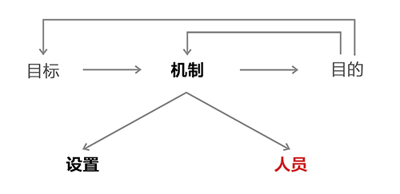

... 39) First, match the person to the design. Understand what attributes matter most for a job, and then ascertain whether an individual has them. This matching process requires 1) visualizing the job and the qualities needed to do it well and then 2) ascertaining if the individual has those qualities.

... 39) 首先，要选择合适的人参与机构设置。 首先要看清某职位描述所应包含的最重要的能力，然后确定某人是否具有这些特质。删选过程需要做到：1）将职位和所需具备的特质明确表达出来；2）确认某人是否具备这些特质。

Look for believable responsible parties who love producing great results. Remember that values are most important—e.g., if “work” is what people have to do to make money, I don’t want people to “work” here. I only want people at Bridgewater who are joining us on an important, shared mission to do great things.

寻找可靠的负责人，他们热衷于创造成绩。记住，价值观是最重要的。例如，如果“工作”只是人们养家活口的被迫选择，我不希望我的员工是在工作。我希望加入桥水基金的人都是和我们有着重要的、共同的使命，去创造辉煌。

> The thing that I like least (or dislike most) about my job is fighting to maintain standards, but it must be done. I know that the only way for me to succeed and to be happy is to have good people do it for me, which means that I have to hire, train, and sort out people. It is futile to give responsibilities to people who do not have the qualities required to succeed. It frustrates, and inevitably angers, all parties, which is subversive to the environment. So, hiring, training, and sorting out people so that responsibilities are placed in the hands of people who can be trusted to do an excellent job is the only viable path, and is extremely satisfying.
> 工作中，我最不喜欢的事情就是需要不停维持标准，但是这事关紧要。我知道如果想要成功，想要快乐，就必须让其他人为我来做这件事。于是，这就意味着，我需要雇佣、培训、挑选人员。如果将任务安排给无法胜任的人来做，这是毫无意义的，也会令所有人困惑，甚至愤怒，破坏整个环境。因此，雇佣、培训、挑选人员，使得各项责任置于能够很好完成工作的人手中是唯一的可行之路，这样做的结果也是十分令人满意的。

39a) **Most importantly, find people who share your values.** At Bridgewater, those key values are a drive for excellence, truth at all costs, a high sense of ownership, and strong character (by character, I mean the willingness to do the good but difficult things) .

39a) **最为重要的是要找同你价值观一致的人。** 在桥水，这些核心价值观就是追求卓越，不惜一切代价探寻真相，强烈的归属感，意志坚定，即愿意去做正确但艰难的事情。

39b) **Look for people who are willing to look at themselves objectively and have character.** These are not natural talents—they are qualities that anyone can acquire. They are also the qualities that have the biggest influence on whether or not I respect someone. They are essential for success.

39b) **要找愿意客观评价自己且又意志坚定的人。**这些不是与生俱来的天分，而是可以后天习得的。这些品质是我确定自己是否尊重某人最重要的依据。这些品质关系到是否能够成功。
39c) **Conceptual thinking and common sense are required in order to assign someone the responsibility for achieving goals (as distinct from tasks) .**

39c) **根据需要完成的任务和实现的目标，选择具备相关概念性思维和常识的人履职尽责。**

... 40) **Recognize that the inevitable responsible party is the person who bears the consequences of what is done.** Because of this, the RP must choose wisely when delegating responsibilities to others, and he must incentivize and manage them appropriately. There is no escaping that. For example, you are the inevitable RP for taking care of your health because you’re the one who inevitably bears the consequences. If you’re sick, you might choose to delegate the responsibility of figuring out what do to about it to a doctor. However, it is your responsibility to pick the right doctor because you will bear the consequences of that decision. While it is, of course, also the doctor’s responsibility to handle the responsibilities that you delegate to him, you still need to make sure that his incentives are aligned with his responsibilities and that he is doing his job well. The inevitable responsible party can’t delegate all his responsibilities away and expect good outcomes, even in cases in which he has no expertise. So you can’t escape hiring and managing properly.

... 40) **必然负责人是需要承担一切后果的。**正因为如此，负责人在委派责任时，应该谨慎斟酌人选。终极责任人需要在激励与管理中获得不断平衡，同时要管理好这些任务，这是其无法逃避的责任。你是自己健康的必然负责人，因为健康受损后你必然会承受相应后果。如果你病了，你可以将寻求方案的责任委派给医生。然而，你依然需要负责挑选一个正确的医生，因为这一决定的后果还是会影响你。当然，医生有责任处理好你委派给他的责任。但是你依然需要确保你给医生的物质刺激与给他的责任相符， 确保他认真完成工作。必然负责人无法将自己所有的责任都委派给别人，同时期待有好的结果，即便是他毫无专长的领域也是这样。所以，你依然无法逃避合理雇佣和管理的责任。

... 41) **By and large, you will get what you deserve over time.** The results that you end up with will reflect how you and your people learn to handle things. So take control of your situation and hold yourself and others accountable for producing great results. People who wish for a great result but are unwilling to do what it takes to get there will fail.

... 41) **总的来说，日积月累，你就会得到你想要的。**你所获得的成果将反映你与你的团队是如何学习处理任务的。因此，请把握局势，让你与团队其他人对获得成果负责。那些眼高手低的人，注定一败涂地。

... 42) **The most important responsible parties are those who are most responsible for the goals, outcomes, and machines (they are those higher in the pyramid) .** Give me someone who can effectively be responsible for an area—i.e., who can design, hire, and sort to achieve the goal, and I can be comfortable about all that is in that area. Therefore, they are the most important people to choose and manage well.

... 42) **最重要的负责人要为目标、结果和组织机构负主要责任（即位于金字塔上层的人）。**如果我有某个能够有效负责某领域的人，他可以执行规划、雇佣、分类以实现目标，那么我会对该领域十分放心。因此，任用好和管理好这群人才是最重要的。

... 43) **Choose those who understand the difference between goals and tasks to run things.** Otherwise you will have to do their jobs for them. The ability to see and value goals is largely innate, though it improves with experience. It can be tested for, though no tests are perfect.

... 43) **选择那些明白“目标”与“任务”之间差异的人来做事。** 否则你就必须替他们完成他们的工作。 清楚认识并珍视目标是一种天生的能力，也会随着经验的增多而提升。该能力能够被测试，但是测试并不完美。

**

... 44) Recognize that People Are Built Very Differently

... 44) 要知道每个人都生而不同**

So…
因此：

... 45) **Think about their very different values, abilities, and skills.** Values are the deep-seated beliefs that motivate behaviors; people will fight for their values, and values determine people’s compatibility with others. Abilities are ways of thinking and behaving. Some people are great learners and fast processors; others possess common sense; still others think creatively or logically or with supreme organization, etc. Skills are learned tools, such as being able to speak a foreign language or write computer code.

... 45) **思考他们在价值观、能力和技能上的差异。**价值观即推动行为的深层信仰。人们会为价值观而奋斗，价值观决定了人们与他人相处的模式。能力是人们思考与行为的方式。有些人学习能力强，能够快速处理问题，有些人有丰富的常识，也有人拥有创新思维、逻辑思维，或者有优秀的组织能力。技能则是指学会使用的工具，比如说一门外语，编写计算机程序等。

While values and abilities are unlikely to change much, most skills can be acquired in a limited amount of time (e.g., most master’s degrees can be acquired in two years) and often change in worth (e.g., today’s best programming language can be obsolete in a few years) .

一个人的价值观和能力不易改变，但是大多数技能却能够在限定时间内获得。例如，大多数硕士学历可以在两年内获得。而且大多数技能的价值是会发生改变的，例如，今年先进的编程语言在几年后可能就落伍了。
It is important for you to know what mix of qualities is important to fit each role and, more broadly, with whom you can have successful relationships. In picking people for long-term relationships, values are most important, abilities come next, and skills are the least important.

你必须知道每个角色所需要的能力，更宽泛而言，你与谁能够维持成功的关系。在考虑长期关系人选时，价值观是最重要的，能力次之，技能最微不足道。

**... 46) Understand what each person who works for you is like so that you know what to expect from them.**

... **46) 要了解你每个员工的情况，才能知道你能从他们身上有何种期待。**

**... 47) Recognize that the type of person you fit in the job must match the requirements for that job.**

**... 47) 岗位用人要与职位要求相匹配。**

### How People’s Thinking Abilities Differ

### 人类思维能力的差异

In my many years of running Bridgewater I have learned that people’s thinking abilities differ and that it is important to understand these differences so that they are appropriately considered when assigning people to roles. I have tried to find experts who understood these differences to help me better understand and test for them. I have found a few truly insightful people amid a mass of mediocrity. I have also found that there are all sorts of theories from all sorts of people about how people think and why, so very little should be treated as fact. It seems that “political correctness” and the reluctance to objectively discuss differences in innate abilities have stood in the way of forthright and thoughtful research on this important subject. While the search for good advice and tests has been challenging, it has also been invaluable. What follows is a mix of my theories based on my personal observations and a collection of valuable things I have learned from others. I know I have only scratched the surface of learning about how people think, why they think differently, and how to test for these different thinking abilities, so I am excited about the potential of learning more.I believe, but am not certain about, the following:

以我多年经营桥水基金的经验来看，人与人之间的思维能力是有差异的。只有了解了这些差异，才能知人善任。我曾找来一些熟悉思维差异的专家来帮助我更好的理解和验证这些差异。在大量平庸之辈中，不乏极具洞见者。我同时也发现，诸多学者有诸多关于人类是如何进行思考及其成因的理论，但是只有极少的理论是事实。人们似乎是出于“政治正确”的考虑，抑或不太情愿客观地讨论人类天资的差别，也就无法对这一重要领域进行直截了当的、深刻的研究。虽然寻找良好的建议和测试的过程充满挑战，但这一工作却意义非凡。如下内容综合了我的个人观察以及对前人文献的学习。人类是如何思考？为何人类有不同的思维方式？以及如何对不同的思维能力进行测试？对于这些问题，我的学习只触及到了皮毛，我热切地期待学到更多的知识。以下这些是我所相信，但并不十分确定的观点：

> I have particularly valued psychologist Bob Eichinger.
> 我认为心理学家鲍勃·艾兴格（Bob Eichinger）的理论尤为有价值。
> 
> I am convinced that we are just scratching the surface of understanding differences in how people think and how to test for it, so there is great potential for others to follow this path. Unfortunately, most of the world’s experts I have met are more theoretical than practical.
> 我相信，在理解人类思维差异和测试方法方面，我们的理解只涉及到了皮毛。后人循此路径进行研究，还将大有可为。然而甚为可惜的是，我所接触到的专家都过于注重理论研究而忽视了实用意义。

*   There are two big differences in how people think that are due to the brain’s coming in two big halves and different people relying differently on them.58 This was explained by Caltech Professor Roger Sperry, who won a Nobel Prize in medicine for attributing these two ways of thinking to different reliances on the two hemispheres. As a result of this discovery, these two ways of thinking are called “left-brained” and “right-brained.” Professor Sperry helped us understand that:

    人类思维的两种最大的差异来源于大脑的构造，我们的大脑是由两个半球组成的，不同的人对于两个半球的依赖程度不同。加利福利亚理工学院的罗杰·斯佩里（Roger Sperry）教授对这一发现进行了解释。斯佩里教授研究了对大脑半球不同依赖造成的两种思维方式，也因此而获得了诺贝尔医学奖。而这一发现得出一个结论，两种不同的思维方式被称为“左脑思维”和“右脑思维”。斯佩里教授帮助我们理解了：

> A good book on this is A Whole New Mind by Daniel H. Pink, and a good article on the science of this is “A Wandering Mind Heads Straight Toward Insight” by Robert Lee Hotz from The Wall Street Journal.
> 在该领域值得借鉴的著作有丹尼尔·H·平克（Daniel H Pink) 的《全新思维》（A Whole New Mind) ，以及罗伯特·李·霍兹刊登于《华尔街日报》的“游离的思维更易洞察一切” 。

*   The left hemisphere reasons sequentially, analyzes details, and excels at linear analysis. Left-brained thinkers do these things well. They are also called linear thinkers. When they excel at this type of thinking they are called “bright.”

    左脑善于循序渐进式推理，分析细节，线性分析能力强。左脑型思维者在以上方面表现突出，也因此被称为线性思维者，如果某人在此类思维中优于常人，我们可称其为“聪明”。

> “Bright” people have high IQs, are highly analytical thinkers, and can solve complex mental problems.
> 聪明的人有高智商，善于分析，能够解决复杂的心理问题。

*   The right hemisphere reasons holistically, recognizes themes, and synthesizes the big picture. Right-brained thinkers do these things well. People who think this way are also called lateral thinkers. Those who excel at this kind of thinking are called “smart.”

    右脑善于整体推理，能够识别主题，整合全局。右脑型思维者在以上方面表现突出，也因此被称为水平思维者，如果某人在此类思维中优于常人，我们可称其为“睿智”。

> "Smart"people have common sense, are good at synthesizing, and can imagine what is possible.
> 睿智的人有常识，善于整合，富于想象。

Long before I knew that there was a Professor Sperry I saw these differences. I bet you’ve seen them too.**

在知道斯佩里教授之前，我早已察觉到这两种思维方式的不同，我想你也应该察觉到了

*   **On a scale of -5 to +5 – left-brained to right-brained – where do you think you fall?**

    **-5到+5分别指示了左脑型思维和右脑型思维，你的思维模式是介于这之间的哪一个级别？**

*   **How confident are you that your self-assessment is right?**

    **你认为你的自我评价是准的吗？有多准？**

• **Some people see details (trees) , and others see big pictures (forests) .** Those who “see trees” see the parts most vividly and don’t readily relate the parts to each other in order to see the big picture—e.g., they might prefer more literal, precise paintings. They are typically left-brained. Others connect the dots to pictures. In fact, they typically don’t even see the dots; they just see the pictures. They are typically right-brained. You can detect which type people are by observing what they focus on. Detailed thinkers can lose sight of the big picture and are more likely to focus in on a part than to go to the higher level and see the relationship between parts. For example, a person who focuses on details can be thrown off by word mistakes like “there“ instead of “their,” while big-picture thinkers won’t even notice the mistake. Similarly, big-picture thinkers can often understand the meaning of sentences even when key words are reversed—e.g., when “up” is mistakenly used instead of “down,” they understand that the person speaking couldn’t have meant “up” in that context. That is because their attention is focused on the context first and the details second. When describing the same meeting, these two different types will frequently focus on completely different things and disagree on their interpretations. In discussions, they can frustrate each other and discount what the other is saying. Similarly, a person of one type interviewing another type will usually yield an unsatisfactory result.

• **有些人善于观察细节（树木），而有些人更注重全局（森林）。**那些善于观察树木的人能够对部分体察入微，但却不善于将各个部分联系起来以获得整体。比如，他们可能更喜欢写实的、精确的画作，这种人就是典型的左脑型思维者。而有些人，他们能够将一个个点连接起来，形成画面。实际上，这些人甚至根本看不到点，只能看到画面，这种人是典型的右脑型思维者。根据观察人关注的焦点，你可以判断出该人是哪种类型的思维者。细节思维者可能会看不到全局，他们更愿意去关注某一个部分，而不愿上升到一定的高度，去探究各个部分之间的关系。比如，一个关注细节的人可能纠结于一些小的拼写错误，如“there”和“their”（英文中二者发音相同），而一个胸怀全局的人可能根本不会注意到这一错误。同样的，即便一个句子中的关键词都是颠倒的，也不会影响一个全局思维者对整个句子意思的理解。例如，讲话者将“下”说成了“上”，而全局思维者却能够在理解上下文的基础上，明白讲话者不可能是在说“上”。这是因为全局思维者首先会将注意力放在整体上，其次才是细节。当这两类人描述同一场会议时，他们的关注点可能大相径庭，在对事情的理解上也是南辕北辙。在小组讨论时，他们会相持不下，也会不断驳斥对方的观点。基于同一原因，当某种类型的思维者去面试另一个类型的思维者时，结果也往往不尽人意。

*   **On a scale of -5 to +5 – “detailed” to “big picture – where do you think you fall?**

    -5到+5分别指示了对细节和全局的关注程度，你的思维模式是介于这之间的哪一个级别？

*   **How confident are you that your self-assessment is right?**
    你认为你的自我评价是准的吗？有多准？

• **Some people rely more on remembering what they were taught when making decisions, and others rely more on their independent reasoning.** Let’s call the first group memory-based learners and the second group reasoning-based thinkers. When using the word “learning” I intend to convey “acquiring knowledge by being taught,” and when using the word “thinking” I mean “figuring it out for oneself.” Memory-based learners approach decision-making by remembering what they were taught. They draw on their memory banks and follow the instructions stored there. They are typically left-brained. Reasoning-based thinkers pay more attention to the principles behind what happens. They are typically right-brained. You can tell the difference when what is learned (e.g., CAPM) conflicts with what is logical (e.g., All Weather) . People who rely on memory-based learning will typically be more skeptical of unconventional ideas because their process is to more readily accept what they have been told and because they are less able to assess it for themselves. Those who rely on more on reasoning won’t care much about convention and will assess ideas on their merits. Those who rely on memory-based learning also tend to align themselves with the consensus more than people who rely on reasoning. Memory-based learners are more willing to accept the status quo, while reasoning-based thinkers are less biased by it. They are more likely to be innovative, while those who rely on learning are likelier to be cautious. Performance in school will correlate well with the quality of one’s learning-based thinking, but will not reliably correlate with one’s reasoning-based thinking. The most able learners are easily found, since they are, or were, the best students from the best schools. The best thinkers are tougher to find, as there are no obvious funnels through which they pass, especially before they develop track records in the “real world.”

• **当需要做出决定时，有些人更依赖他们被传授的知识，而有些人则更愿意进行独立论证。**我们姑且将第一组称为记忆型学习者，将第二组称为推理型思考者。我一般用“学习”一词表达通过接受他人传授以获得知识，而用“思考”一词表达通过个人努力进行探索。记忆型学习者做选择时会回忆他人是如何教他的。他们会利用记忆库，遵循在记忆库中储存的指令。这就是典型的左脑型思维者。推理型思考者更加注重事件背后的原则，属于右脑型思维者。当习得的知识（如资产评估模型）与逻辑（如全天候情况）发生冲突时，不同思维的人会做出不同的反应。记忆型学习者会对非传统的观念持怀疑态度，因为这类人习惯直接接受被告知的内容，也无法做出自己的判断。相反，那些更依赖推理的人就不会在意陈规，他们更愿意就观点本身做出自己的判断。记忆型学习者会更愿意与多数人的共识保持一致，更愿意接受现状。而推理型思考者却不会如此，他们更具创新精神，不那么谨慎。学校成绩是与一个人的学习型思考相挂钩的，但却无法反应一个人的推理能力。当然，最优秀的学习者是很好找的，他们就是，或者曾经是，最好的学校里的最好的学生。而优秀的思考者却不那么容易找到，因为社会并不存在普遍的衡量其能力的通道。

*   **On a scale of -5 to +5 – “learning” to “thinking”– where do you think you fall?**
    **-5到+5分别指示了对学习和思考的重视程度，你的思维模式是介于这之间的哪一个级别?**

*   **How confident are you that your self-assessment is right?**
    **你认为你的自我评价是准的吗？有多准？**

*   **Some people are focused on daily tasks, and others are focused on their goals and how to achieve them.** Those who “visualize” best can see the pictures (rather than the dots) over time. They have a strong capacity to visualize and will be more likely to make meaningful changes and anticipate future events. They are the most suitable for creating new things (organizations, projects, etc.) and managing organizations that have lots of change. We call them “creators.” They are typically right-brained thinkers. By contrast, those who are focused on the daily tasks are better at managing things that don’t change much or require repetitive processes done reliably, and are typically best at doing clearly specified tasks. They see things much more literally and tend to make incremental changes that reference what already exists. They are slower to depart from the status quo and more likely to be blindsided by sudden events. They are typically left-brained thinkers.
    **有些人着眼于日常事务，有些人却更关注自己设定的目标以及达成目标的途径。**擅长“形象化”的人随着时间的推移，能够看到大画面，而不是一个个的点。他们这种过人的形象化能力能够使他们做出有价值的改变，能够预测未来事件走向。他们更适合去创造新的东西，比如公司、项目，也更能管理好一个变幻莫测的组织机构，我们将这类人称为“创造者”，他们是典型的右脑型思维者。与此相反，那些关注日常事务的人能够更好的管理一尘不变或者需要一丝不苟完成重复流程的事项，他们尤其擅长完成明确细致的工作任务。他们倾向于直观看待事务，利用现有参考进行细微调整。他们不愿意改变现状，遇到紧急情况会措手不及，这类人就是典型的左脑型思维者。

*   **On a scale of -5 to +5—“tasks” to “goals”—where do you think you fall?**
    **-5到+5分别指示了对任务和目标的关注程度，你的思维模式是介于这之间的哪一个级别?**

*   How confident are you that your self-assessment is right?
    你认为你的自我评价是准的吗？有多准？

• Some people are “planners,” and others are “perceivers.” Planners like to focus on a plan and stick with it, while perceivers are prone to focus on what’s happening around them and more readily adapt to it. Perceivers see things happening and work backward to understand the cause and how to respond; they work from the outside in; they also see many more possibilities that they compare and choose from; often they see so many that they are confused by them. In contrast, planners work from the inside out, figuring out first what they want to achieve and then how things should unfold. Planners and perceivers have trouble appreciating each other. While a perceiver likes to see new things and change directions often, this is discomforting to planners, who prefer to stick to a plan. Planners weigh precedent much more heavily in their decision-making, and assume that if it was done before in a certain way, it should be done again in the same way, while perceivers tend to optimize on the spot. Planners are typically left-brained, and perceivers are typically right-brained.

• 有些人是计划者，而有些人是观察者。计划者能够投入一项计划并坚持执行，而观察者更倾向于将注意力放在观察计划周围的因素上，更能适应周遭的变化。观察者先看到结果，再倒推回去，获知起因，从而找到应对方案。他们的工作方式是由外及里的，他们也能看到更多可供比较和选择的可能性。有时，因为可能性过多以至于观察者无法决断。相反，计划者是由里及外的工作方式，他们会先确定期待实现的内容，再寻求事情的展开方式。计划者与观察者彼此很难互相欣赏。观察者喜欢新事物，喜欢时常变换方向，这会让计划者感到不安，因为后者更愿意坚持原有计划，在决策时往往遵循先例，认为这类事肯定在过去碰到过，并以某种方式得以解决，现在也应该以同样的方式来解决，而观察者们则倾向于现场进行优化。规划者就是典型的左脑型思维者，而观察者就是典型的右脑型思维者。

*   **On a scale of -5 to +5—“planner” to “perceiver”—where do you think you fall?**
    **-5到+5分别指示了计划者和观察者，你的思维模式是介于这之间的哪一级别?**

*   **How confident are you that your self-assessment is right?**
    **你认为你的自我评价是准的吗？有多准？**

• Some people are driven more by their emotions, and others are driven more by their intellect. We all have emotions and intellect. When they conflict, some people will give in to their emotions, while others maintain control of their emotions and are driven by their intellect. I am told this is more due to relative reliance on the amygdala and the prefrontal cortex, but I’m not sure. Once again, these two different types typically can’t understand and typically frustrate each other.

• 有些人他们做事受情感驱使，有的人则由理智驱使。我们每个人都有情感和理智，而二者冲突时，有的人会向情感妥协，而有的人能更好的控制情感，让理智占上风。我得知这是由于不同的人对杏仁核或者前额皮质的依赖程度不同，我对此不太确认。与上述诸多情况相同，这两类人无法理解彼此，往往会针锋相对。

*   **On a scale of -5 to +5—“driven by emotion” to “driven by intellect”—where do you think you fall?**
    **-5到+5分别指示了情感驱动和理智驱动，你的思维模式是介于这之间的哪一级别？**

*   **How confident are you that your self-assessment is right?**
    **你认为你的自我评价是准的吗？有多准？**

**• Some people are risk-takers, and others are risk-averse.**
**• 有些人愿意接受风险，而有些人则尽可能避免风险**

*   **On a scale of -5 to +5—“driven by emotion” to “driven by intellect”—where do you think you fall?**
    **-5到+5分别指示了避免风险和接受风险，你的思维模式是介于这之间的哪一级别？**

*   **How confident are you that your self-assessment is right?**
    **你认为你的自我评价是准的吗？有多准？**

**• Some people are introverts, and others are extroverts.** The most important difference between them is their willingness to fight for truth. Introverts tend to find the necessary conflicts more difficult.
**有些人是内向的，而有些人是外向的。**二者之间最大的不同在于他们是否愿意去为真相奋斗。内向的人认为接受这些必要的冲突更为艰难。

*   **On a scale of -5 to +5—“introvert” to “extrovert”—where do you think you fall?**
    **-5到+5分别指示了内向和外向，你的思维模式是介于这之间的哪一级别？**

*   **How confident are you that your self-assessment is right?**
    **你认为你的自我评价是准的吗？有多准？**

There are lots of important ways in which people think differently that I won’t continue on about.

人类思维差异还有很多，在此不一一赘述。

**... 48) Use personality assessment tests and quality reflections on experiences to help you identify these differences.** These should be done openly so that these important differences are embraced and considered in our interactions.

... 48) **通过性格测试以及员工工作经历中反映的性格特点来帮助自己了解他们之间的差异。**这些工作需要公开完成，以便大家能够在合作中充分认识并考虑这些重要不同。

... 49) **Understand that different ways of seeing and thinking make people suitable for different jobs.** Since nature created different ways of thinking and since nature never creates anything without a purpose,61 each way of thinking has purposes. Often, thinking well for some purposes necessitates thinking poorly for others. It is highly desirable to understand one’s own ways, and others’ ways, of thinking, and their best applications. While there is no best quality, there are certainly some qualities that are more suitable for some jobs (e.g., being a math wiz is important for a job that requires a math wiz) . So don’t treat everyone the same.

... 49) **要知道，每个人的观察与思考方式不同，也因此适合不同的职位。**大自然创造了不同的思维方式，这样做是有自己的道理的。每一种思维方式都有自己存在的原因。一般而言，针对某些目的的思维方式，在进行其他目的的思维时，会表现糟糕。一定要理解个人的思维方法和其应用领域。当然，不存在所谓最好的性格，却有更适合做某些工作的性格。比如，如果一个职位需要数学天才，那么在岗的人最好是个数学天才。不要对所有人不加区分对待。

> Even the “mistakes” that nature makes have a purpose; they are essential for the evolutionary process.
> 即便是大自然所犯的“错误”也是处于一定理由的，它们都是成长过程的需要。

Sometimes I see people dealing with each other, especially in groups, without regard for these differences. This is nonsensical. Both people expressing their own views and those considering others’ views need to take into account their differences. These differences are real, so it’s dumb to pretend they don’t exist.

有时，我察觉到团队中员工彼此相处时没有考虑到这些差异，这是不理智的。不论是在表达自己见地还是思考他人观点时，都应该将彼此的差异纳入考虑。这些差异是真实存在的，千万不要假装看不到。

49a) **People are best at the jobs that require what they do well.**

49a) **人们在所擅长的领域工作表现最佳。**

49b) **If you’re not naturally good at one type of thinking,** it doesn’t mean you’re precluded from paths that require that type of thinking, but it does require that you either work with someone who has that required way of thinking (which works best) or learn to think differently (which is very difficult and sometimes impossible) .

49b) **若你天生不擅长某种思维方式，并不意味着就做不好需要这种思维方式的工作。** 你需要与其他拥有所需思维方式的人一起合作，这是最理想的方式。你也可以学习换个思维方式，但这样做很困难，有时甚至不太可能。

**...50) Don’t hide these differences. Explore them openly with the goal of figuring out how you and your people are built so you can put the right people in the right jobs and clearly assign responsibilities.** This is good for both your team and for Bridgewater as a whole.

**...50) 不要隐藏这些差异，坦诚沟通，以深入了解自己和员工，把合适的人用在合适的岗位上，并明晰任务分工。**这对于你的团队和桥水公司而言，都是大有裨益的。

**... 51) Remember that people who see things and think one way often have difficulty communicating and relating to people who see things and think another way.** Keep in mind how difficult it is to convey what it means to think in an alternative way for the same reason it would be difficult to convey what the sense of smell is to someone who doesn’t have the ability to smell.

**... 51) 要记住，看待事物与思维方式不同的人，在交流和相处上是存在困难的。**记住，要求一个人转换思维方式就如同试图向一个没有嗅觉的人来解释嗅觉的含义一样难。

**

... 52) Hire Right, Because the Penalties of Hiring Wrong Are Huge

... 52) 请招对人，因为用错人的代价极为惨重**

So…
因此：

**... 53) Think through what values, abilities, and skills you are looking for.** A lot of time and effort is put into hiring a person, and substantial time and resources are invested in new employees’ development before finding out whether they are succeeding. Getting rid of employees who aren’t succeeding is also difficult, so it pays to be as sure as possible in hiring. Refer to our diagram that shows how to achieve your goals by comparing them with the outcomes you’re getting, and think of the people part as shown below. By constantly comparing the picture of what the people are like with the qualities needed, you will hire better and evolve faster.

**... 53) 仔细审度自己想要的员工应具备什么样的价值观、能力和技能。**我们花费大量的时间和精力来招揽人才，然后在认定这些人是否是可造之材之前还需要投入大量的时间和资源来培养新员工。淘汰不合格的员工同样很艰难，因此需要在招聘的时候慎之又慎。参考下图，了解如何通过将目标与成果进行对比进而达成目标。如下图所示，思考关于人员的部分的描述。只要不断将图中人的性格与职位所需的特质进行比对，你就会在招聘上更胜一筹，发展更快。
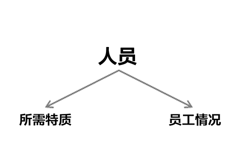

**... 54) Weigh values and abilities more heavily than skills in deciding whom to hire.** Avoid the temptation to think narrowly about filling a job with a specific skill.While having that skill might be important, what’s most important is determining whether you and they are working toward the same goals and can work in the same ways and share the same values.

**... 54) 招聘员工时，要多考虑员工的价值观与能力，这比技能更重要。**不要总是希望为一个职位设定一个具体的技能。也许拥有那项技能很重要，但是最重要的是确保你和招聘来的员工能够为同一个目标、以同样的方式、同样的价值观一起工作。

> The importance of a skill will vary according to the job. The more knowledge-dependent and independent in nature the job is (e.g., a 62programmer or lawyer whose job isn’t to think about the direction of the company) , the more relevant the required skills are.
> 根据每个职位的不同，技能的重要性也相应变化。职位的知识依赖度和独立度越高，所需技能的相关度越高。比如程序员或律师，他们的工作职责就不包括考虑公司的运作方向。

**... 55) Write the profile of the person you are looking for into the job description.**

**... 55) 招聘时，在岗位说明里描述希望招到一个什么样的员工。**

**...56) Select the appropriate people and tests for assessing each of these qualities and compare the results of those assessments to what you’ve decided is needed for the job.** Synthesize the results of those tests to see if there is a “click.”

**...56) 我的翻译。选择合适的人和测试手段来评估这一些资质的每一项并且把这些评估的结果与你认为工作所需的资质相比较。**综合考虑这些评估的结果，来决定是否有合适人选。

**56a) Remember that people tend to pick people like themselves, so pick interviewers who can identify what you are looking for.** For example, if you’re looking for a visionary, pick a visionary to do the interview where you test for vision. If there is a mix of qualities you’re looking for, put together a group of interviewers who embody all of these qualities collectively. Don’t choose interviewers whose judgment you don’t trust (in other words, choose believable interviewers) .

**56a) 要记住，人们往往倾向于选择和自己相似的人，因此应挑选那些了解自己想雇佣何种员工的人担任面试考官。** 比如说，如果你想找一名有远见的员工，那么请安排一个本身就有远见的面试官去测试应聘者是否有远见。如果你想找一个复合型人才，那么请安排一组能够涵盖所有素质的面试官。如果你对某人的判断力没有信心，那么请不要选择他当面试官，一定要选择你可以信任的人。

**56b) Understand how to use and interpret personality assessments.** These can be a fantastic tool in your arsenal for quickly getting a picture of what people are like—abilities, preferences, and style. They are o ften much more objective and reliable than interviews.

**56b) 要知道如何使用和解读性格测试。**性格测试能够帮助你快速了解人们的基本情况，包括能力、喜好、风格。性格测试往往要比面试本身更客观、更可信。

**56c) Pay attention to people’s track records.**

**56c) 了解应聘者的过往业绩。**

**56d) Dig deeply to discover why people did what they did.** Knowing what they did is valuable only in helping you figure out what they are like. Understanding the “why” behind people’s actions will tell you about their qualities and as a result, what you can probably expect from them.

**56d) 深入挖掘，探寻他们过往行为的动机。**了解过去能够帮助你评估他们现在的情况。了解人们行为背后的动机能够让你判断他们的特质，以及你可以从这些特质期待得到的结果。

**56e) Recognize that performance in school, while of some value in making assessments, doesn’t tell you much about whether the person has the values and abilities you are looking for.**Memory and processing speed tend to be the abilities that determine success in school (largely because they’re easier to measure and grade) and are most valued, so school performance is an excellent gauge of these. School performance is also a good gauge for measuring willingness and ability to follow directions as well as determination. However, school is of limited value for teaching and testing common sense, vision, creativity, or decision-making. Since those traits all outweigh memory, processing speed, and the ability to follow directions in most jobs, you must look beyond school to ascertain whether the applicant has the qualities you’re looking for.

56e) **要认识到，尽管学校表现在进行评估时有一定价值，但却不能体现应聘者是否具备你想要的价值观或能力。**记忆和处理速度能力很大程度上决定了学业成功与否（可能因为二者比较容易衡量和评分），也是学校最看重的能力，因此，学校表现是衡量以上两种能力的最好的标尺。学校表现同时还可以衡量一个人的意志、遵守规范的能力、决心。然而，学校在传授或检测常识、眼界、创新性、决策能力等方面价值却极为有限。而这些特质对于大多数工作而言的重要性远胜于记忆、处理速度和遵守规范的能力。我们必须突破学校表现来考虑应聘者是否有你所需要的特质。

> Consider how few important decisions you make as a student from first grade through college. Other than deciding which college to attend in the senior year of high school and which major to pursue in the sophomore year of college, most people normally just do what they are told to do.
> 考虑一下作为一个大学生你从大学一年级到读完大学，你做出过的极为有限的重要决定，除了在高年级时决定要去哪所大学和在大2时要决定选什么专业，大多数人通常都只是做他们被告知要去做的事情。

**56f) Ask for past reviews.** Don’t rely exclusively on the candidate for information about their track record; instead, talk to people who know them (believable people are best) , and look for documented evidence.

**56f) 要求提供过往业绩的评估。** 不要单纯依赖应聘者本人来提供关于他们过往业绩的信息，应该去与那些熟悉他们的人谈话，最好是可信度高的人，或者要求提供有案可查的证据。

**56g) Check references.**

**56g) 参考推荐信。**

**... 57) Look for people who have lots of great questions.** These are even more important than great answers.

**... 57) 寻找有许多绝妙问题的人。**因为这些绝妙的问题，甚至比绝妙的答案还重要。
**... 58) Make sure candidates interview you and Bridgewater.** Show them the real picture. For example, share these principles with them to show how we operate and why. Have them listen to the tapes to see the reality.

**... 58) 确保应聘者对你和桥水联合基金也进行了了解。** 给他们展现真实的情况，比如，可以将我们讨论的这些原则分享给他们，演示一下我们是如何操作的以及背后的原因。为确保真实性，可为他们提供录音带。

**... 59) Don’t hire people just to fit the first job they will do at Bridgewater; hire people you want to share your life with.** The best relationships are long term and based on shared missions and values. Also, turnover is generally inefficient because of the long time it requires for people to get to know each other and Bridgewater. Both the people you work with and the company itself will evolve in ways you can’t anticipate. So hire the kind of people you want to be with on this long-term mission.

**...59) 不要聘用那些只把桥水联合基金当做第一份工作的人，**要用那些你愿意与之分享人生的人。最好的关系都是长期的、基于共同的使命与价值观的关系。同时，员工跳槽会致使公司效率低下，因为新员工需要花费时间熟悉彼此，熟悉公司。你的同事和你所在的公司都会以不可预测的方式发生演变。所以，还是聘用那些能够长期与之相处的人吧。

**... 60) Look for people who sparkle, not just “another one of those.”** I have too often seen people hired who don’t sparkle, just because they have clearly demonstrated they were “one of those.” If you’re looking for a plumber you might be inclined to fill the job with someone who has years of experience, without confirming whether he has demonstrated the qualities of an outstanding plumber. Yet the difference between hiring an ordinary versus an extraordinary plumber (or any other expert) is huge. So when reviewing a candidate’s background, you must identify how this person has demonstrated himself to be outstanding. The most obvious demonstration is outstanding performance within an outstanding peer group. If you’re less than excited to hire someone for a particular job, don’t do it. The two of you will probably make each other miserable.

**... 60) 要选熠熠生辉之人，而不是又一个平庸之辈。**我见过许多并不熠熠生辉却被聘用的人，因为他们明确说明了自己只是一个平庸之辈。如果你只是寻找一个伐木工人，那么你很可能直接把工作给某个有几年经验的人，而不去确认此人是否拥有一个优秀的伐木工所应具备的特质。但是，雇佣一名普通的伐木工与雇佣一名优秀的伐木工（或者其他领域的专家）有着天壤之别。因此，在翻查应聘者的资料时，你必须看清该应聘者是如何证明自己是一名优秀的人才的。最显而易见的证明就是，他是否在一组优秀的人之中完成了优秀的工作。如果你对雇佣某人来承担某项工作并不那么激动，那就不要招揽此人，这很可能对你们双方都是折磨。

**... 61) Hear the click: Find the right fit between the role and the person.** Remember that your goal is to put the right people in the right design. First understand the responsibilities of the role, then what qualities are needed to fulfill them excellently, and then ascertain whether an individual has them. This matching process requires 1) visualizing the job and the qualities needed to do it well and 2) ascertaining if the individual has those qualities. I describe this process as “hearing the click,” because that’s the sound of finding the right fit between the role and the individual.

**... 61) 听到咔哒声：所需职位和聘用之人一定要匹配合适。**记住，你的目标是将对的人员置于对的机制之中。首先应该确定岗位责任，然后找出圆满完成这些责任所需要哪些特质，然后考虑候选人是否具有这些特质。这样一个匹配过程需要：1）将职位和所需素质明确表达出来；2）确认某人是否具备这些素质。我之所以将这一过程称之为“听到咔哒声”，是因为当你在角色与人员上找到了完美的匹配，就会听到这种声音。

**... 62) Pay for the person, not for the job.** Look at what they were paid before and what people with comparable credentials get paid and pay some premium to that, but don’t pay based on the job title.

**... 62) 以人论酬，而不是以岗论酬。**参考此人过去的薪资水平，以及拥有类似资质人的一般薪资水平，在此基础做一定上浮，但是不要只看职位的头衔来决定酬劳。

**...63) Recognize that no matter how good you are at hiring, there is a high probability that the person you hire will not be the great person you need for the job.** Continue the “interviewing” process as intensely after they are on the job as before, and don’t settle.

**... 63) 要知道无论你在招聘人才方面有多在行，你所聘用的人选都很有可能不是岗位的最佳人选。**员工到岗之后，依然需要进行同等强度的面试流程，不能满足现状。

**

... 64) Manage as Someone Who Is Designing and Operating a Machine to Achieve the Goal

... 64) 像设计和运行一台机器一样做好管理工作，才能实现预期目标**
So…
因此：

**... 65) Understand the differences between managing, micromanaging, and not managing.** Micromanaging is telling the people who work for you exactly what tasks to do and/or doing their tasks for them. Not managing is having them do their jobs without your oversight and involvement. Managing means: 1) understanding how well your people and designs are operating to achieve your goals and 2) constantly improving them. To be successful, you need to manage.

**... 65) 明白管理、微观管理和不管理之间的区别。**微观管理指管理者告诉员工每一项工作该怎么做或者帮他们来做。不管理就是管理者让员工自己工作，不进行任何监管和参与。而有效的管理则意味着：1）了解你的员工和规划是如何为实现你的目标而运行的；2）不断完善。想要成功，你必须学会有效管理。

**65a) Managing the people who report to you should feel like “skiing together.”** Like a ski instructor, you need to have close contact with your people on the slopes so that you can assess their strengths and weaknesses as they are doing their jobs. There should be a good back and forth with trial and error. With time you will be able to decide what they can and can’t effectively handle on their own.

**65a) 管理下属应该感觉像是一同滑雪一样。** 你要像一个滑雪教练，在错位上与你的员工保持密切接触，以便评估他们工作状态中的强项和弱点，这必须是一个反复尝试的过程。随着时间的推移，你就能够确定他们自己是否能有效处理事情。

**65b) An excellent skier is probably going to be more critical and a better critic of another skier than a novice skier.** A student probably thinks his ski instructor is fabulous, while an Olympic skier looking at the same ski instructor would assess him to be at a much lower level.

**65b) 优秀的滑雪者更能挑出对方的毛病，这是初学者很难做到的。** 一个初学者可能会觉得自己的滑雪教练水平棒极了，但是一个奥运滑雪冠军在评估同一个教练时，却会认为这个人水平并不那么好。

**...66) Constantly compare your outcomes to your goals.** Identify problems and diagnose whether the problems are with the way the organization is designed or with the way the people are handling their responsibilities. So remember how the following feedback loop to rapid improvement works.

**...66) 不断比较完成情况和目标之间的差距。**找到问题，判断问题出现的原因是与公司规划的方式有关还是与员工处理责任的方式有关。记住下面这个快速提升的反馈循环是如何工作的。

And remember to do this constantly so you have a large sample size. You want to have a large sample size because 1) any one problem can either be a one-off imperfection or symptomatic of root causes that will show up as problems repeatedly; and 2) looking at a large sample size of problems will make clear which it is. Also, the larger your sample size, the clearer the root causes of your problems, and the more obvious your solutions, will be.

记住要重复这一行为，以期获得更多的样本。问题样本容量大的好处是：1）随着问题不断重复出现，一个问题要么是一次性的不完美，要么是深层原因的症状；2）使观察更清晰明了。同时，你的样本数量越多，问题的深层原因就越明显，你也越能找到相应的解决方案。

If you do this constantly in this way, your evolutionary process should look like this:

如果你持续这样做，那么你的成长过程应该如下图所示：

**... 67) Look down on your machine and yourself within it from the higher level.** Higher-level thinking doesn’t mean the thinking done by higher -level beings. It means seeing things from a top-down perspective—like looking at a photo of Earth from outer space, which shows you the relationships between the continents, counties, and seas, and then going down to a photo of your country, then down to your neighborhood, then down to your family. If you just saw your family without the perspective of seeing that there are millions of other families, and there have been many millions of other families over thousands of years, and observing how your family compares and how families evolve, you would just be dealing with the items that are coming at you as they transpire without the perspective.

**... 67) 在所管理的机制内，从更高的层次俯视审视自己和机制。**更高层次的思考并不意味着位于更高层次的人的思考，而是以自上而下的视角来审查事物。这就像看一张外太空拍的地球的图片一样， 能够看到大洲、国家、海洋之间的关系。请再找来一张你的国家的图片，社区的图片，然后是你家庭的图片。在看待自己的家庭时，你要看到数以百万的其他家庭，以及几千年来历史长河中出现过的不可计数的其他家庭，在这些大背景中考虑比较自己的家庭，观察家庭的演变情况。否则，你只能见树不见林。

**...68) Connect the case at hand to your principles for handling cases of that type.** Remember that every problem and task is just another “one of those”—i.e., another one of a certain type. Figuring out what type it is and reflecting on principles for handling that type of issue will help you do a better job. Whether or not you use the principles written here, you still must decide on a course of action and what guiding principles will be effective. Through this process you will improve your principles as well as handle your issues better.

**...68) 解决问题要参照同类别问题时应遵循的原则。**要记住，每一个问题和任务都只是某类问题中的一个。找出问题的类型，参看处理此类问题的适用原则，能够帮助你更好的完成工作。不管你用不用本书所述的原则，你还是需要确定一个行动方案，以及相应行之有效的指导原则。通过这一过程，你能够不断改进自己的原则，提高处理问题的能力。

**...69) Conduct the discussion at two levels when a problem occurs: 1) the “machine” level discussion of why the machine produced that outcome and 2) the “case at hand” discussion of what to do now about the problem.** Don’t make the mistake of just having the task-level discussion, because then you are micromanaging—i.e., you are doing your managee’s thinking for him and your managee will mistake your doing this as being OK, when that’s not OK (because you will be micromanaging) . When having the machine-level discussion, think clearly how things should have gone and explore why they didn’t go that way. If you are in a rush to determine what to do and you have to tell the person who works for you what to do, point out that you are having to do this, make clear that you are having to do this and that is what you are doing, and make it a training experience—i.e., explain what you are doing and why.

**...69) 问题出现时，要展开两个层面的讨论：1）从机制层面来讨论，为什么会出现这个问题；2）单从问题本身层面来讨论，当下应如何解决。**不要将讨论局限在问题本身，这是微观管理的表现。你这样做无异于帮助你的下属思考本该由他思考的问题，同时让他误认为这样做合情合理。实际上，你这样做是不合适的，因为这就是微观管理。当你进行机制层面的讨论时，应该思考事情本应朝着什么方向发展，却为什么没有。如果你着急解决问题，必须告诉你的下属下一步该做什么，那么请清楚地告诉他们你必须展开这两个层面的讨论，并将此作为一种员工培训来进行，解释清楚这样做的原因。

**... 70) Don’t try to be followed; try to be understood and to understand others.** Your goal is to understand what is true and improve together. If you want to be followed, either for an egotistical reason or because you believe it more expedient to operate that way, you will pay a heavy price in the long run. If you are the only one thinking, the results will suffer.

**... 70) 和员工的关系不是服从与被服从，而应是相互理解。**你的目标是理解真相，共同提升。如果你出于自我本位或方便管理的原因希望自己的命令一直被服从，那么从长远来看你将付出沉重的代价。如果只有你一个人思考，那么结果肯定不会理想。

**70a) Don’t try to control people by giving them orders.** They will likely resent the orders, and when you aren’t looking, defy them. An authoritarian approach also means you aren’t developing your employees, and over time they will become increasingly dependent on you, which damages all parties. Instead, the greatest power you have over intelligent people—and the greatest influence they will have on you—comes from constantly getting in synch about what is true and what is best so that they and you want the same things. People must desire to do the right things, and this desire must come from them. You can, however, show them the connection between fulfilling their responsibilities and their own well- being. Reaching agreement will come only from radically open discussions in which you are fair, reasonable, and open-minded.

**70a) 不要给员工下命令控制他们。**他们一般都会抵触命令，有时还会背着你蔑视命令。这种专权的管理方式也意味着你并没有培养你的员工，随着时间的推移，他们会越来越依赖你，这对所有人都有害无益。如此相反，要想最大化对高智商人才行使的权力，使他们对你的影响也最大，就要不断讨论，使真相和最佳方案达成意见一致，确保你们目标一致。人们必须渴望做正确的事情，而这种渴望必须发自内心。你可以向他们揭示完成责任和自身发展之间的联系。只有通过公证、合理、开放的自由辩论，才能达成一致。

**70b) Communicate the logic and welcome feedback.** When making rules or changes, explain the principles behind the decision. We want reasonable thinkers to operate sensibly. We achieve this through principles that are sound and well understood, applied and tested through open discussion. It is each person’s job to 1) evaluate whether he agrees with a decision, and if not, explain why; and 2) hold each other accountable for operating consistently within the organization’s principles. We want people who understand the principles that allow our community to succeed and possess strong ethics that motivate them to work by our rules, rather than to sneak around them. We want people who know that if the community works well, it will be good for them. We don’t want people who need to be ordered and threatened. We don’t want people who just follow orders.

**70b) 沟通要有逻辑，多听取反馈意见。**在制定规则和做出改变时，一定要就决策背后的原则进行解释。要安排逻辑思维能力强的人合理地开展工作。我们制定了健全的原则，这些原则通过自由辩论得到深入理解、适用和检验。每个人都要做到：1）思考自己是否同意某项决策，如果不同意，理由是什么；2）彼此为遵循公司原则情况负责。我们想要的员工必须能够理解让我们公司成功的原则，同时拥有能够激励他们按规矩办事的职业操守，而不是那些时刻钻原则空子的人。我们想要的员工必须认可如果公司发展的好，那对他们自己也有好处。我们不想要那些需要下命令、威胁的员工，也不想要那些只会服从命令的员工。

**... 71) Clearly assign responsibilities.** Eliminate any confusion about expectations and ensure that people view the failure to achieve their goals and do their tasks as personal failures.The most important person is the one who is given the overall responsibility for accomplishing the mission and has both the vision to see what should be done and the discipline to make sure it’s accomplished by the people who do the tasks.

**... 71) 明确责任分工。**要消除针对期望的误解，让员工看到，没有实现目标，没有完成任务，就是他们个人的失败。最关键的人物是被赋予完成整项工作任务责任的人，该人应具备能看到问题解决方案的视野，还应拥有确保负责该项工作的人能够完成工作的纪律执行力。

> You learn principles by experiencing the rewards and punishments of your actions interacting with reality. The clearer the relationship is between cause and effect, the better it is for learning and evolving. So clearly designated responsibilities enhance the feedback and learning process. For example, if you are in the woods and have to survive on your own, the connection between your actions and their results is clearer and is all that matters. Blame doesn’t enter into it as it gets you nothing. All that you focus on are the interactions between your actions and their results.
> 通过与现实互动获得奖励或惩罚，人们学会建立自己的原则。这其中的因果关系越明显，对学习和发展越有利。责任明确有助于收集反馈，促进学习。如果你身处森林之中，希望独立生存下去，此时你的行为与这些行为的结果之间的关系非常明显，也决定了你的生死。不要责备，责备没有任何意义。你只需要关注你的行为和行为的结果。

**... 72) Hold people accountable and appreciate them holding you accountable.** It’s better for them, for you, and for the community. Slacker standards don’t do anyone any good. People can resent being held accountable, however, and you don’t want to have to tell them what to do all the time. Instead, reason with them, so that they understand the value and importance of being held accountable. Hold them accountable on a daily basis. Constant examination of problems builds a sample size that helps point the way to a resolution and is a good way to detect problems early on before they become critical. Avoiding these daily conflicts produces huge costs in the end.

**...72) 对员工进行工作问责制度，若他们问责你，要感谢他们。**这样做对员工、对你、对公司都有好处，逃避责任对任何人都无益。人们讨厌被问责，但是你肯定不愿意时刻告诉他们该做些什么。相反，你要与他们讲道理，使他们理解问责的价值和重要性。问责要每日进行，不断检查问题从而建立起样本容量，帮助找到解决方案，能够在问题变得严峻之前发现问题。而避免这些日常冲突的结果就是最后付出沉痛代价。

**72a) Distinguish between failures where someone broke their “contract” from ones where there was no contract to begin with.** If you didn’t make the expectation clear, you generally can’t hold people accountable for it being fulfilled (with the exception of common sense—which isn’t all that common) . If you find that a responsibility fell through the cracks because there was no contract, think about whether you need to edit the design of your machine.

**72a) 要分清楚，有些工作上的失败是因为员工没履行一开始的“约定”，而有些则是因为一开始就没有“约定”。**如果你没有将自己的期待说清楚，那么你就不能追究某人未完成期待的责任。当然，除了众所周知的常识以外，有时也不是那么众所周知。如果说你发现由于没有事先约定，导致责任无法追究，那么你就该反思一下是否需要修改机制设计。

... 73) Avoid the “sucked down” phenomenon. This occurs when a manager is pulled down to do the tasks of a subordinate without acknowledging the problem. The sucked down phenomenon bears some resemblance to job slip, since it involves the manager’s responsibilities slipping into areas that should be left to others. Both situations represent the reality of a job diverging from the ideal of that job. However, the sucked down phenomenon is typically the manager’s response to subordinates’ inabilities to do certain tasks or the manager’s failure to properly redesign how the responsibilities should be handled in light of changed circumstances. You can tell this problem exists when the manager focuses more on getting tasks done than on operating his machine.

... 73) 避免“上级卷入下级工作职责”现象。 即管理者需要去做下属职责范围的工作，却拒绝承认这是个问题。这种上级卷入下级工作职责的现象与职责错位情况类似，管理者的职责滑向了本应属于下属的领域。二者都属于工作职能偏移的情况。然而，上级卷入下级工作职责现象则专指上级对下级工作不力的反应或上级无法随着情势变化适当调整责任分工的情况。这种情况会在管理者更重视完成工作任务而非设计机制时存在。

**73a) Watch out for people who confuse goals and tasks, because you can’t trust people with responsibilities if they don’t understand the goals.**One way to test this: if you ask a high-level question like, “How is goal XYZ going?” a good answer will provide a synthesis upfront (of how XYZ is in fact going overall) , and then support that assessment with the tasks done to achieve the goal. People who see the tasks and lose sight of the goals will just explain the tasks that were done and not make the connection to how those tasks relate to the machine that produces outcomes and achieves goals.

**73a) 谨防那些混淆目标与任务的员工，不能理解工作目标的员工是不值得信任的。**你可以这样检验员工是否理解工作目标：如果你问一个高层级的问题，“某个目标达成的怎么样了？”一个好的答案是结合了对目标完成进度的坦率回答，再加上具体为实现目标做的工作以支撑此结论。那些只看到任务而忽视目标的人，只会向你解释任务完成了多少，却无法将这些任务与创造结果、实现目标的机制相结合。

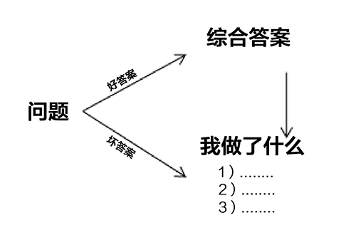

**...74) Think like an owner, and expect the people you work with to do the same.** You must act in the interest of our community and recognize that your well-being is directly connected to the well-being of Bridgewater. For example, spend money like it’s your own.

**...74) 要有“主人翁”思维，并希望员工们也能具备这种思维方式。**员工行事必须符合公司利益，认识到你与桥水基金荣辱与共。比如，你要像花自己的钱一样来花公司的钱。

**... 75) Force yourself and the people who work for you to do difficult things.** It’s usually easy to make things go well if you’re willing to do difficult things. We must act as trainers in gyms act in order to keep each other fit. That’s what’s required to produce the excellence that benefits everyone. It is a law of nature that you must do difficult things to gain strength and power. As with working out, after a while you make the connection between doing difficult things and the benefits you get from doing them, and you come to look forward to doing these difficult things.

**... 75) 强迫自己和员工迎难而上。如果你愿意迎难而上，那么就能够比较容易让事情顺利进行。**我们必须像健身房教练一样让彼此保持身材。如果想要获得众人受益的卓越成绩，就必须这么干。要想获得力量，变得强大，你必须迎难而上，这是自然界的法则。比如健身，开始一段时间的健身之后你就会发现，完成了困难的项目，你就会从中受益，随后你就会期待做这些困难的项目了。

**75a) Hold yourself and others accountable.** It is unacceptable for you to say you won’t fight for quality and truth because it makes you or other people uncomfortable. Character is the ability to get yourself to do the difficult but right things. Get over the discomfort, and force yourself to hold people accountable. The choice is between doing that properly or letting our community down by behaving in a way that isn’t good for you or the people you are “probing” and coaching.

**75a) 对自己和他人要采取问责制度。** 如果你认为不争取提高质量，获得真相，只是因为这样做会让你和其他人不舒服，这种想法是不可取的。坚强的意志能够帮助你去做那些艰难但正确的事情。克服不安，强迫自己向别人问责。你要么按照原则来办事，要么就会面临让公司失望，因为你的做法既不利于自己，也不利于那些你调查或辅导的人。

**... 76) Don’t worry if your people like you; worry about whether you are helping your people and Bridgewater to be great.** One of the most essential and difficult things you have to do is make sure the people who work for you do their jobs excellently. That requires constantly challenging them and doing things they don’t like you to do, such as probing them. Even your best people, whom you regularly praise and reward, must be challenged and probed. You shouldn’t be a manager if you have problems confronting people or if you put being liked above ensuring your people succeed.

**... 76) 别担忧员工喜不喜欢你，还是多想想自己所做的事情能不能帮员工和桥水联合基金获得成功吧。**你必须做的最重要但最艰难的事情就是确保员工认真完成工作。也就要求你不断地质疑他们，做一些不讨人喜欢的事情，比如调查他们。即便是那些你经常表扬和奖励的优秀员工，你也必须质疑和调查。如果你不喜欢与人对质，或者你认为讨人喜欢比确保他们成功更重要，那么你就不适合做一个管理者。

**... 77) Know what you want and stick to it if you believe it’s right, even if others want to take you in another direction.**

**... 77) 知道自己想要什么，坚信自己认为是正确的事情，不要轻易被人牵着鼻子走。**

**... 78) Communicate the plan clearly.** People should know the plans and designs within their departments. When you decide to divert from an agreed-upon path, be sure to communicate your thoughts to the relevant parties and get their views so that you are all clear about taking the new path.

**... 78) 计划沟通要清晰明了。**身处某个部门的员工应该熟悉本部门的计划和设置。当你试图脱离某一条规划好的线路时，一定要与相关方沟通你的观点，并听取他们的意见，保证所有人对于采取新的计划是明确的。

**78a) Have agreed -upon goals and tasks that everyone knows (from the people in the departments to the people outside the departments who oversee them) .** This is important to ensure clarity on what the goals are, what the plan is, and who is responsible to do what in order to achieve the goals. It allows people to buy into the plan or to express their lack of confidence and suggest changes. It also makes clear who is keeping up his end of the bargain and who is falling short. These stated goals, tasks, and assigned responsibilities should be shown at department meetings at least once a quarter, perhaps as often as once a month.

**78a) 已达成共识的目标任务要让所有相关人士都知道。（包括有关部门的员工及监管层的领导）只有这样才能让大家充分认清目标、计划、完成目标的负责人。**这能增强人们对计划的信心，或者给他们机会表达自己缺乏信心从而提供更改建议。这样做也能看清楚哪些人在计划中能坚持到底，哪些人可能会中途退缩。这些目标、任务、分工必须在部门会议上至少每季度通报一次，甚至是一个月通报一次。

**78b) Watch out for the unfocused and unproductive “we should … (do something) .”** Remember that to really accomplish things we need believable responsible parties who should determine, in an open-minded way, what should be done; so it is important to identify who these people are by their names rather than with a vague “we,” and to recognize that it is their responsibility to determine what should be done. So it is silly for a group of people who are not responsible to say things like “we should…” to each other. On the other hand, it can be desirable to speak to the responsible party about what should be done.

**78b) 谨防交流中出现没有重点，低效无用的句式：我们应该如何。** 如果想要达成目标，我们需要可靠的负责人，他们坚定果断、思维开放，知道该干些什么。因此，我们必须清楚的知道这些人的名字，而不是用一个模糊的“我们”来指代，也应该认识到，他们有责任来决定应该做什么。因此我们不应该让一群不负责的人来对彼此说“我们应该如何”。与此相反，你应该向负责人表达该如何做的想法。

**... 79) Constantly get in synch with your people.** Being out of synch leads to confused and inefficient decision-making. It can also lead you in conflicting directions either because 1) you are not clear with each other, which often generates wildly differing assumptions, or 2) you have unresolved differences in your views of how things should proceed and why. Getting in synch by discussing who will do what and why is essential for mutual progress. It doesn’t necessarily entail reaching a consensus. Often there will be irreconcilable differences about what should be done, but a decision still needs to be made, which is fine. The process of getting in synch will make it clear what is to be done and why, even if it cannot eliminate difference. One of the most difficult and most important things you must do, and have others do, is bring forth disagreement and work through it together to achieve a resolution. Recognize that this process takes time. It can happen any way people prefer: discussion, e-mail, etc. You must have a workable process for making decisions even when disagreements remain. I discuss such a process in the earlier section on getting in synch.

**... 79) 保持与员工意见统一。**如果无法达成意见一致，就会产生令人困惑的、低效率的决策，还可能导致你在大方向上出现冲突，因为1）你们不了解彼此的想法，通常会造成大相径庭的推断；2）你们对于应该如何推进事项及其原因上的分歧尚未得到解决。通过讨论分工及其原因从而实现意见一致能够促进互相进步。并不一定需要达成完全的共识。有时的确会出现一些关于该如何做事的不可调和的分歧，但是依然需要作出决定，这种情况是可以接受的。争取达成意见一致的过程能够明确大家该干什么，但是可以保留那些无法消除的分歧。你必须做的以及必须让他人做的最艰难最重要的事情之一就是将分歧提到台面上来，讨论分析以求获得一个解决方案。当然，这一过程会耗费一些时间，也可以通过多种方式来进行，比如讨论，发邮件等。你必须制定出一个决策的可行流程，即便争议依然存在，在前面关于争取达成意见一致的部分我已经讨论过这个流程了。

**... 80) Get a “threshold level of understanding”—i.e.**, a rich enough understanding of the people, processes and problems around you to make well-informed decisions.

**... 80) 充分了解工作相关情况。**—即为做出最周全的决定，必须充分了解身边的员工、工作流程及存在的问题。

**...81) Avoid staying too distant.** You need to know your people extremely well, provide and receive regular feedback, and have quality discussions. Your job design needs to build in the time to do these things.

**... 81) 避免和员工产生距离感。**你需要极其了解你的员工，经常性提供并听取反馈意见，开展富有成效的讨论。你的工作职责安排中应该留出足够的时间来做这些事情。

**81a) Tool: Use daily updates as a tool for staying on top of what your people are doing and thinking.** Daily updates are brief descriptions of what the person did that day, what they are planning to do the next day, their problems, their questions, and their observations. They typically take about five minutes to write and do wonders for staying in touch.

**81a) 工具：使用每日进度更新了解员工工作与思考的情况。**每日进度更新是关于某个员工当日工作进度的简报，还包括了他们明天的计划、存在的问题、疑惑、观察。进度更新只需要大约五分钟就能完成，对于跟进工作状态十分有效。

**... 82) Learn confidence in your people—don’t presume it.** It takes time to learn about people and what confidences can be placed in them. Sometimes new people are offended we don’t yet have confidence in how they are handling their responsibilities. They think it’s a criticism of their abilities when in fact it’s a realistic recognition that we simply haven’t had enough time or direct experience with them to form a point of view. No manager (including myself) should delegate responsibilities to people we don’t yet know well enough to have confidence in. And new people shouldn’t be offended if we haven’t yet formed that confidence.

**...82) 对员工的信任度不能先入为主，要逐步去了解。**了解员工，了解能给他多少信任是需要花费时间的。有时，当我们对于一些新人是否能担当重任还存在怀疑，这可能会冒犯到此人。他们会认为这是你对他们能力的质疑，而实际上这只是因为我们还没有足够的时间去了解该人，也没有和他们直接打过交道，因此还无法形成相关认识。所有的管理者（包括我自己）在对下属 没有充分了解建立信任之前，都不能将责任分配给他们。而新员工也不能因为管理者还没有机会建立其对他们的信心就感到被冒犯了。

**... 83) Vary your involvement based on your confidence.** Management largely consists of scanning and probing everything for which you are responsible to identify suspicious signs. Based on what you see, you should vary your degree of digging, doing more of it for people and areas that look more suspicious, and less of it where probing instills you with confidence. With the right tools in place and performing well, your scanning will include both reviewing the output of these tools (e.g., “issues log,” “metrics,” “daily updates,” and “checklists”) and spot-checking.

**...83) 处理问题时，根据自己感觉有把握的情况来调整参与度。**管理通常意味着扫描和调查所有你负责的事项，以便找到可疑迹象。根据你所看到的，调整调查的程度。当被调查对象看起来更可疑时，可适当调高调查的程度。反之，当你有信心认为一般调查足以消除疑虑，即可调低调查程度。应该使用正确的调查工具，充分发挥其作用，调查应该包括定期审查、抽查问题日志、计量图表、日常进度更新、或清单等方式的结果。

**... 84) Avoid the “theoretical should.”** The theoretical should occurs when a manager theorizes that people should be able to do something when they can’t or without actually knowing whether they can do it.

**... 84) 避免说“理论上应该”。** “理论上应该”是管理者认为从理论上讲人们应该有能力做某事，但实际上他们做不到，或者不确定自己是否能做到。

**... 85) Care about the people who work for you.** If you are not working with people you care about and respect, this whole thing ain’t worth it. If you don’t believe that, you probably shouldn’t work at Bridgewater. While it’s desirable to convey these feelings, having them is more important. It is good to share your lives together, but not required. Be there for weddings, births, and funerals. This is something that I try to do but fail to do enough because of the numbers, so I convey that I will be there for anyone who really needs me. Personal contact at the time of personal difficulty is a must.

**... 85) 关爱员工。如果你不关心尊重你的员工，整个工作就没有意义了。**如果你不相信这个论断，可能桥水基金就不太适合你。拥有对员工的关爱之情非常重要，如果能够表达出关爱最好。你们可以一起分享人生，但对此不强求。请尽量参加员工的婚葬嫁娶。我一直试图这样做，但是由于员工数量太多了，我做的还不够。当别人真的需要我时，我就会到场。在员工困难时与员工进行私下接触至关重要。

**... 86) Logic, reason, and common sense must trump everything else in decision-making.**

**... 86) 决策中最重要的是讲究逻辑、给明理由且符合常识。**

**... 87) While logic drives our decisions, feelings are very relevant.** A feeling is a reality—and a good reality—and it’s up to management to deal with all realities sensibly. Good emotions are important. In fact, they are probably most important since they are the reasons behind the good things we do, e.g., satisfaction with a job wonderfully done and love of others. Emotions are bad only if they cloud judgment and take us away from what we want.

**... 87) 尽管做决策时主要依靠逻辑，但感觉也是很重要的。**情感也是一种事实，而且是一种好的事实，管理者需要合理地处理所有的事实。拥有好的情绪至关重要，甚至可能是最重要的。因为正面情绪是事情顺利进行的原因，比如说对完成工作的满意情绪，以及关爱他们的情绪。情绪只有在妨碍我们做判断，使我们远离目标时才是负面的情绪。

**... 88) Escalate when you can’t adequately handle your responsibilities, and make sure that the people who work for you do the same.** Escalating means saying that you don’t believe that you can successfully handle a situation and that you are passing the “responsible party” (RP) job to someone else. The person you are escalating to—the person to whom you report—can then decide whether to coach you through it, take control, have someone else handle it, or do something else. However, the boss should avoid being drawn into doing the job of the person who is failing without exploring why the job has not been done successfully without help. It’s very important to get an accurate assessment of what each person can and can’t do and why. If the boss just does the job for the person, even if it produces good results, we will lack the right attribution of success and failure. Remember that an important goal is to learn about what a person is like from testing, and that we want to get that information without crashing the car. So, the RP must either say that he can handle his job or that he cannot. And it is the responsibility of the boss to make the assessment of whether to remove the RP from the driver’s seat because he might crash. We learn from mistakes by seeing our failures, feeling the pain of them, and reflecting and gaining insight. If the boss and the RP don’t recognize the RP’s failures to fix things, and the RP lacks the ability to do the job, trouble will result. Remember that life is the best teacher—“the proof is in the pudding.” So going through this process is essential to real learning.

**... 88) 如果发现自己无法有效解决问题时，应将问题升级，提交给上级，确保为你工作的员工们也是这样操作的。**将问题升级，意味着你没有信心应付当下局面，要将负责人的工作转交给其他人。你转交责任的人，也就是你直接汇报的上级决定是对你进行辅导，还是直接接过责任，还是让其他人来做，或是其他的解决办法。然而，上级要弄清楚执行工作任务的人为什么在没有别人帮助时无法独立完成工作，不可直接代替该人做事。我们需要获得关于每个人能够胜任或不能胜任某项工作的原因。如果说上级直接代替下级做事，即便结果令人满意，也不是我们应有的成败态度。记住，我们工作的一个重要的目标就是通过测试来了解一个人，而不是要真的毁掉一辆车时才知道某人不是个好司机。负责人必须能够确认自己能够胜任或者不能胜任，上级则必须做出判断，看负责人是否可能出事故，是否需要要让其从驾驶座上下来。我们不断从失败中吸取教训，承认失败，感受痛苦，反思自己，进而吸取经验。如果说上级和负责人都没有认识到负责人无法解决问题，无法胜任自己的工作，就一定会出问题。生活是最好的老师，实践出真知。如果想要真正学到东西，这一过程必不可少。

**88a) Make sure your people know to be proactive.** Demand that they speak up when they won’t meet agreed-upon deliverables or deadlines. This communication is essential to getting in synch on both a project level and on a personal level.

**88a) 确保员工主动积极。**要求员工在无法交付约定好的工作或无法按时完成工作时一定要说出来。这种争取意见一致的沟通方式对于整个项目以及个人都至关重要。

**88b) Tool: An escalation button.** Because there is confusion at times about whether responsible parties are conveying to their managers their problems or whether they are escalating, use an escalation button. This is a tool that makes clear to the manager that the managee is escalating.

**88b) 工具：升级按钮。**有的时候会分不清负责人到底只是在向管理者阐述问题还是在将问题升级，提交上级处理，这时就需要一个升级按钮，提醒管理者下级此时是在升级问题。

**... 89) Involve the person who is the point of the pyramid when encountering material cross-departmental or cross sub-departmental issues.** Imagine an organizational chart as a pyramid that consists of numerous pyramids, so:

**... 89) 跨部门间或跨子部门间出现问题时，需要上级部门，也就是这个组织“金字塔尖”的那个人来参与定夺。**将公司结构看做一个金字塔，一个大金字塔之下又有多个小金字塔。

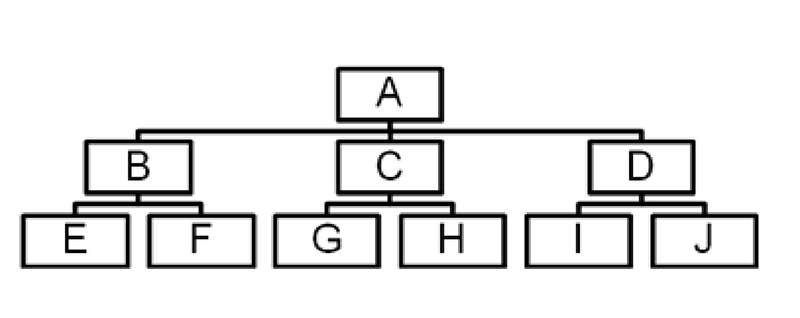

When issues involve parties that are not in the same part of the pyramid, it is generally desirable to involve the person who is at the point of the pyramid. The individual at the point has the perspective and knowledge to weigh the trade-offs properly and make an informed decision. Not involving the person at the point of the pyramid will likely cause problems. In the diagram above, if persons G and H are having an issue, who is the point of the pyramid? If persons F and I are having an issue, who is the point of the pyramid?
当问题涉及的相关方不再金字塔的同一个部分时，请邀请位于该金字塔尖上的人来做判断。位于塔尖的人能够有足够的视野和知识，权衡利弊，做出明智决定。反之，如果不让塔尖上的人参与进来很可能会引发问题。观察上图，如果G和H发生矛盾，谁是位于金字塔尖的决策者呢？如果F和I遇到问题，谁又是金字塔尖的决策者？

> If you answered C and A, you understand the concept. If you didn’t, think again.
> 如果你能回答C和A，那么你就理解了这个概念，如果答错，请再思考一下。

**

... 90) Probe Deep and Hard to Learn What to Expect from Your “Machine”

... 90) 认真深入调查，了解机制能够创造什么。**

So…
因此：

**... 91) Know what your people are like, and make sure they do their jobs excellently.** This requires constantly challenging them and probing them. That’s true even if your people are doing their jobs well, even though those people can be given more leeway.

**... 91) 了解自己的员工，确保他们顺利完成工作。**你需要不断质疑员工，调查他们。即便某些员工工作的很好，也依然需要这样做，但可以适当对他们留有余地。

**... 92) Constantly probe the people who report to you, and encourage them to probe you.** Managers are much less able to discover the right things to do than most people assume. I know that’s true for me. The people who work for you should constantly challenge you, in order for you to become as good as you can be. Also, inviting criticism brings to the surface any subterranean discontent and makes the people working for you responsible for helping to find solutions. It’s much easier for people to remain spectators offering unchallenged comments from the stands than to become players on the field. Forcing people onto the field strengthens the whole team. Communication is a two-way responsibility.

**... 92) 不断调查直接向你汇报的下级，并鼓励他们调查你。**管理者们其实并没有大家想的那么有能力做出正确的抉择，起码对于我而言是这样。你的员工应该经常质疑你，促使你成为最好的自己。同时，接受批评也能将别人背后对你的不满拿到台面上来，让你的员工也负责帮你找寻解决方案。与在球场上打球的选手相比，在看台上作为观众发出一些无关痛痒的评论自然要简单的多。要求每个人都要到球场上打球能够提升整个团队。沟通是双向的责任。

**92a) Remind the people you are probing that problems and mistakes are fuel for improvement.**They ought to understand that probing is good for them and everyone else. The main reason Bridgewater has improved at a much faster rate than most other companies over the past 30 years is that we seek out problems and find systematic ways of eliminating them. This approach has given us an unlimited supply of practical ways to improve.

**92a) 提醒你调查的员工，问题和错误是改进的动力。**他们应该理解，调查对他们自己和其他人而言都是一件好事。在过去的三十年间，桥水联合基金比其他的大多数公司发展的都要快，原因就是我们一直在发现问题，并找寻系统性解决问题的方法。这种方法给了我们取之不尽的改进方法。

**... 93) Probe to the level below the people who work for you.** You can’t understand how the person who reports to you manages others unless you know their direct reports and can observe how they behave with them. Also encourage the people who work two levels below you to bring their disagreements with their bosses to you.

**... 93) 调查下两级的员工。**如果你不了解你的下属手下的人的工作状况以及他们之间的互动情况，那你也无法了解你的下属。此外，鼓励低于你两级之下的员工直接向你汇报他们与上司之间的不同意见。

**... 94) Remember that few people see themselves objectively, so it’s important to welcome probing and to probe others.**

**... 94) 记住，只有极少人能够客观看待自己。因此，你应该欢迎调查，同时要去调查别人。**

**... 95) Probe so that you have a good enough understanding of whether problems are likely to occur before they actually do.** If problems take you by surprise, it is probably because you are either too far removed from your people and processes or you haven’t adequately thought through how the people and processes might lead to various outcomes.

**... 95) 调查有助于你在问题出现之前充分了解其出现的可能性。**如果问题的出现使你措手不及，可能是因为你对自己的团队和工作流程参与不够，或者你对于团队和工作流程可能出现的结果了解不够深入。

**95a) When a crisis appears to be brewing, contact should be so close that it’s extremely unlikely that there will be any surprises.**

**95a) 如果说有迹象显示危机正在酝酿，那么你就应该保持密切关注，不可能在其发生之时有任何惊讶。**

**95b) Investigate and let people know you are going to investigate so there are no surprises and they don’t take it personally.**

**95b) 调查情况的时候要告诉被调查的人，不让被调查的人措手不及，让他们知道你是对事不对人。**

**... 96) Don’t “pick your battles.” Fight them all.** If you see something wrong, even something small,deal with it. Because 1) small badnesses can be symptomatic of serious underlying problems; 2) resolving small differences of perception may prevent more serious divergences of views; and 3) in trying to help to train people, constant reinforcement of desired behavior is helpful. The more battles you fight, the more opportunities you will have to get to know each other and the faster the evolutionary process will occur.

**... 96) 不要挑肥拣瘦，要解决所有问题。**如果你发现了问题，不论是多小的问题，也要立即处理。因为1）小问题可能只是深层严重问题的一个表现；2）应对观点上的小不同可以防止出现观点上的重大差异；3）在试图培训员工时，持续巩固期望行为有效甚好。打的仗越多，你了解彼此的机会就越多，工作流程成长的速度也会越快。

**... 97) Don’t let people off the hook.** Ask the important, difficult questions, and independently audit.

**... 97) 不要让人逃避责任。**要问重要的、难以回答的问题，并展开独立审计。

**... 98) Don’t assume that people’s answers are correct.** They could be erroneous theories or “spin,” so you need to occasionally double check them, especially when they sound questionable. Some managers are reluctant to do this, feeling as though it is the equivalent of saying they don’t trust them. These managers need to understand and convey that trust in the accuracy of people’s statements is gained or lost through this process. People will learn to be much more accurate in what they say to you if they understand this—and increasingly, you will learn who and what you can rely on.

**... 98) 不要想当然认为人们的答案都是正确的。** 人们提供的答案很可能只是错误百出的理论或自己的困惑。有时，你需要再次确认这些答案，尤其是当它们本身听起来就很可疑的时候。有些管理者不愿这样做，觉得这样做无异于说自己不信任他们。这些管理者需要认识到，通过这一做法，你可以判断决定对人们说法的准确性是信任或是不信任。如果你的员工认识到这一点，他们就会在跟你说话时更准确表达自己，你也会越来越明确哪些人或事值得信任。

**... 99) Make the probing transparent rather than private.** That will help to assure the quality of the probing (because others can make their own assessments) , and it will reinforce the culture of transparency and freedom to find truth.

**... 99) 将调查透明化，不要私下进行。**这将有助于保证调查的质量，因为其他人都可以做自己的评估，这样做也能进一步巩固公司极度透明和自由探索真相的文化氛围。

**

... 100) Evaluate People Accurately, Not “Kindly”

... 100) 准确地，而不是善意地评估员工。**

So…
因此：

**... 101) Make accurate assessments.** Since truth is the foundation of excellence and people are your most important resource, make the most precise personnel evaluations possible. This accuracy takes time and considerable back-and-forth. Your assessment of how responsible parties are performing should be based not on whether they’re doing it your way but on whether they’re doing it in a good way. Speak frankly, listen with an open mind, consider the views of other believable and honest people, and try to get in synch about what’s going on with the person and why. Remember not to be overconfident in your assessments as it’s possible you are wrong.

**... 101) 进行准确评估。** 真相是优秀的基础，人才是最重要的资源。因此，请对员工进行最为精确的评估吧。精确评估需要花费时间，反复进行。关于负责人工作情况的评估不应该基于其是否按照你的方式在工作，而应基于其是否按照正确的方式工作。坦白地交流，洗耳恭听，听取其他诚实可信人的看法，对于被评估对象的情况及相应原因争取达成一致。同时，切忌对评估过于自信，你的评估也会出错。

**101a) Use evaluation tools such as performance surveys, metrics, and formal reviews to document all aspects of a person’s performance. These will help clarify assessments and communication surrounding them.**

**101a) 使用各种评估工具来记录员工全方位表现，包括工作表现调查问卷、计量图表、正式评估报告。这些工具能够帮助你将员工相关的评估和沟通整理清楚。**

**101b) Maintain “baseball cards” and/or “believability matrixes” for your people.** Imagine if you had baseball cards that showed all the performance stats for your people: batting averages, home runs, errors, ERAs, win/loss records. You could see what they did well and poorly and call on the right people to play the right positions in a very transparent way. These would also simplify discussions about compensation, incentives, moving players up to first string, or cutting them from the team. You can and should keep such records of your people. Create your baseball cards to achieve your goals of conveying what the person is like. I use ratings, forced rankings, metrics, results, and credentials. Baseball cards can be passed to potential new managers as they consider candidates for assignments.

**101b) 为员工建立“棒球记录卡”以及“可信度图表”。**试想一下，如果你为员工建立棒球记录卡，上面显示他们所有的工作表现数据，包括击球率、全垒打、失误、防御率，以及所有的胜负记录。你就可以直观看到他们的强项和弱项，以一种公开透明的方式来将每个人安排到他们的位置上。这样做也能简化很多讨论，包括薪酬奖励，决定是否将某位队员安排进第一阵容，或者将他们开除出队。你能够、也应该为你的员工建立这样的记录档案。建立棒球记录卡，展现每个员工的情况。我会参考记录卡上的数据进行评级、排位、建表、得出结果、总结资历。棒球记录卡可以转交给有潜力的新管理者，他们是安排工作的候选人。

**... 102) Evaluate employees with the same rigor as you evaluate job candidates.** Ask yourself: “Would I hire this person knowing what I now know about them?” I find it odd and silly that interviewers often freely and confidently criticize job candidates despite not knowing them well, yet they won’t criticize employees for similar weaknesses even though they have more evidence. That is because some people view criticism as harmful and feel less protective of an outsider than they do of a fellow employee. If you believe accuracy is best for everyone, then you should see why this is a mistake and why frank evaluations must be ongoing.

**... 102) 以同等的严厉程度来评价员工、雇佣新人。**问一下你自己：“基于现在对该人的了解，你是否会雇佣此人？”面试官总是无所节制地任意批评应聘者，尽管他们还不那么了解该人。但是即便管理者更了解自己的员工，他们也不会因为同样的问题来批评自己的员工。在我看来，这是非常愚蠢的。这是因为有些人将批评当成是有害的，对于自己的员工，他们更有保护意识，但是对外人就不是这样。如果你能看到准确的评价能让所有人受益，那么你就应该看出对员工和应聘者区别对待的问题所在，也应该了解时刻进行诚实评价的重要性。

**... 103) Know what makes your people tick, because people are your most important resource.** Develop a full profile of each person’s values, abilities, and skills. These qualities are the real drivers of behavior, and knowing them in detail will tell you which jobs a person can and cannot do well, which ones they should avoid, and how the person should be trained. I have often seen people struggling in a job and their manager trying for months to find the right response because the manager overlooked the person’s “package.”These profiles should change as the people change.

**... 103) 充分了解员工的特质，因为人才是最重要的资源。**建立一个完整的档案，收录每个人的价值观、能力、技能。这些特质是行为背后的真正动力，充分了解这些特质能够帮你判断某人适合或不适合做某事，应该避免做某事，应该如何被培训。我时常看到有人在自己的岗位上做的不顺心，他们的管理者花了数月的时间才找到对策。因为管理者忽视了该人的打包档案，这些档案应该随着人的改变而即使更新。

**... 104) Recognize that while most people prefer compliments over criticisms, there is nothing more valuable than accurate criticisms.** While it is important to be clear about what people are doing well, there should not be a reluctance to profile people in a way that describes their weaknesses. It is vital that you be accurate.

**... 104) 要认识到，尽管大多数人都喜欢被表扬，不喜欢被批评，但准确的批评却是最宝贵的。**了解员工哪些工作做得好非常重要，同时我们更应该建立一个记录员工弱点的档案，越准确越好。

**... 105) Make this discovery process open, evolutionary, and iterative.** Articulate your theory of a person’s values, abilities, and skills upfront and share this with him; listen to his and others’ response to your description; organize a plan for training and testing; and reassess your theory based on the performance you observe. Do this on an ongoing basis. After several months of discussions and real-world tests, you and he should have a pretty good idea of what he is like. Over time this exercise will crystallize suitable roles and appropriate training, or it will reveal that it’s time for the person to leave Bridgewater.

**... 105) 将这一发现过程公开，循环往复，促其演变。**直接表达出你关于一个人的价值观、能力、技能的理论，听取记录对象或他人关于这些理论的看法，组织培训与测试计划，最后根据你观察到的员工表现来重新衡量你的理论。这一过程要持续进行，经过数月的讨论和实战演练，此时你与记录对象应该对于他的个人情况有了较好的认识。随着时间的推移，这一过程能够得出清楚的结论，认定某事适合什么样的岗位，什么样的培训。否则，调查过程将揭露此人应该离开桥水联合基金了。

**...106) Provide constant, clear, and honest feedback, and encourage discussion of this feedback.** Don’t hesitate to be both critical and complimentary—and be sure to be open-minded. Training and assessing will be better if you frequently explain your observations. Providing this feedback constantly is the most effective way to train.

**...106) 提供频繁的、清楚的、诚实的反馈，并鼓励就这些反馈进行讨论。**坚持批评与表扬相结合，坚持开放性思维。如果你能频繁地对自己的观察做出解释，那么此时的培训和评估将更有意义。而频繁提供反馈正是最有效的培训方式。

> Child psychologists, dog trainers, and other behavior modification specialists will tell you that constant, no-exception feedback is fundamental to good training.
> 儿童心理学家、训狗师以及其他行为矫正方面的专家会告诉你，坚持持续进行反馈对于训练行为至关重要。

**106a) Put your compliments and criticisms into perspective.** I find that many people tend to blow evaluations out of proportion, so it helps to clarify that the weakness or mistake under discussion is not indicative of your total evaluation. Example: One day I told one of the new research people what a good job I thought he was doing and how strong his thinking was. It was a very positive initial evaluation. A few days later I heard him chatting away for hours about stuff that wasn’t related to work, so I spoke to him about the cost to his and our development if he regularly wasted time. Afterward I learned he took away from that encounter the idea that I thought he was doing a horrible job and that he was on the brink of being fired. But my comment about his need for focus had nothing to do with my overall evaluation of him. If I had explained myself when we sat down that second time, he could have better put my comments in perspective.

**106a) 正确对待表扬与批评。我发现很多人会对评估的作用夸大其词，对此，我需要说明的是，有时我会讨论你的缺点或错误，但是这并不是我对你的整体评价。**例如，有一天，我对一名新研究员说，你的工作做的很好，思维能力很强，我对他做出了正面的初始评价。几天后，我又听到他聊一件与工作无关的事，足足闲聊了几个钟头。于是，我找他谈话，告诉他如果他经常浪费时间的话，会给自己和我们的工作造成不良影响。此后，我得知，那次谈话之后，他觉得我认为他的工作干的很差劲，自己离炒鱿鱼已经不远了。但实际上，我对于他应该更专注工作的评价与我对他的整体评估无关。如果我在第二次和他坐下来谈话的时候就表达了这一点，那么他就能够更正确地对待我对他的评价了。

**106b) Remember that convincing people of their strengths is generally much easier than convincing them of their weaknesses.** People don’t like to face their weaknesses. At Bridgewater, because we always seek excellence, more time is spent discussing weaknesses. Similarly, problems require more time than things that are going well. Problems must be figured out and worked on, while things that are running smoothly require less attention. So we spend a lot of time focusing on people’s weaknesses and problems. This is great because we focus on improving, not celebrating how great we are, which is in fact how we get to be great. For people who don’t understand this fact, the environment can be difficult. It’s therefore important to 1) clarify and draw attention to people’s strengths and what’s being done well; and2) constantly remind them of the healthy motive behind this process of exploring weaknesses. Aim for complete accuracy in your assessments. Don’t feel you have to find an equal number of “good and bad” qualities in a person. Just describe the person or the circumstances as accurately as possible, celebrating what is good and noting what is bad.

**106b) 记住，让别人看到自己的长处通常比让他们看到自己的短处要容易得多。**人们不愿直面自己的弱点。在桥水联合基金，我们总是追求卓越，因此我们会投入很多的时间来讨论弱点。与此相同，困难重重的工作要比顺利完成的工作花费更多的时间。我们必须找到问题，分析解决问题。而顺利进行的事情则不需要那么多关注。因此，我们投入非常多时间关注员工的弱点和问题。这样做效果甚好，因为我们不去欢呼自己有多么优秀，而是聚焦提升，这才是我们变得优秀的方式。对于那些无法理解此事的人而言，这种环境可能会难以忍受。因此，我们需要1）关注并弄清员工的长处和强项；2）不停提醒他们寻找弱点背后的积极动力，争取进行最准确的评估。不要觉得自己非要找到某个人同样数量的优点和缺点。你只需要尽可能准确的描述某人或某个环境，称赞积极因素，记下消极因素。

**106c) Encourage objective reflection**—lots and lots of it.

**106c) 鼓励客观的反思**—数不甚数。

**106d) Employee reviews:** While feedback should be constant, reviews are periodic. The purpose of a review is to review the employee's performance and to state what the person is like as it pertains to their doing their job.

**106d) 员工评估报告:** 反馈是持续进行的，而评估报告是周期性的。评估报告的目的是回顾员工的工作表现，展示员工在工作状态时的个人情况。

A job review should have little surprises in it—this is because throughout the year, if you can’t make sense of how the person is doing their job or if you think it’s being done badly, you should probe them to seek understanding of root causes of their performance. Because it is very difficult for people to identify their own weaknesses, they need the appropriate probing (not nitpicking) of specific cases by others to get at the truth of what they are like and how they are fitting into their jobs.

工作评估报告中的内容应该不会有任何出人意料的表述，因为在全年的管理过程中，如果你不知道一个员工的工作状态，或者你知道他的工作任务完成的很糟糕，那么你就应该调查他们以求理解这些不理想的工作表现背后的深层原因。让人认识到自己的弱点是很难的，因此，你还需要其他人针对一些特定案例的调查（不是鸡蛋里挑骨头），以便获得关于员工素质的真实情况和其称职情况。

From examining these specific cases and getting in synch about them, agreed-upon patterns will emerge. As successes and failures will occur in everyone (every batter strikes out a lot) , in reviewing someone the goal is see the patterns and to understand the whole picture rather than to assume that one or a few failures or successes is representative of the person. You have to understand the person’s modus operandi and that to be successful, they can’t be successful in all ways—e.g., to be meticulous they might not be able to be fast (and vice versa) . Steve Jobs has been criticized as being autocratic and impersonal, but his modus operandi might require him being that way, so the real choice in assessing his fit for his job is to have him the way he is or not at all: that assessment must be made in the review, not just a theoretical assessment that he should do what he is doing and be less autocratic.

通过审查这些特定案例，争取达成一致意见，你将会看到出现一些重复模式的出现。每个人都会有成败，就像每一个击球手都有过很多三击未中出局的情况一样。在评估某人时，我们要看到模式，看到大局，而不要认为一两次的成败就足够定义某个人。你需要了解一个人的处事之道，知道如果要成功，他们不可能擅长所有的领域。一个谨慎的人，可能就没有那么敏捷，反之亦然。乔布斯被人批评为一个专制且没有人情味的人，但是可能正是他的处事之道要求他那么做，那么衡量某人是否适合某项工作时，要么完全按照他的方法来，要么就换一个人来做。评估报告中就应该含有这种评估，而不是一些所谓理论上的评估，认为乔布斯应该再接再厉，但不要过于独裁。

In some cases it won’t take long to see what a person is like—e.g., it doesn’t take long to hear if a person can sing. In other cases it takes a significant number of samples and time to reflect on them. Over time and with a large sample size you should be able to see what people are like, and their track records (i.e., the level and the steepness up or down in the trajectories that they are responsible for, rather than the wiggles in these) paint a very clear picture of what you can expect from them.

在某些情况下，了解一个人并不需要太久，比如你在很短的时间内就能判断一个人是不是能唱歌。而在另一些情况下，需要大量的样本和时间才能反映一个人的情况。时间越久，样本容量越大，你越能看清楚一个人的情况及他的过往业绩（比如，某人负责的业绩轨迹所在的区间，是上升还是下降，幅度怎样，而不只是一些来回的波动），越能清楚了解你期待从他们身上获得什么结果。

If there are performance problems, it is either because of design problems (e.g., the person has too many responsibilities) or fit/abilities problems. If the problems are due to the person’s inabilities, these inabilities are either because of the person’s innate weaknesses in doing that job (e.g., with a height of 5-foot-2, the person probably shouldn’t be a center on the basketball team) or because of inadequate training to do the job. A good review, and getting in synch throughout the year, should get at these things.

如果工作业绩出现问题，原因要么是工作安排不合理，比如说一个人要负责的事情太多；要么是负责该项工作的人不能胜任该工作。如果问题出在员工能力欠缺上，有可能说明此人先天的弱点使其不适合此岗位，比如，某个身高5.2英尺（约合1.58米）的人就不适合做一个篮球中锋。也有可能说明此人上岗培训做的不够。一份成功的报告，以及全年的意见讨论，是能够应对这些问题的。

The goal of a review is to be clear about what the person can and can’t be trusted to do based on what the person is like. From there, “what to do about it” (i.e., how these qualities fit into the job requirement) can be determined.

评估报告的最终目的是根据评估对象的特质来判断此人是否能够被信任做某事。基于此，决定下一步该做什么，即这些特质如何能够被利用到工作岗位中。

**... 107) Understand that you and the people you manage will go through a process of personal evolution.** Personal evolution occurs first by identifying your strengths and weaknesses, and then by changing your weaknesses (e.g., through training) or changing jobs to play to strengths and preferences. This process, while generally difficult for both managers and their subordinates, has made people happier and Bridgewater more successful. Remember that most people are happiest when they are improving and doing things that help them advance most rapidly, so learning your people’s weaknesses is just as valuable for them and for you as learning their strengths.

**... 107) 你以及你管理的人都会经历个人成长的过程。**要实现个人成长，首先需要认清个人的优缺点，然后改变缺点（可以通过培训来实现），或者换一份能够发挥自己长处和迎合个人喜好的工作。一般而言这一过程会让管理者和被管理者都不太容易接受，却能使人更开心，使桥水基金更成功。记住，当人们取得进步，或做一些使他们快速成长的事情时是最快乐的。因此，了解员工的弱点与了解他们的长处一样宝贵，对你或对员工自己而言都是这样。

**... 108) Recognize that your evolution at Bridgewater should be relatively rapid and a natural consequence of discovering your strengths and weaknesses; as a result, your career path is not planned at the outset.**

**... 108) 要认识到，你在桥水基金的成长会相对较快，这是了解自己优缺点的必然结果。因此，你的职业规划不是在一开始就定下来的。**

Your career path isn’t planned because the evolutionary process is about discovering your likes and dislikes as well as your strengths and weaknesses. The best career path for anyone is based on this information. In other words, each person’s career direction will evolve differently based on what we all learn. This process occurs by putting people into jobs that they are likely to succeed at, but that they have to stretch themselves to do well. They should be given enough freedom to learn and think for themselves while being coached so they can be taught and prevented from making unacceptable mistakes.

无法确定职业道路，是因为成长过程即发现自己的喜好和优缺点，基于以上信息的职业规划才是最合适每个人的。也就是说，每个人的职业方向会随着不断学习进行不同的演变。将人们安排到最可能做出成绩，但也必须通过努力才能做好的岗位，这样才能实现成长过程。员工应该拥有自我学习和思考的自由，同时需要获得辅导、经验传授，防止以后犯大错。

During this process they should receive constant feedback. They should reflect on whether their problems can be resolved by additional learning or stem from innate qualities that can’t be changed. Typically it takes six to 12 months to get to know a person in a by-and-large sort of way and about 18 months to change behavior (depending on the job and the person) . During this time there should be periodic mini- reviews and several major ones. Following each of these assessments, new assignments should be made to continue to train and test them. They should be tailored to what was learned about the person’s likes and dislikes and strengths and weaknesses. This is an iterative process in which these cumulative experiences of training, testing, and adjusting direct the person to ever more suitable roles and responsibilities. It benefits the individual by providing better self-understanding and greater familiarity with various jobs at Bridgewater. This is typically both a challenging and rewarding process. When it results in a parting of ways, it’s usually because people find they cannot be excellent and happy in any job at Bridgewater or they refuse to go through this process.

在这一过程中，员工应该收到持续的反馈。他们需要进行反思，思考自己的问题是通过额外学习能够弥补的，还是由无法改变的先天性格所致。一般情况下，需要6到12个月来了解一个人某方面的情况，需要大约18个月来改变习惯，具体时间因人因岗而异。在此期间，应该进行周期性的简单评估报告和若干全面评估报告。评估之后，应该安排新的任务进行培训和测试。新的任务应该根据员工的已知喜好和优缺点量身定做。这是一个循环往复的过程，不断积累培训、测试、调整的经验，以期将员工安排到最合适的岗位职责上。对员工而言，成长过程能够帮助其更好认识自己，熟悉桥水基金的各个岗位。这一过程充满挑战却回报丰厚。如若不然，一般都是因为有些人认为他们在桥水基金无法胜任任何一个职位，也不会做的开心，或者他们自己拒绝开始接受进行这一流程。

**... 109) Remember that the only purpose of looking at what people did is to learn what they are like.** Knowing what they are like will tell you how you can expect them to handle their responsibilities in the future. Intent matters, and the same actions can stem from different causes.

**... 109) 要记住，了解员工的过去是为了了解他们的特质。**了解员工特性能够帮助你预测该员工在未来的工作表现。在这方面，了解动机很重要，同样的行为可能源自不同的原因。

**109a) Look at patterns of behaviors and don’t read too much into any one event.** Since there is no such thing as perfection, even excellent managers, companies, and decisions will have problems. It’s easy, though often not worth much, to identify and dwell on tiny mistakes. In fact, this can be a problem if you get bogged down pinpointing and analyzing an infinite number of imperfections. At the same time, minor mistakes can sometimes be manifestations of serious root causes that could cause major mistakes down the road, so they can be quite valuable to diagnose. When assessing mistakes it is important to 1) ask whether these mistakes are manifestations of something serious or unimportant and 2) reflect on the frequency of them. An excellent decision-maker and a bad decision-maker will both make mistakes. The difference is what causes them to make mistakes and the frequency of their mistakes.

**109a) 关注行为模式，但不要过分解读任何单一事件。世上没有完美之事，即便是最优秀的管理者、公司或决策也会有自己的问题。**找到并分析小错误很容易，但却意义不大。实际上，如果你深陷对无数不完美现象的分析之中，这本身就会是个问题。与此同时，有些小问题却是某些严重根源问题的表现，这些深层次的问题可能在未来引发重大问题，如果能诊断出这种小问题，也是意义重大。在检测错误时，应该1）问一下该问题是不是严重问题的表现，或者根本不重要；2）反思问题出现的频率。优秀的决策者和糟糕的决策者都会犯错，区别在于犯错的原因和频率。

There is also a difference between “I believe you made a bad decision” and “I believe you are a bad decision-maker,” which can be ascertained only by seeing the pattern. Any one event has many different possible explanations, whereas a pattern of behavior can tell you a lot about root causes. There are many qualities that make up a person. To understand each requires 1) a reliable sample size and 2) getting in synch (i.e., asking the person why and giving feedback) . Some qualities don’t require a large sample size—e.g., it takes only one data point to know if a person can sing—and others take multiple observations (five to 10) . The number of observations needed to detect a pattern largely depends on how well you get in synch after each observation. A quality discussion of how and why a person behaved a certain way should help you quickly understand the larger picture.

“我认为你做了一个糟糕的决定”和“我认为你是一个糟糕的决策者”其中的差别只有通过观察犯错模式才能得出。任何一个单一事件都可能有多个解释，而行为模式更能揭示深层次的原因。一个人有很多特质，要了解这些特质，你需要1）一个可靠的样本容量；2）争取达成意见一致。比如，向犯错人问为什么，然后给予反馈。了解某些特质不需要一个很大的样本容量，比如，只需要一个数据点就可以判断某个人是否会唱歌。其他的一些特质却需要进行多次观察，一般是5到10次。分析模式所需的观察次数很大程度上取决于每次观察之后你们达成一致的程度。如果能够开展富有成效的讨论，了解某人的行为方式与原因，那么就能更快的了解整体情况。

**109b) Don’t believe that being good or bad at some things means that the person is good or bad at everything.** Realize that all people have strengths and weaknesses.

**109b) 不要认为擅长（或不擅长）某件事的人就一定对所有的事都擅长（或不擅长）。**要知道，每个人都有他的强项与弱项。

**...110) If someone is doing their job poorly, consider whether this is due to inadequate learning (i.e., training/experience) or inadequate ability.** A weakness due to a lack of experience or training or due to inadequate time can be fixed. A lack of inherent ability cannot. Failing to distinguish between these causes is a common mistake among managers, because managers are often reluctant to appear unkind or judgmental by saying someone lacks ability. They also know people assessed this way tend to push back hard against accepting a permanent weakness. Managers need to get beyond this reluctance. In our diagram of thinking through the machine that will produce outcomes, think about…

**...110) 如果某人工作做的很差劲，思考这是因为缺少学习（培训或相关经验）还是因为缺少能力。**由于缺少经验、培训或时间而导致的弱点是能够被修补的，而天资能力的欠缺却无法弥补。管理者无法辨别二者之间的差别是一个常见的错误，因为管理者总是不愿意苛刻地认定某人能力欠缺。他们同样知道，如果这样去评价，被评价的对象往往会努力反击，拒绝承认自己有永久性缺陷。但是，管理者应该克服这种不情愿情绪。在下列图表中，思考一下机制所能创造的结果：

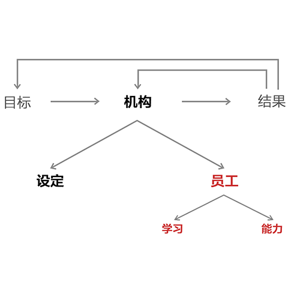

**... 111) Remember that when it comes to assessing people, the two biggest mistakes are being overconfident in your assessment and failing to get in synch on that assessment. Don’t make those mistakes.**

**... 111) 记住，在评估员工时最常犯的两个错误是：对于评估结果过于自信；对于评估结果意见无法达成一致。不要犯这两个错误。**

**111a) Get in synch in a non-hierarchical way regarding assessments.** The greatest single discrepancy between a manager and a managee is how well each performs his job. In most organizations, evaluations run in only one direction, with the manager assessing the managee. The managee typically disagrees with the assessment, especially if it is worse than the employee’s self-assessment, because most people believe themselves to be better than they really are. Managees also have opinions of managers that in most companies they wouldn’t dare bring up, so misunderstandings and resentments fester. This perverse behavior undermines the effectiveness of the environment and the relationships between people. It can be avoided by getting in synch in a high-quality way.

**111a) 针对评估争取意见一致时，要以非等级的方式来进行。**管理者与被管理者之间最大的不同在于他们的工作能力差异。大多数公司只开展单向的评估，即管理者评估被管理者。通常情况下，管理者们都不会同意评估的结论，尤其是当结论要比自己的自我评定差时，大多数人的自我感觉都要比其真实情况更良好。而在大多数公司，被管理者即便对管理者有意见，也不敢提出来。于是，误解和埋怨开始滋生。这种不合常理的行为损害了工作环境及员工关系，但却可以通过有效争取意见一致来避免。

**111b) Learn about your people and have them learn about you with very frank conversations about mistakes and their root causes.** You need to be clear in conveying your assessments and be open-minded in listening to people’s replies. This is so they can understand your thinking and you can open-mindedly consider their perspectives. So together you can work on setting their training and career paths. Recognizing and communicating people’s weakness is one of the most difficult things managers have to do. Good managers recognize that while it is difficult in the short term, it actually makes things easier in the long term, because the costs of having people in jobs where they can’t excel are huge. Most managers at other companies dodge being as open with assessments as we insist on; more typically, managers elsewhere tend to be less frank in conveying their views, which is neither fair nor effective.

**111b) 通过开展坦诚对话，讨论错误以及犯错的根源，来了解彼此。在说明自己的评估时，要清楚明确，在倾听别人的回答时，要没有成见。只有这样，你才能整理自己的思路，以开放的态度考虑别人的观点。**然后，你与被评估对象一起制定培养计划和职业道路。了解员工的弱点并对弱点进行沟通是管理者最难做的工作之一。优秀的管理者能够认识到，从短期来看，讨论弱点是很艰难的，但是从长远意义上来讲却能让事情发展的更顺利。如果将员工安排到他无法胜任的岗位上，代价是十分巨大的。大多数公司的管理者们都不像我们这样坚持对评估持开放态度，而且他们的管理者们不像我们这样坦诚地表达看法，但是他们这种做法既不公平又低效。

**... 112) Help people through the pain that comes with exploring their weaknesses.** Emotions tend to heat up during most disagreements, especially about someone’s possible weaknesses. Speak in a calm, slow, and analytical manner to facilitate communication. If you are calm and open to others’ views, they are less likely to shut down logical exchanges than if you behave emotionally. Put things in perspective by reminding them that their pain is the pain that comes with learning and personal evolution—they’re going to be in a much better place by getting to truth. Consider asking them to go away and reflect when they are calm, and have a follow-up conversation in a few days.

**... 112) 帮助人们渡过发现缺点的阵痛期。**人们在意见分歧时，通常会情绪激动，当讨论自己的缺点时，尤其是这样。此时，你需要缓慢冷静地作分析，促进有效沟通。如果你对别人的观点保持冷静、开放的态度，要比你表现的情绪化更能促进富有逻辑的交流。让他们正确看待评估，提醒他们，现在的痛苦是伴随着学习与个人成长的痛苦。了解真相之后，他们能够成为更好的自己。让他们冷静之后再做反思，几天之后再进行一次跟踪交流。

**... 113) Recognize that when you are really in synch with people about weaknesses, whether yours or theirs, they are probably true.** Getting to this point is a great achievement.When you reach an agreement, it’s a good sign you’re there. This is one of the main reasons why the person being evaluated needs to be an equal participant in the process of finding truth. So when you do agree, write it down on the relevant baseball card. This information will be a critical building block for future success.

**... 113) 要认识到，如果你就某人的弱点达成一致，不管是你的还是其他人的，这个弱点多半是事实。**如果能到达这一阶段，已经很不容易了。当你们达成一致时，就是成功的积极信号了。这也是为什么评估对象要同等参与到探索真相的过程当中来。将达成一致的事项标注在棒球记录卡上，作为构建未来成功的一个关键模块。

**... 114) Remember that you don’t need to get to the point of “beyond a shadow of a doubt” when judging people.** Instead, work toward developing a mutually agreed “by-and-large” understanding of someone that has a high level of confidence behind it. When necessary, take the time to enrich this understanding. That said, you should not aim for perfect understanding. Perfect understanding isn’t possible, and trying to get it will waste time and stall progress.

**... 114) 记住，在评价员工时，并不需要达到“不含一丝质疑”的程度。**与此相反，应该努力促成双方大体上达成一致的、信心程度较高的理解。在必要时，慢慢丰富这一理解。也就是说，你不需要完美地了解某人，也并不存在这种完美的了解，盲目追求只会浪费时间，拖慢进度。

**... 115) Understand that you should be able to learn the most about what a person is like and whether they are a “click” for the job in their first year.** You should be able to roughly assess someone’s abilities after six to 12 months of close contact and numerous tests and getting in synch about them. A more confident assessment so that you can make a more confident role assignment will probably take about 18 months. This timeline will of course depend on the job, the person, the amount of contact with that person, and how well you do it. As I explain in the section on design, the ratio of senior managers to junior managers as well as the ratio of managers to the number of people who work two levels below them should be small enough to ensure quality communication and mutual understanding. Generally, that ratio should not be more than 1:10, preferably more like 1:5\.

**... 115) 要知道，你是能够了解一个人的大部分特质的，也能够判断他们在第一年来时是否能够胜任工作。**经过6到12个月的密切接触，进行无数测试，不断讨论意见，你应该能够大概评估出某人的能力。如果想要获得一个更准确的评估，并据此来进行更为合理的工作安排，那么评估时间可能需要18个月。具体的时间受到工作岗位、评估对象、接触程度、评估水平的影响。我在机构设置部分已经提到，高级管理者与初级管理者、管理者与两级以下的被管理者之间的人数比例应该小到足以确保高质量沟通与相互理解。一般而言，此人数比例应该保持在1:10以下，最好是1:5。

**... 116) Continue assessing people throughout their time at Bridgewater**. You will get to know them better, it will help you train and direct them, and you won’t be stuck with an obsolete picture. Most importantly, assess what your people’s core values and abilities are and make sure they complement Bridgewater’s. Since core values and abilities are more permanent than skills, they are more important to ascertain, especially at Bridgewater. As mentioned, you should be able to roughly assess people’s abilities after six to 12 months of close contact and confidently assess them after 18 months.Don’t rest with that evaluation, however. Always ask yourself if you would have hired them for that job knowing what you now know. If not, get them out of the job.

**... 116) 在员工在桥水联合基金工作期间，持续对员工进行评估**。随着你对员工越来越了解，你就能更好地培训他们，领导他们，而不会被成见遮蔽双眼。最重要的是，你要评估员工的核心价值观和能力是否符合桥水基金的企业文化。如前所述，你应该能够通过6到12个月密切接触，完成对员工能力的基本评估，18月内能够对他们进行较为有信心的全面评估。但请不要止步于该评估。要不停地问自己，如果你提前了解了他们现在的情况，还会雇佣他们吗？如果答案是否定的，就不要让他们再继续现在的工作了吧。

**

... 100) 117) Train and Test People Through Experiences

... 100) 117) 通过实战经验来培训、测试员工。**

So…
因此：

**... 118) Understand that training is really guiding the process of personal evolution.** It requires the trainee to be open-minded, to suspend ego in order to find out what he is doing well and poorly, and to decide what to do about it. It also requires the trainer to be open- minded (and to do the other things previously mentioned) . It would be best if at least two believable trainers work with each trainee in order to triangulate views about what the trainee is like. As previously explained, the training should be through shared experiences like that of a ski instructor skiing with his student—i.e., it should be an apprentice relationship.

**... 118) 要知道，培训对个人成长过程起着指引作用。**培训对象需要开放思维，将自我暂且放到一边，了解自己擅长和不擅长的领域，决定下一步该如何做。当然，培训师也需要开放思想（还需按此前所述开展工作）。最佳状态是有至少两名可靠的培训师联合培养一名培训生，在讨论培训生情况时可形成三角状态。如前所述，培训需要通过共同经验来完成，就像滑雪教练与学员一起滑雪一样，培训师与培训生应该是师徒关系。

**... 119) Know that experience creates internalization.** A huge difference exists between memory-based “book” learning and hands-on, internalized learning. A medical student who has “learned” to perform an operation in his medical school class has not learned it in the same way as a doctor who has already conducted several operations. In the first case, the learning is stored in the conscious mind, and the medical student draws on his memory bank to remember what he has learned. In the second case, what the doctor has learned through hands-on experience is stored in the subconscious mind and pops up without his consciously recalling it from the memory bank. People who excel at book learning tend to call up from memory what they have learned in order to follow stored instructions. Others who are better at internalized learning use the thoughts that flow from their subconscious. The experienced skier doesn’t recite instructions on how to ski and then execute them; rather, he does it well “without thinking,” in the same way he breathes without thinking. Understanding these differences is essential.Remember that experience creates internalization. Doing things repeatedly leads to internalization, which produces a quality of understanding that is generally vastly superior to intellectualized learning.

**... 119) 经验能够内化知识。**基于记忆的书本学习与动手操作的内化学习之间差异显著。医学院的学生在学校课堂上学习做手术的方法和那些已经做过数次手术的医生的学习方法是不同的。前一种情况中的学习是存储于有意识的大脑之中的，医学院的学生通过记忆库来回想自己所学的知识；而后者医生通过实践经验学得的知识是存储于潜意识之中的，不需要有意识地从记忆库中获取就能下意识出现。那些书本知识学得好的人通过唤醒记忆中的知识来按照所存储的指令行事；那些善于内化学习的人则会利用自己的潜意识思维行事。滑雪老手不用一边背诵滑雪须知一边滑雪，他们不需要思考就能滑得很好，就像呼吸本不需要思考一样。理解两种学习模式之间的差异是非常重要的。要记住，经验能够内化，重复做某事能够内化知识，通过这种方式获得的知识理解往往要比理智化的学习过程质量更高。

> I believe that school overrates the importance of intellectualized learning. People who were terrific in school and very good at this type of learning tend to overvalue it, or at least fail to distinguish it from the experiential/internalized kind of learning. This lack of differentiation can become a great peril later in life. Many people who have had great academic success need to be mindful of this challenge, especially if their success has been in the “sciences,” such as math and engineering. I also believe this is why hands-on experience is particularly valuable for these types of people.
> 我认为学校过分推崇理智化的学习方式了。那些在学校表现优秀，擅长该学习方式的人总是过分重视理智化学习，或者至少没有看到理智化与经验/内化学习之间的差别。这种不加区分的理解有可能会为日后的人生埋下危机的种子。学校成绩优异的人要格外留意这些情况，理科成绩好的人，比如擅长数学或工程学的人，尤其是这样。这也是为什么我认为实践经验对于这些类型的人而言尤为重要。

**... 120) Provide constant feedback to put the learning in perspective.** Most training comes from doing and getting in synch about performance. Feedback should include reviews of what is succeeding and what is not in proportion to the actual situation rather than in an attempt to balance compliments and criticisms. You are a manager, and you want your machine to function as intended. For it do so, employees must meet expectations, and only you can help them to understand where they are in relation to expectations. As strengths and weaknesses become clearer, responsibilities can be more appropriately tailored to make the machine work better and to facilitate personal evolution. The more intensely this is done, the more rapid the evolutionary process will be. So you must constantly get in synch about employee performance.

**... 120) 正确对待学习，频繁提供反馈。**绝大多数的培训都是针对工作表现的讨论，旨在获得一致意见。反馈所包含的评估报告应该根据实际情况记录成败，而不是有意试图平衡赞美与批评。你是一个管理者，你乐意看到机制如设置好的那样运转。为此，员工必须达到预期，而你需要能够帮助他们认识到他们与预期之间的关系。随着员工的优缺点日渐明晰，为使机制工作的更顺畅，并进一步促进个人成长，工作分配应该为个人量身定做。这个过程进行的越彻底，员工成长会越迅速。因此，你必须经常讨论员工的工作表现，争取达成一致意见。

**... 121) Remember that everything is a case study.** Think about what it is a case of and what principles apply.

**... 121) 要记住，每件事都是一个案例。**思考这个案子说明了什么，应该适用哪些原则。

**... 122) Teach your people to fish rather than give them fish.** It is a bad sign when you tell people what they should do because that behavior typically reflects micromanagement or inability on the part of the person being managed. Instead, you should be training and testing. So give people your thoughts on how they might approach their decisions or how and why you would operate in their shoes, but don’t dictate to them. Almost all that you will be doing is constantly getting in synch about how they are doing things and exploring why.

**... 122) 授人以鱼不如授人以渔。**不要直接告诉你的员工该做什么，这是一个消极征兆，这种行为要么是典型的微观管理，要么就显示了被管理者的无能，你需要做的是培训和测试。告诉员工你认为他们可以怎样实现决策，或者如果你站在他们的立场上，会怎么处理这件事，为什么会这样做。但是千万不要命令他们做事，基本上你只需要频繁地过问他们进展的如何，探究他们工作状况背后的原因。

**... 123) Recognize that sometimes it is better to let people make mistakes so that they can learn from them rather than tell them the better decision.** However, since the connections between cause and effect can be misunderstood, providing feedback for these people is essential to the learning process.

**... 123) 要认识到，有时让人犯错并从中吸取教训要比直接告诉他们一个更好决定更明智。**有时因为原因和结果之间的关系很容易让人误解，为犯错的人提供反馈对于学习过程很重要。

**123a) When criticizing, try to make helpful suggestions.** Your goal is to help your people understand and improve, so your suggestions are important. Offering suggestions also helps those being criticized to understand that your goal is to help them and Bridgewater, not to hurt them.

**123a) 在批评时，要提一些有建设性的意见。**你的目的是帮助员工理解问题，提升自己，所以提建议是非常重要的。给那些受批评的人提建议也能让他们更好的理解你帮助他们和桥水基金的意图，批评不是为了中伤他人。

**123b) Learn from success as well as from failure.** Point out examples of jobs that are well done and the causes of success. This reinforces good behavior and creates role models for those who are learning.

**123b) 从成功中学习，也要从失败中学习。**要对出色的工作表现提出表扬，并分析其原因。对良好品行进行强化，为学习者树立榜样。

**... 124) Know what types of mistakes are acceptable and unacceptable, and don’t allow the people who work for you to make the unacceptable ones.** When considering what failures you are willing to allow in order to promote learning through trial-and-error, weigh the potential damage of a mistake against the benefit of incremental learning. In defining what latitude I’m willing to give people, I say, “I’m willing to let you scratch or dent the car, but I won’t put you in a position where I think there’s a significant risk you could total it.”

**...124) 分清哪些错误是可以接受的，哪些是不能接受的。不要让员工犯不可接受的错误。**你需要允许一些失败来促进尝试错误方式的学习，判断哪些错误是可以容忍的，要权衡该错误的潜在伤害及其给渐进式学习带来的益处。在讨论我对员工的犯错容忍度时，我总是这样表述，“我能允许你刮花或撞凹一辆车，但是我不会让你身处可能撞坏整辆车的境地。”

**... 125) Recognize that behavior modification typically takes about 18 months of constant reinforcement.** The first step is intellectualizing the best way of doing things. If you’re out of shape you must understand that you are out of shape, you must want to get in shape, and you must understand the way to get in shape: “I want to be fit by eating well and exercising.” Then the intellect will fight with desires and emotions. With determination, the intellect will overcome the impediments to doing what’s necessary to achieve the goal, and the desired behavior will occur. After doing that consistently for 18 months, the new behavior will be internalized.

**... 125) 要认识到，一般需要18个月持续不断的巩固才能实现行为矫正。**首先，要将最佳方案理智化。如果你身材走样，你必须知道自己身材走样了，你得想变得身材更好，了解塑身的方法。“我想要通过合理膳食和加强锻炼来塑身。”之后，理智会与欲望和情感作斗争。坚定意志，理智最终会冲破障碍，行动起来达成目标，那么预期行为就会出现。如此坚持18个月，新的行为模式就会被内化。

**... 126) Train people; don’t rehabilitate them.** Training is part of the plan to develop people’s skills and to help them evolve. Rehabilitation is the process of trying to create significant change in people’s values and/or abilities. Since values and abilities are difficult to change, rehabilitation typically takes too long and is too improbable to do at Bridgewater. If attempted, it is generally best directed by professionals over extended periods of time. People with inappropriate values and inadequate abilities to meet their job requirements have devastating impacts on the organization. They should be properly sorted (see the principles section on sorting) .

**...126) 培训员工，而不是改造员工。**培训作为培养员工技能计划的一部分，旨在帮助他们成长。而改造则是试图就员工的价值观和能力进行重大调整。价值观和能力是很难改变的，因此在桥水联合基金，改造需要耗费的时间太长，也不太可能实现。如果的确要进行改造，最好是由专业人士来指导，需要另外延长期限来完成。如果安排那些价值观和能力与职位要求不相适应的人来做某项工作，那么对公司将产生破坏性影响。因此，应对员工进行合理分类（参见关于分类的部分）。

**126a) A common mistake: training and testing a poor performer to see if he or she can acquire the required skills without simultaneously trying to assess their abilities.** Skills are readily testable, so they should be easy to determine. Knowing them is less important than knowing people’s abilities. That makes picking people with the right skills relatively easy. Abilities, especially right-brained abilities, are more difficult to assess. When thinking about why someone is a poor performer, openly consider whether it is a problem with their abilities. Values are the toughest and take the longest to assess.

**126a) 常见错误:培训和测试测表现糟糕的员工来察觉他们是否掌握所需技能而不去尝试评估他们的能力。技能是很容易被测试的，所以技能应该很容易被判断。知道人们的技能没有知道人们的能力那么重要，这使得挑选有合适技能的人相对来说比较容易**。而能力，尤其是右脑思维能力，却是很难评估的。当你思索为什么某人工作表现不佳时，不妨考虑一下他们是否能力欠缺。价值观是最难评估的，也需要花费最长的时间评估。

**... 127) After you decide “what’s true” (i.e., after you figure out what your people are like) , think carefully about “what to do about it.”As mentioned before, it’s important to separate thinking about “what’s true” and thinking about “what to do about it.”** Figuring out what’s true takes time—often several months filled with a large sample size. Figuring out what to do about it (i.e., designing) is much faster—typically hours or days—but it isn’t instantaneous. Too often people either jump to decisions or don’t make them.

**... 127) 在找到真相之后（即了解到员工的真实情况），谨慎思考下一步该做什么。**如前所述，应该将“真实情况是怎样”与“下一步该怎么做”区分开，这十分重要。找到真相需要时间，通常需要几个月的时间，以及一个较大的样本容量。而分析下一步该做什么，也就是进行分工设置，需要的时间却短得多，大概需要几个小时或几天就足够了，但这并不是一蹴而就的。人们往往草率决定或者根本不做决定。

**

... 128) Sort People into Other Jobs at Bridgewater, or Remove Them from Bridgewater

... 128) 在桥水基金内部进行换岗，或将其解除雇佣**

So…
因此：

**... 129) When you find that someone is not a good “click” for a job, get them out of it ASAP.** If you are expecting/wishing people to be much better in the near future than they have been in the past, you are making a serious mistake—instead, sort the people. People who repeatedly operated in a certain way probably will continue to operate that way because that behavior reflects what they’re like. Since people generally change slowly (at best) , you should expect slow improvement (at best) , so instead of hoping for improvement, you need to sort the people or change the design to supplement them. Since changing the design to accommodate people’s weaknesses is generally a bad idea, it is generally better to sort the people.

**... 129) 一旦发现某人不能胜任工作，尽快将其调离该职位。**如果你期望某人能够在不远的将来比过去做得好很多，多半是痴心妄想。与此相反，请筛选员工。以某种方式重复性做事的人在将来也会持续以这种方式来做事，因为人的行为反应了他们的偏好。因为人们一般发生改变的速度很慢（如果能发生改变的话），因此你也只能期待有缓慢的进步（如果能有进步的话）。与其指望员工进步，不如将其进行筛选，或者改变分工设置来弥补他们的不足。为了弥补员工的不足而改变设置一般不是一个明智的做法，最好还是对员工进行筛选。

Sometimes good people “lose their boxes” because they can’t evolve into responsible parties soon enough. Either there is a problem with their qualities or it will take too long to train them well. Some of these people might be good at another position within Bridgewater. Remember that identifying failure and learning from it are part of the evolutionary process. Make sure you record the reasons on the relevant “baseball card” and think about what a good next step would be for that individual.

有时，如果无法快速成长为负责人，一些表现良好的员工也可能丢掉其岗位。这可能是因为他们能力欠缺，或者培训他们所花的时间过长，这些人在桥水基金可能能够胜任其他的工作。要记住，承认失败，从中吸取经验教训是成长的必经之路。确保你在相关的棒球记录卡上记下了问题的原因，再思考针对每个员工，下一步该做出什么决定。

**... 130) Know that it is much worse to keep someone in a job who is not suited for it than it is to fire someone.** Don’t collect people. Firing people is not a big deal—certainly nowhere near as big a deal as keeping badly performing people, because keeping a person in a job they are not suited for is terrible both for the person (because it prevents personal evolution) and our community (because we all bear the consequences and it erodes meritocracy) . Consider the enormous costs of not firing someone unsuited for a job: the costs of bad performance over a long time; the negative effect on the environment; the time and effort wasted trying to train the person; and the greater pain of separation involved with someone who’s been here awhile (say, five years or more) compared with someone let go after just a year.

**... 130) 勉强将某人留在不合适的职位上要比将其开除更糟糕。不要勉强留人。**开除员工并不是什么大不了的事情，强行留住表现不佳的员工造成的影响要大得多。因为勉强将某人留在其不适合的岗位上既有碍员工成长又会给公司带来不良后果，侵蚀公司能力至上的原则。思考这些勉强留人的成本吧，包括长期业绩不佳的成本，对环境造成的负面影响，试图培训此人造成的时间和精力浪费。而且，开除某个在公司供职长久的人（5年或更长）带来的分离之苦要远胜于开除一个才来了一年的人。

**... 131) When people are “without a box,” consider whether there is an open box at Bridgewater that would be a better fit. If not, fire them.** Remember that we hire people not to fill their first job at Bridgewater nor primarily for their skills. We are trying to select people with whom we’d like to share our lives. We expect everyone to evolve here. Because managers have a better idea of people’s strengths and weaknesses and their fit within our culture than what emerges from the interview process, you have invaluable information for assessing them for another role at Bridgewater.

**... 131) 当员工没有岗位时，思考桥水公司内部是否还有更适合的岗位。如果没有，应该将该员工开除。**记住，我们雇佣员工不是想给他们在桥水基金找到第一份工作，也不会将他们的技能作为第一考虑。我们想要挑选那些我们愿意与之分享人生的人。我们希望每个人都能在这里成长。管理者比面试官更为了解员工的优缺点以及他们是否能够融入我们的企业文化。因此，你拥有关于该员工的宝贵信息，能够衡量其在桥水是否还有其他合适的职位。

**... 132) Do not lower the bar.** If a person can’t operate consistently with our requirements of excellence and radical truth and can’t get to the bar in an acceptable time frame, they have to leave. We want to neither lower the bar nor enter into a long-term rehabilitation program.

**... 132) 不要降低标准。**如果某人无法达到我们关于优秀与极度真实的标准，在可接受的时间框架内也无法达标，那么他们就必须离开。我们不愿意降低标准，也不愿意进行长期的改造工程。

### To Perceive, Diagnose, and Solve Problems…
发现、诊断、解决问题

**

... 133) Know How to Perceive Problems Effectively

... 133) 懂得如何有效发现问题**

So…
因此：

**... 134) Keep in mind the 5-Step Process explained in Part 2.**

**... 134) 时刻牢记在第二部分阐释过的五步流程。**

**... 135) Recognize that perceiving problems is the first essential step toward great management.** As in nature, if you can’t see what’s happening around you, you will deteriorate and eventually die off. People who can 1) perceive problems; 2) decide what to do about them; and 3) get these things done can be great managers.

**... 135) 要认识到，发现问题是优秀管理的第一步。**在大自然的环境中，如果你没有办法观察到周遭发生的事情，那么你将十分危险，最终自取灭亡。那些能够发现问题、决定如何处理问题、并执行解决方案的人才能成为优秀的管理者

**... 136) Understand that problems are the fuel for improvement.** Problems are like wood thrown into a locomotive engine, because burning them up—i.e., inventing and implementing solutions—propels us forward. Problems are typically manifestations of root causes, so they provide clues for getting better. Most of the movement toward excellence comes from eliminating problems by getting at their root causes and making the changes that pay off repeatedly in the future. So finding problems should get you excited because you have found an opportunity to get better.

**... 136) 要理解，问题是提升的动力。**问题就像木头投入了火车头发动机中一样，因为燃烧这些木头 —— 例如:创造和执行解决方案 —— 推动我们进步。问题通常是根源的表现形式，他们能够提供一些线索，让我们有所提升。分析问题的根源，彻底消除问题，进而做出改变，在未来能够重复获得回报，这一过程加快了我们向卓越迈进的步伐。因此，发现问题应该让你兴奋，因为这意味着你又找到一个提升自己的机会了。

**... 137) You need to be able to perceive if things are above the bar (i.e., good enough) or below the bar (i.e., not good enough) , and you need to make sure your people can as well.** That requires the ability to synthesize.

**... 137) 你需要观察事情是在预期之上还是在预期之下，确保你的员工也有此观察力。**这需要整合的能力。

**... 138) Don’t tolerate badness.** Too often I observe people who observe badness and tolerate it. Sometimes it is because they don’t have the courage to make the needed changes, and sometimes it is because they don’t know how to fix it. Both are very bad. If they’re stuck, they need to seek the advice of believable people to make the needed changes, and if that doesn’t work, they need to escalate.

**... 138) 不要容忍问题。**我经常看到一些人明明已经发现了问题，却对其放任。可能是因为他们没有勇气做出所需的改变，也可能是因为他们不知道怎么改，这两种情况都很糟糕。如果他们不知所措，那么就应该寻求靠谱的人的意见，做出相应改变。如果不行，他们就需要将问题升级。

**... 139) “Taste the soup.”** A good restaurateur constantly tastes the food that is coming out of his kitchen and judges it against his vision of what is excellent. A good manager needs to do the same.

**... 139) “品尝汤的味道”。** 一个称职的餐馆老板会经常尝一尝自己厨房做出的食物，然后以自己的品味来判断菜品是不是好吃。同理，一个好的管理者也需要这样。

**... 140) Have as many eyes looking for problems as possible.** Encourage people to bring problems to you and look into them carefully. If everyone in your area feels responsible for the well -being of that area and feels comfortable speaking up about problems, your risks of overlooking them will be much less than if you are the only one doing this. This will help you perceive problems, gain the best ideas, and keep you and your people in synch.

**... 140) 找尽可能多的人手一起来发现问题。**鼓励员工向你提交问题，同时你需要认真研究这些问题。如果公司每一个员工都认为自己对公司的成长负有责任，愿意坦诚地将问题说出来，这要比你独自发现问题好得多，更不容易忽略问题。这一过程能够帮助你发现问题，吸取最好的观点，帮助你和你的员工达成意见一致。

**140a) “Pop the cork.”** It’s your responsibility to make sure that communications from your people are flowing freely.

**140a) “拔出瓶塞。”** 确保员工交流畅通无阻是你的责任。

**140b) Hold people accountable for raising their complaints.** Ask yourself: 1) does someone think there’s something wrong; 2) did this lead to a proper discussion; and 3) if they felt raising the issue didn’t lead to the proper response, did they escalate it? That’s how it should be.

**140b) 将投诉作为员工义务来进行。**问一问自己：1）是否有人认为有事情出错；2）这一问题是否能展开适当的讨论；3）如果他们认为提出问题之后并不会针对问题进行讨论，那他们会将问题升级吗？基本上就是这样。

**140c) The leader must encourage disagreement and be either impartial or open-minded.**

**140c) 领导者必须鼓励不同意见，不偏不倚，思想开放。**

**140d) The people closest to certain jobs probably know them best, or at least have perspectives you need to understand, so those people are essential for creating improvement.**

**140d) 与某项工作接触最密切的人应该最了解该项工作，或者至少有值得你借鉴的观点。因此，这些人对于促进提升是很重要的。**

**... 141) To perceive problems, compare how the movie is unfolding relative to your script**—i.e., compare the actual operating of the machine and the outcomes it is producing to your visualization of how it should operate and the outcomes you expected. As long as you have the visualization of your expectations in mind to compare with the actual results, you will note the deviations so you can deal with them. For example, if you expect improvement to be within a specific range…

**... 141) 参照你的剧本，比较电影情节的发展，通过这种方式来发现问题。**观察机制的实际运行与其产出的实际效果，将其与你预期的运行方式和结果相比较。只要将你脑海中的预期的具体表述与实际结果对比一下，你就会发现二者之间的出入，从而做出修正。比如，如果你的预期提升是在一个特定范围内的，那么……

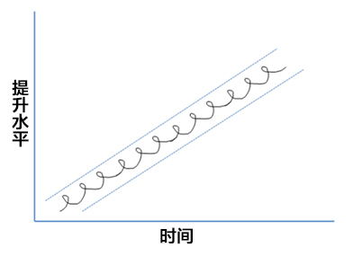

… and it ends up looking like this …

… 最终将变成这样 …

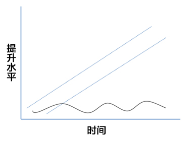

… you will know you need to get at the root cause to deal with it. If you don’t, the trajectory will probably continue.

你会意识到，你需要解决根源来处理问题，否则，前进的轨迹将无法继续。

**... 142) Don’t use the anonymous “we” and “they,” because that masks personal responsibility—use specific names.** For example, don’t say “we” or “they” handled it badly. Also avoid: “We should...” or “We ar...”Who is “we”? Exactly who should, who made a mistake, or who did a great job? Use specific names. Don’t undermine personal accountability with vagueness. When naming names, it’s also good to remind people of related principles like “mistakes are good if they result in learning.”

**... 142) 不要使用模糊的人称“我们”或“他们”，这样做会掩盖个人责任。请使用具体人名。**比如，不要说“我们”或“他们”做的很糟糕。同时也要避免说，“我们需要……”或者“我们是……”这样的句子。到底谁是“我们”？到底是谁需要？谁犯错？又是谁干的好？请使用具体的名字。不要用模糊表述掩盖了个人的责任。在点名时，最好能够提醒被点名的人“犯错能促进学习，是好事。”这样的原则。

**... 143) Be very specific about problems; don’t start with generalizations.** For example, don’t say, “Client advisors aren’t communicating well with the analysts.”Be specific: name which client advisors aren’t doing this well and in which ways. Start with the specifics and then observe patterns.

**... 143) 具体问题要具体对待，不要一开始就过于宽泛。**比如，不要说，“客户顾问没有与分析师进行很好的沟通。”请更具体一些，指出是哪些客户顾问没有做好，为什么说他们没有做好。先从具体问题下手，再试图观察模式。

**... 144) Tool: Use the following tools to catch problems: issues logs, metrics, surveys, checklists, outside consultants, and internal auditors.**

**... 144) 工具：使用以下工具来捕捉问题：问题日志、计量图表、调查问卷、清单、外部咨询，以及内部审计。**

1) Issues log: A problem or “issue” that should be logged is easy to identify: anything that went wrong. The issues log acts like a water filter that catches garbage. By examining the garbage and determining where it came from, you can determine how to eliminate it at the source. You diagnose root causes for the issues log the same way as for a drilldown (explained below) in that the log must include a frank assessment of individual contributions to the problems alongside their strengths and weaknesses. As you come up with the changes that will reduce or eliminate the garbage, the water will become cleaner. In addition to using issues logs to catch problems, you can use them to measure the numbers and types of problems, and they can therefore be effective metrics of performance. A common challenge to getting people to use issues logs is that they are sometimes viewed as vehicles for blaming people. You have to encourage use by making clear how necessary they are, rewarding active usage, and punishing non-use. If, for example, something goes wrong and it’s not in the issues log, the relevant people should be in big trouble. But if something goes wrong and it’s there (and, ideally, properly diagnosed) , the relevant people will probably be rewarded or praised. But there must be personal accountability.

问题日志：分辨哪些问题应该被记下来很容易，即记下所有出错的地方。问题日志就像阻拦垃圾的水过滤器一样，通过检查垃圾，查找来源，决定如何从源头清除这些垃圾。在问题日志中找寻问题的根源需要开展深度探讨（后详）。在日志中，应该如实记录个人对问题的贡献率，旁边标注该人的优缺点。随着你不断做出改变，水中的垃圾会随之减少甚至消失，水质会变得更好。除了使用问题日志来捕捉问题，你还是可以用它来记录问题的数量和类别，之后可以作为有效的工作表现计量。在使用问题日志时，最大的一个障碍就是人们认为问题日志是责备员工的工具。你应该明确问题日志的必要性，奖励积极使用的行为，惩罚不使用的行为，以此鼓励员工使用。如果出问题了，但是该问题却没有在日志中显示，那么相关人员应该有大麻烦。但是如果问题在日志中已经有所记录（理想状态下已经有了正确的诊断），相关人员就应该被奖励或表扬。总之，一定要向个人问责。

2) Metrics: Detailed metrics measure individual, group, and system performance. Make sure these metrics aren’t being “gamed” so that they cease to convey a real picture. If your metrics are good enough, you can gain such a complete and accurate view of what your people are doing and how well they are doing it that you can nearly manage via the metrics. However, don’t even think of taking the use of metrics that far! Instead, use the metrics to ask questions and explore. Remember that any single metric can mislead. You need enough evidence to establish patterns. Metrics and 360 reviews reveal patterns that make it easier to achieve agreement on employees’ strengths and weaknesses. Of course, the people providing the information for metrics must deliver accurate assessments. There are various ways to facilitate this accuracy. A reluctance to be critical can be detected by looking at the average grade each grader gives; those giving much higher average grades might be the easy graders. Similarly helpful are “forced rankings,” in which people must rank coworker performance from best to worst. Forced rankings are essentially the same thing as “grading on a curve.” Metrics that allow for independent grading across departments and/or groups are especially valuable.

计量图表：详细的计量图表能够有效衡量个人、团队和系统的表现。确保图表里的数据没有被篡改，能够显示真实情况。如果你的图表足够准确全面，那么你就能够清楚看到你的员工在做什么事，业绩如何，你甚至可以通过图表来进行管理。但是，不要过度使用图表，妄图实现一切。你需要观察图表，提问题，分析问题。记住，任何一个单一的图表都能带来误解。你需要收集足够多的证据来建立模式。计量图表和360度全息图能够揭示模式，记录员工优缺点，为各方达成一致意见带来方便。当然，为图表提供数据的人必须给出准确的评估，促进评估准确性的方式多种多样。如果想要检测评分者是不是愿意以批判的眼光在做评估，可以看看每个评分者给出的平均分。如果平均分给的过高，则说明评分者太宽容。还有一个类似有效的工具：强迫排序。员工必须对所有的同事表现进行排序，由最好的排到最差的。这种被迫排序和曲线评分方式相似。能够对各部门、各团队进行独立打分的图表是最有价值的。

3) Surveys (of workers and of customers) .

调查问卷（包括员工调查问卷和客户调查问卷）。

**... 145) The most common reason problems aren’t perceived is what I call the “frog in the boiling water” problem.** Supposedly, if you throw a frog in a pot of boiling water it will immediately jump out. But if you put a frog in room-temperature water and gradually bring the water to a boil, the frog will stay in place and boil to death. There is a strong tendency to get used to and accept very bad things that would be shocking if seen with fresh eyes.

**... 145) 最常见的无法观察到原因的问题是“温水煮青蛙”问题。**如果你将一只青蛙扔进滚烫的水里，它会立即跳出来。但是如果你把青蛙放进室温下的水里，然后将水逐渐加热至沸腾，青蛙就是一直待在原地不动，直到被烫死。有一种很强的趋势去习惯和接受以第一次眼光来看待非常令人震惊的坏的事情。

**... 146) In some cases, people accept unacceptable problems because they are perceived as being too difficult to fix. Yet fixing unacceptable problems is actually a lot easier than not fixing them, because not fixing them will make you miserable.** They will lead to chronic unacceptable results, stress, more work, and possibly get you fired. So remember one of the first principles of management: you either have to fix problems or escalate them (if need be, over and over again) if you can't fix them. There is no other, or easier, alternative.

**... 146) 在某些情况下，因为某些问题实在难以解决，人们不得不接受那些不可接受的问题。但是，解决那些不可接受的问题其实要比不解决它们更容易，因为不解决它们，将后患无穷。**这些问题会带来长期无法让人忍受的结果、压力、更多工作，甚至可能让你被开除。记住管理的首要原则之一：要么解决问题，解决不了就要升级问题，如果需要的话，甚至可以循环往复进行。没有比这更好的替代方案了。

**146a) Problems that have good, planned solutions are completely different from those that don’t.** The spectrum of badness versus goodness with problems looks like this:

**146a) 已经拥有有效周密的解决方案的问题与那些没有解决方案的问题天差地别。**问题好坏的级别划分如下：

a) They’re unidentified (worst) ;

没有被发现（最坏）；

b) Identified but without a planned solution (better) ;

发现了但是没有解决方案（稍好）；

c) Identified with a good, planned solution (good) ; and

找到了周密有效的解决方案（很好）；

d) Solved (best) .

得以解决（最好）。

However, the worst situation for morale is the second case: identified but without a planned solution. So it’s really important to identify which of these categories the problem belongs to.

然而，第二种情况却总容易打击员工积极性，那就是发现了问题但是没有解决方案。因此，将问题进行以上分类至关重要。

**

... 147) Diagnose to Understand What the Problems Are Symptomatic Of

... 147) 通过诊断分析来理解问题症结所在**

So…
因此：

**... 148) Recognize that all problems are just manifestations of their root causes, so diagnose to understand what the problems are symptomatic of.** Don’t deal with your problems as one-offs. They are outcomes produced by your machine, which consists of design and people. If the design is excellent and the people are excellent, the outcomes will be excellent (though not perfect) . So when you have problems, your diagnosis should look at the design and the people to determine what failed you and why.

**... 148) 要认识到所有问题只是其根本原因的表征，所以要通过诊断分析来理解问题症结所在。**不要以为可以一次性解决问题。问题是机制的产物，而机制由其设置和人员构成。如果设置和人员都没问题，那结果肯定也不错（尽管不完美）。所以当你遇到问题时，应该分析设定和人员，以此确定造成失败的原因。

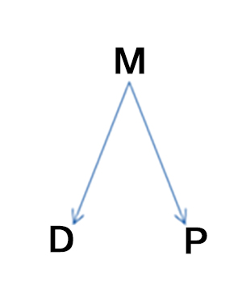

**... 149) Understand that diagnosis is foundational both to progress and quality relationships.** An honest and collaborative exploration of problems with the people around you will give you a better understanding of why these problems occur so that they can be fixed. You will also get to know each other better, be yourself, and see whether the people around you are reasonable and/or enforce their reasonableness. Further, you will help your people grow and vice versa. So, this process is not only what good management is; it is also the basis for personal and organizational evolution and the way to establish deep and meaningful relationships. Because it starts and ends with how you approach mistakes, I hope that I have conveyed why I believe this attitude about and approach to dealing with mistakes is so important.

**... 149) 要明白诊断分析是发展公司和建立良好人际关系的基础。**和员工一同秉承诚实和协作的精神探究问题，这能让你更好地理解问题产生的原因，进而解决问题。与此同时，也能和员工之间增进相互理解，展现自己，观察员工是否通情达理、办事妥当，你们也可以在相互帮助中获得成长。这个过程不仅仅是一种良好的管理方式，更是员工与公司成长的基础，是建立深厚人际关系的必经之路。因为整个过程始于并且结束于你处理问题的方式，这也是为什么我认为这种对待错误的态度和解决问题的方法至关重要。

**... 150) Ask the following questions when diagnosing.** These questions are intended to look at the problem (i.e., the outcome that was inconsistent with the goal) as a manifestation of your “machine.” It does this first by examining how the responsible parties imagined that the machine would have worked, then examining how it did work, and then examining the inconsistencies. If you get adept at the process, it should take 10 to 20 minutes. As previously mentioned, it should be done constantly so that you have a large sample size and no one case is a big deal.

**... 150) 诊断分析时要问自己以下几个问题。**这些问题会引导你将困难（即和目标不一致的结果）视作“机制”的外在表现。首先，你需要了解负责人对于机制运行成效的期待，然后审视机制的运作过程，最后检查出现的问题。一旦你熟悉了这个流程，只需10到20分钟就可以完成这些步骤。如前所述，你应经常重复该流程，累积大量案例，这样解决单个难题就不在话下了。

1) Ask the person who experienced the problem: What suboptimality did you experience?

询问经历过这种问题的人：你有过哪些次佳体验?

2) Ask the manager of the area: Is there a clear responsible party for the machine as a whole who can describe the machine to you and answer your questions about how the machine performed compared with expectations? Who owns this responsibility?

2) 询问该领域的管理者：机制有无明确的负责人，该人是否能向你描述机制，告诉你机制相比预期表现如何，并为整体机制负责？负责人是谁？

> Do not mask personal responsibility—use specific names.
> 不要模糊个人责任,要落实到人。

3) Ask the responsible party: What is the “mental map” of how it was supposed to work?

3) 询问负责人：关于机制运行预期的思维蓝图是什么样的？

4) Ask the owner of the responsibility: What, if anything, broke in this situation? Were there problems with the design (i.e., who is supposed to do what) or with how the people in the design behaved?

4) 询问负责人：问题出在哪里？是机制设定（即谁应该做什么）？还是人员在此种机制设定下的表现？

*   Compare the mental map of “what should have happened” to “what did happen” in order to identify the gap.
    将思维蓝图中给出的“未来期望”同“现实情况”相对比，找出其中的差距。

*   If the machine steps were followed, ask, “Is the machine designed well?” If not, what’s wrong with the machine?
    若机制中规定的步骤都有执行，那要问，该机制的设定是否合理？如若不然，又存在哪些问题？

5) Ask the people involved why they handled the issue the way they did. What are the proximate causes of the problem (e.g., “Did not do XYZ”) ? They will be described using verbs—for example, “Harry did XYZ.” What are the root causes? They will be descriptions. For example: inadequate training/experience, lack of vision, lack of ability, lack of judgment, etc. In other words, root cause is not an action or a reaction—it is a reason.

5) 询问相关人员为什么选择用这种方式处理问题。该问题的直接原因有哪些（比如，没有做某件事）？直接原因会以动词形式出现--比如，“哈利做了某事”。根本原因是什么？根本原因应以描述形式出现。例如：缺少培训或是经验，缺乏远见，能力不足，判断失误等。换句话说，根本原因不是行为也不是反应--而是原因。

*   Be willing to touch the nerve.
    敢于得罪人。

6) Ask the people involved: Is this broadly consistent with prior patterns (yes/no/unsure) ? What is the systematic solution? How should the people / machines / responsibilities evolve as a result of this issue?

6) 询问相关人员：该问题是否和以前的惯例不符（是、否、不确定）？系统性解决方案是什么？从此问题看出人员、设计、职责方面需要哪些改进？

*   Confirm that the short-term resolution of the issue has been addressed.
    确认己提出针对该问题的短期解决方案。

*   Determine the steps to be taken for long-term solutions and who is responsible for those steps. Specifically:
    决定长期解决方案的执行步骤以及执行负责人。尤其是：

a) Are there responsibilities that need either assigning or greater clarification?

a) 需要指派或进一步明确任务么？

b) Are there machine designs that need to be reworked?

b) 需要改进机制设定么？

c) Are there people whose fit for their roles needs to be evaluated?

c) 需要评估人员和岗位匹配度么？

**... 151) Remember that a root cause is not an action but a reason.** It is described by using adjectives rather than verbs. Keep asking “why” to get at root causes, and don’t forget to examine problems with people. In fact, since most things are done or not done because someone decided to do them or not do them a certain way, most root causes can be traced to specific people, especially “the responsible party.” When the problem is attributable to a person, you have to ask why the person made the mistake to get at the real root cause, and you need to be as accurate in diagnosing a fault in a person as you are in diagnosing a fault in a piece of equipment.

**... 151) 要谨记根本原因不是行为而是原因。**根本原因通常用形容词而不是动词来描述。要追溯根本原因，就要不停地问“为什么”，并检视人员方面出现的问题。事实上，大多数事情是由某人来决定是否以某种方式处理，所以绝大多数问题的根本原因都可以追究到具体的人特别是“负责人”身上。一旦将问题归结到个人，你就必须要问为什么这个人会犯错，这样才能找到真正的根本原因。你需要像诊断设备故障一样准确地诊断一个人犯的错误。

For example, a root cause discovery process might proceed like this:

比如，寻找根本原因的流程可能如下：

-“The problem was due to bad programming.”

- “该问题源于不良编程。”

-“Why was there bad programming?”

- “为什么编程不良？”

-“Because Harry programmed it badly.”

-“因为哈里没把程序编写好。”

-“Why did Harry program it badly?”

-“为什么哈里没把程序编好？”

-“Because he wasn’t well trained and because he was in a rush.”

-“因为他没经过良好培训，而且程序写得太急了。”

-“Why wasn’t he well trained? Did his manager know that he wasn’t well trained and let him do the job anyway, or did he not know?”

-“为什么他没经过良好培训？他的上司在知道哈里没经过培训的情况下还让他负责这项工作，还是不知情？”

Ultimately it will come down to what the people or the design is like.

根本原因最终会归结到人员或者设定方面。

**... 152) Identify at which step failure occurred in the 5-Step Process.** If a person is chronically failing it is due to either lack of training or lack of ability. Which was it? At which of the five steps did the person fail? Different steps require different abilities.

**... 152) 找出五步流程中哪一步失败了。**如果一名员工总是失败，那要么是因为他缺少培训，要么是没能力。是哪个方面的问题？是五步中的哪一步失败了？不同的步骤需要人员具备不同的能力。

1.  _Setting goals_: This requires _big-picture thinking_, vision, and _values that are consistent with those of our community_. (It is helpful to ask whether the responsible party lost sight of the goals or whether he or she set goals that are inconsistent with Bridgewater’s.)
    _设立目标_：该步骤要求人员有全局观、_远见_、_以及和我们团体一致的价值观_。（询问责任方是否忽略了目标，设立的目标是否同桥水联合基金的目标不一致。）

2.  _Perceiving problems_: This requires _perception_, _the ability to synthesize_, and an _intolerance of badness_ (i.e., some people see badness but aren’t sufficiently bothered by it to push themselves to eliminate it) . Of course, having perspective (typically gained via experience) helps at all steps.
    _发现问题_：该步骤要求人员有_洞察力_，_综合信息的能力_，以及_对问题零容忍_（有些人看到问题但觉得没什么，也没有动力去解决问题）当然，有远见（通常从经验中获得）对所有步骤都有帮助。

3.  _Diagnosis_: This requires logic, _assertiveness_, and _open-mindedness_. _You must be willing to have open_ _and/or difficult discussions to get at the truth._
    _诊断分析_：该步骤要求人员_逻辑清晰_，_做事果断_，思想开明。必须要能够通过开诚布公的讨论来寻找真相，尽管有时讨论很困难。

4.  Design: This requires creativity and practical visualization.
    设定：该步骤要求人员有创造力和形象化能力。

5.  Doing the tasks: This requires determination and self-discipline.
    执行任务：该步骤要求人员有决断力和自我约束力。

If you 1) identify at which of these steps the chronic failures are occurring and 2) see which, if any, of these abilities the person is short of, you will go a long way toward diagnosing the problem.
如果你1）找出哪一步经常出现问题；2）判断人员缺乏哪种能力，那么你在诊断分析问题方面就已经迈出了一大步。

**... 153) Remember that a proper diagnosis requires a quality, collaborative, and honest discussion to get at the truth.** Don’t just give your verdict without exploring the mistake, because there’s a reasonably high probability that you don’t know the answer. Do not be arrogant. You might have a theory about what happened, and that theory should be explored with relevant others. If you and others are open-minded, you will almost certainly have a quality analysis that will give everyone working theories to explore or you will reach conclusions that can be used for the design phase. And if you do this whenever problems recur, you and others involved will eventually uncover the root causes.

**... 153) 要做好诊断分析，需要深入讨论，共同协作，态度诚恳，只有这样才能触及问题真相。**切忌不分析问题就妄下结论，因为你很可能不知道问题的原因所在。不要骄傲自大。你可能对于发生的问题有自己的分析判断，但也应该和他人共同讨论验证自己的想法。如果你和其它人都保持开放的心态，便能进行深入分析，让所有人去寻找行之有效的方案，或是你自己最后达成结论，并将其用于设定阶段。这样一来，无论何时再发生问题，你和其它参与过讨论的人最终都能找到根本原因所在。

**... 154) Keep in mind that diagnoses should produce outcomes.** Otherwise there’s no purpose in them. The outcome might not take the form of an agreement, but at a minimum it should take the form of theories about root causes (which should be written down so you have a collection of synthesized dots to use for identifying patterns) and clarity about what should be done in the future to protect against them, or to gather information to find out.

**... 154) 要记得诊断分析应该有结果。**不然，就没有诊断分析的必要了。结果不一定是达成一致意见，但至少应该提出对根本原因的猜想（要记录下这些想法，这些想法集合起来可以帮助你找到规律），并且要明确未来应采取何种措施阻止问题再次发生，或者搜集信息，找寻原因。

**... 155) Don’t make too much out of one “dot”—synthesize a richer picture by squeezing lots of “dots” quickly and triangulating with others.** A dot is a particular outcome. When you diagnose to understand the reason it occurred, you are “squeezing” the dot. Don’t try to squeeze too much out of a single dot—it can only tell you so much. Rather, try to collect and squeeze a bunch of dots in an 80/20 way, triangulating with the dots of others, so that you can synthesize a pointillist painting of what the person is like.

**... 155) 不要试图从一个“点”中获取大量信息，而应该快速压榨大量的“点”，并将它们相互联结，从而形成更丰富的图像。**一个点就是一个具体的结果。当你通过诊断分析来理解一个结果产生的原因时，你就在“压榨”这个点。不要试图从一个点中压榨很多东西，它只能告诉你那么点信息。相反，你应该以二八原则去收集并压榨大量的点，在点之间建立联系，这样你就能对该员工有如点彩画般的细致了解。

**... 156) Maintain an emerging synthesis by diagnosing continuously**—You must be able to categorize, understand, and observe the evolution of the different parts of your machine/system through time, and synthesize this understanding into a picture of how your machine is working and how it should be modified to improve. But if you don’t look into the significant bad outcomes as they occur, you won’t really understand what they are symptomatic of, nor will you be able to understand how things are changing through time (e.g., if they are improving or worsening) .

**... 156) 要进行持续性诊断分析，整合新思路。**要观察、理解、划分系统机制的不同组成部分随着时间推移发生的演变，并将这些体会整合到机制的运行蓝图和改进计划中。但是，如果当问题发生时你不去分析，你就不能真正理解其成因，也不会明白情况怎样随时间发生变化（例如，情况改善或变得更糟）。

... 157) To distinguish between a capacity issue and a capability issue, imagine how the person would perform at that particular function if they had ample capacity.**Think back on how they performed in similar functions when they had ample capacity.**

**... 157) 要区别是才能问题还是能力问题，就去想象如果一个人有足够的才能，那他在这个特定职能上的表现会如何。**回想如果人员有足够的才能，那么他们在相似的职能方面会有怎样的表现。

**... 158) The most common reasons managers fail to produce excellent results or escalate are:**

**... 158) 管理者绩效不佳或未能升职最常见的原因有：**

a. They are too removed.

他们对问题袖手旁观。

b. They have problems discerning quality differences.

他们不能识别质量差异。

c. They have lost sight of how bad things have become because they have gradually gotten used to their badness (the “frog in the boiling water problem”) .

他们已经渐渐习惯了问题的存在，从而忽视了问题是怎样形成的（“温水煮青蛙”）。

d. They have such high pride in their work that they can’t bear to admit they are unable to solve their own problems.

他们对自己的工作太过自满，不愿承认自己解决不了自己的问题。

e. They fear adverse consequences from admitting failure.

他们害怕承认失败带来的后果。

**... 159) Avoid “Monday morning quarterbacking.”** That is, evaluate the merits of a past decision based on what you know now versus what you could have reasonably known at the time of the decision. Do this by asking yourself, “What should a quality person have known and done in that situation?” Also, have a deep understanding of the person who made the decision (how do they think, what type of person are they, did they learn from the situation, etc) .

**.. 159) 不要做事后诸葛。事后诸葛是指在做出决定后自称有先见之明的人。**问自己，“什么是一名高素质人才在问题当下该了解和完成的” 此外，要深入了解当时的决策者（他们怎么想的，他们是什么类型的人，他们有没有从中学到什么，等等）。

**... 160) Identify the principles that were violated.** Identify which of these principles apply to the case at hand, review them, and see if they would have helped. Think for yourself what principles are best for handling cases like this. This will help solve not only this problem but it will also help you solve other problems like it.

**... 160) 找出违背了哪些原则。**找出适合手头案例的原则，回顾一遍，看看这些原则是否有帮助。自己想想哪些原则对处理这种案子最有帮助。这样做可以帮你解决当前的问题以及类似的其它问题。

**... 161) Remember that if you have the same people doing the same things, you should expect the same results.**

**... 161) 要记得如果你让同样的人做同样的事，那么得到的也是同样的结果。**

**... 162) Use the following “drilldown” technique to gain an 80/20 understanding of a department or sub-department that is having problems.** A drilldown is the process by which someone who wants to do so can gain a deep enough understanding of the problems in an area as well as the root causes, so that they can then go on to design a plan to make the department or sub-department excellent. It is not a “diagnosis,” which is done for each problem. A manager doing ongoing diagnosis will naturally understand his areas well and won’t have to do a drilldown. Drilling down is a form of probing, though it is broader and deeper. Done well, it should get you almost all the information needed to turn a department around in about five hours of effort.

**... 162) 运用下述的“钻取”方法，重点理解部门或分部面临的问题。**钻取的过程能让人更深入地了解一个领域存在的问题及其根本原因，从而设定计划，确保部门或分部运行良好。钻取不是“诊断”，诊断分析需针对每个问题进行。通过持续性的诊断分析，管理者就自然而然地了解了自己的工作领域，也就没有必要再深究问题了。钻取是探究的一种形式，但其所指范围更广更深。做好钻取可以让你获取几乎所有必要的信息，只需约5个小时的时间就可以让部门情况迅速好转。

A drilldown takes place in two distinct steps: 1) listing problems and 2) listing causes/diagnosing. It is followed by 3) designing a plan. If done well, getting informed via the first two steps typically takes about four hours (give or take an hour) , with the first step of listing the problems typically taking one to two hours and the second step of diagnosing them typically taking two to four hours, if done efficiently.

钻取分两步：1）列举问题；2）列举原因、诊断分析。钻取之后是紧跟着的第三步，即设定计划。顺利的话，通过前两个步骤获取信息通常需要4个小时左右的时间（可能有一个小时的误差），其中第一步列举问题花费1-2个小时，第二步诊断分析花费2-4个小时。

It’s very important that these steps are done separately and independently. That’s because going into two or three directions at the same time causes confusion and doesn’t allow adequate discussion of each of the possible causes and solutions.

谨记这些步骤需要分别独立进行。因为同时进行两个或三个步骤容易导致混淆，而且也不能充分讨论每一个可能的原因和解决方案。

Having the people from the area under scrutiny actively participate in all three steps is critical. You need to hear their descriptions and allow them to argue with you when they think you are wrong. This way you are much more likely to come up with an accurate diagnosis and a good plan.

要让来自于受审查领域的人积极参与到这三个步骤当中。你需要倾听他们的说法，如果他们认为你做错了，要允许他们与你争辩。这样你能更容易做出准确的诊断分析，提出完善的计划。

After the drilldown, you will create the plan or design, which typically takes two to three hours. So the whole process, from asking the first question to coming up with the detailed plan, typically takes about five to eight hours spread over three or four meetings. Then there is step four—the executing, monitoring, and modifying of the plan—which typically takes six to 12 months.

钻取之后，就需要拟出计划或设定方案，这通常需要2-3个小时的时间。所以整个流程，从提问第一个问题，到提出详细的计划，通常需要3-4次会议，共5-8个小时左右。这之后是第四步是执行、监督、改进计划，通常需要6-12个月。

Here is more detail on each of the steps:

下面是每个步骤的细节：

**Step 1**—List the problems. Don’t confuse problems with possible solutions. Sometimes problems occur for rare or insignificant reasons because nothing is perfect. Don’t pay much attention to those. But more often than not, they are symptomatic of something malfunctioning in your machine, so it pays to investigate what that is. For example, not having enough capacity is not a “problem”; it might cause problems, but it’s not a problem. Having people work so late that they might quit, getting out reports too late, etc., might be problems that are caused by a lack of capacity. But the lack of capacity itself is not a problem. To fix problems, you need to start with the specific problems and address them one by one and come up with very specific solutions. That’s because there are lots of ways to solve problems. The problem of people working late at night might be solved by gaining capacity, or it might be solved by shifting work to another department, or by doing less, etc. To assume that lack of capacity is the problem could lead to inferior problem -solving. So unless you keep in mind the very specific problems, you will not be effective at solving them. In the process of solving problems, you will often see that several problems are due to the same cause (e.g., lack of capacity, a shortage of tech resources, bad management, etc.) , but that is not the same thing as starting at the more general level (like saying that bad management or lack of capacity, etc., are problems) , which is why I am saying you must start with very specific problems before making generalizations. For example, when you have a “people problem,” be specific. Specify which people you are having what problems with and avoid the tendency of saying things like, “People in operations aren’t…” Avoid the tendency not to name names for fear of offending.

**第一步：**列举问题。不要把问题和可能的解决方案搞混了。有些时候，出现问题是因为很罕见或很无足轻重的因素，没有什么是完美的，所以不需要太在意这些问题。但是更多时候，出现问题表明你的机制运行不良，这时就值得深入探究原因了。例如，没有足够的才能不是“问题”；它可能带来问题，但本身不是问题。让员工加班太晚员工可能辞职，报告发布太晚等等，都可能是能力不足引起的问题。但是能力不足本身不是问题。要解决问题，你需要找到具体的问题，一个个应对，并提出具体的解决方案。因为解决问题有不同的方法。人员加班到很晚可以通过提高能力来解决，或者把他调到其它部门，或者让他少干点活，等等。如果把缺乏能力视作问题的话，会让解决问题变得更加困难。只有考虑到非常具体的问题，才能有效解决它们。在解决问题的过程中，你经常会发现，几个问题都由一个原因造成（缺乏才能，缺少科技，管理不良等），这不同于从更普遍的层面理解问题（比如把管理不良或缺乏才能等看做是问题）。这也是为什么我特别强调，在下结论之前，你一定要先分析非常具体的问题。比如说，如果你面临一个“人员问题”，那就再具体点，指明你和谁之间存在什么问题。而不要说类似于“作业人员没有……”的话，不要怕得罪人而就不敢说出名字。

**Step 2**—Identify root causes. Root causes are the deep-seated reasons behind the actions that caused the problems. It is important to distinguish between proximate causes, which are superficial reasons for what happened (e.g., “I missed the train because I didn’t check the train schedule”) , and root causes (e.g., “I didn’t check the schedule because I am forgetful”) . Typically a proximate cause is the action that led to the problem while a root cause is the fundamental reason that action occurred. So, when diagnosing, if you are describing what happened or didn’t happen to cause the problem, you are probably describing proximate causes. When you start describing the qualities that were behind these actions, you are probably getting at the root causes. To get at the root cause, keep asking why. For example, if the problem is that people are working late and the direct cause was that there wasn’t enough capacity, then ask why there wasn’t enough capacity. Then you will get closer to the root cause.

**第二步：**找出根本原因。根本原因是隐藏在引起问题的行为背后的深层次原因。有必要区别直接原因，即事情的表面原因（比如，“我没赶上车因为我没看列车时刻表。”）和根本原因（比如，“我没看列车时刻表因为我健忘。”）通常来讲，直接原因是导致问题的行为，而根本原因是行为产生的本质原因。所以在诊断分析时，如果你描述的是发生了或未发生什么导致了问题，那你很可能在讲直接原因。如果你开始描述这些行为背后的特质时，你可能就在靠近根本原因了。要找到根本原因，记得问为什么。例如，如果问题是员工加班到很晚，直接原因就是才能不足，然后你要问，为什么才能不足，这样你就更接近根本原因了。

If your machine is producing outcomes that you don’t want, either the design is flawed or the parts/people that you dropped into the design are malfunctioning. Most, but not all, problems happen because 1) it isn’t clear who the “responsible party” is for making sure things go well or 2) the responsible party isn’t handling his or her responsibilities well (in other words, isn’t operating according to the principles to eliminate the problem) . So first ask, “Is it clear who the responsible party is?” If not, specify that. If it is clear, then ask, “Why isn’t he or she doing a good job?” There are two possible reasons for someone doing a poor job: insufficient training or insufficient ability.

如果机制的产出不如你所愿，要么设定出错，要么这个设定的构成部分/人员表现不佳。大多数问题发生是因为1）“负责人”不明确，不知道谁来确保机制运行良好；2）负责人未尽到职责（换句话说，负责人未遵循原则解决问题）。所以首先要问，“负责人明确么？”如果答案是“否”，那尽快明确负责人。如果答案是“是”，那要再问，“为什么他或她没做好本职工作？”人员表现不佳可能有两个原因：培训不足或才能不够。

> Which would be because the manager—the responsible party for making it clear who is responsible for what—is failing to do that well.
> 可能是因为管理者--来明确谁负责什么工作的负责人--未能做好该项工作

Though it is essential to connect problems to the responsible parties, this can be difficult if the responsible parties don’t acknowledge their mistakes and fail to diagnose why they made the mistakes. Still, clarity about responsibility and the problems’ root causes must be achieved because otherwise there is no hope for improvement. If the responsible parties do not explicitly take responsibility for ensuring that their areas operate smoothly, their areas will not operate smoothly. An important first step toward achieving clarity is to remove the mentality of blame and credit, because it stands in the way of accurately understanding problems, and that’s a prerequisite for producing improvements. Also, it is important not to judge too quickly what the root causes are. Instead, you should observe the patterns of problems using the issues log as a tool and discuss with the responsible parties what the root causes might be each time a problem arises. You probably won’t initially be able to come to conclusions with a high degree of confidence, because there are many possible reasons for any one problem. But over time, the problems’ patterns and causes will become clear to everyone.

把问题归结到负责人身上固然重要，但如果负责人认识不到自己的错误，或者不愿去诊断分析自己犯错的原因，那这个过程就很难进行。仍要强调的是，明确责任和问题的根本原因至关重要，如果做不到这一点是不可能进步的。如果负责人为确保其分管部门运行顺利而不明不白地负起责任，那么该部门也不可能顺利运行。明确责任的第一步就是摒弃功与过的概念，因为这种思路不利于我们准确理解问题，而后者又是进步的先决条件。此外，对于问题的根本原因，不要过快下结论。而要利用问题日志，观察问题的规律，每次出现问题时，都和负责人讨论可能的根本原因。一开始你可能不确信自己的结论，因为任意一个问题都有很多可能的原因。但是慢慢地，所有人会越来越清楚问题的规律和原因。

As mentioned, there are two possible reasons why the responsible party handled something badly: 1) the responsible party didn’t encounter this problem enough times previously to learn from it and prevent it in the future (by using the principles) or 2) the responsible party is unsuited for that job. And there are also two possible reasons the person is not suited for that job: 1) not enough experience or training and 2) lack of values and/or abilities required to do the job well. So getting at the root causes is largely a matter of figuring out:

如上所述，负责人办事不力有两个可能的原因：1）负责人之前对此类问题没有足够的经验，尚未能从中学习应对之策，不能（根据原则指导）阻止问题再次发生，或2）负责人不适合这份工作。人员不适合这份工作也有两种可能的原因：1）经验不足或缺乏培训；2）缺乏能够做好这份工作的价值和/或能力。所以找寻根本原因基本上就是要弄清楚：

1.  Who is the responsible party for what went wrong?
    该问题的负责人是谁？

2.  Did that person encounter the problem enough times that he or she should have either learned how not to repeat it or elevated it to someone who could have helped learn how to solve it? The conclusions could be the following: 1) If the person did encounter the problem enough times to have resolved or elevated it, then the person is not suitable for the job;2) if the person did not encounter the problems enough times to resolve or elevate it, what are the probable root causes? The most common root causes are: 1) the person is not suitable for the job in some way (doesn’t learn from mistakes, doesn’t have a high sense of responsibility, is lazy, etc.) ; 2) the design of the process is flawed (e.g., the person is doing things in a way that can be improved) ; or 3) there is no possible solution. If it’s the first root cause, the person should have their job changed; if it’s the second, you and the person need to properly diagnose the problem and come up with a different process that will work; and if it’s the third, you won’t know that until you have thoroughly explored whether the process can be remediated.
    负责人是否之前对此类问题积累了足够经验，已经从中学习应对之策？或是将问题提交上级，并由上级帮助其掌握问题的解决方法？结论可能如下：1）如果该员工的确对此类问题有丰富经验，应该能解决或是呈报上级，那么该员工不适合这项工作；2）如果该员工对此类问题没有丰富经验，不能解决或是呈报上级，那么根本原因可能有哪些？最可能的根本原因是：1）该员工某方面不适合这项工作（不能从错误中学习，没有责任感，懒散，等等。）；2）流程设定有问题（例如：人员做事的方式可以改进）；或3）无法解决。如果是第一个原因，应该调动该人员的工作；如果是第二个原因，你和该员工需要仔细诊断分析问题，提出行之有效的改进方案；如果是第三个原因，那在你深入探究流程是否可以弥补之前，解决方案是未知的。

> That doesn’t mean that all people have to solve and prevent all repeating problems or they shouldn’t be in their jobs. That might not be possible because smaller, repeating problems might be consciously accepted until they become high enough priorities to be fixed. However, it does mean that repeating problems should be recognized and, if not able to be resolved, they must be elevated.
> 这不意味着所有人员都要解决并避免所有重复发生的问题，如果真是这样，那这些人和岗位也就没有存在的必要了，并且要做到这样也不太可能，因为小的重复发生的问题可能为人们有意无意地接受了，直到小问题变成有待解决的大问题。但是，重复出现的问题应该引起注意，即使解决不了，也应该报告给上级。

1.  That second alternative of trying to find a better process takes time and patience (involving you and the person properly diagnosing the problem and finding a different approach that works) . Normally, this is the point at which most companies and people fail. That is because people often take the identification of a “mistake” as the equivalent of an accusation that they are flawed (dumb, lazy, etc.) , so they become defensive. If instead they view the exercise as an investigation into how the process might be flawed, it’s easier to make progress. So when criticizing, it’s sometimes helpful to convey explicitly the point of the exercise: mutually diagnosing the problem and exploring the pros and cons of alternative approaches. You both need to be mindful that doing this well typically takes time and patience. One of the purposes of the brainstorming session is to do this, ideally with an agreed diagnosis resulting from it.
    第二个方案试图寻找一个更好的工作流程，但需要大量时间和精力，因为你和该员工要仔细诊断分析分体，并且找到可行的替代方案。大多数公司和人都在这一环节失败了。因为人们总是把“错误”等同于对他们本身的指责，比如傻，懒，等等。这样一来，他们防御心就很强。如果他们把这种做法看做是对流程为什么出错的调查，就能更容易取得进展了。所以，在进行评价时，最好清晰地传达出这种做法的目的：互相诊断分析问题，探究替代方案的优缺点。双方都要记得，要做好这件事需要时间和耐心。头脑风暴的目的之一就是这个，当然最好头脑风暴过后能得出一个大家都同意的诊断结果。

**Step 3**—Create a plan (brief notes) :

**第三步**：做计划（简介）：

-Look at each root cause and ask yourself what should be done about it.

-思考每个根本原因，问自己应该对此做些什么。

-Creating a plan is like writing a movie script in that you visualize who will do what through time in order to achieve the goal.

-制定计划如同撰写电影剧本，随着时间的推进要设想好由谁来完成任务才能实现最终的目标。

-Step away from the group to reflect and work on the plan, then bring it back to the group to discuss and modify.

-做计划时，考虑不同的可能性并适时实施，从而做出最优选择。

-When developing the plan, iterate through multiple possibilities and play them out in time to help determine the best choice.

-当你做计划时，要考虑多种的可能性并及时从中确定最佳选项。

-Make sure to assign who is supposed to do what with rough target dates for achieving individual tasks of the plan. Once the plan design is complete, make sure the tasks, responsible parties, and timelines are reasonable and doable.

-要分配谁应该做什么事，明确完成个人计划任务的大概日期。一旦计划设定完成，要确保任务，负责人和时间线的合理性和可行性。

-While everyone does not need to agree with the plan, it is important that the key people agree that it will work.

-计划不必让所有人都满意，但关键人物要同意计划可行。

**Step 4**—Implement the plan (brief notes) :

**第四步**：执行计划（简介）：

-Give each person a monthly to-do list to provide clarity and transparency around responsibilities and expectations for that month. Then plot the progress in open, monthly meetings with all the relevant parties. Explicitly assess how the plan is working and deal with problems that aren’t being resolved.

- 给每名员工一份月任务清单，明确员工任务和目标。在同相关员工的月度会议上制定工作进度。评估计划运行状况，解决尚存问题。

-Make sure to hold responsible parties accountable for target dates and develop metrics around how they are meeting their commitments.

-要让负责人确保任务在目标日期前圆满完成，并制定绩效衡量标准。

-Regularly look at that list of assigned tasks to track progress and determine if any adjustments are needed.

-经常翻阅分派任务清单，查看进度，决定是否需要调整。

-Create transparency around the plan by posting it publicly and reviewing it regularly with the group. This helps people see the ways in which all of the problems are being addressed and reinforces accountability.

-公开张贴计划，和小组定期共同审阅计划，从而确保计划透明。这能让员工看到解决问题的方式，提高他们的责任感。

Do not exclude any relevant people from the drilldown: besides losing the benefit of their ideas, you disenfranchise these people from the game plan and reduce their sense of ownership.

不要把任何相关人员排除在钻取之外：除了失去他们的想法外，你剥夺了这些人参与计划的权利，减少了他们的主人翁意识。

Remember that people tell you things they want and tend not to be self- critical. **It is your job as a manager to get at truth and excellence, not to make people happy.** For example, the correct path might be to fire some people and replace them with better people, or to put people in jobs they might not want, etc. The brainstorming session must include a discussion of people’s weaknesses and failings to get at truth and excellence. Everyone’s objective must be to get at the best answer, not the answer that will make people happy. This is especially true for managers. In the long run, the best answers will be the ones that make the people we want to be at Bridgewater happiest.

要记得人们只会说自己想说的事，而且不太会自我批评。**你作为管理者，应该寻找真相，追求卓越，而不是取悦别人。**比如说，正确的做法可能是解雇某人，然后以更优秀的人取而代之，或是把人员安排到他们自己不想去的位子上。头脑风暴环节必须要讨论人们在寻找真相，追求卓越的过程中遇到的失败和坎坷。每个人的目标都应该是寻找最优解，而不是取悦别人，对管理者来说更是如此。从长期来看，只有最优解才能让那些我们想要留在桥水的人最开心。

**

...163) Put Things in Perspective

...163) 理清思维**

So…
因此：

**... 164) Go back before going forward.** Before moving forward, take the time to reflect on how the machine worked. By diagnosing what went right and what went wrong (especially what went wrong) , you can see how the machine is operating and how it should be improved. People who are just focused on what they should do next are overly focused on the tasks at hand and not on how the machine is working; so they don’t make sustainable progress.

**... 164) 前进之前请先回顾。**实施下一步之前，花点时间反思机制的运作。诊断分析哪里做得好哪里做得不好（尤其是后者），以便更了解机制的运行和改进措施。太过强调下一步进展，会让人过于关注手头的工作，而忽视了整个机制的运行状况，这不是可持续发展之路。

Go back by “telling the story” to help put things in perspective. Sometimes people have problems putting current conditions into perspective or projecting into the future. Sometimes they disagree on cause- effect relationships, or focus on details rather than addressing the big picture. Sometimes they forget who or what caused things to go well or poorly. By asking them to “tell the story” of how we got here, or by “telling the story” yourself, you put where you are in perspective. Doing this highlights important items that were done well or poorly in relation to their consequences, draws attention to the overarching goals, and helps achieve agreement. By telling the story from the past to the present, it will help you continue it into the future (i.e., design a plan) . Making a good plan involves sketching out the important events through time and thinking through the specifics in sequence so that when you are done, the final story is vivid and easy to visualize. Then other people can understand the plan, comment on it, and eventually believe in it. It’s also required for specifying who should do what and when.

通过“讲故事”的方式来回顾过去可以让人理清思路。有时，人们很难理清当前状况或是预测未来走势。有时，人们对因果关系有不同看法或是过于专注细节而忽略大局。有时，人们忘记是什么人或者什么原因导致事情成功或失败。这时候，无论是让他们“讲故事”描述每一步的进展，还是自己“讲故事”，都可以让我们理清思路。这种做法，能突出重要事件的结果是好是坏，让人关注整体目标，从而达成一致意见。讲述从过去到现在的过程，能帮助你续写这个故事（即设计计划）。要做好计划，需要列出发生过的重要事件，然后按照顺序思索细节内容。这样做完计划后，最终的故事既生动，又容易想象。其他人就能理解这个计划，提出建议，最终信服该计划。计划中应该指明什么人负责在什么时候做什么事。

**164a) Tool: Have all new employees listen to tapes of “the story” to bring them up to date.** Listen to some of the associated tapes about Bridgewater’s story. Imagine how much better informed you would be than a person who just joined Bridgewater and hadn’t listened to these stories.

**164a) 方法：让所有新员工听“故事”磁带，帮助他们了解公司截止到目前的发展状况。**听一些和桥水基金公司的故事相关的磁带。想一想现在你所了解的内容比你刚加入桥水，没听过这些故事之前多多少。

**... 165) Understand “above the line” and “below the line” thinking and how to navigate between the two.** There are different levels and themes going on in any one conversation. It is important to know how to navigate them. If you imagine main points and subordinate points organized in outline form, an above-the- line discussion addresses the main points. That doesn’t mean you shouldn’t reference details, because some details might be necessary to the discussion. But reference details solely for the purpose of understanding major points rather than dissecting minor points.

**... 165）理解“宏观”和“微观”的思维模式及其适用范围。**每一次讨论中都有不同的层次和不同的主题。你要知道怎么应对。如果将主论点和分论点以提纲形式排列出来，那么宏观层面讨论关注的是主论点。但这不意味着你就不能提及细节，因为细节可能对讨论至关重要。但要记得，引用细节只是为了更好地理解主论点，而不是为了分析分论点。

For example, suppose your major point is: “Sally can do that job well.” In an above-the-line conversation, the discussion of her qualities would target the question of Sally’s capacity to do her job. As soon as agreement was reached on whether she could perform competently, you would pass to the next major point—such as what qualities are required for that job. In contrast, a below- the- line discussion would focus on Sally’s qualities for their own sake, without relating them to whether she can do her job well. The discussion might cover qualities that are irrelevant to the job. While both levels of discussion touch on minor points, “above the line” discourse will always move coherently from one major point to the next in much the same way as you can read an outline in order to fully understand the whole concept and reach a conclusion. You go “below the line” to the minor points only to illustrate something important about the major points and progress in an orderly and accurate way to the conclusion. Your ability to do this is partially innate but can be improved with practice.

举个例子，假设你的主论点是：“萨莉能做好那个工作。”在宏观层面谈话中，关于她素质的讨论主要放在萨莉的工作能力上。一旦大家关于她是否能胜任这一问题取得一致，你就可以开始讲下一个主论点，比如说该工作所需的素质有哪些。相比之下，微观层面的讨论关注萨莉的素质本身，而不会将这些素质和她能不能胜任联系起来。这种讨论可能会谈及和工作无关的个人素质。尽管两个层面的讨论都涉及到分论点，但是“宏观”谈话的两个主论点间有连贯性，这和你阅读提纲，理解整个概念，并最终得出结论是一个道理。你谈及“微观”层面的分论点只是为了说明和主论点相关的重要信息，然后按部就班地过渡到结论。这种能力有一部分是与生俱来的，但也可以通过练习提高。

> Good conceptual thinkers naturally see things in this outline-like form and know how to navigate. They know whether they are having an above-the-line conversation and appropriately delving, and they know how to navigate between both levels. Poor conceptual thinkers tend to get confused because they see things as one big pile of information from which they pick data points almost at random.
> 富有理性的思考者通常会以这种提纲挈领的方式看待问题，且游刃有余。他们知道是否在进行宏观层面讨论，以及如何恰当地提及细节，他们也知道怎么在两种模式之间自由切换。缺乏逻辑的思考者通常会感到困惑，他们将事物看做一大团信息，只能以近乎随机的方式从中择取数据。

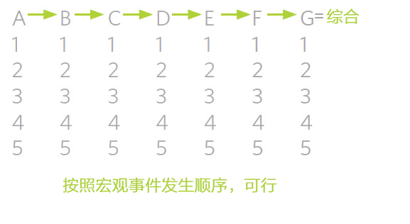

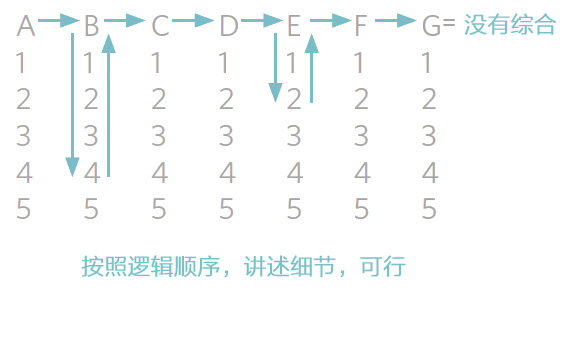

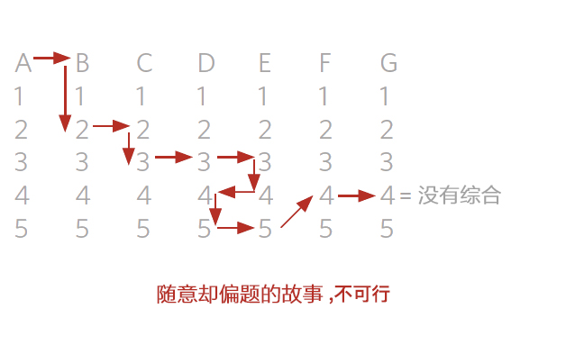

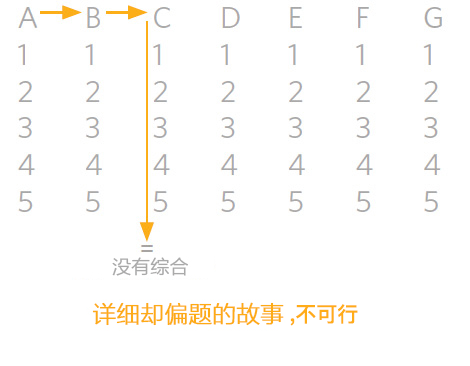

**

... 166) Design Your Machine to Achieve Your Goals
... 166) 设定机制，达成目标**

So…
因此：

**... 167) Remember: You are designing a “machine” or system that will produce outcomes.** This machine will consist of distinct parts (i.e., people and other resources as well as the way they interact with each other) .

**... 167）要记得：你是在设定一个能够有产出的“机制”或系统。**这个机制由不同的部分构成（即，人员，其它资源，以及它们之间互动的方式）

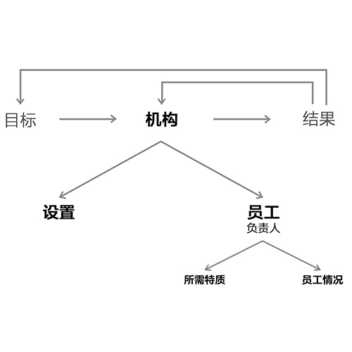

**167a) A short-term goal probably won’t require you to build a machine.** But for an ongoing mission, you will need a well-designed and efficient machine.

**167a) 短期目标可能不需要你设立机制。**但是长期存续任务需要一个设定良好，能有效运行的机制。

**167b) Beware of paying too much attention to what is coming at you and not enough attention to what your responsibilities are or how your machine should work to achieve your goals.** Constantly compare your machine’s outcomes to your goals in order to reflect on how well the machine is operating. Examine both the design and how the individual parts are functioning.

**167b) 注意不要太过关注你眼前的问题，而忽视了你的职责，**以及机制怎样运行并达成目标。经常性地对比机制成果和目标，反思机制运行情况。检查设定运行和人员表现状况。

**... 168) Don’t act before thinking. Take the time to come up with a game plan.** Take at least a few hours to think through your plan. Those hours will be virtually nothing in relation to the amount of time that will be spent doing, and they will make the doing radically more effective.

**... 168）三思而后行。花点时间做计划。**至少要花几个小时的时间思考你的计划。这点时间和你行动起来花的时间相比根本不算什么，但是却能让你之后的行动更有效率。

**... 169) The organizational design you draw up should minimize problems and maximize capitalization on opportunities.** Make the design an extension of your understanding of your problems and opportunities.

**... 169）你拟出的组织设计应该能最小化问题，最大化机会。**让设计成为你对问题和机会内涵理解的一种延伸。

**... 170) Put yourself in the “position of pain” for a while so that you gain a richer understanding of what you’re designing for.** Temporarily insert yourself into the flow to gain a real understanding of what you are dealing with (the process flow, the type of people needed, the potential problems, etc.) and to visualize a clear picture of what will work. You can accomplish this in a number of ways (reviewing work, doing work at different stages in the process, etc.) .

**... 170) 将自己放在“痛点”上一段时间，你就会更理解自己的设定针对的对象是什么。**暂时将自己插入到工作流程中，真正理解你要处理的事务（流程，需求人员类型，潜在问题等），从而构想出运作蓝图。你可以用很多种方式来完成这个步骤（回顾工作，尝试流程中不同阶段的工作等）。

**... 171) Recognize that design is an iterative process; between a bad “now” and a good “then” is a “working through it” period.** That “working through it” period involves trying processes and people out, seeing what goes well or poorly, learning from the iterations, and moving toward having the right people in the ideal systematic design. Even with a good future design picture in mind, it will naturally take time, testing, mistakes, and learning to get to a good “then” state.

**... 171) 要认识到，机构设置是一个循环往复的过程，在一个糟糕的“现在”和一个美好的“未来”之间，是“努力实现”的过程。**这一努力实现的过程包括不断检测各种流程和员工，观察运行良好和不佳的环节，从循环往复中学习，不断改进，将合适的人员安排进理想系统设置之中。即便你在脑海中已经有了一个完善的未来机构设置图，也还是需要花一些时间来测试、犯错、学习，最终达到理想的“未来”的状态。

**... 172) Visualize alternative machines and their outcomes, and then choose.** A good designer is able to visualize the machine and its outcomes accurately, though imperfectly. First visualize the parts and their interactions, and then find the parts to fit the design. Look at all the system’s pieces and their interactions. Imagine how goals 1, 2, and 3 can be achieved. Imagine how Harry, Larry, and Sally can operate in various ways with various tools and different incentives and penalties in place to achieve those goals. Then imagine how the system would work differently if you replaced Harry with George, or if it was configured in an entirely different way. Do this iteratively. Think through what the products and people and finances will look like month by month (or quarter by quarter) over the next year given one system; then change the system and visualize the outcomes again. At the end of this process, your plan should look like a realistic movie script, which describes the parties and their interactions through time. Remember that everything takes longer and costs more than you plan for. Recognize that some people are relatively better or worse at visualization. Accurately assess your own abilities and those of others so you can use the most capable people to create the visualization.

**... 172) 将可替代的其他机制及其成果形象化，以供选择。**一个好的规划师能够准确地将机制及其成果表述出来，当然，可能达不到完美的程度。首先，将各个部件与部件之间的联系表述出来，然后寻找适合机制的部件。看一看系统里所有的碎片和这些碎片之间的联系，试想一下该如何实现目标的第一步、第二步及第三步。思考哈利、拉里、萨丽是如何通过各种方式，利用各种工具，在不同的激励和惩罚措施之下，最终实现了目标。再思考一下如果你用乔治代替了拉里，整个系统的工作方式会发生什么样的改变，会发生翻天覆地的变化吗？如此反复，思考在一种系统之下，下一年每月（或每季度）的产品、员工和财务会是什么样，然后将系统改变，再设想一下结果。在该流程的最后阶段，你的计划应该像一个真实的电影剧本，按时间顺序描述各方与他们之间的互动。记住，现实中完成每件事所需的时间总比计划的要长，应该付出的代价也总比计划要大。要认识到某些人会在将想法具体化能力上比其他人好一些或差一些。准确地评估自己和他人在这方面的能力，以便挑选最合适的人来做这件事。

**... 173) Think about second- and third-order consequences as well as first-order consequences.** The outcome you get as a first-order consequence might be desirable (or undesirable) , while the second- or third-order consequences could be the opposite, so focusing solely on first-order consequences, which people tend to do, could lead to bad decision-making. Though I might not like the first-order consequences of a rainy day, I might love the second-order consequences. So if I were in a position to choose whether or not there should be rainy days, I would need to look at the second- and third-order consequences to make the right decision. For example, for every person you plan to hire, you will have to hire more to support them. I call this “The 1.6 Effect.”

**...173) 思考二、三级效应与一级效应。在一级效应下检测获得的结果可能是理想的（或不理想的），而在二、三级效应之下，结论可能正好相反。**如果只是关注一级效应，人们往往也正是这样做的，就可能导致一些坏决策。比如，我也许不喜欢雨天的一级效应，但是我说不定喜欢它带来的二级效应。如果要我来选是不是应该有下雨天，我需要考虑雨天的二、三级效应，做出更明智的决定。比如，你每计划招聘一个人，那么你就需要雇更多的人来支持他们。我将此称之为“1.6效应”。

**... 174) Most importantly, build the organization around goals rather than tasks.** As an example of building the organization around goals rather than tasks, we have traditionally had a marketing department (goal: to market) that is separate from our client service department (goal: to service clients) , even though they do similar things and there would be advantages to having them work together. But because marketing and servicing clients are two distinct goals, we have a separate department for each. If they were merged, the department head, salespeople, client advisors, analysts, and others would be giving and receiving conflicting feedback. If asked why clients were receiving relatively poor attention, the answer might be: “We have incentives to raise sales.” Asked why they weren’t making sales, the merged department might explain that they need to take care of their clients. Keeping the two areas separate gives each department a clear focus and the appropriate resources to achieve its goals, makes the diagnosis of resource allocations more straightforward, and reduces “job slip.” Of course, when building departments around goals, your goals have to be the right size to warrant these resources. An organization might not be big enough to warrant having a few salesmen and its own analytical group. Bridgewater has successfully evolved from a one-cell organization, in which most people were involved in everything, to the current multi-cell organization because we retained our ability to efficiently focus as the organization grew. Also, I want to make clear that temporarily sharing or rotating resources is OK, and is not the same thing as a merging of responsibilities. I will discuss merging later in this document, as well the coordination required to maintain focus in large organizations.

**... 174) 以目标为中心建立机构，而不是以任务为中心，这是重中之重。**我们围绕目标而不是任务来组建机构。例如，我们一直以来都有一个单独的市场部门，目标是进行市场营销。该部门与旨在为客户提供服务的客户服务部门是分开的。尽管以上两个部门的工作任务相似，而且将两个部门合并也可以产生一些好处，但是因为这两个部门的目标不同，我们就为每个目标单独设立了一个部门。如果两个部门合并，部门领导、销售人员、客户咨询、分析师以及其他员工就会给出或收到互相矛盾的反馈。比如，如果你问，“为什么客户没有受到应有的关注？”答案可能是，“因为我们需要提高销量啊。”如果你问为什么我们的销量如此不济，合并后的部门就可能解释他们需要照顾客户。设立两个独立的部门，能够给每个部门一个清晰的目标以及达成该目标的合适资源，也可以使资源配置的过程更加直截了当，减少“职责错位”的现象。当然，在围绕目标进行部门建设时，要注意你的目标大小应该与所分配的资源相匹配。有时候，一个公司可能规模比较小，不需要很多销售人员以及自己的分析团队。最开始，桥水联合基金只是一个单细胞公司，每个人都需要做所有的事。我们不断成长，将注意力进行有效集中，现在，桥水已经发展成为一个多细胞公司了。同时，我想要明确一点，暂时的共享或轮流使用资源是没问题的，这与合并职责不同。我将在后文中讨论合并的问题，以及如果在大型企业中集中注意力的协调能力。

**174a) First come up with the best workflow design, sketch it out in an organizational chart, visualize how the parts interact, specify what qualities are required for each job, and, only after that is done, choose the right people to fill the jobs** (based on how their capabilities and desires match up with the requirements) .

**174a) 首先，设计最佳工作流，在一个组织图中画出草图，将各部分互动情况形象化，标出每个职位所需的特质，最后，选择合适的员工来填充岗位** (根据他们的能力和意愿来进行需求匹配) 。

**174b) Organize departments and sub-departments around the most logical groupings.** Some groups naturally gravitate toward one another. Trying to impose your own structure without acknowledging these magnetic pulls is ineffective and likely will result in a bad outcome.

**174b) 按照最富逻辑的组团方式来组建部门和子部门。**有些团队彼此之间会很自然的相互吸引，在没有认识到团队间的磁拉力时就妄图将自以为的结构强加给大家，会导致效率低下以及不良后果。

**174c) Make departments as self-sufficient as possible so that they have control over the resources they need to achieve the goals.** We do this because we don’t want to create a bureaucracy that forces departments to requisition resources from a pool that lacks the focus to do the job. People sometimes argue that we should have a technology department, but I am against that because building technology is a task, not a goal in and of itself. You build technology to perform valuable tasks. If we kept the tech resources outside the department, we would have people from various departments arguing about whose project is most important in order to garner resources, which isn’t good for efficiency. The tech people would be evaluated and managed by bureaucrats rather than the people they do the work for.

**174c) 让每个部门尽可能的自给自足，以此确保他们能够自主控制达成目标所需的资源。我们这样做的出发点是因为我们不想设置过多官僚流程，强迫每个部门从集体资源池里申请资源，这样容易分散工作精力。**也有桥水的员工提议，我们应该有一个技术部门，但是我不这么认为。因为解决技术问题应该是一个任务，不是一个目标。建立技术团队的目的是完成所需的技术任务。如果我们设立技术部们独立于各部门，那么各部门的人就会为争取资源坚持认为自己的项目最重要，这对于公司效率是不利的。这样的话，技术部门的人就会由官僚人士来评估和管理，而不受其直接服务对象控制。

**174d) The efficiency of an organization decreases and the bureaucracy of an organization increases in direct relation to the increase in the number of people and/or the complexity of the organization.**

**174d) 公司效率的下降与官僚作风的扩张程度与公司人数增长和复杂性提升直接相关。**

**... 175) Build your organization from the top down.** An organization is the opposite of a building—the foundation is at the top. The head of the organization is responsible for designing the organization and for choosing people to fill its boxes. Therefore, make sure you hire managers before their direct reports. Managers can then help design the machine and choose people who complement the machine.

**... 175) 自上而下组建公司。**公司机构组建与建筑修建的顺序正好相反，后者需要先打好地基。机构领导负责进行机构设置，安排合适人才去各个岗位。因此，你应该先雇管理者，再给管理者找直接向其汇报的下属。管理者们可以帮助你继续进行机构设置，寻找其他的人员来填补机构空缺。

**175a) Everyone must be overseen by a believable person who has high standards.** Without this strong oversight, there is potential for inadequate quality control, inadequate training, and inadequate appreciation of excellent work. Do not “just trust” people to do their jobs well.

**175a) 应该给每名员工安排一位拥有高标准的靠谱的人对其进行监管。**没有严格的监管，可能导致在质量控制、员工培训、追求卓越等各方面出现缺失与不足。不要轻易“相信”员工能够做好自己的工作。

**175b) The people at the top of each pyramid should have the skills and focus to manage their direct reports and a deep understanding of their jobs.** Here’s an example of the confusion that can arise when that understanding is absent: It was proposed that the head of technology have the facilities group (the people who take care of facilities like the building, lunches, office supplies, etc.) report to him because both are, in a sense, “facilities” and because they have some things in common, such as the electrical supply. But the head of technology didn’t understand what the facilities people do. Having people who are responsible for the janitorial services and meals reporting to a technology manager is as inappropriate as having the technology people report to the person who is taking care of facilities. These functions, even if they’re considered “facilities” in the broadest sense, are very different, as are the respective skill sets. Similarly, at another time, we talked about combining folks who work on client agreements with those who do counterparty agreements under one manager. That would have been a mistake because the skills required to reach agreements with clients are very different from the ones required to reach agreements with counterparties. It was wrong to conflate both departments under the general heading of “agreements,” because each kind called for specific knowledge and skills.

**175b) 位于金字塔尖的管理者应该具备管理直接下属的能力和精力，对下属的工作职责有深入了解。如果公司内部沟通不畅，会出现很多问题。例如，有人提议让后勤团队，即负责建筑维护、员工午餐、提供办公用品的部门，向技术团队的负责人汇报工作。**原因是两个团队都与办公设施相关，工作职责也有相似之处，比如都负责电力供应。但实际情况是，技术团队的负责人并不了解后勤团队的工作到底是什么。让做清洁服务的人向做技术的人汇报工作就像让做技术的人向后勤员工汇报工作一样不合时宜。两个团队的职责虽然从宽泛的意义上讲都属于负责办公设施，但是实际职责却大为不同，所需要的配套技能也不同。同理，我们也曾讨论过是否要将负责客户协议的人与负责订约方协议的人统一安排给一个管理者。但是这样也是不可行的，因为与客户达成协议所需的技能和与订约方达成协议所需技能相差甚远。不要只是因为两者都与“协议”相关就盲目合并，因为两个团队需要的知识和技能都是不同的。

**175c) The ratio of senior managers to junior managers and to the number of people who work two levels below should be limited, to preserve quality communication and mutual understanding.** Generally, the ratio should not be more than 1:10, and preferably closer to 1:5\. Of course, the appropriate ratio will vary depending on how many people your direct reports have reporting to them, the complexity of the jobs they’re doing, and the manager’s ability to handle several people or projects at once.

**175c) 高级管理者与初级管理者、管理者与两级以下的被管理者之间的人数比例应该限定在一定范围内，以确保高质量的沟通与互相理解。**一般而言，此人数比例应该保持在1:10以下，最好是接近1:5。当然，具体的比例还取决于有多少人向你的直接下属汇报工作，他们做的工作的复杂程度，以及管理者一次应对多人多项目的能力。

**175d) The number of layers from top to bottom and the ratio of managers to their direct reports will limit the size of an effective organization.**

**175d) 自上而下的层级数量以及管理者与直接下属的比例会制约高效公司的规模。**

**175e) The larger the organization, the more important are 1) information technology expertise in management and 2) cross-department communication (more on these later) .**

**175e) 公司越大，越需要1）在管理中运用信息技术；2）跨部门沟通（后详）。**

**175f) Do not build the organization to fit the people.** Jobs are created based on the work that needs to be done, not what people want to do or what people are available. You can always search outside Bridgewater to find the people who “click” best for a particular role.

**175f) 不要为了迁就人员而组建机构。**岗位是基于所需完成的工作来设定的，而不是基于人们想要干什么事，能干什么事而设定。我们总能在桥水公司之外找到符合某项特定工作岗位的最佳人选。

**... 176) Have the clearest possible delineation of responsibilities and reporting lines.** It’s required both within and between departments. Make sure reporting lines and designated responsibilities are clear. To avoid confusion, people should not report to two different departments. Dual reporting (reporting across department lines) causes confusion, complicates prioritization, diminishes focus on clear goals, and muddies the lines of supervision and accountability, especially when a person reports to two people in two different departments. When situations require dual reporting, managers need to be informed. Asking someone from another department to do a task without consulting with his or her manager is strictly prohibited (unless the request will take less than an hour or so) . However, appointing co-heads of a department or a sub-department can work well if the managers are in synch and combine complementary and essential strengths to this area; dual reporting in that case can work fine if properly coordinated by the co-heads.

**... 176) 尽可能清楚地描述工作职责与级别关系。** 务必清楚表述级别关系和工作职责，该要求适用于部门内部及跨部门之间。为避免冲突，一人无需向两个不同的部门汇报工作。双重汇报，即跨部门的汇报，会引起冲突，将确定优先事项的过程复杂化，分散对清晰目标的关注力， 模糊监管和责任的界限。这种情况在一个人向两个不同部门的不同人汇报时更为显著。当具体情势的确需要双重汇报时，管理者必须对此知情。在不与相关人员的管理者打招呼的情况下就直接让某个其他部门的人做事是被严格禁止的，除非这件事只需要不到一个钟头左右的时间。但是，如果管理者们达成一致，同时能够结合在此领域重要的互补优势，为部门或子部门选定共同领导人是可行的。在这种情况下的双重汇报由共同领导人的协调一致，也是可行的。

**176a) Create an organizational chart to look like a pyramid, with straight lines down that don’t cross.** A series of descending pyramids make up the whole pyramid, but the number of layers should be limited to minimize hierarchy.

**176a) 建立一个金字塔形的组织图，画出不相交的竖线。**A 在整个金字塔中又有一系列的小金字塔，但是为了减少机构层级，要控制金字塔的层数。

**... 177) Constantly think about how to produce leverage.** For example, to make training as easy to leverage as possible, document the most common questions and answers through audio, video, or written guidelines and then assign someone to regularly organize them into a manual. Technology can do most tasks, so think creatively about how to design tools that will provide leverage for you and the people who work for you.

**... 177) 经常思考该如何让事情发挥最大效果。**比如，为让培训最易于接受，可以通过音频、视频或书面指南的方式记录下最常见的问题和答案，然后安排专人定期将其编纂成手册。技术现在能完成大部分的任务，创新性思考如何设计工具，供自己和员工使用。

**177a) You should be able to delegate the details away.** If you can’t, you either have problems with managing or training or you have the wrong people doing the job. The real sign of a master manager is that he doesn’t have to “do” practically anything. Of course, a great manager has to hire and oversee the people who do things; but a “supreme master” manager can even hire a person or two to do this and has achieved such leverage that things are effortlessly running superbly. Of course, there is a continuum related to this. The main message I’m trying to convey is that managers should strive to hire, train, and oversee in a way in which others can superbly handle as much as possible on their own. Managers should view the need to get involved in the nitty-gritty themselves as a bad sign.

**177a) 你应该将细节工作委派给他人。**如果你做不到的话，说明你不擅长管理或培训，或者你安排的人无法胜任自己的工作。真正的管理大师的标志是根本不需要亲自做任何实际工作。当然，一个杰出的管理者必须雇佣和监管他人做事。但是大师级的管理者甚至能够找到一两个人来帮他雇佣和监管他人，已经达到一种毫不费力就能将公司经营得很好的境界。当然，要实现这样，还需要满足其他的因素。我想说的是，管理者们应该努力去招聘、培养、监管员工，使得员工能够尽可能依靠自己的力量精彩完成工作。如果管理者们不得不去做特别琐碎的工作，这将是一个糟糕的信号。

**177b) It is far better to find a few smart people and give them the best technology than to have a greater number of ordinary and less well -equipped people.** First of all, great people and great technology are almost always a great value because their effectiveness in enhancing the organization’s productivity can be enormous. Second, it is desirable to have smart people have the widest possible span of understanding and control because fragmented understanding and control create inefficiencies and undermine organizational cohesion. Usually it is the person’s capacity that limits the scope of his understanding and control. So the mix of really smart people operating with really great technology in a streamlined organization is optimal for organizational efficiency.

**177b) 与其让一众能力平庸之人获得不那么精良的装备，不如只给一小部分聪明人配备最好的技术。**首先，拥有优秀的员工和优秀的技术对促进公司生产力有极大的效果。 其次，最好能让优秀的员工尽可能广泛地了解公司情况，进行管控。碎片化的了解和管控会造成效率低下，不利于公司凝聚力。通常情况下，人的能力制约了他的理解力和控制力。如果能够结合最聪明的人、最先进的技术和合理的公司结构，就能实现公司效率的最大化。

**177c) Use “leveragers.”** Leveragers are capable of doing a lot to get your concepts implemented. Conceptualizing and managing are most important and take only about 10% of the time needed for implementing; so if you have good leveragers, you can accomplish a lot more with relative ease.

**177c) 使用执行力强的人。**执行力强的人能够竭尽所能执行你的理念。构思与管理是最重要的，但是其花费的时间只占到执行的十分之一左右。如果你拥有有力的执行者，那么你就能轻松完成很多事情了。

**... 178) Understand the clover-leaf design.** Find two or three responsible parties who have overlapping believabilities and responsibilities and who are willing to challenge and check each other. If you do this, and those people are willing to fight for what they believe is best by being open-minded and assertive at the same time, and if they escalate their disagreements and failures to you, this process will have a high probability of sorting issues that they can probably handle well from issues that you should examine and resolve with them.

**... 178) 理解四叶草形的机构设置。**找两到三名业务有交叉的可信负责人，如果他们愿意，让他们监督和挑战彼此。他们能够本着开放的心态，坚定地为自认为对的事情据理力争，在碰到分歧和失败时，将问题提交给你来处理。 如果能坚持这一程序，那么他们就能将自己能够处理的问题与需要你参与处理的问题区分开。

**... 179) Don’t do work for people in another department or grab people from another department to do work for you unless you speak to the boss.**

**... 179) 不要为其他部门做事，也不要在没有和其他部门领导交涉的情况下从其他部门抓人来为你做事。**

**... 180) Watch out for “department slip.”** This happens when a support department, such as HR or Facilities, mistakes its responsibilities to provide support with a responsibility to determine how the thing they are supporting should be done. An example of this sort of mistake is if those in the Recruiting department think they should determine whom we should hire or if people in HR think they should determine what our employment policies should be. Another example would be if the Facilities group determined what facilities we should have. While support departments should know the goals of the people they’re supporting and provide feedback regarding possible choices, they are not the ones to determine the vision.

**... 180) 谨防“部门职能错位”。**当一个提供支持的部门，比如人力资源或后勤部门， 将支持的责任与决定被支持的工作该如何进行的责任混淆。例如，负责招聘的员工认为他们应该有权决定去雇佣谁，而人力资源的员工认为他们应该有权决定就业政策， 都是部门职能错位的现象。再比如，后勤团队去决定我们应该购置什么样的办公设施，都是这种情况。支持团队虽然需要了解他们所支持的团队的目标，提供可能的选项，但是他们却不能最终做决定。

**... 181) Assign responsibilities based on workflow design and people’s abilities, not job titles.** What people do should primarily be a function of the job they have, and it should be pretty obvious who should do what (if they’re suited for the job) . For example, just because someone is responsible for “human resources,” “recruiting,” “legal,” “programming,” etc., doesn’t necessarily mean they are the appropriate person to do everything associated with those functions. For example, though “Human Resources” people help with hiring, firing, and providing benefits, it would be a mistake to give them the responsibility of determining who gets hired and fired and what benefits are provided to employees. When assigning responsibilities, think about both the workflow design and a person’s abilities, not the job title.

**... 181) 在分配责任时，注意考虑工作流的设置和员工的能力，而不是岗位头衔。**员工所做的工作应该是他们所在职位的主要功能，只要员工是适合自己的岗位的，那么谁负责做什么应该是显而易见的。例如，不能只因为某人负责“人力资源”、“招聘”、“法律”或“编程”，就推论他们是负责所有相关功能事项的最佳人选。尽管人力资源部门的员工会帮助招聘、解聘、员工福利，但是却不能给他们权力决定应该招谁、开除谁、提供什么样的福利。在分工时，要考虑工作流的设置和员工的能力，而不是岗位头衔。

**... 182) Watch out for consultant addiction.** Beware of the chronic use of consultants to do work that should be done by employees.

**... 182) 谨防过分依赖外部咨询。**不要长期使用咨询来完成本该由员工自己完成的工作。

**... 183) Tool: Maintain a procedures manual.** This is the document in which you describe how all of the pieces of your machine work. There needs to be enough specificity so that operators of the different pieces of the machine can refer to the manual to help them do their job. The manual should be a living document that includes output from the issues log so that mistakes already identified and diagnosed aren’t repeated. It prevents forgetting previous learning and facilitates communication.

**... 183) 工具：使用流程手册。**流程手册记录了整个机构各个部件运行的情况。手册的内容需要足够详细，保证机构各部门员工都能够参考手册帮助其工作。手册应该是实时更新的，需要涵盖问题日志里的成果，保证已经发现并诊断过的问题不会重复出现。实时更新手册还能巩固先前的经验，促进员工沟通。

**... 184) Tool: Use checklists.** When people are assigned tasks, it is generally desirable to have these captured on checklists so they can check off each item as it is done. If not, there is a risk that people will gradually not do the agreed tasks or there will be lack of clarity. Crossing items off a checklist will serve as a task reminder and confirmation of what has been done.

**... 184) 工具：使用任务清单。**当员工被安排了新的工作任务时，最好能够将任务记录在清单上，当完成一项时，可以划掉相应项目。如若不然，员工可能会对已答应的工作逐渐懈怠，或记不清楚。将清单上的项目划掉的过程能够起到提醒任务的作用，确定已经完成的事项。

**184a) Don’t confuse checklists with personal responsibility.** People should be expected to do their job well, not just what is on their checklists.

**184a) 不要将任务清单与个人责任混为一谈。**员工应该将自己的工作做好，这不仅仅局限于清单上的内容。

**184b) Remember that “systematic” doesn’t necessarily mean computerized.** It might mean having people do specified tasks and indicate that they have done them with checklists.

**184b) 记住，系统性并不意味着必须全部由电脑来控制。**也可能意味着让员工负责具体的工作，指示他们利用清单来完成工作。

**184c) Use “double-do” rather than “double-check” to make sure mission-critical tasks are done correctly.** When people double-check someone else’s work, there is a much lower rate of catching errors than when two parties independently do the work and the results are compared. Double-doing is having two different people doing the same task on the same job so that two independent answers are derived. By comparing them you will not only assure better answers but you will see the differences in people’s performances and make much more rapid improvement. I use double-dos in critical areas such as finance, where large amounts of money are involved.

**184c) 要“重复工作”，不要“重复检查”，保证重要任务完成无误。**当人们在检查别人的工作时，找到错误的概率要远小于两个人分别独立完成之后再就结果进行对比。重复工作就是让两组不同的人来完成同一个工作的同一项任务，由此生成两个独立的答案。通过对比两个答案，你既能确保选择一个更优的答案，又能看到两组人工作表现的差异，让员工提升更快。我在一些关键领域使用重复工作的原则，比如当涉及到大笔资金的使用，就需要员工对财政进行重复工作。

**... 185) Watch out for “job slip.”**Job slip is when a job changes without being explicitly thought through and agreed to, generally because of changing circumstances or a temporary necessity. Job slip will generally cause bad job design. It often leads to the wrong people handling the wrong responsibilities and confusion over who is supposed to do what.

**... 185) 谨防“职责错位”。**职责错位是指在没有经过深思熟虑或达成一致的情况下改变工作职责。一般是因为情势变化或临时需要。 职责错位会给工作职能的设计带来不良影响，往往会导致错误的人承担错误的职责，也会使人弄不清到底谁应该负责什么事。

**... 186) Think clearly how things should go, and when they aren’t going that way,acknowledge it and investigate.** First decide which issue to address first: finding the reason the machine isn’t working well or executing the tasks required to get past the problem (in which case you need to come back to the reasons later) . Either way, don’t pass the problem by without discussing the reasons. Otherwise, you will end up with job slip.

**... 186) 考虑清楚工作应该如何开展，如果事情不是朝预期的方向发展，需要及时发现并展开调查。** 首先，决定应该从哪里开始下手，即找到机制无法正常运行的原因，或者跳过问题执行其他任务，这种情况下，你需要稍后再调查问题原因。不论怎么选择，千万不要不讨论问题原因直接跳过问题。否则，你最终会陷入职责错位之中。

**... 187) Have good controls so that you are not exposed to the dishonesty of others and trust is never an issue.** A higher percentage of the population than you might imagine will cheat if given an opportunity, and most people who are given the choice of being “fair” with you and taking more for themselves will choose taking more for themselves. Even a tiny amount of cheating is intolerable, so your happiness and success will depend on your controls. Security controls should be viewed as a necessary tool of our profession, not as a personal affront to an individual’s integrity. Just as a bank teller doesn’t view a check on the money in his drawer as an indication that the bank thinks he is dishonest, everyone here should understand the need for our security controls. Explain this to your people so they see it in the proper context. Even the best controls will never be foolproof, and trustworthiness is a quality that should be appreciated.

**... 187) 加强监管，谨防他人的不诚实，使信任不再成为问题。**只有给机会，比你预想多很多的人会选择弄虚作假，而大多数人在面临是选择公平还是占更多便宜时，总会选择占更多便宜。但是对公司运营而言，任何最小的欺骗也是不能容忍的，你的幸福和成功都取决于你的监管能力。安全控制应该被看做是职业所必须的工具，而不是针对个人人品的冒犯。就像银行柜员不会觉得查看他柜面的钱款数额是出于银行对他的不信任，所有员工必须理解安全控制的必要性。请向员工进行解释，让他们理解这样做的思路。但是，即便是最好的监管，也不可能毫无漏洞，应该鼓励员工提升自己的可靠度。

**187a) People doing auditing should report to people outside the department being audited, and auditing procedures should not be made known to those being audited.**

**187a) 审计人员应该向被审计部门之外的人汇报审计结果，同时审计程序不能向被审计对象透露。**

**187b) Remember: There is no sense in having laws unless you have policemen (auditors) .**

**187b) 记住，如果没有警察（审计人员），法律则形同虚设。**

**

... 188) Do What You Set Out to Do

... 188) 坚持到底**

So…
因此：

**... 189) Push through!** You can make great things happen, but you must MAKE great things happen. Times will come when the choice will be to plod along normally or to push through to achieve the goal. The choice should be obvious.

**... 189) 坚持到底！**你能做出伟大的事情，前提是你必须要去做。总有一天，你需要选择是和往常一样拖沓行事还是排除万难达成目标。选择很明显。

> As Lee Ann Womack’s country and western song says, when you have a choice between sitting it out or dancing, I hope you'll dance.
> 就像李安沃马克在乡村西部歌曲中唱到的那样，当你面临逃避还是跳舞的选择，我希望你选择跳舞。

### To Make Decisions Effectively…
有效决策

**

... 190) Recognize the Power of Knowing How to Deal with Not Knowing

... 190) 认可在无知时该如何行事的能力**

So…
因此：

**... 191) Recognize that your goal is to come up with the best answer, that the probability of your having it is small, and that even if you have it, you can’t be confident that you do have it unless you have other believable people test you.**

**... 191) 要认识到，你的目标是找到最佳答案，而找到最佳答案的可能性是很小的，就算你真的找到了，你也无法确信自己成功了，你必须让其他的靠谱的人来对你进行测试。**

**... 192) Understand that the ability to deal with not knowing is far more powerful than knowing.** That is because there’s way more that we don’t know than what we could possibly ever know.

**... 192) 要知道，处理无知的能力要比知道能力更强大。**这是因为一个人的所知一定远远少于未知。

**192a) Embrace the power of asking: “What don’t I know, and what should I do about it?”** Generally you should find believable people and ask their advice, remembering that you are looking to understand their reasoning rather than get their conclusions.

**192a) 鼓励提问：“有什么是我不知道的呢？那我该怎么办呢？”**一般情况下，你应该去找一些靠谱的人，听取他们的意见，记住你要关注的是他们的论证过程，而不是他们的结论。

**192b) Finding the path to success is at least as dependent on coming up with the right questions as coming up with answers.** Successful people are great at asking the important questions and then finding the answers. When faced with a problem, they first ask themselves if they know all the important questions about it; they are objective in assessing the probability that they have the answers; and they are good at open-mindedly seeking believable people to ask.

**192b) 寻找成功的道路上，提出正确问题与获得正确答案同等重要。成功人士擅长问重要问题，并找到答案。**在遇到困难时，他们首先问问自己是否已经对所有相关的问题都有所了解了。他们能够客观评估自己获得答案的可能性，同时，愿意本着开放的心态向靠谱的人求助。

**... 193) Remember that your goal is to find the best answer, not to give the best one you have.** The answer doesn’t have to be in your head; you can look outside of you. In life the goal is for you to do the right thing, considering the probability that you might be wrong. So it is invaluable to know what you don’t know so that you can figure out a way to find out and/or to get help from others.

**... 193) 记住，你的目标是寻找最佳答案，而不是在已有的答案中挑一个最好的。**最佳答案不一定就是你已知的答案，你也可以寻求外界帮助。生活的目标是做正确的事，同时考虑做错事的可能性。因此，能够知道自己不知道什么是非常宝贵的能力，只有这样，才能想办法求助他人。

**... 194) While everyone has the right to have questions and theories, only believable people have the right to have opinions.** If you can’t successfully ski down a difficult slope, you shouldn’t tell others how to do it, though you can ask questions about it and even express your views about possible ways if you make clear that you are unsure.

**... 194) 每个人都有权拥有自己的问题和理论，但是只有靠谱的人有权提出观点。**如果你自己不会在高难度坡道上滑雪，那么你就没资格告诉别人该怎么滑。当然，你可以就此事提问，也可以在表明自己并不确定的情况下发表自己的观点，讨论可能存在的方式。

**... 195) Constantly worry about what you are missing.** Even if you acknowledge you are a “dumb shit” and are following the principles and are designing around your weaknesses, understand that you still might be missing things. You will get better and be safer this way.

**... 195) 时刻警惕考虑不周的情况。**即便你知道自己很笨，于是严格遵守原则，同时围绕自己的弱点对环境进行了相应设置，但你还是可能有所遗漏。谨慎行事会让你更成功、更安全。

**195a) Successful people ask for the criticism of others and consider its merit.**

**195a) 成功人士会征求别人的批评意见，并看到批评的价值。**

**195b) Triangulate your view.** Never make any important decisions without asking at least three believable people. Don’t ask them for their conclusions or just do what they tell you to do. Understand, visualize, and assess their reasoning to see if it makes sense to you. Ask them to probe your own reasoning. That’s critical to your learning as well as to your successful handling of your responsibilities.

**195b) 吸收众人观点。**永远不要在没有向至少三位靠谱的人咨询的情况下做任何重要决定。不要只是听取结论，盲目照搬。理解他们的观点，将其具体化，评估他们的论证过程，看看说的有没有道理。让他们也来刺激你自己进行论证。这对于你的学习过程和成功承担责任都很重要。

**

... 196) Make All Decisions Logically, as Expected Value Calculations

... 196) 做决策要讲逻辑，基于期望值测算**

So…
所以说

**...197) Considering both the probabilities and the payoffs of the consequences, make sure that the probability of the unacceptable (i.e., the risk of ruin) is nil.**

**...197）考虑结果的可能性与收益，确保发生不可接受结果（如搞砸的风险）的可能性为零。**

**197a) The cost of a bad decision is equal to or greater than the reward of a good decision, so knowing what you don’t know is at least as valuable as knowing.**

**197a) 不良决策的代价等同于，甚至严重于正确决策带来的回报。因此，知道自己什么没掌握，至少和知道自己掌握什么一样有价值。**

**197b) Recognize opportunities where there isn’t much to lose and a lot to gain, even if the probability of the gain happening is low.** It is a reality that there are always multiple possibilitiesand nothing is certain. All decisions are therefore risk/reward bets. Know how to pursue fabulous risk/reward ratios that have a huge upside and very little downside, albeit a small probability of happening. My life has been filled with these.

**197b) 如果有亏少利多的机会要把握，就算获利可能性低也要试试。**不可否认，世事无绝对，存在不同的可能性。因此，所有的决策都是有风险有回报的赌局。要知道如何实现极佳的风险回报率，即回报巨大，风险极小，当然这种可能性很小。我的人生充满了这种决策。

**197c) Understand how valuable it is to raise the probability that your decision will be right by accurately assessing the probability of your being right.** I often observe people giving opinionsas soon as they have them, which seems at about the point that they think there’s more than a 50% chance of them being right. Often they don’t pay any attention to the value of raising the probability of being right (e.g., from 51% to 85%) by reflecting harder on whether the answer is right and doing the investigations and double-checking with others to make sure that the answer is right. Remember that, in an expected value sense, raising the probability of being right (e.g., from 51% to 85%) can be worth more than just going from probably wrong (e.g., 45%) to probably being right (e.g., 51%) because we are all playing probabilities. Think about the effects of altering the probabilities of achieving must -dos: if you have a 51% probability of handling a “must-do” correctly, it means that only a bit more than half of your must-dos will be done appropriately, whereas an 85% probability of handling a decision well means that only 15% of the must-dos will be handled badly.

**197c) 精准评估自己决策正确的可能性，以提高决策准确性，这是十分有价值的。**我常看到有人一有想法就不假思索地提出自己的观点，看似自己观点的准确性高于50%，却不做进一步调查，也不同他人进行确认以确保观点的正确性。这样认真反思后的答案准确性就能得到提高（比方说从51%提高到85%），可他们往往不以为然。要记住，从期望值角度来看，提高准确性（比方说从51%提高到85%），远比从可能错误的（假设准确性是49%）情况提升为可能是正确的（假设准确性此时是51%）情况要有价值得多，因为我们终究是在拿可能性打赌。试想一下，本来实现必要事项的可能性是51%，那意味着只有略微过半的任务可能顺利完成，但准确性一旦提高到了85%就意味着只有15%关键事项可能会出问题。

**197d) Don’t bet too much on anything. Make 15 or more good, uncorrelated bets.**

**197d) 任何事情都不能押过多赌注，要留15%或更多余地给无关联的赌注。**

**

... 198) Remember the 80/20 Rule, and Know What the Key20% Is

... 198）牢记80/20法则，并知道那关键的20%是什么**

So…
所以说

**... 199) Distinguish the important things from the unimportant things and deal with the important things first.**

**... 199）区分重要事项和不重要事项，先处理重要事项。**

**199a) Don’t be a perfectionist**, because perfectionists often spend too much time on little differences atthe margins at the expense of other big, important things. Be an effective imperfectionist. Solutions that broadly work well (e.g., how people should contact each other in the event of crises) are generally better than highly specialized solutions (e.g., how each person should contact each other in the event of every conceivable crisis) , especially in the early stages of a plan. There generally isn’t much gained by lots of detail relative to a good broad solution. Complicated procedures are tough to remember, and it takes a lot of time to make such detailed plans (so they might not even be ready when needed) .

**199a) 不要做完美主义者。**因为完美主义者在细微差别上过于耗时，因小失大。要成为有效率的非完美主义者。宽泛的解决方案（比方说，遭遇危机时，大家如何保持联络）一般比极为专业的解决方案（比方说，面对任何一种可能想到的危机时，大家如何保持联络）要更好，这在方案设计初期尤为明显。宽泛合理的解决方案比充斥了一堆繁杂细节的方案能带来更多益处，因为过程太复杂不易记住，制定细节庞杂的方案也很耗时间，甚至到需要派上用场时，也可能还未完成。

**199b) Since 80% of the juice can be gotten with the first 20% of the squeezing, there are relatively few (typically less than five) important things to consider in making a decision.** For each ofthem, the marginal gains of studying them past a certain point are limited.

**199b) 压榨过程进行20%的时候就能得到80%的果汁，所以做决定时，最重要的事项是比较少的（一般少于五件）**，而且研究每件事项所能获得的边际收益也是有限的。

**199c) Watch out for “detail anxiety,”** i.e., worrying inappropriately about unimportant, small things.

**199c) 警惕“细节焦虑”，不要小题大做。**

**199d) Don’t mistake small things for unimportant things, because some small things can be very important** (e.g., hugging a loved one) .

**199d) 不要混淆小事情和不重要事项，因为小事情也可能很重要**（举个例子，给爱的人一个简单的拥抱就是这如此）。

**... 200) Think about the appropriate time to make a decision in light of the marginal gains made by acquiring additional information versus the marginal costs of postponing the decision.** There are some decisions that are best made after acquiring moreinformation, and some that are best made sooner rather than later. The later a decision is made, the more informed it can be; however, making it later can also have adverse consequences (e.g., postponing progress) . Understanding the trade-off between the marginal gains of acquiring the extra information against the marginal costs of postponing a decision is an important factor in the timing and preparation of decision-making.

**... 200）做决策的时机要恰当，为获取更多信息而延迟决策，需权衡可获得的边际效益和所需耗费的边际成本。**有些决策适合在进一步咨询后进行，有些决策则应尽快敲定。决策耗时越长，能获取更多信息，但也有其负面影响，比如会延迟进展。懂得权衡利弊，要考虑获取更多信息能带来的边际收益，也要关注延迟决策所需耗费的边际成本，这是影响决策时效性与准备工作的重要因素。

**... 201) Make sure all the “must do’s” are above the bar before you do anything else.** First, distinguish between your “must do’s” and your “like to do’s”. Don’t overlook any “must do’s,” and don’t mistakenly slip the “like to do’s” onto the list. Then, get all the “must do’s” above the bar. Then get all the “must do’s” excellent. If you have time, turn to the “like to do’s” and try to get them above the bar. Only if you have time (though you certainly will not if you are thinking broadly) , turn toward making things perfect. Chances are, you won’t have to deal with the unimportant things, which is better than not having time to deal with the important things. I often hear people say, "Wouldn’t it be good to do this or that,” referring to nice- to-do’s rather than must-do’s that have to be above the bar. Chances are, they are being distracted from far more important things that need to be done well.

**... 201）确保所有“必须完成的任务”在完成前优先于其他任何事情。首先，区分“必须完成的任务”和“喜欢做的任务”。**不要遗漏任何一样“必须完成的任务”，也不要误将“喜欢做的任务”列入了任务清单。然后，将“必须完成的任务”排上工作日程并出色地完成这些工作。要还有时间，就回过头来看看“喜欢做的任务”，着手再完成这些任务。当自己还有多余的时间时，再想想怎么把事情做到完美（如果思维开阔就肯定不会这样）。实际情况可能是你没时间处理不重要的事情，这好过于没时间处理重要的事情。我老听到有人讲：“这样做或那样做不好吗？”他们考虑的是将看起来漂亮的事情优先做，而非“必须完成的任务”，很有可能就忽略了更为重要的事情。

**... 202) Remember that the best choices are the ones with more pros than cons, not those that don’t have any cons. Watch out for people who tend to argue against something because they can find something wrong with it without properly weighing all the pros against the cons.** Such people tend to be poor decision-makers.

**... 202）要记住，最佳选择获得赞同意见多于反对意见，当然不是说不允许任何反对意见。要警惕有人在没有适当权衡正反意见时挑错反对。**这类人不是优秀的决策者。

**... 203) Watch out for unproductively identifying possibilities without assigning them probabilities, because it screws up prioritization.** You can recognize this with phrases like “It’s possible that...” then going on to say something that’s improbable and/or unimportant, rather than something like, “I think there’s a good chance that…” followed by something that’s important or probable. Almost anything is possible. All possibilities must be looked at in terms of their likelihoods and prioritized.

**... 203）要警惕在没有考虑所有可能性的情况下，就低效地确定其可能性，这样会打乱优先次序。**听到“可能是……”这种句式就明白了，他接下来会说一些无从考据且不重要的事情。如果某人说“我认为很可能……”，这一般后面就会说重要且有所根据的事情了。一切皆有可能，所以要根据可能性与重要性来仔细探究每一种可能的情况。

**... 204) Understand the concept and use the phrase “by and large.”** Too often I hear discussions fail to progress when a statement is made and the person to whom it is made replies, “Not always,” leading to a discussion of the exceptions rather than the rule. For example, a statement like “The people in the XYZ Department are working too many hours” might lead to a response like “Not all of them are; Sally and Bill are working normal hours,” which could lead to a discussion of whether Sally and Bill are working too long, which derails the discussion. Because nothing is 100% true, conversations can get off track if they turn to whether exceptions exist, which is especially foolish if both parties agree that the statement is by and large true. To avoid this problem, the person making such statements might use the term “by and large,” like “By and large, the people in the XYZ Department are working too many hours.” People hearing that should consider whether it is a “by and large” statement and treat it accordingly.

**... 204）理解并运用“总体来说”的概念。**我老听到这种情况，当有人提出了一个观点，参与讨论的人回复说，“也不总这样啊”，这时，讨论就会陷入僵局。因为他那样一说，大家就会开始不谈常规情况，而开始商讨各种例外情况。举个例子，有人说：“某某部门的员工工作时间太长了。”那别人可能就会回应说：“也不全是吧，萨莉和比尔上班时间就挺正常的呀。”这样一说，大家讨论的重点就会变成萨莉和比尔上班时间到底长不长，这就偏离了讨论要点。因为事事无绝对，讨论重心若放在研究是否存在例外情况的话，对话就偏离了正轨，要双方本来就都觉得这件事“总体来说”没问题的话，这样做就更蠢了。为避免这个问题，发表论述的人可能会说“总体来说”，比如：“总体来说，某某部门的员工工作时间挺长的。”听者就要考虑着是不是“总体来说”句式，并依此处理。

**204a) When you ask someone whether something is true and they tell you that “It’s not totally true,” it’s probably true enough.**

**204a) 当询问某事的真实性时，若对方告诉你“也不完全是事实”时，其实也八九不离十了。**

**

... 205) Synthesize

... 205）综合**

So…
所以说

**... 206) Understand and connect the dots. To do this well, you have to synthesize what is going on.** Usually it takes diagnosing a few (e.g., five or so) dots of the same type to get at the true root cause so that you can see how the machine should be modified to produce better outcomes. For example, one type of outcome involves someone, let’s call him Harry, handling a type of responsibility (entering an order) . You will need at least a few experiences to learn about Harry doing this. It will pay for you to understand Harry and his handling of orders and have him understand you by looking objectively at the outcomes and by getting in synch, especially about the bad outcomes. The quality of your understanding of your machine and its constituent parts will depend on how well you diagnose and process the important outcomes. If you don’t do this continuously and you don’t synthesize well, you will fail. This isn’t easy.

**... 206）理解并连点成线。要做好这点，需要综合分析总体情况。**只有诊断几个同类型的关键点（例如五个左右）才能了解问题的根源，进而调整机制，改善结果。。举个例子，员工也是可被改善的结果之一，我们姑且叫他哈利吧，他负责某项业务（处理订单）。要了解哈利做得怎么样至少得经历几次观察，更好了解哈利和他处理订单的情况，同时让他理解你，与你达成一致意见，尤其就不好的结果能达成共识，这一过程是回报丰厚的。对机制和其组成部分的理解程度取决于你是否能够很好地完成了对重要问题的诊断和处理。若不持续这样做，就没法做好综合分析，只会面临失败。要顺利完成并不是容易的事。

See how the dots connect through time. This requires collecting, analyzing, and sorting lots of different types, and it ain’t easy for most folks. Imagine a day in which eight outcomes occur. Some are good, some bad. Let’s represent this day as follows, with each type of event represented by a letter and the quality of the outcome represented by its height.

要观察关键点是如何在时间轴上关联起来的，需要收集、分析、大量归类，对于一般人而言难度颇大。试想某天同时出现了八种结果，有好有坏，下图就是这样一天，字母代表事件类别，在图中的水平高度代表结果的质量：

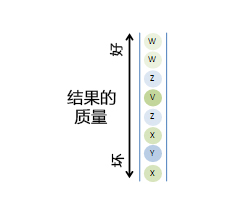

In order to see the day this way, you must categorize outcomes by type and quality, which will require synthesizing a “by and large” assessment of each. If you didn’t examine the bad outcomes as they occurred, you couldn’t understand what they are symptomatic of. Keep in mind our example is a relatively simple one: only eight occurrences over one day. Now let’s look at what a month looks like.

要利用图表方式观察这一天，就得根据类别和质量对结果进行分类，这需要对每一项进行“总体来说”的宏观分析。不良结果出现如果不进行检查，就无法了解症结所在。要记住，我们这个例子相对简单：一天只出现了八个结果，现在让我们来看看一个月的情况吧：

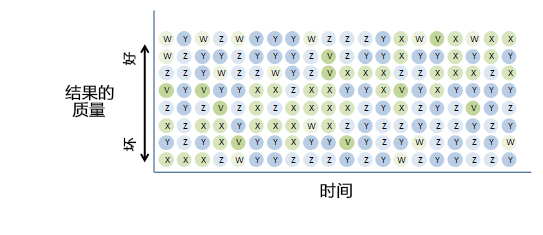

Confusing, eh? Some people are much better at this than others.

看晕了是吧？可就是有人擅长观察这些图表。

In order to understand how your machine is working to achieve your goals, you have to perceive change over time, charting improvement vs. deterioration. The chart below plots just the type X dots, which you can see improving. As mentioned in the section on diagnosis, you must categorize, understand, and observe the evolution of the different parts of your machine through time, and synthesize this understanding into a picture of how your machine is working and how it should be improved. People who do this well are rare and essential. As with most abilities, synthesizing well is partially innate and partially learned through practice.

想要理解机制如何运转以实现目标的，你就得观察一段时间内机制运行产生的变化，绘制图表，记录进步与退步。下图展示了X类别关键点的分布，你会发现它在进行改善。讲问题诊断的时候我提过，必须分类、理解、观察一段时间内机制里不同组成部分的变化，然后综合分析所了解的情况，绘制在图表上，体现机制的运行情况，了解应如何改善。擅于制表读表的人少之又少，但却不可或缺。和大多数能力一样，进行有效综合分析的能力一部分是与生俱来，一部分源自后天实践。

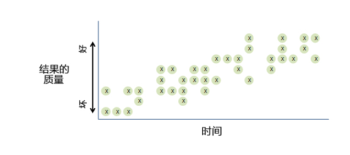

**... 207) Understand what an acceptable rate of improvement is, and that it is the level and not the rate of change that matters most.** I often hear people say, “It’s getting better,” asthough that is good enough when “it” is both below that bar and improving at an inadequate rate. That isn’t good enough. For example, if someone who has been getting 30s and 40s on tests raised his grade to the 50s, you could say he’s improving but the level is still woefully inadequate. Everything important you manage has to be on a trajectory to be “above the bar” and headed for “excellent” at an acceptable pace. For example, in the chart below, the trajectory of A might be acceptable, but B’s trajectory is not. A gets us above the bar in an acceptable amount of time.

**... 207）知道可接受的改善速度是多少，因为改变的程度比改变的速度更重要。我老听人讲“情况越来越好了”。**然而实际情况是低于预期，改善速度还很慢，这样的情况根本就称不上好。举个例子，假如有个老是考30-40分的人这次考到了50多分，你可以说他进步了，但离令人满意的分数还差得远。你所掌握的每件事情，都应朝着“高于预期”，争取“卓越”的轨迹上稳步前进。如下表所示，A的运行轨迹是可以接受的，但B的运行轨迹无法令人接受。A的轨迹高于预期，并在合理的一段时间内实现。

**... 208) If your best solution isn’t good enough, think harder or escalate that you can’t produce a solution that is good enough.** A common mistake is accepting your own best solutionwhen it isn’t good enough.

**... 208）如果最佳方案不够令人满意，就得尽力想出更好的办法，实在想不到就提交给上级。**一个常犯的错误是方案还不够完善，就自认为已经是最佳方案了。

**... 209) Avoid the temptation to compromise on that which is uncompromisable.** You must have and achieve high standards. This is particularly difficult when two uncompromisable things are at odds. At such times, there is a tendency to let one of them go. However, at such times you have to allocate more time to figure out how to best handle this, be more creative, and ask for more input. But don’t compromise on one of the things that shouldn’t be compromised. For example, one of the uncompromisable things I regularly get pressure from people to compromise on is letting great people avoid exploring their mistakes and weaknesses because they find it painful. For reasons articulated throughout these principles, I believe we can’t compromise on this because that process of exploration is healthy for Bridgewater, healthy for them, and key to our culture. I also believe that to allow opt-outs would legitimatize two sets of rules and put our radically honest way of being in jeopardy. But I want great people.

**... 209）经受住诱惑不要在不能妥协的地方妥协**。你必须有且取得很高的标准。当你有两个不可妥协的事情互相起冲突的时候，这尤其困难。在这种时候,你有放弃其中之一的倾向。然而,在这种时候, 你需要更多的时间来搞清如何最好的处理这件事，要更有创造性,并要求更多的输入。但是不要再两者之中任何一件不能妥协的事情上面妥协。 比如,我最近经常感到压力的就是人们经常妥协而我认为是绝对不能妥协的一件事之一是让优秀的人物避免和探索他们的错误和缺点,因为这些优秀的人物认为这太痛苦了。因为在前文原则中所清晰地表达的各种理由中,我相信我们不能在这一点上面妥协，因为优秀的人物探索的过程对桥水公司有益处,对优秀人物本人有益处,是我们文化的关键所在。我也相信如果我收回两条原则将会使得这两个规则合法化（原则一人们不需要探索自己的缺点和弱点。原则二员工不能不要优秀的人去探索他们的缺点和弱点）并且使我们的底层的诚实的的行为方式处于危险之中。但是我想要优秀的员工。

Everyone is wrestling with some things, but most people don’t talk about them—some people don’t like to probe you about your weaknesses because they think it’s unkind or awkward. And it’s often difficult for us to see and accept our own weaknesses. So when you are really in synch with others about what you’re wrestling with, that is a great step forward, because this feedback is probably true.

每个人都有为之苦恼的事情，但多数人对此避而不谈。一般人们不会想去探寻你身上的缺点，他们认为这很无礼也很尴尬，而发现并接受自身缺点又非易事。所以两个所苦恼的事情一旦契合，就意味着取得了很有意义的进步，此时双方的反馈可能是坦诚真实的。

**... 210) Don’t try to please everyone.** Not everyone is going to be happy about every decision you make,especially the decisions that say they can’t do something.

**... 210）不要试图取悦所有人。**你做的每个决策都不可能让每个人都满意，尤其是当决策否决了某些人的做法时，他们更是不会满意的。